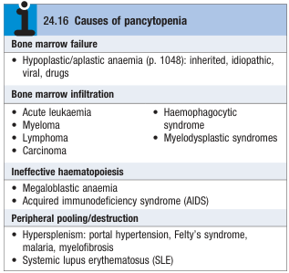
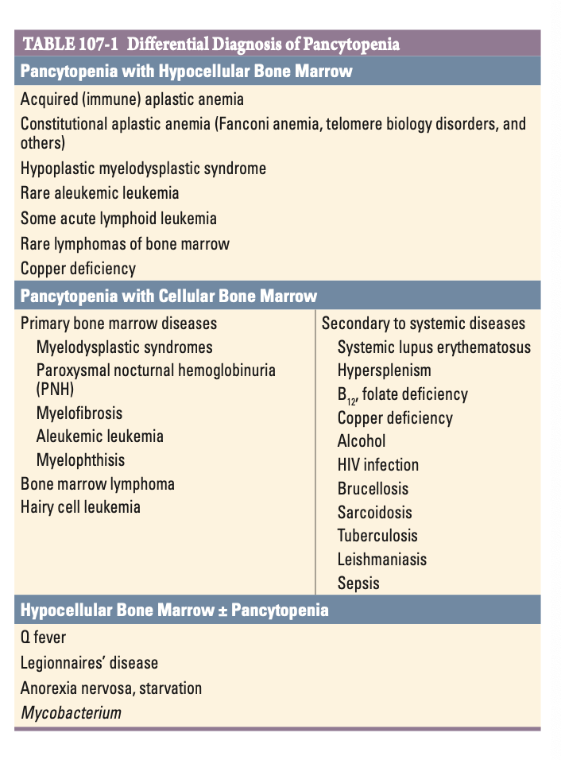

# Pancytopaenia

- **Definition** - combination of anaemia, leukopenia and thrombocytopenia, reflecting a bone marrow pathology, or splenic pooling of mature cells
- **DDx of pancytopenia:**
    - <u>Marrow pathology</u> - BM failure, BM infiltration, haemantic deficiency, AIDS
    - <u>Splenic pooling</u> - Hypersplenism, SLE

   
  
- **Ix** - BM examination may be required
