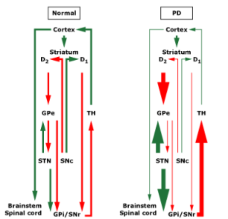
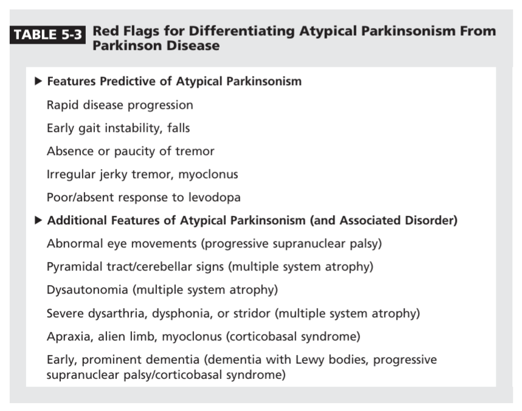

# Parkinsonism

- **Definition** - clinical syndrome caused by depletion of dopamine in the striatoniagral pathway characterised by 1) tremors, 2) rigidity, 3) akinesia, and 4) postural instability
- **Etiology of parkisonism:**
    - **Idiopathic Parkinson's disease** - PD accounts for 80% of parkisonisum
    - **Vascular PD** - caused by subclinical stroke involving the BG circuit
    - **Drug-induced parkisonism:**
        - Antipsychotics (D2 receptor antagonists and atypical antipsychotics)
        - Metoclopramide, Prochlorerazine
        - Tetrabenazine
        - Sodium valproate
        - Lithium
        - Manganese
        - MPTP
    - **Parkisonian plus syndromes** - Lewy Body Dementia, Multiple system atrophy, Progressive supranuclear palsy, Corticobasal degeneration, Spinocerebellar ataxia

  
  
- **Normal basal ganglia circuitry** - striatoniagral projections tend to 1) accentuates wanted motor activity, and 2) inhibition of unwanted motor activity:
    - <u>Direct pathway promotes movements</u> - Striatum inhibits GPi (GABA), causing disinhibition of thalamus, stimulating the cortex
    - <u>Indirect pathway suppresses movement</u> - Striatum inhibits GPe, causing disinhibition of GPi, resulting in inhibition of thalamus, inhibiting the cortex
    - <u>Niagro-striatal pathway</u> - Dopaminergic projections towards striatium, stimulating direct pathway (D1), and inhibiting indirect pathway (D2)
- **In PD** - there is a <u>loss of dopaminergic cells in the Substantia niagra</u> resulting in abnormal modulation of BG circuitry:
    - <u>Loss of stimulation of direct pathway</u> - results in difficulty in initiating movements (i.e. bradykinesia)
    - <u>Excessive stimulation of indirect pathway</u> - results in increased unwanted movements (e.g. tremors, rigidity etc.)

  
  
- **Clinical features of parkisonism** - characteristically <u>assymetrical</u> even when it progresses:
    - <u>Tremors</u> (80%) - unilateral rest tremor affecting limbs, jaw, chin but not he head
    - <u>Bradykinesia</u> - hallmark difficulty in initiating movement, and an overall reduction in velocity and amplitude of movement:
        - **Manifestation in faces** - results in expressionless facies, and monotomous speech
        - **Manifestation in UL** - reduced amplitude results in micrographia (progressively small handwriting), reduced dexterity in buttoning shirt or typing shoelaces, and double clicking of mouse
        - **Manifestation in LL** - cardinal manifestations of festinating/ shuffling gait
        - **Manifestation in trunk** - difficulty rolling in bed
    - <u>Rigidity</u> - constant increase in tone that is irrespective to velocity (cf spasticity), resulting in stopped posture and stiffness, and muscle pain
    - <u>Loss of postural reflexes</u> - pathologically manifests early but falls tend not to occur until later
- **Signs in parkinsonism:**
    - **General appearance:**
        - <u>Masked facies and Reptillian eyes</u> - expressionless face (hypomimia), with unblinking eyes attributed to bradykinesia
        - <u>Soft, rapid, indistinct speech</u> (dysphonia) - monotomous speech attributed to bradykinesia
        - <u>Stopped posture</u> - flexed posture as a result of rigidity
    - **Gait** - shuffling/ festination gait with difficulty in initiation and turning:
        - <u>Failure of gait ignition</u> - difficulty to initiate gait, especially when getting up from chair due to akinesia
        - <u>Shuffling gait/ festination</u> - rapid, short stride length with tendancy to shorten due to **postural instability**
        - <u>Reduced arm swing</u> - as a result of rigidity and bradykinesia
        - <u>Difficulty in turning</u> - due to loss of postural mechanisms upon turning
    - **Tremor:**
        - <u>Resting tremor</u> (3-4 Hz) - asymetrical, usually in the hand (pill rolling), that by definition is maximal at rest and suppressed by **voluntary movement and posture maintenance**
        - <u>Postural tremor</u> (6-8 Hz) - tremor on out-stretched hands
        - <u>Re-emergent tremor</u> (3-4 Hz) - rest tremor re-emerges after few seconds of stretching arms out
    - **Rigidity** - on testing tone of the upper limb:
        - <u>Cogwheel rigidity</u> - jerky resistance to passive movements as muscle tenses and relaxes, caused by tremors superimposed on rigidity
        - <u>Lead-pipe rigidity</u> - passive movement of an extremity met w/ a constant dead-feeling resistance
    - **Akinesia** (fundamental feature of PD) - slowness of movement w/ fatiguing and decreasing in size of repetitive movement:
        - <u>Finger tapping</u> - slowness and reduced amplitude on finger tapping
        - <u>Hand-opening and closing</u> - slowness and reduced amplitude on hand opening and closing
        - <u>Pronation and supination of forearms</u> - slowness when assessing for Dysdiadokinesia
    - **Postural reflexes** - pull test
    - **Normal findings** - if abnormal, consider other causes:
        - Power, deep tendon reflexes, plantar responses
        - Eye movements
        - Sensation
        - Cerebellar examination
- **Red flag features suggestive of atypical parkisonian syndrome:** 

    - <u>Rapid disease trajectory</u> - all forms of APS exhibits aggressive neurodegeneration typically leading to severe disability or death in a window of \< 10y
    - <u>Symmetrical progression fof disease</u> - suggestive of PSP, and MSA
    - <u>Absence of pharmacolognical responses</u> - IPD a/w robust response to LD, but primarily failure to adequate trial of LD, a rapidly-lost response, or medication-induced dysathesia suggestive of an atypical syndrome
    - <u>Early gait instability and unexplained falls</u> - onset of severe unexplained falls within 1-2y of Dx is highly specific for APS, and is most common in PSP
    - <u>Absence of tremors</u> - absence of tremors is highly atypical of IPD, where APS may frequently present w/o any tremors, or tremors atypical of IPD (e.g. myoclonus)
    - <u>Other neurological deficits</u>:
        - Pyramidal signs - suggestive of MSA
        - Cerebellar signs - suggestive of MSA
        - Bulbar dysfunction (severe dysphonia/ dysarthria) - suggestive of MSA or PSP
        - Cortical dysfunction (e.g. apraxia/ myoclonus) - suggestive of CBD
        - Early prominent dysautonomia - suggestive of MSA
        - Supranuclear gaze palsies (absence voluntary movement w/ movement of doll-eye reflexes) - suggestive of PSP but also seen in CBD
        - Gait - wide-based gait rather than narrow shuffling gait suggestive of PSP
        - Early cognitive impairment - suggestive of LBD, CBD, PSP
