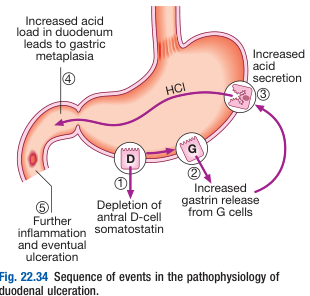
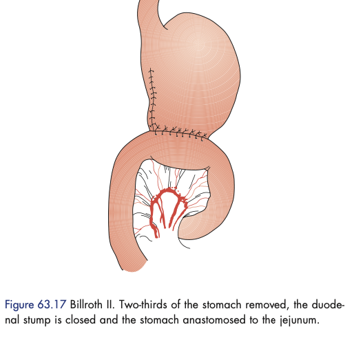
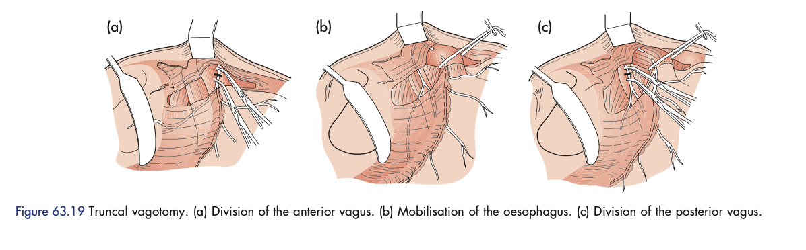
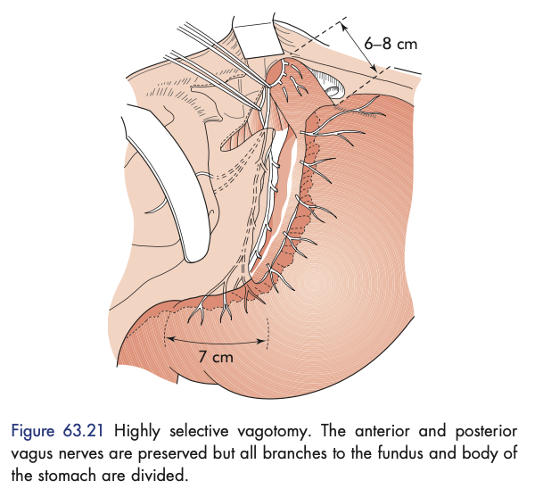

# Peptic Ulcer Disease

- **Definition** - loss of mucosa as a result of gastric juices, typically found in the esophagus, stomach, duodenum, jejunum (after anastamosis) or rarely the ileum (Meckel's diverticulitis)
- **Epidemiology:**
    - Prevalence - 0.1-0.2% but declining in developed countries due to H. pylori
    - Demographic:
        - Duodenal ulcers - M:F = 2-5:1
        - Gastric ulcers - M:F = 2:1
- **Site and pathology of ulcers** - 15% of patients have multiple ulcers, 10% have ulcers in stomach and duodenum:
    - <u>Site of gastric ulcer</u> - 90% in lesser curve of antrum, or junction between body and antrum
    - <u>Site of duodenal ulcer</u> - usually D1 and on the anterior wall
- **Etio-pathophysiology of PUD:**
    - **Imbalance between aggressive factors and defensive factors:**
        - <u>Aggressive factors</u> - HCl, pepsin
        - <u>Defensive factors</u> - mucous, HCO3-, prostaglandins
    - **Role of H. pylori infections** - previously leading role in causing peptic ulcers (90% of duodenal ulcers, 70% of gastric ulcers), but declining in role due to <u>H. pylori eradication</u>:
        - **Colonisation of gastric mucosa** - due to presence of various virulence factors
        - **Invoke local inflammation of the gastric mucosa** - causing antral gastritis resulting in <u>depletion of somatostatin</u> (D cells) and <u>increased gastrin</u> (G cells), resulting in increased HCl secretion (further inflammation and eventual ulceration)
        - **Invokve pangastritis** (1%) - causes chronic atrophic gastritis and subsequently hypochlohydria (may require other environmental factors to induce PUD)

    
    
    - **Role of aspirin and NSAIDs** - COX-1 inhibition resulting in reduced prostaglandin synthesis in gastric mucosa
    - **Smoking** - increased risk of gastric ulcer, but once ulcer has formed, it is more likely to cause complications and lessen healing
    - **Other miscellaneous factors:**
        - Hypercalcaemia (e.g. primary PTH) - results in hypergastrinaemia
        - Zollinger-Ellison syndrome - results in hypergastrinaemia from gastrinoma of the pancreas
- **Clinical features of PUD:**
    - **Clinical course** - a chronic condition w/ spontaneous relapse and remission lasting for decades
    - **NSAID-related ulcers present atypically** - only mild epigastic discomfort, or even asymptomatic, with dysmotility-like Sx (anorexia, early satiety, bloating, nausea)
    - **Characteristic peptic ulcer pain** (burning or dysmotility-like) - with three notable features:
        - <u>Localisation to epigastrium</u> - peptic ulcer disease invariably is localised to the epigastrium
        - <u>Relationship w/ food</u> - some relationship with food according to classical teaching, but in reality difficult to distinguish:
            - Gastric ulcers - exacerbated by food (proposed to be related to HCl secretion)
            - Duodenal ulcers - relieved by food initially (closure of pylorus), and exacerbated at night
        - <u>Episodic occurence</u> - w/ relapse and remissions
    - **Nausea or vommiting** (40%) - only ocassionally, persistent vomiting (esp. of old food) is suggestive of GOO
    - **Presentation as ulcer complications:**
        - <u>Bleeding</u> - visible UGIB, or anaemia
        - <u>Perforation</u> - acute severe epigastric pain that spreads to diffuse peritonitis
        - <u>GOO</u> - epigastric distension, N/V within 1h of eating
- **Ix:**
    - OGD - for Bx, r/o malignancy and H. pylori testing
    - H. pylori testing - to establish etiology
- **Mx** - symptomatic relief, healing of ulcers, prevention of recurrence:
    - **Mx of underlying cause:**
        - General measures - Smoking cessation, review NSAID use, alcohol in moderation
        - H. pylori eradication - see notes on H. pylori infections
    - **Antisecretory therapy** (PPI) - continued until H. pylori eradicated (continuous maintenance Tx not typically required, but can offer lowest effective dose)
    - **Elective surgical Mx:** - if causing GOO, persistent ulceration (exclude underlying malignancy), or recurrent ulcer after surgery:
        - Gastric ulcer - partial gastrectomy with Bilroth I (or II) anastamosis
        - Duodenal ulcers - truncal vagotomy and pyloroplasty

## NSAID-related ulcers

- **Prevalence** - increasing prevalence, soon to overcome H. pylori in leading cause of peptic ulcers
- **Pathophysiology** - established PUD diseae, NSAID usage increases risk of complications and lessens healing:
    - **Topical effects** - reduced gastric mucosa defense
    - **Systemic effects** - COX-1 inhibition resulting in reduced prostaglandin synthesis (reduced blood flow and synthesis of protective factors)
    - **Variation of ulcerogenicity** - dependent on pH environment (actual inciting agents), and type of NSAIDs
- **Risk factors of NSAID-induced ulcers:**
    - Patient-related factors - age \> 60y, prior H. pylori disease (increased risk of complications)
    - Drug-related factors:
        - Dosage
        - Relative toxicity (depending on COX-selectivity)
        - Combination of NSAIDs
        - Concurrent use of anticoagulants or steroids
- **Mx:**
    - <u>Review of meds</u> - indication of NSAID, consider switching to use of less ulcerogenic NSAIDs, or selective COX-2 inhibitor
    - <u>Co-therapy</u> - PPI, H2 antagonist, Misoprostol
    - <u>HP testing and eradication</u>

## Complications of peptic ulcer disease

- **Perforated peptic ulcer** - perforation of a peptic ulcer resulting in release of gastric contents into peritoneal cavity, leading to peritonitis:
    - <u>Epidemiology</u> - 2-10% of PUD (most commonly in duodenal ulcers)
    - <u>Clinical features</u> - clinically suspect on triad of features:
        - **Sudden severe abdominal pain** - initially occurs over <u>epigastrium</u>, subsequently becomes <u>diffuse</u> following spread of gastric gastrium over the peritoneum:
            - <u>Site</u> - epigastric, becoming generalised
            - <u>Onset</u> - sudden onset (within seconds)
            - <u>Character</u> - constant and severe
            - <u>Radiation</u> - to shoulder tip (diaphragm irritation)
            - <u>Relieving factors</u> - typically patients prefer lying completely still
        - **Board-like rigidity** - caused by generalised peritonitis
        - **Shock** - tachycardia, shallow breathing (can be attributed to diaphragm irritation)
        - **Absence of prior dyspepsia** - not uncommon for PPU to be <u>first presentation of PUD</u>, -ve Hx does not exclude Dx
    - <u>Signs</u>:
        - **Vitals** - tachycardia, tachypnoea, hypotension, fever
        - **Board-like rigidity**
        - **Absent bowel sounds**
        - **Reduced liver dullness**
    - <u>Dx</u> - erect CXR, and supine AXR in A&E:
        - **Erect CXR** (50%) - free gas under diaphragm +/- continuous diaphragm sign
        - **AXR** - increased outlining of abdominal organs:
            - Double wall sign
            - Falciform ligament sign
            - Hepatic edge sign
            - Urachus sign
            - Football sign
        - **Water soluble contrast** - leakage of gastroduodenal contents
    - <u>Mx</u>:
        - NPO and NG suction
        - Resuscitation
        - Immediate surgical Tx - direct repair +/- pyloroplasty/ partial gastrectomy for gastric ulcer, omentum patch repair for DU
        - Post-op Mx - H. pylori infection, high dose PPI, NSAID avoidance
- **Gastric outlet obstruction:**
    - <u>Clinical features</u>:
        - N/V - typically protracted post-prandial non-billous vomiting ocassionally with food eaten previously before
        - Abdominal distension - typically over epigastrium
        - Dehydration - as a result of profuse vomiting
    - <u>Signs</u>:
        - General examination - wasting (malnutrition), and dehydration
        - Abdominal examination - epigastric distension, sccussion splash (\>4h after last meal), and visible gastric peristalsis
    - <u>Ix</u>:
        - RFT - HypoNa, HypoK, HypoCl, alkalosis, increased urea
    - <u>DDx of GOO</u>:
        - Benign causes - complicated duodenal ulcers (fibrotic stricutres, oedema of pyloric channel), adult hypertrophic pyloric stenosis
        - Malignant cause - CA antrum
    - <u>Mx</u>:
        - Rehydration and treat electrolyte abnormality - normal saline +/- K supplements
        - Empty the stomach - wide-bore NG tube suction
        - Diagnostic endoscopy - typically delayed after stomach is emptied
        - Tx of underlying cause - partial gastrectomy, or balloon dilatation of strictures
- **UGIB** - see notes on [[Upper GI Bleeding]] as a presenting problem

## Peptic ulcer surgery

- **Surgical Tx** - usually only performed in a complicated peptic ulcer in the modern world:
    - <u>Operations for duodenal ulcer</u> (historical interest) - Bilroth II gastrectomy, gastrojejunostomy, truncal vagotomy and drainage, highly-selective vagotomy, trucal vagotomy and antrectomy
    - <u>Operations for gastric surgery</u> - Bilroth I gastrectomy
- **Bilroth II gastrectomy:**
    - <u>Procedure</u> - gastric ressection with gastrojejunal anastamosis:
        - 1\. Mobilisation of antrum and distal stomach by opening the greater and lesser omentum and disection of gastroepiploic a., left and right gastric a.
        - 2\. Closure of duodenum (suture or staplers) to form a duodenal stump
        - 3\. Closure of lesser curve aspect of gastric remnant, and anastamosis of the greater curve aspect to jejunum in retrocolic fashion

    
    
    - <u>Disadvantages</u> - high morbidity and mortality limits operation in uncomplicated duodenal ulcers
- **Gastrojejunostomy:**
    - <u>Procedure</u> - gastrojejunal anastamosis w/o gastrectomy performed (healing of ulcer from alklali SB secretions neutralising gastric acid)
    - <u>Disadvantages</u> - higher risk of stomal ulcerations
- **Truncal vagotomy and drainage:**
    - <u>Procedure</u> - transection of anterior and posterior vagal trunk to reduce acid secretion (~ 50% of maximal acid output) with drainage by pyloroplasty (transection of pyloric ring) to avoid gastric stasis due to reduced motility after vagotomy

  
  
- **Highly selective vagotomy:**
    - <u>Procedure</u> - denervation of the body and fundus by section of branches while preserving anterior and posterior vagal trunks
    - <u>Disadvantages</u> - less morbidity than aforementioned surgeries, resulting in mild epigastric fullness and dumping ocassionally, and recurrence is rare if done correctly (only <u>fell out of favour in advent of medical Tx</u>)

  
  
- **Truncal vagotomy and antrectomy:**
    - <u>Procedure</u> - truncal vagotomy with removal of antrum (source of gastrin)
- **Bilroth I gastrectomy:**
    - <u>Procedure</u> - gastric resection with gastroduodenal anastamosis:
        - 1\. Mobilisation of antrum and distal stomach by opening the greater and lesser omentum and disection of gastroepiploic a., left and right gastric a.
        - 3\. Closure of lesser curve aspect of gastric remnant, and reconstruction (facilated by mobilisation of duodenum by Kocher's maneuver)
- **Complications of peptic ulcer surgery:**
    - **Recurrent ulceration** - recurrent ulceration causing symptoms or complications
    - **Small stomach Syndrome** - arises in all forms of peptic ulcer surgery:
        - Gastrectomy - due to literal small stomach
        - Truncal vagotomy and highly selective vagotomy - due to reduced receptive relaxation (but tends to get better w/ time)
    - **Bile vomiting** - caused by severe bile reflux from gastrectomy with bilroth reconstruction, or pyloroplasty (treated by Roux-en-Y diversion)
    - **Dumping** - complication arising from early rapid gastric emptying, classified into early and late dumping with different pathophysiology:
        - **Early dumping:**
            - <u>Pathophysiology</u> - intake of food directly released into the duodenum, which has high-osmotic load, causing sequestration from circulation to GI tract
            - <u>Clinical features</u> - aggravated and precipitated by food (esp. carbohydrate rich food), relieved by lying down:
                - **Abd Sx** - epigastric fullness, colic, diarrhoea
                - **Vasomotor Sx** - sweating, lightheadedness, tachycardia
            - <u>Mx</u> - dietary manipulation (small, dry meals and avoid fluids w/ high carbohydrates) + revisional surgery
        - **Late dumping:**
            - <u>Pathophysiology</u> - reactive hypoglycaemia
    - **Postvagotomy diarrhoea**
    - **Malignant transformation**
    - **Nutritional consequences**
    - **Gallstones**
