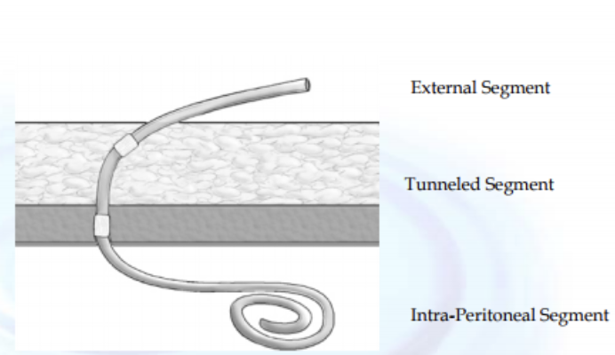

# Peritoneal Dialysis

- **Definition** - form of RRT with the peritoneal membrane acting as the semi-permeable membrane
- **Principles of PD** - balance between movement of solute and water into peritoneal cavity and absorption from peritoneal cavity:
    - <u>Convection clearance</u> - generated through ultrafiltration
    - <u>Diffusive clearance</u> - down a concentration gradient
- **PD fluid:**
    - <u>Volume</u> - 1.5-3L
    - <u>Composition of PDF</u>:
        - Dextrose-containing at varying concentrations
        - Amino acids for severe protein-energy malnutrition
        - Icodextrin may replace dextrose as it is nonabsorbable (more efficient ultrafiltration)
        - Additives - e.g. heparin, IP ABx, insulin
- **Access to peritoneal cavity** - Tenckoff catheter:
    - Silicone rubber w/ numerous side holes at distal end
    - Two dacron cuffs found in pre-peritoneal space, 2cm from skin surface:
        - Serves as a seal to prevent bacteria tracking from skin surface to peritoneal cavity
        - Prevents external leakage of fluid

  
  
- **Modalities of PD** - CAPD vs APD:
    - **Continuous ambulatory peritoneal dialysis** (CAPD) - multiple exchanges throughout the day (usually x3) followed by an overnight dwell, which may be performed in isolation or modified to be prescribed w/ CCPD overnight
    - **Automated peritoneal dialysis** (APD) - use of a cycler to perform multiple overnight exchanges resulting in multiple shorter dwells, variations include:
        - <u>Continuous cycler peritoneal dialysis</u> (CCPD) - 3-6 overnight exchanges, w/ a 14-16h daytime dwell, such that patients do not require daytime exchange, however evidence shows lower UF than CAPD
        - <u>Nightly intermittent peritoneal dialysis</u> (NIPD) - modification of CCPD w/o utilisation of daytime dwell
        - <u>Tidal peritoneal dialysis</u> (TID) - paprtial drain w/ or w/o daytime dwell
        - <u>Intermittent peritoneal dialysis</u> - multiple short exchanges performed on an intermittent basis
- **Approach to evaluation of patients for chronic PD:**
    - <u>Timely referral and preparation for KRT</u> - discussion of life-plan of kidney care, evaluation of the pros and cons of different KRTs, preparation of socio-economical factors affecting KRT, workup for kidney transplantation
    - <u>Selection of the ideal candidate</u> - various factors determine qualification for peritoneal dialysis:
        - Patient's desire to perform self-PD care (w/ mental capacity to understand and communicate, physically capable to perform procedures, and suitable environment to store supplies and perform exchanges)
        - Significant residual kidney function
        - Minimal or no abdominal surgery
    - <u>Catheter insertion</u> - usually timed when there are minimal uraemic Sx, although catheter is functional hours within insertion, typically wait up to 2 weeks before PD training
- **Barriers to initiation of PD:**
    - **Patient factors** - physical, cognitive, or psychological impairments, and availability of carer, home environments:
        - Patient must have mental capacity to understand and communicate to ensure successful PD training
        - Good vision, muscle strength and dexterity allow for easier acquisition of skills to perform the procedure but is not an absolute C/I (i.e. blind patients can still perform PD)
        - Presence of caregiver may circumvent patient's inability to perform PD on own
        - Patient requires adequate home environment for storage of PD fluid and performing dialysis
    - **Factors related to the abdomino-peritoneal cavity:**
        - <u>Peritoneal scarring</u> - advanced scarring may result in difficulties in 1) filling, 2) drainage, 3) solute clearence and UF, however **prior Abd surgery should not be a C/I to PD**
        - <u>Active abdominal inflammatory process or cancer</u> - e.g. diverticulitis, IBD, or abdominal malignancies are a/w more peritonitis and mechanical catheter complications
        - <u>Stomas</u> - increased risk of exit-site infection, and non-conventional pre-sternal catheter superior to surgical ostomies to prevent any leakage to flow towards PD catheter
        - <u>Hernia</u> - worsening hernia and potential incarcerations may occur w/ abdominal wall hernia and must be repaired
        - <u>Ventriculoperitoneal shunts</u> - limited data, but concomitent PD increases risk of ascending infections and shunt malfunction
    - **Factors related to kidney function:**
        - <u>Anuria</u> - absence of any renal functions increase higher dialysis volume requirements to achieve solute clearance and UF
        - <u>Larger patient size</u> - directly related to dialysis volume requirement
- **Peritoneal equilibrium test** - formal evaluation of peritoneal membrane characteristics:
    - <u>Principle</u> - measures transfer rate of Cr and glucose across the membrane
    - <u>Stratifies patients into</u>:
        - Low transporters
        - Low-average transporters
        - High-average transporters
        - High transporters
    - <u>Implications</u> - guides dosing:
        - High transporters tend to loss absorb more glucose resulting in loss of ultrafiltration and lose more albumin into PDF, requiring more frequent, shorter dwell-time exchanges and are obligate users of cyclers (APD)
        - Low or low-average transporters may require larger volumes of PDF to allow for adequate solute Tx
- **Complications:**
    - Peritonitis
    - Tunnel infections
    - Hypoproteinaemia
    - Hyperglycaemia and weight gain
    - Worsened insulin resistance
    - Sclerosing peritonitis
