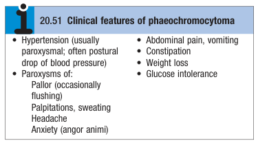
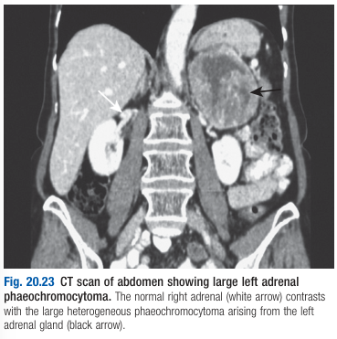

# Phaeochromocytoma and Paraganglioma

- **Definition** - rare neuro-endocrine tumours that may secrete catecholamines:
    - <u>Phaeochromocytoma</u> (80%) - tumours arising from the adrenal medulla
    - <u>Paraganglioma</u> (20%) - tumours arising elsewhere in the sympathetic nervous system
- **Epidemiology** - extremely rare (estimated to account for \< 0.1% of HTN)
- **Associated conditions** - 30% cases are a/w an underlying inherited condition:
    - Von-Hippel-Lindau syndrome
    - Neurofibromatosis
    - Multiple Endocrine Neoplasia Type 2
    - Mutations w/ succinate dehydrogenase B, C and D genes (particularly paraganglioma)
- **Clinical features of phaeochromocytoma and paraganglioma** - clinical features depends on pattern of catecholamine secretion which is often paroxysmal: 

    - **Hypertension** - often severe HTN but is paroxysmal (due to paroxysmal release of catecholamines), and may initially present w/ complications of HTN:
        - <u>HTN</u> - account for \< 0.1% cases of HTN
        - <u>Complications of HTN</u> - presenting complaint may be of ACS/ MI, Stroke/ TIA, acute-decompensated heart failure, accelerated-phase (malignant HTN) or target-organ damage (e.g. retinopathy, nephropathy)
    - **Paradoxical postural hypotension** - "pressure diuresise and natriuresis" during hypertensive episodes, resulting in low intravascular volume and postural hypotension in between episodes
    - **Paroxysms of catecholamine surges:**
        - <u>Pallor</u> - due to strong peripheral vasoconstriction as a result of alpha-1 receptor agonism (ocassionally flushing)
        - <u>Palpitations</u> - due to +ve chronotropic effect of beta-1 receptor agonism
        - <u>Sweating</u> - increased sweat production due to increased metabolic rate
        - <u>Headaches</u> - increased cerebral blood flow
        - <u>Anxiety</u> (angor amini) - psychiatric manifestation to sympathetic stimulation
        - <u>GI disturbances</u> - abdominal pain, nausea and vomitng
    - **Associated features:**
        - <u>Weight loss</u> - through excessive metabolic activity and increased insulin resistance
        - <u>Glucose intolerance</u> - increased insulin resistance
- **Ix:**
    - **Plasma/ urine metanephrine and normetanephrine** - metabolites of adrenaline and noradrenaline:
        - <u>Test properties</u> - dependent on cutoff (the higher the concentration, the more likly the Dx)
        - <u>Limitations</u>:
            - False +ve - psychological and physiological stress, following exercise, use of tricyclic antidepressants
        - <u>Repeat sample</u> - usually indicated to confirm Dx
    - **Tumour markers** - serum chromogranin A (useful in patients w/ non-secretory tumours or as Tx response)
    - **Imaging:**
        - <u>Abdominal CT/ MRI</u> - enables identification of phaeochromocytoma: 
        
        - <u>Scintigraphy</u> - meta-iodobenzyl guanidine (MIBG) for detection of paraganglioma, and 18-FDG PET for confirming malignant disease
    - **Genetic testing** - indicated for:
        - Other features of genetic syndrome (e.g. VHL disease)
        - FHx of phaeochromocytoma
        - Presentation \< 50y
- **Mx:**
    - **Principles of Mx:**
        - <u>Medical Mx</u> - preparation of patient for a minimum of 6 weeks before surgery to correct fluid status
        - <u>Surgical Tx</u> - with short-acting sodium nitroprusside and short-acting alpha-antagonist phentolamine to prevent hypertensive episodes
        - <u>Tx of metastatic disease</u>:
            - Debulking surgery
            - Radionuclide surgery w/ I-131 MIBG
            - Cheomoembolisation (of hepatic metastasis)
            - Chemotherapy
            - Targeted therapy (TKI and angiogenesis inhibitors)
    - **Medical Tx** - alpha-blockers administered first, followed by rate-limiting beta-blockers:
        - **Alpha-blockers:**
            - <u>Regimen</u> - non-competitive antagonism due to excessive circulatory catacholamines:
                - Phenoxybenzamine 10-20 mg PO tid/qid
                - Prazosin, doxazosin not preferred due to competitive antognism
            - <u>MOA</u> - alpha-blockade, resulting in **peripheral vasodilation**, and BP lowering effects
            - <u>S/E</u>:
                - Reflex tachycardia (prevented by beta-blockers)
        - **Beta-blockers** (e.g. propanolol):
            - <u>Indication</u> - only if marked reflex tachycardia causing Sx
            - <u>Effects of beta-blockade before alpha-blockade</u>:
                - Paradoxical rise in BP due to unopposed alpha-mediated vasoconstriction
