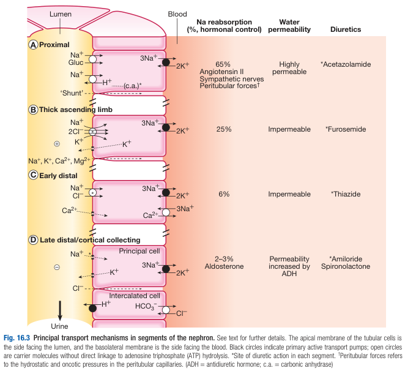
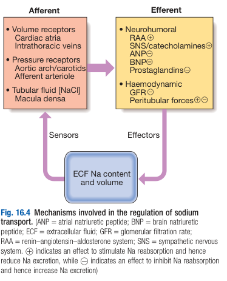

# Physiological Functions of Sodium and Flexible Renal Sodium Handling

- **Physiological function of sodium** - total body Na is the <u>principal determinant of ECF volume</u>:
    - 1\) The majority of total body Na is located in ECF
    - 2\) Na is the most abundant cation in ECF
- **Normal daily Na intake** - wide variation from 50-250 mmol/d, implicating:
    - 1\) Renal Na handling must be able to regulate Na excretion to match the variations of daily Na intake (reabsorption of filtered Na load can range from 0.1% to 99%)
    - 2\) Renal Na handling must be regulated principally by ECF (or plasma volume), as this is the physiological parameter that Na affects, and has direct implications to life
- **Process of renal Na handling** - occurs within the <u>nephron</u>:
    - **Ultrafiltration** - occurs at the renal corpuscle at a GFR of 125 ml/min (180 L/d), where ultrafiltrate resembles plasma in its electrolyte composition (incl. Na), and 99% of fluid is reabsorbed through <u>tubular reabsorption of sodium</u>
    - **Progressive reabsorption of Na in nephron segments:**
        - **Proximal convoluted tubule** (PCT) - reabsorption of 65% of sodium load to drive water reabsorption, secondary transport and acid-base regulation:
            - <u>Reabsorption of water</u> - creates osmotic gradient to drive reabsorption of water via shunt pathway or aquaporin pathway, such that **filtrate remains isotonic**
            - <u>Reabsorption via shunt pathway</u> - transepithelial flux of Na, water, and other soluble substances between cell-cell junctions
            - <u>Aquaporin pathway</u> - component of water is reabsorbed via AQP-1, which are not sensitive to hormonal regulation
            - <u>Reabsorption of vital molecules</u> - drive secondary transport of glucose, amino acids, phosphate and other organic molecules
            - <u>Acid-base regulation</u> - carbonic anhydrase activity (under neurohormonal control) results in formation of H+, which is secreted into lumen by NHE-3, and HCO3- reabsorbed into blood
        - **Thick ascending limb of loop of Henle** - reabsorption of 25% of Na, but <u>impermeable to water</u>:
            - <u>Triple co-transporter</u> (NKCC2 co-transporter) - apical NKCC2 enables electroneutral entry of Na, K, and 2 Cl into tubular cells (filtrate progressively becomes hypotonic)
            - <u>Recycling of K</u> - ROMK enables K that accumulate into the cells to return into the lumen, such that **K is not the limiting factor** to the effects of NKCC co-transportation (recall K is primarily intracellular, while Na and Cl are primarily extracellular)
        - **Early distal convoluted tubule** (DCT) - reabsorption of 6% of Na, but is again <u>impermeable to water</u>:
            - <u>Co-transport of Na and Cl</u> - reabsorption of Na and Cl via Na/Cl co-transporter (NCCT), resulting in further dilution of filtrate (filtrate progressively becomes hypotonic)
            - <u>Reabsorption of Ca</u> - reabsorption of Ca in Na-dependent manner
        - **Late distal tubules and collecting ducts** - reabsorption of Na primarily under hormonal control, to a maximum of 2-3% of filtered Na load, and <u>variability of water permeability depending on ADH levels</u>:
            - <u>Reabsorption of Na via aldosterone-induced ENaC</u> - aldosterone induces ENaC insertion into apical membrane,resulting in reabsorption of Na (up to 2-3% of Na load)
            - <u>Reabsorption of Cl, secretion of H+ and K</u> - Na reabsorption results in a -ve transluminal potential gradient, which is balanced by secretion of K (ROMK), H+ (H+ ATPase), and reabsorption of Cl (between cells)
            - <u>Variability in water permeability</u> - increased permeability based on ADH levels, which is **dependent on ECF osmolality**

    
    
- **Regulation of ECF volume by RAAS** - through regulation of whole body sodium balance by matching urinary Na excretion to Na intake:
    - <u>Receptors</u>:
        - **Volume sensors** - in cardiac atria and intra-thoracic veins (direct detection in changes in ECF volume)
        - **Pressure sensors** - in aortic arch and carotid sinuses (indirect detection in changes in ECF volume by measurement of pressure)
        - **Macula-densa cells of early DCT** (tubuloglomerular back by juxtaglomerular apparatus) - detection of decreased NaCl concentration in distal tubular fluid, which may occur in 1) reduced perfusion pressure of glomerulus (e.g. hypovolaemia), 2) increased PCT Na reabsorption due to increased SNS activity
    - <u>Hormonal response</u> - renin release:
        - **Ang II effects:**
            - Peripheral vasoconstricction
            - Increased PCT Na reabsorption
            - Aldosterone release
        - **Aldosterone effects** - increased DCT Na reabsorption
- **Regulation of ECF volume by SNS:**
    - Stimulation of PCT Na reabsorption
    - Trigger tubuloglomerular feedback through afferant arteriole vasoconstriction and decreased GFR
- **Principles of renal Na handling and maintenance of ECF volume** - Guyton's "Pressure Diuresis, Pressure Natriuresis":
    - <u>State of hypovolaemia and hypotension</u> - increased whole body Na by causing **Na retention** (urinary Na excretion \< Na intake)
    - <u>State of hypervolaemia and hypertension</u> - decreased whole body Na by causing **Na depletion** (urinary Na excretion \> Na intake)

  
  
