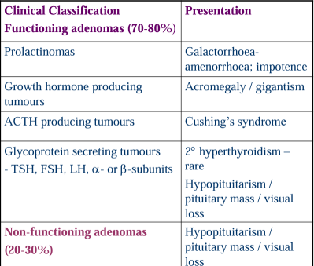

# Pituitary Adenoma

- **Epidemiology of pituitary adenomas:**
    - 6-18% of all brain tumours
    - Often undiagnosed - 12-22% prevalence on unselected autopsy series, most are prolactinomas
- **Classification by size:**
    - Microadenoma (\< 1cm in all dimensions) - clinically indolent unless incidentaloma or functional tumour
    - Macroadenoma (\> 1cm in at least 1 dimension) - typically non-functional, presents with mass effect and hypopituitarism
- **Clinical classification of pituitary tumours** - depending on clinical presentation:
    - Functioning (70-80%) vs Non-functional (20-30%)
    - Functional pituitary adenoma (classically microadenoma because hormone excess effects prompt earlier presentation):
        - Prolactinoma (25%) - presents as prolactinaemia (typically microadenoma devoid of mass effect and hypopituitarism)
        - Growth hormone producing adenoma (12%) - presents as acromegaly or gigantism
        - ACTH secreting adenoma (5-10%) - presents as Cushing's disease
        - Glycoprotein secreting adenomas (TSH, FSH, LH) (1%) - little hormonal excess, typically presents with local mass effects and hypopituitarism
    - Non-functional pituitary tumours - presents with local mass effects and hypopituitarism

  
  
- **Pathological classification based on transcription factors:**
    - Principles - Detection of increased expression of certain TF by IHC, implying propensity of pituitary cell differentiation towards a certain lineage
        - TPIT - corticotroph differentiation
        - PIT1 - lactotroph, mammosomatotroph, somatotroph and thyrotroph differentiation
        - SF1 - gonadotroph differentiation
    - Advantages of pathological classification:
        - **Improved diagnostics** - Immunohistochemistry for TF allows for positive nuclear staining (cf patchy ctyoplasmic staining for hormonal staining)
        - **Prognostic implications**
            - TPIT - more agressive
            - SF1 - more benign
- **Diagnosis of pituitary adenomas:**
    - **Biochemical diagnosis** - functional adenomas:
        - <u>Prolactinoma</u> - Raised serum prolactin (usually 10x ULN)
        - <u>GH secreting adenoma</u> - Raised IGF-1 on screening, failed GH suppression on OGTT
        - <u>ACTH-secreting adenoma</u> - 1) Confirmed CS (\>= 2 +ve diagnostic tests), 2) Increased ACTH, 3) High dose dexamethasone suppression test +/- CRH test (ref Cushing's Syndrome workup pathway)
    - **Radiological diagnosis** - characterize size of lesion:
        - Contrast MRI - modality of choice
        - CT - better for calcified tumours (e.g. craniopharyngioma)
