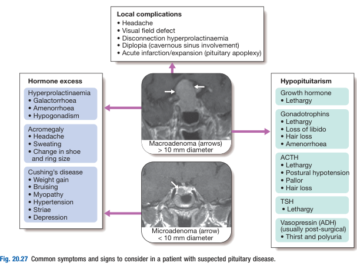
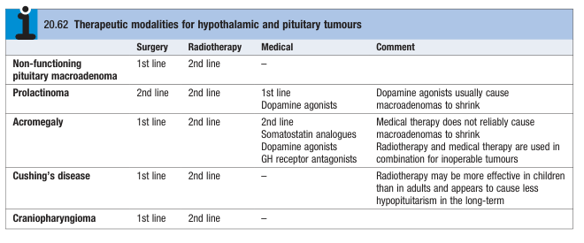

# Pituitary Tumour

- **Definition** - presence of a tumour in the pituitary, with manifestations related to its mass effect, hormone excess, or hypopituitarism
- **DDx of pituitary tumours:**
    - <u>Intrasellar tumours</u> - pituitary adenomas (most commonly non-functioning adenomas)
    - <u>Suprasellar tumours</u> - craniopharyngioma
    - <u>Parasellar tumours</u> - meningioma
- **Clinical features of pituitary tumour** - 1) mass effect, 2) hormonal excess, and 3) hypopituitarism: 

    - **Local mass effect:**
        - **Non-specific headache** - consequence of stretching of the diaphragmatic sellae. and is particularly common in acromegaly
        - **Visual field defects** - classically bitemporal hemianopia, but dependent on the direction of extension of the tumour:
            - <u>Bitemporal haemaniopia</u> - due to suprasellar extension to compress the optic chiasm
            - <u>Upper quadrantanopia</u> - due to suprasellar extension partially compressing the optic nerve
            - <u>Mononuclear vision loss or scotoma</u> - due to compression of the optic nerve
            - <u>Homonymous haemianopia</u> - due to compression of optic radiation
        - **Carvenous sinus syndrome** - due to lateral extension of tumour resulting in compression of 3rd, 4th or 6th cranial nerve, manifesting as diplopia and strabismus
        - **Hyperprolactinaemia** - due to compression of pituitary stalk resulting in disinhibition of lactotrophs, manifesting as galactorrhoea, amenorrhoea or hypogonadism
        - **Acute-onset hypopituitarism** - only in non-haemorrhagic infarction, i.e. pituitary apoplexy
    - **Hormonal excess:**
        - <u>Acromegaly or gigantism</u> - due to GH hypersecretion by somatrophic tumour
        - <u>Cushing's disease</u> - due to excessive ACTH secretion by corticotrophic tumour
        - <u>Hyperprolactinaemia</u> - due to a prolactinoma, or disconnect hyperprolactinaemia
    - **Hypopituitarism** - see notes on hypopituitarism
- **Ix of suspected pituitary Sx:**
    - **Neuroimaging** - MRI or CT brain
    - **Perimetry** - assessment of visual field defect
    - **Pituitary function assessment** - consider provacative tests if non-diagnostic:
        - <u>Assessment of HPT axis</u> - TFT (TSH + fT3/4)
        - <u>Assessment of gonadotrophin axis</u> - testosterone, E2, FSH, LH
        - <u>Assessment of GH axis</u> - IGF-1 as screening
        - <u>Assessment of HPA axis</u> - morning cortisol, ACTH-stimulation test, spot ACTH
        - <u>Assessment of PRL axis</u> - spot PRL
- **Mx:**
    - **Principles of Mx:**
        - <u>Urgent surgical decompression</u> - indicated if evidence of pressure on visual pathways (as chance of recovery proportional to duration of Sx, and full recovery unlikely if Sx last for \> 4mo)
        - <u>Selection of modality of Tx based on likely histology</u> - prolactinoma (esp. if prolactin \> 5000 mU/L) can be treated by medical therapy first line: 
        
        - <u>Follow-up</u> - repeat pituitary function testing at 4-6 weeks after definitive Tx and repeat imaging afater 3-6 mo for significant residual disease
    - **Surgery:**
        - <u>Approach</u>:
            - Transphenoidal approach (most common)
            - Transfrontal approach (reserved for tumours w/ suprasellar extension)
        - <u>Resectability</u> - complete resectability is uncommon if there is lateral extension into carvenous sinus
        - <u>S/E</u> - risk increases w/ size of the primary lesion:
            - Hypopituitarism
            - Central diabetes insipidus
    - **Radiotherapy** - not indicated for patients requiring urgent decompression as it takes months to years to be effective:
        - <u>Indications</u> - as 2nd line therapy if surgery not indicated or failed surgery
        - <u>Modalities</u>:
            - Standard fractionated radiotherapy
            - Gamma knife
        - <u>S/E</u>:
            - Hypopituitarism - 50-70% in first 10y, hence anual pituitary function assessment necessary
            - Impaired cognitive function
            - Induce primary brain tumour
