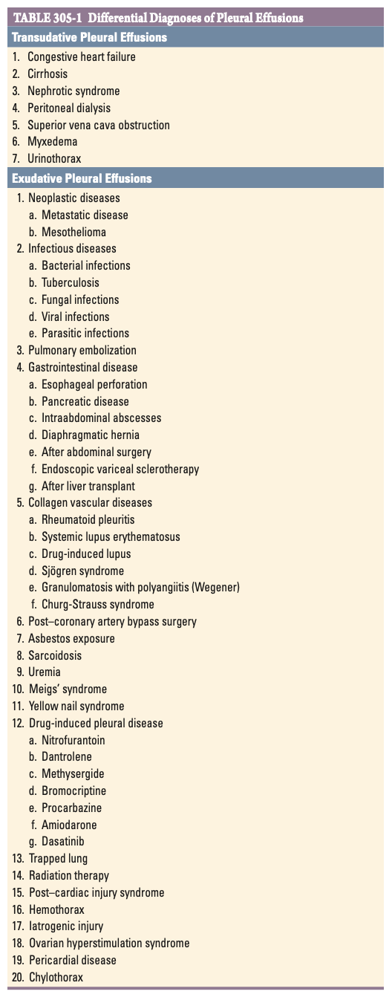
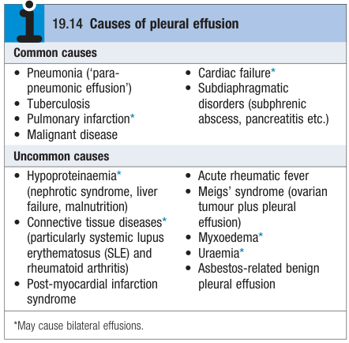
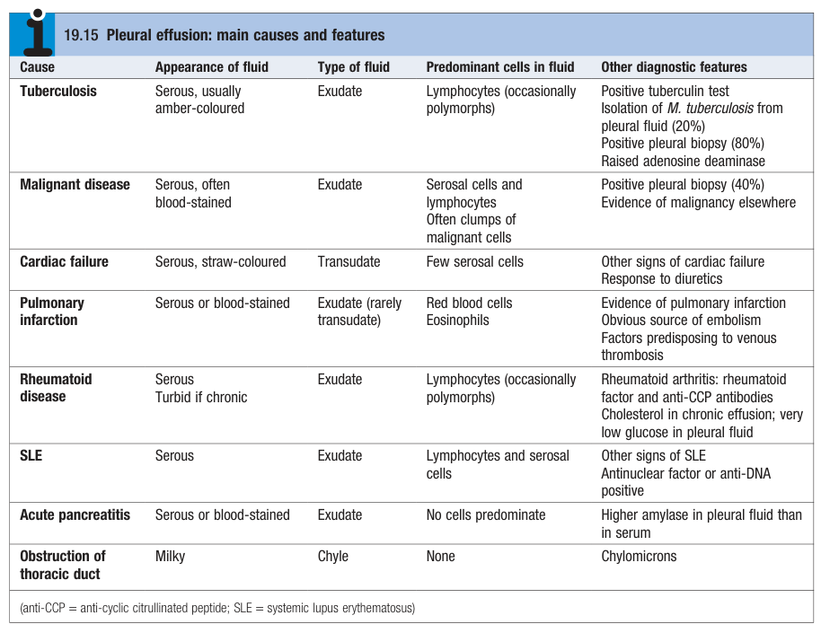
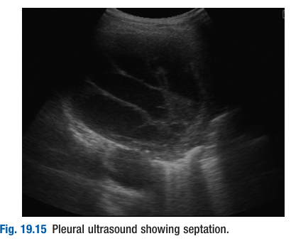
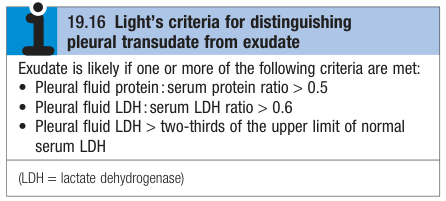
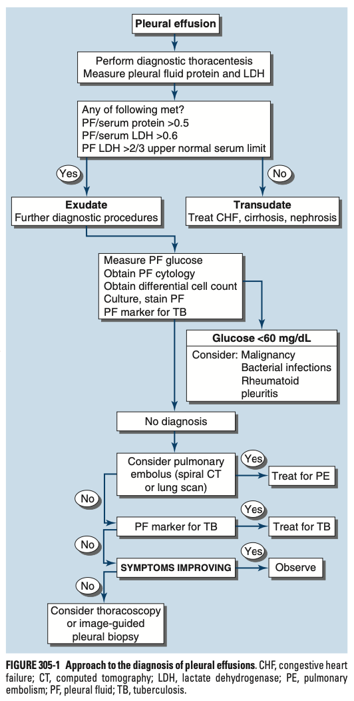
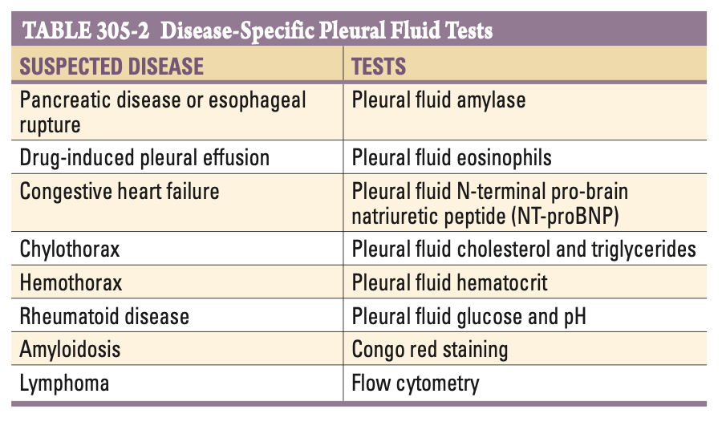
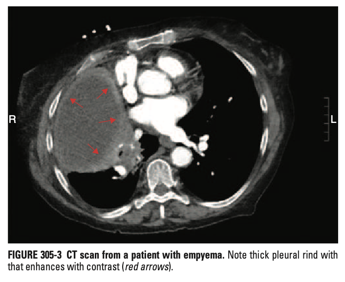

# Pleural Effusion

- **Definition and terminology:**
    - <u>Pleural effusion</u> - accumulation of excess serous fluid within the pleural cavity
    - <u>Empyema</u> - accumulation of fibropurulent or frank pus in the pleural cavity
    - <u>Haemothorax</u> - accumulation of blood in the pleural cavity
    - <u>Chylothorax</u> - accumulation of chyle in the pleural cavity
- **Regulation of pleural fluid in pleural cavity:**
    - <u>Pleural fluid production</u> - from interstitium of the lungs through th visceral pleura; mainly determined by hydrostatic-oncotic balance (Starling's law), modulated by capillary permeability at the visceral pleura
    - <u>Pleural fluid drainage</u> - by rich lymphatics of the parietal pleura; has the capacity to absorb 20x more fluid than normally produced
- **Clinical features of pleural effusion:**
    - **Chest pain** (pleurisy) - sharp (lateralerised) chest pain on inspiration or coughing reflecting pleurisy (more often exudative) often <u>precedes development of effusion</u>, often in patient w/ underlying pneumonia, pulmonary infarction of CTD
    - **Dyspnoea** - may be only Sx, and depends on 1) size, 2) rate of accumulation
- **Signs of pleural effusion** - can be suspected on clinical examination:
    - **General examination** - tachypnoea
    - **Respiratory examination** - normal if mild, stony dull percussion notes and reduced air entry, +/- tracheal deviation in massive pleural effusion:
        - <u>Inspection</u> - reduced chest wall expansion (unilaterally or bilaterally depending on laterality of underlying pathology)
        - <u>Palpation</u> - reduced chest wall expansion; **tracheal deviation/ displaced apex beat to the contralateral side in massive pleural effusion**
        - <u>Percussion</u> - **stony dull percussion notes below level of effusion**, resonant above level of effusion
        - <u>Auscultation</u>:
            - **Reduced breath sound below level of effusion**
            - Bronchial breath sound above level of effusion
- **Most common cause of pleural effusion based on nature of effusion:**
    - <u>Transudative pleural effusion</u> - 1) left ventricular failure, 2) cirrhosis (i.e. hepatic hydrothorax)
    - <u>Exudative pleural effusion</u> - 1) parapneumonic effusion, 2) TB pleuritis (most common cause in developing world) 3) malignant pleural effusion
- **DDx of pleural effusions** - in practice, pleural effusions most commonly arise as a result of 1) infection (including TB), and 2) malignancy: 

    - **Transudative pleural effusion** - caused by disturbance of <u>hydrostatic-oncotic balance</u>:
        - <u>Increased hydrostatic pressure</u> - congestive hearat failure, renal failure, cirrhosis, superior vena cava obstruction
        - <u>Decreased oncotic pressure</u> - hypoalbuminaemia (esp. Nephrotic syndrome)
        - <u>Others</u>:
            - Myxoedema
            - Peritoneal dialysis
            - Urinothorax
    - **Exudative pleuural effusion** - caused by 1) increased capillary permeability (e.g. inflammation), 2) impaired drainage by lypmphatics, or other 3) miscellaneous causes:
        - **Increased capillary permeability** (e.g. infective, inflammatory or neoplastic):
            - <u>Neoplastic</u> - primary mesothelioma, secondary metastasis (e.g. CA lung, ovaries etc.)
            - <u>Infective</u> - parapneumonic effusions, tuberculosis, fungal infections, viral infections, parasitic infections
            - <u>Inflammatory</u>:
                - **Pulmonary embolism** (remains a top DDx even if Dx and pleuritic chest pain accounted by pleural effusion)
                - **Other pulmonary disease** - asbestosis
                - **GI diseases** - esophageal rupture, pancreatitis (and other pancreatic disease), intra-abdominal abscesses, after abdominal surgery, endoscopic variceal sclerotherapy, post-LT
                - **Connective tissue disease** - <u>rheumatoid arthritis</u>, systemic lupus erythematosus, drug-induced lupus, Sjogren's syndrome
                - **Vasculitides** - Churg-Strauss syndrome, Wegner's granulomatosis
                - **Others:**
                    - Pericardial disease
                    - Post-CABG fluid collection
                    - Dressler's syndrome (Post-cardiac injury syndrome)
                    - Drug-induced pleural effusion
                    - Radiation therapy)
                    - Ovarian hyperstimulation syndrome
                    - Sarcoidosis
        - **Impaired lymphatic drainage** - chylothorax, lymphangioleiomyomatosis, lymphangitis carcinomatosis
        - **Others:**
            - Hemothorax
            - Iatrogenic injury
            - Trapped lung

   
  
- **Initial Ix:**
    - **Routine bloods** - CBC, LRFT for systemic diseases, clotting profile due to necessary invasive procedures
    - **CXR** - erect PA chest film:
        - <u>Findings suggestive of pleural effusion</u> - requires around 200 ml of fluid to be detected on PA chest film:
            - Curved shadow at lung base
            - Blunted costophrenic angle that ascends towards axilla
            - Loculation of fluid in oblique fissures or localised scarring or adhesion like pleuroidesis (appears at round opacity)
    - **USG:**
        - <u>Findings suggestive in transudative effusion</u> - clear hypoechoic space
        - <u>Findings suggestive in exudative effusion</u> - moving floating densities
        - <u>Findings suggestive in evolving empyema or resolving haemothorax</u> - septations: 
        
    - **Diagnostic paracentesis** - necessary for all patients unless cause is obvious (e.g. LV failure):
        - **Appearance:**
            - <u>Straw-colour</u> - tranxudative effusion
            - <u>Milky</u> - chylothorax
            - <u>Frank pus</u> - empyema
            - <u>Blood stained</u> - malignancy, TB, pulmonary infarction, or from a traumatic tap
        - **Laboratory invesetigations:**
            - <u>WBC and differentials</u> - detect pleocytosis:
                - Neutrophilic - suggestive of parapneumonic inflammation
                - Lymphocytic - suggestive of TB
                - Monocytic - a machine count error and may reflect presence of malignant cells due to similar cell size
            - <u>Protein, LDH</u> - distinguishing pleural transudate from exudate by **Light's criteria**: 
            
            - <u>Glucose and pH</u> - reduced in high cellular metabolism (e.g. infection, malignancy, active autoimmune disease, eusophageal rupture)
        - **Microbiology** - G stain, culture +/- AFB stain and culture
        - **Cytology** - for detection of malignancies (w/ other roles in Dx of rheumatoid pleuritis)
    - **Pleural Bx** - considered if thoracocentesis inconclusive:
        - US-guided
        - CT-guided
        - VATS-guided
    - **CT thorax** - if suspecting malignant disease
- **Diagnostic approach to pleural effusions:** 

    - <u>Additional Ix for bilateral pleural effusions</u> - NT-proBNP, TFT, biochemistry (albumin)
    - <u>Additional Ix for exudatives</u>:
        - Blood tests - tumour markers (CEA), autoimmune screen (RF, Anti-CCP, ANA), paired sera for glucose, LDH, protein and albumin for subsequent interpretation
        - Microbiology - sputum for G stain, AFB stain, C/ST for common organisms and microbacterial
        - Additional testing for pleural fluid - pH, ADA, AFB staining, amylase
- **Light's criteria** - classification of pleural effusion into 1) transudative, or 2) exudative:
    - <u>Pleural effusion is likely exudative if \>= 1 of the following criteria is met</u>:
        - 1\. Pleural fluid protein/ serum protein \> 0.5
        - 2\. Pleural fluid LDH/ serum LDH \> 0.6
        - 3\. Pleural fluid LDH \>= 2/3 the ULN for serum LDH
    - <u>Limitations of light's criteria</u> - rather high FP rates (moderate PPV) for exudates (100% Sn, 72% Sp):
        - Mis-identifies 25% of transudates as exudates ("pseudoexudates"), particularly heart failure (?chronic diuresis)
        - If suspicion high for transudative process, use of alternative criteria w/ higher Sp for exudates for reclassification of suspected "pseudoexudates" back to transudates
- **DDx of exudative, lymphocytic effusion w/ -ve cytology:**
    - <u>Pseudoexudates</u> (Congestive heart failure) - as light's criteria wrongly classifies 25% of transudates into exudates, use alternative criteria (as below)
    - <u>True exudates</u> - major DDx of a true exudative lymphocytic effusion include:
        - Malignancies - primary lung malignancies, lymphooma
        - TB - consider testing for ADA and IGRA (100% Sn and Sp when combined)
        - Autoimmune conditions - serum autoimmune screen
        - Yellow nail syndrome (peripheral signs and Dx by exclusion of the above causes)
- **Alternative criteria for reclassification of pseudoexudates** - beyond assessment of appearance, cytological, microbiological and biochemical evaluation of pleural fluid:
    - <u>Serum to pleural fluid protein gradient</u> (SPPG) - \> 3.1 g/dL sufficient for identification of pseudoexudates for CHF and hepatothorax at near 100% Sn and Sp
    - <u>Serum to pleural albumin gradient</u> (SPAG) - \> 1.2 g/dL sufficient for identification of pseudoexudates for CHF and hepatothorax at near 100% sensitivity
    - <u>Pleural fluid cholesterol level</u> - elevated levels (esp. w/ elevated LDH) confers a "true exudate"
- **Disease-specific pleural fluid tests:** 

- **DDx of low glucose and pH in pleural fluid:**
    - <u>Infections</u> - parapneumonic effusions, TB (rarely too low)
    - <u>Malignancies</u> - often due to consumptive nature
    - <u>Boorhaave syndrome</u> - due to gastric acid
- **DDx of amylase in pleural fluid** - N.B. malignancy is most common cause (rather than GI causes), and can be evaluated by asking for <u>salivary amylase isotype</u>:
    - <u>Malignancy</u> - most commonly caused by primary or metastatic adenocarcinoma, never in mesothelioma
    - <u>GI causes</u> - pancreatic diseases, Boorhaave's syndrome
- **DDx of pleural fluid eosinophilia:**
    - Drug-induced pleural effusions
    - Parasitic infections
    - Eosinophilic granulomatosis with polyangiitis
- **Role of cholesterol and triglycerides in pleural fluid analysis:**
    - <u>Chylothorax</u> (high TG, high cholesterol) - seen in:
        - TB
        - Neoplastic disorders (lymphangitis carcinomatosis, lymphoma)
        - Disorders of pulmonary lymphatics (lymphangioleiomyomatosis)
        - Thoracic injuries (e.g. complicating esophagectomy)
    - <u>Pseudochylothorax</u> (high cholesterol, low TG) - rheumatoid pleurisy, TB
- **Mx:**
    - **Principles of Mx:**
        - <u>Symptomatic relief</u> - therapeutic aspiration but never to dryness
        - <u>Dx and Tx of underlying cause</u> - e.g. fluid and salt restriction and lasix for HF, Tx of pneumonia etc.
    - **Therapeutic aspiration:**
        - <u>Role</u> - palliation of breathlessness while acquiring sample for workup
        - <u>Caution</u>:
            - Removal of \> 1.5L at a time may risk **re-expansion pulmonary oedema**
            - Never drained to dryness before diagnosis established, as it precludes pleural Bx until fluid re-accumulates
- **Effusion due to heart failure** - most common cause of trasudative pleural effusion:
    - <u>Pathophysiology</u> - LV dysfunction results in:
        - Increased LA pressure
        - Increased pulmonary wedge capillary pressure
        - Increased hydrostatic pressure driving fluid in the lung interstitium exiting through the visceral pleura (and overwhelms the drainage capacity of the lymphatics in the parietal pleura)
    - <u>Features suggestive of effusion due to LV dysfunction</u> (Tx as HF):
        - Elevated NT-proBNP (should correlate to pleural NT-proBNP)
        - Other evidence of APO
        - Bilateral, symmetrical pleural effusion
    - <u>Features where diagnostic thoracocentesis is necessary</u>:
        - Febrile
        - Pleuritic chest pains (usually suggestive an exudative process)
        - Asymmetrical or unilateral pleural effusion
        - Effusion persistence despite HF Tx
- **Hepatic hydrothorax:**
    - <u>Epidemiology</u> - 5% of patients w/ cirrhosis and ascites
    - <u>Pathophysiology</u> - direct movement of peritoneal fluid through small openings in diaphragm to pleural space
    - <u>Clinical manifestations</u>:
        - Dyspnoea often pronounced (may be out-of-proportion to abdominal distension)
        - R sided pleural effusion common
        - Transudative (low protein), but may evolve into secondary bacterial empyema (in a related manner to SBP)
    - <u>Mx</u>:
        - Mx as ascites
        - Pleurodesis can be considered if recurrent or persistent
- **Parapneumonic effusion** (PPEs) - most common cause of exudative effusions in the US:
    - <u>Epidemiology</u> - seen in up to 50% of patients w/ CAP
    - <u>Pathophysiology</u>:
        - Reactive - inflammatory change of the visceral pleura w/ no translocation of organisms (i.e. no organism on culture)
        - Secondary infection (10%) - extension of infection into pleural space, resulting in complicated PPE, or emphysema (fibrinopurulent to grossly purulent)
        - Organizing phase - formation of "pleural peel" due to fibrin formation and subsequent adhesion formation around the visceral pleura ("trapped lung")
    - <u>Approach to thoracocentesis in suspected PPE</u> - determine the safety of thoracocentesis:
        - Free-flowing pleural fluid on lateral decubitus radiograph
        - At least 10 mm of free fluid on lateral decubitus suggests the safety of thoracocentesis
        - Presence of loculations and septations
    - <u>Factors indicating the need for evacuation of pleural fluid</u> - increasing order of importance:
        - 1\. Loculated pleural fluid
        - 2\. Pleural fluid pH \< 7.20
        - 3\. Pleural fluid glucose \< 3.3 mmol/L (+/- elevated pleural fluid LDL \> 900 IU/L)
        - 4\. Positive Gram's stain on culture of the pleural fluid
        - 5\. Presence of gross pus in the pleural sapce
    - <u>Complications of pleural peel formation</u> - trapped lung:
        - Fibrous restrictive peel around the visceral pleura in the setting of long-term pleuro-pulmonary pathology
        - Characterised by "pneumothorax ex vacuo", i.e. presence of thick pleural rind on chest imaging after thoracocentesis
        - Results in repeated effusions after drainage due to inability for lung to re-expand (w/o decortication of the lung)

    
    
    - <u>Mx</u>:
        - 1\. Complete drainage by thoracocentesis
        - 2\. Chest tube instillation of combination of fibrinolytic agent (e.g. tPA 10mg) and deoxyribonuclease (5mg)
        - 3\. Thorascopy destruction of adhesions
        - 4\. Decortication of the lung if trapped lung ensues
- **Effusion secondary to malignancy** - second most common type of exudative effusion (very rarely trassudative):
    - <u>Epidemiology and common causes of malignant pleural effusions</u> - 75% caused by:
        - Lung carcinoma
        - Breast carcinoma
        - Lymphoma
    - <u>Clinical manifestations</u> - dyspnoea **out-of-proportion** to the effusion
    - <u>Pleural fluid findings</u> - usually exudative:
        - Cytology (usu. -ve, and can be confirmed by sonographic guided Bx of pleural thickening)
        - Low glucose and low pH (correlates to the tumour burden within the pleural space and hence prognosis)
        - Mononuclear cells (error by machine count recognising malignant cells as mononuclear cells)
        - Amylase +ve (presence of salivary amylase suggestive of lung primary; mesothelioma is amylase -ve)
    - <u>Mx</u> - symptomatic Mx:
        - Therapeutic thoracocentesis
        - Small indwelling catheter for home drainage
        - Chemical or surgical pleurodesis
    - <u>Porgnosis</u> - usually poor (\< 6 mo survival), worst w/ lower pH and glucose
- **Effusion secondary to pulmonary embolism** (often overlooked and missed):
    - <u>Pathophysiology</u> - pulmonary infarction (almost always exudative)
    - <u>Clinical manifesatation</u>:
        - Dyspneoa severe (may be out-of-proportion to pleural effusion)
        - Pleuritic chest pain
    - <u>Mx</u> - as pulmonary embolism
    - <u>DDx of persistent or increasing pleural effusion after anticoagulation</u>:
        - Recurrent embolism (due to anticoagulation failure)
        - Haemothorax
        - Pleural infection
- **Tuberculous pleuritis:**
    - <u>Epidemiology</u> - most common cause of exudative pleural effusion world wide
    - <u>Pathophysiology</u> - thought to be a hypersensitivity reaction to tuberculous protein in pleural space
    - <u>Clinical manifestations</u>:
        - Pleurtic chest pains
        - Dyspnoea
        - Marked systemic Sx (e.g. fever, night sweats, weight loss)
    - <u>Pleural fluid findings</u> - other than AFB, C/ST, TB markers include:
        - ADA \> 40 IU/L
        - Interferon gamma \> 140 pg/mL
        - Lymphocytosis
    - <u>Diagnosis</u> - established by culture for AFB on:
        - Pleural fluid
        - Needle biopsy of thickened pleura
- **Effusion secondary to viral infection:**
    - Likely attributable to the sizable percentage of exudative effusions w/ no diagnosis (20%)
    - Generally resolves spontaneously w/ no long-term residua
    - Avoid aggressive Ix for Dx of pleural effusion, esp. if in a patient who is clinically and radiologically improving
