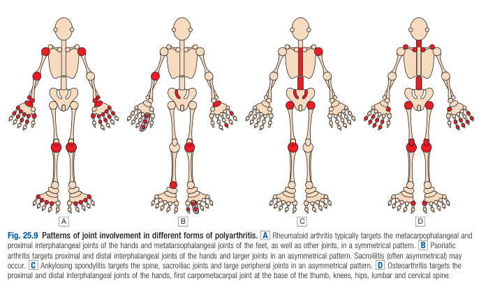
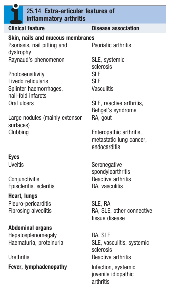

# Polyarthritis

- **Definition** - Pain and swelling affecting \>= joints or joint groups
- **DDx of polyarthritis** - differentiated by patterns of joint involvement and extra-articular manifestations:
    - <u>Common causes</u>:
        - **Rheumatoid arthritis** - symmetrical small and large joint involvements (UL & LL)
        - **Viral arthritis** - symmetrical small joint involvement (a/w rash and prodromal illness)
        - **Noadal OA** - symmetrical DIP, PIP, CMC and large joint involvement (a/w Herberden's nodes)
        - **Seronegative spondyloarthropathies:**
            - Psoriatic arthritis - varying clinical presentations (a/w nail dystrophy and psoriasis)
            - Ankylosing spondylitis, Axial spondylitis, enteropathic spondylitis - irregular asymmetrical oligoarthritis with LL predilectation (a/w inflammatory back pain)
        - **SlE** - symmetrical small joint involvement (Raynaud's phenomenon, cutaneous lupus, photosensitivity)
    - <u>Less common causes</u>:
        - JIA
        - Chronic gout
        - Systemic sclerosis and polymyositis
        - Hypertrophic osteoarthropathy
        - Haemochromatosis
        - Acromegaly
- **Salient points of Hx:**
    - HPI - characterise pattern of joint involvement in polyarthritis and associated Sx:
        - Pattern of joint involvement - Symmetry, small and large joint involvement, axial involvement 
        
        - Associated symptoms - mucocutaneous manifestations, occular manifestations, abdominal organs, systemic symptoms: 
        
- **Ix:**
    - Routine bloods - CBC, LRFT
    - Inflammatory markers - ESR, CRP
    - Immunological screen - ANA, RF, ACPA
    - +/- US - demonstrate synovitis if not evident clinically
- **Mx:**
    - All efforts directed at diagnosis
    - NSAIDs and analgesics for symptomatic relief until diagnosis can be made\*\* Fracture
