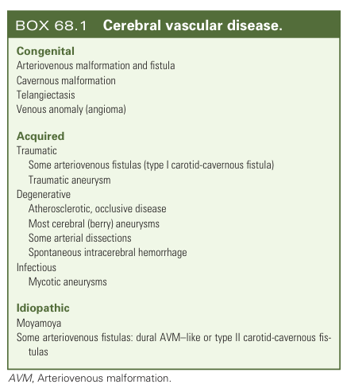
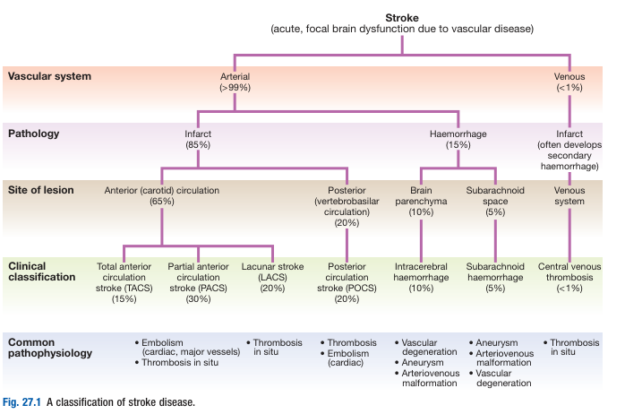
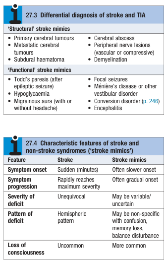
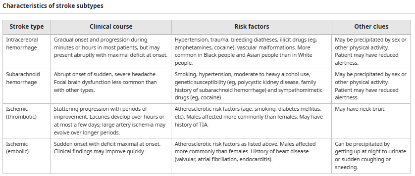

# Principles of Stroke and Cerebrovascular Diseases

- **Cerebrovascular Disorders** - host of disorders involving cerebrovasculature, not just strokes: 

- **Definition of stroke** - a rapid onset of focal neurological S/S or global disturbances of cerebral function due to non-traumatic vascular causes, w/ symptoms lasting \>= 24h or leading to death
- **Classification of stroke disease** - 85% Ischaemic stroke, 15% intracerebral haemorrhage: 

- **Epidemiology** - common medical emergency and most common adult neurological disease:
    - <u>Incidence</u> - most common adult neurological disease
    - <u>Demographic</u> - incidence increases steeply with age, ?Male preponderance
    - <u>Mortality and Morbidity</u> - 2nd leading cause of death, 4th leading cause of physical disability in China and HK:
        - Mortality - 20% 30d mortality
        - Morbidity - 50% who survive are left with physical disability
- **Stroke mimics** - S/S caused by non-vascular phenomenon that is considered if Hx atypical (\< 5% in classical presentation): 

    - **Persistent neurological deficits:**
        - <u>Traumatic brain injury</u> - head trauma resulting in subdural or epidural haematoma
        - <u>Focal brain SOL</u> (e.g. brain tumour) - can cause abrupt onset or worsening, particularly when it reaches critical mass or intra-tumoral haemorrhage occurs
        - <u>CNS infections</u> - encephalitis or brain abscesses
        - <u>Neuroinflammatory disorders</u> - esp. MS, where Hx f prior attacks is important in identification of the disease
        - <u>Non-ketotic hyperglycaemic stupor</u> (HHS) - considered in diabetic patients
    - **Transient neurological deficits:**
        - <u>Seizures</u> - focal seizures typically results in +ve Sx, although paralysis may occur after an event (Todd's paresis)
        - <u>Migraine aura</u> - complex focal neurological S/S often accompanies migraine headache
        - <u>Hypoglycaemia</u> - important cause of focal neurological S/S of the elderly
- **Approach to suspected stroke:**
    - <u>Initial assessment</u> - primary assessment (ABC), temperature
    - <u>Targeted Hx and P/E</u> - 1) r/o stroke mimics, 2) differentiation between stroke subtypes, and 3) determine whether patient is candidate for reperfusion
    - <u>Initial Ix</u> - routines, neuroimaging, and cardiac evaluation (+/- hypercoagulable studies)
- **Salient points of Hx:**
    - **HPI** - last known well, characterisation of clinical course, including onset, progression, provacation, previous episodes:
        - <u>Last known well</u> - eligibility criteria of TPA and mechanical thrombectomy
        - <u>Onset</u> - immediate onset to maximal intensity of Sx a/w SAH and embolic stroke; gradual onset is a/w ischaemic stroke and occasionally ICH
        - <u>Progression of Sx</u> - each stroke subtype has a characteristic clinical course:
            - **Thrombotic stroke** - gradual onset of Sx that fluctuates between normal and abnormal, <u>progressing in a step-wise, stuttering, fashion</u>, with the duration of Sx evolution being longer for large vessel occlusions
            - **Embolic stroke** - sudden onset to maximal intensity, also often a/w rapid recovery
            - **Intracerebral haemorrhage** - sudden onset and progresses gradually over minutes or a few hours
            - **Subarachnoid haemorrhage** - immediate onset to maximal intensity, usually presenting w/ 'thunderclap headache', while focal neurological Sx is less common

      
      
        - <u>Provacation</u> - note the activity at the onset or just before the stroke:
            - **Spotaneous haemorrhagic stroke** - sometimes can be precipitated by sex or other physical activities
            - **Ischaemic stroke** - typically sudden onset
            - **Embolic stroke** - of interest is a/w getting up at night to urinate (a matutinal embolus)
        - **Previous episodes** - history of TIA:
            - History over same territory favours presence of local vascular lesion
            - History of TIA over more than vascular territory suggest extra-cranial embolisation
    - **Associated Sx:**
        - <u>Fever</u> - consider IE causing embolic stroke, or intercurrent infection predisposing to thrombosis
        - <u>Headache</u> - usually dominant features of haemorrhagic stroke, but may precede thrombotic stroke
        - <u>Nausea and vomiting</u> - reflects either 1) raised ICP secondary to haemorrhagic stroke, or 2) disorientation from vertigo as a result of posterior circulation stroke
        - <u>Altered states of consciousness</u> - favours the presence of haemorrhage, where presence of focal S/S suggestives ICH, while absence suggests SAH
    - **PMH:**
        - <u>Diabetes mellitus</u> - increased likelihood of large and small vesel occlusive disease
        - <u>HTN</u> - increased risk of both ischaemic and haemorrhagic stroke
        - <u>Hyperlipidaemia</u> - increased risk of thrombotic stroke
        - <u>Other atherosclerotic disease</u> - Hx of PAD or CCS a/w increased likelihood of ischaemic stroke
        - <u>Cardiovascular disease</u> (e.g. atrial fibrillation, valvular heart disease, prior MI) - increased probability of cardioembolism
        - <u>Known bleeding tendancy</u> - a/w increased risk of haemorrhagic stroke
    - **Drug Hx** - antiplatelet, anticoagulant
    - **Relevant FHx and SHx** - smoking and alcohol intake
- **P/E:**
    - **Initial general assessment** - primary assessment and temperature:
        - <u>Airway</u> - ensure airway is patent, especially if N/V due to raised ICP
        - <u>Breathing</u> - Hypoventilation may complicate certain strokes (e.g. vertibrobasilar ischaemia, or those w/ raised ICP) that reduces respiratory drive, where increased in PaCO2 results in cerebral vasodilation and worsens ICP
        - <u>Circulation</u> - BP elevated, which may reflect 1) chronic hypertension, or 2) an acute elevation in BP to maintain cerebral perfusion
        - <u>Temperature</u> - concurrent fever can be related to underlying disease (e.g. infective endocarditis), and can worsen ischaemia (hence normothermia should be maintained)
    - **Neurological examination** - clinical stroke localisation: 
    
- **Ix:**
    - **Routine bloods** - RBG, CBC, LRFT, clotting profile, lipid profile, A1c, ESR/CRP:
        - <u>RBG</u> - r/o hypoglycaemia (esp. in elderly) as stroke mimic
        - <u>CBC</u> - detection of anaemia, leukocytosis or severe thrombocytopenia
        - <u>RFT</u> - hydration status, and electrolyte abnormalities
        - <u>Clotting profile</u> - abnormal clotting profile raises suspicion of haemorrhagic stroke
        - <u>Lipid profile</u> - detect dyslipidaemia as atherosclerotic risk factor
        - <u>A1c</u> - determine glycaemic control
        - <u>ESR/CRP</u> - underlying inflammatory disease
    - **Neuroimaging** - CT or MRI brain to distinguish between stroke subtypes:
        - <u>Timing</u> - urgent neuroimaging is typically required if:
            - Decreased GC or progressive focal neurological Sx
            - Hx suggestive of a haemorrhagic stroke
            - Suspected ischaemic stroke that is eligiable for TPA and mechanical thrombectomy
    - **Cardiac evaluation** - 12-lead ECG, 24-48h cardiac monitoring, echocardiogram, ambulatory cardiac event monitoring:
        - <u>12-lead ECG</u> - detection of concurrent myocardial ischaemia and atrial fibrillation
        - <u>24-48h cardiac monitoring</u> - for detection of subclinical AF
        - <u>Echocardiogram</u> - to identify a source of embolism from the heart or aorta
        - <u>Ambulatory cardiac event monitoring</u> - increased detection rates of subclinical AF in those who presents w/ cryptogenic ischaemic stroke or TIA to prevent recurrent stroke (EMBRACE trial)
- **Differentiating features of stroke subtypes:** 

