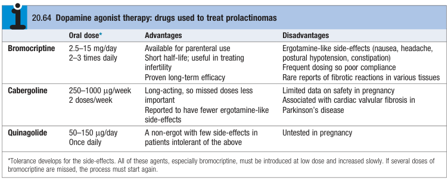

# Prolactinoma

- **Definition** - functional pituitary adenomas that result in autonomous secretion of prolactin
- **Pathophysiology of prolactinoma:**
    - <u>Autonomous secretion of prolactin</u> - manifests as hyperprolactinaemia and hypogonadotrophic hypogonadism
    - <u>Hyperprolactinaemia correlates w/ tumour size</u> - some macroprolactinomas can elevate prolactin concentrations above 100,000 mU/L
- **Clinical features of prolactinoma** - present early as <u>microadenomas</u> in pre-menopausal women as Sx often prompt presentation:
    - **Galactorrhoea** - lactation in the absence of breast feeding
    - **Hypogonadotrophic hypogonadism** - typically manifests as <u>oligo- or a-menorrhoea</u> in pre-menopausal women prompting clinical presentation, while loss of libido and decreased shaving frequency may be elicited in men
    - **Acromegaly** - may be observed in co-secretory tumours as lactotrophs share a common lineage w/ GH-secreting cells
    - **Sx of pituitary tumour** (see notes on hypopituitarism) - macroadenoma may result in:
        - Local mass effect
        - Hypopituitarism
- **Ix:**
    - **Urine pregnancy test** - r/o pregnancy in women of child-bearing age especially if presenting w/ <u>amenorrhoea</u>
    - **Serum PRL level** - ULN typically 500 mU/L (14 ng/dL):
        - <u>Levels between 1000-5000 mU/L</u> - may be a microadenoma, or a pituitary tumour resulting in disconnect hyperprolactinaemia
        - <u>Levels \> 5000 mU/L</u> - extremely suggestive of macroprolactinaemia
    - **Pituitary hormone assessment** - assessment of hypopituitarism
    - **MRI pituitary** - to detect pituitary adenoma
- **Mx:**
    - **Principles of Mx:**
        - <u>Medical therapy</u> - dopamine agonists are first-line therapy for majority of patients, as they are capable of causing **tumour shrinkage**
        - <u>Surgery and RT</u> - second-line therapy when macroprolactinoma has failed to shrink sufficiently within dopamine agonist therapy
    - **Dopamine agonist therapy:**
        - <u>Selection</u>:
            - Ergot-derived dopamine agonist - e.g. bromocriptine, carbegoline
            - Non-ergot-derived dopamine agonist - quinagolide

      
      
        - <u>Clinical efficacy</u> - effective for tumour shrinkage (improvement of visual field defect), and reduction in serum prolactin concentration:
            - Can be single mode of treatment for microadenomas (withdrawal of drug w/o recurrence of hyperprolactinaemia)
            - Typically combined with curative surgery or RT for macroadenomas
        - <u>S/E</u>:
            - **Tricuspid regurgitation** - fibrotic reactions esp. in long-term use in patients w/ PD (periodic screening by echocardiography)
            - **Ergotamine-side effects:**
                - N/V
                - Headache
                - Postural hypotension
                - Constipation
    - **Transphenoidal surgery** - typically considered if failed medical therapy:
        - Cure rate variable by size (up to 80% in microprolactinoma; substantially lower in macroprolactinoma)
        - Recurrence is not unusual
    - **External beam RT** - may be required for some macroadenomas if dopamine agonists are to be stopped
- **Prolactinoma and pregnancy** - return of fertility immediately after innitiation of medical therapy:
    - For microadenomas, withdrawn dopamine agonist therapy as soon as pregnancy is confirmed
    - For macroadenomas, continue dopamine agonist therapay as estrogen stimulation may result in growth of prolactinoma (serial PRL level and visual field assessment)
    - All patients advised to report local mass Sx (e.g. headaches, visual field defects) promptly
