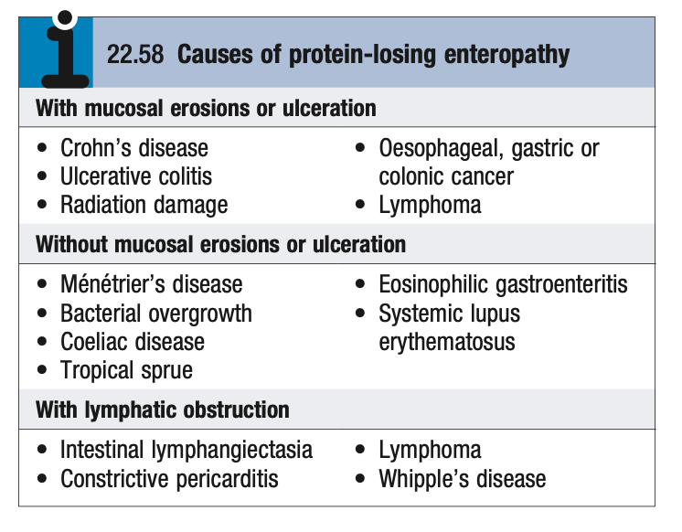

# Protein-Losing Enteropathy

- **Definition** - term describing excessive loss of protein into the gut lumne, sufficient to cause hypoproteinaemia
- **Pathophysiology** - theoretially can occur in many gut disorders but most commonly occurs w/:
    - Mucosal erosions or ulcerations
    - Increased mucosal permeability
    - Obstruction of lymphatic vessels
- **Clinical features of protein-losing enteropathy** - related to hypoproteinaemia:
    - <u>Peripheral oedema</u> - LL oedema, pleural effusion, ascites; may be severe to the extent of anasarca
    - <u>Absence of other more common explanations of hypoproteinaemia</u>:
        - Malnutrition
        - Proteinuria and the nephrotic syndrome
        - Reduced protein synthesis in the setting of chronic liver disease (normal LFTs)
- **DDx of protein-losing enteropathy:** 

    - **Mucosal erosions or ulcerations:**
        - <u>Upper GI causes</u> - esophageal and gastric cancer
        - <u>Lower GI causes</u> - IBD, radiation enteritis/ colitis, lymphoma, colonic carcinoma
    - **Increased gut mucosal permeability:**
        - <u>Gastric causes</u> - Menetrier's disease
        - <u>SB causes</u> - malabsorptive disorders (Small bowel bacterial overgrowth, tropical sprue, coeliac disease), eosinophilic gastroenteritis, systemic lupus erythematosis
    - **Lymphatic obstruction:**
        - Intestinal lymphangiectasia
        - Lymphoma
        - Whipple's disease
        - Constrictive pericarditis
- **Ix and Dx** - confirmation based on demonstration of protein loss via gut:
    - <u>Faecal clearance of alpha-1-antitrypsin</u> - comparison of serum and faecal A1AT levels for 5d accounting for day-to-day variability
    - <u>Nuclear medicine scan</u> - IV injection of Cr-labelled albumin
- **Evaluation of underlying causes** - generally based on endoscopy
- **Mx** - no effective Mx:
    - Tx of underlying disorder
    - Symptomatic Mx of peripheral oedema
    - Nutritional support
