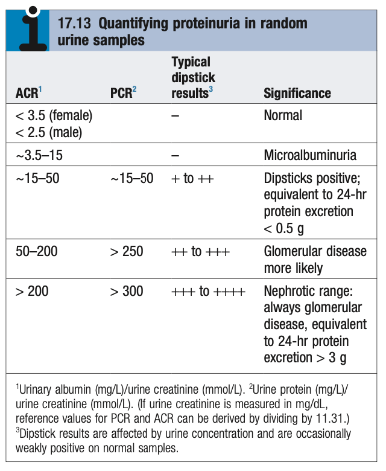
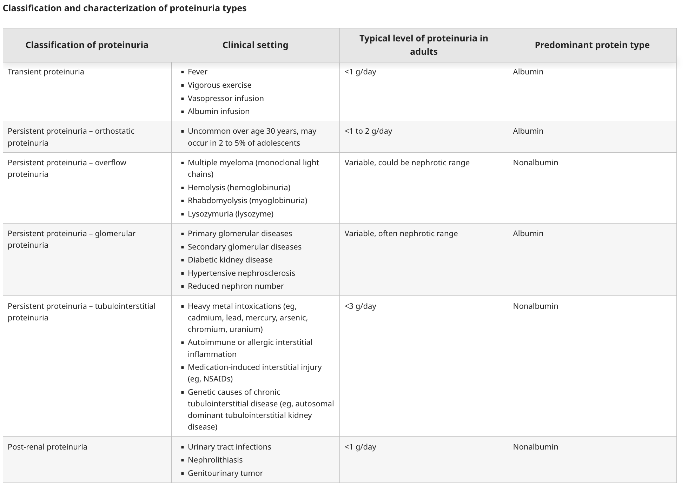
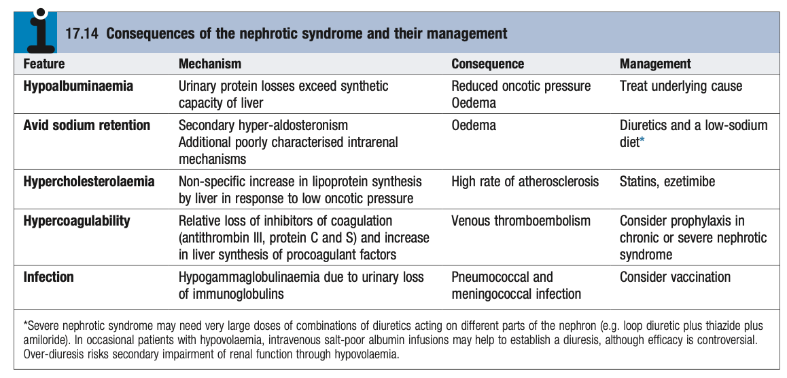
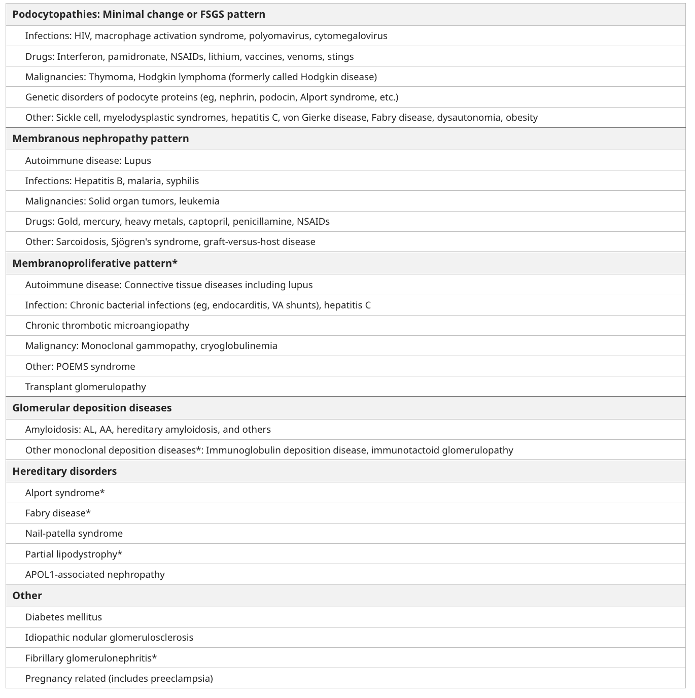
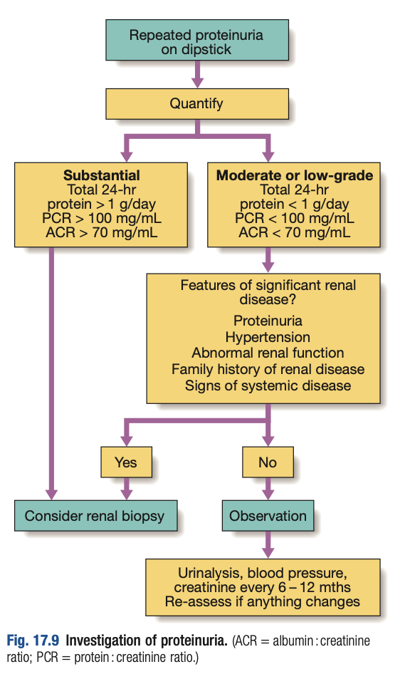

# Proteinuria and the Nephrotic Syndrome

- **Definition of proteinuria** - normal vs abnormal protein excretion:
    - <u>Normal protein excretion</u> - \< 150 mg/d due to filtration of trace amounts of albumin and LMW proteins (much of which are reabsorbed)
    - <u>Abnormal proteinuria</u> - previously defined as excretion of \> 150 mg/d, but evolving definitions as early diabetic nephropathy characterised by albuminuria with normal protein excretion:
        - **Microalbuminuria** - persistent albumin excretion at 30-300 mg/d (dipstick-negative range)
        - **Macroalbuminuria** - persistent albumin ecretion at \> 300 mg/d (dipstick-positive range)
        - **Nephrotic-range proteinuria** - persistent total protein excretion at \> 3.5 g/d (semi-quantitative dipstick is 3-4+)
- **Normal renal protein handling** - generally \< 150 mg/d:
    - <u>Glomerular filtration</u> - moderate amounts of low-molecular-weight proteins pass through the healthy GBM, but <u>most are reabsorbed in the PCT</u>
    - <u>Tubular secretion</u> - a proportion of the protein excreted are Tamm-Horsfall protein, esecreted by the renal tubules
- **Measurement of proteinuria:** 

    - <u>Normal proteinuria</u> - \< 150 mg/d, equivalent to UACR \< 3.5 in F, and \< 2.5 in M
    - <u>Microalbuminuria</u> - very early stages of glomerular diseases where urine is **dipstick -ve for protein**, equivalent to UACR of 3.5-15 mg/mmol
    - <u>Overt proteinuria</u> - i.e. dipstick +ve proteinuria, where glomerular disease is more likely when distick 2-3 +
    - <u>Nephrotic range proteinuria</u> - massive proteinuria of \> 3.5 g/dL, equivalent to UPCR \> 300 mg/mmol or UACR \> 200 mg/mmol
- **Transient proteinuria** - transient proteinuria can be detected on dipstick in certain conditions:
    - <u>Conditions related to transient proteinuria</u> - fever, UTI, vigorous exercise, heart failure
    - <u>Implications</u> - ask about such events in Hx and r/o on **repeat dipstick after the trigger is resolved**
- **Orthostatic proteinuria** - benign disease in young adults a/w proteinuria in upright position (first-morning urine -ve for proteinuria)
- **Types of proteinuria** - dipstick proteinuria assumed to be glomerular of origin (as it cannot detect non-albumin proteins):
    - <u>Glomerular proteinuria</u> - due to increased filtration of medium- and large-sized proteins, particularly **albumin** due to damage of the glomerular filtration barrier
    - <u>Tubular proteinuria</u> - failure of reabsorption of low-molecular-weight proteins, such as beta-2 microglobulin, Ig light chains, retinol-binding proteins due to proximal tubular disorders
    - <u>Overflow proteinuria</u> - increased excretion of low-molecular weight proteins as a result of **marked production of a particular protein** (e.g. <u>paraproteinaemia</u>), leading to increased glomerular filtration and excretion
    - <u>Postrenal proteinuria</u> - often as a result of inflammation in the urinary tract resulting in increases in non-albumin protein (e.g. IgA and IgG)

  
  
- **Clinical patterns of proteinuria:**
    - <u>Isolated non-nephrotic range proteinuria</u> - proteinuria \< 3.5 g/d in absence of other features
    - <u>Nephrotic pattern</u> - syndrome pertaining constellation of clinical features surrounding proteinuria \> 3.5 g/d (see below) that points to a limited set of differential diagnoses
    - <u>Nephritic pattern</u> - syndrome a/w proteinuria and haematuria, fluid retention and HTN
- **Clinical features of nephrotic syndrome** - clinical syndrome characterised by pentad of features:
    - <u>Massive proteinuria</u> - nephrotic-range proteinuria \> 3.5 g/d (PCR \> 300 mg/mmol)
    - <u>Hypoalbuminaemia</u> - defined as albumin \< 30 g/L
    - <u>Oedema and generalised fluid retention</u> - pitting oedema over dependent areas, e.g. LL, extending up to scrotum, and abdomen, or in the UL or face in the morning secondary to both **hypoalbuminaemia** and **avid sodium retention**
    - <u>Hypercholesterolaemia and lipiduria</u> - decreased oncotic pressure stimulates hepatic lipoprotein synthesis and hypercholesterolaemia (increased CVS risk)
- **Pathophysiology of the nephrotic syndrome:**
    - **Proteinuria** - protein loss due to glomerular proteinuria, characterised by increased filtration of medium and large-sized proteins across the damaged glomerular filtration barier, principally loss of albumin, but also other plasma proteins (e.g. anti-coagulants, Ig, hormone-carrying proteins)
    - **Hypoalbuminaemia** - due to proteinuria that is unable to be compensated sufficiently by hepatic albumin synthesis to normalise plasma albumin concentration
    - **Oedema** - oedema can occur in volume-depleted, or volume-excess conditions:
        - <u>Overfilling theory</u> - marked hypoalbuminaemia results in reduced plasma oncotic pressure, resulting in excess interstitial fluid formation
        - <u>Underfill theory</u> - arterial underfilling results in Na and fluid retention via activation of RAAS
    - **Hyperlipidaemia** - decreased plasma oncotic pressure stimulates hepatic lipoprotein synthesis resulting in hypercholesterolemia
- **Complications of nephrotic synrome:** 

    - <u>Protein malnutrition</u> - loss of lean body mass with negative nitrogen balance, but may be masked by weight gain due to concurrent edema
    - <u>Hypovolaemia</u> - occurs in over-diuresis in case of marked hypoproteinaemia, or in the case of severe 3rd-spacing of severe hypoproteinaemia
    - <u>Acute kidney injury</u> - ocassionally caused by hypovolaemia, tubular injury or GN
    - <u>Thromboembolism</u> - relative loss of natural anticoagulants and liver synthesis of pro-coagulants, predisposing to arterial and venous thromboembolism (esp. increased risk of DVT and renal vein thrombosis)
    - <u>Infections</u> - predisposed to encapsulated bacterial infections (e.g. pneumococcal infection, meningococcal infection, cellulitis, and SBP):
        - **Loss of huoral immunity** - due to hypogammaglobulinaemia
        - **Loss of cellular immunity** - due to loss of vitamin D and other serum factors resulting in defective T cell function, and use of immunosuppressive Tx
- **Etiology of isolated proteinuria:**
    - <u>Benign disorders</u> - e.g. transient proteinuria, orthostatic proteinuria
    - <u>Primary glomerular disease</u> - early membranous nephropathy, mild GN (absence of haematuria)
    - <u>Systemic disorders</u> - e.g. secondary FSGS in diabetic nephropathy, prior glomerular disease, deposition disease (e.g. Fabrys disease, amyloidosis)
- **Etiology of nephrotic syndrome:**
    - <u>Primary nephrotic syndrome</u> - MCD (20% adults, 76% children), FSGS (15%), membranous nephropathy (40%), MPGN (7%):
        - Minimal change disease - as a result of primary, or in association of NSAIDs, or malignancies (e.g. HL)
        - FSGS - not a disease entity but reflects sequelae of previously healed focal glomerular injury, and has been associated w/ genetics, viral infections, reflux nephropathy and obesity
        - Membranous nephropathy - autoimmune condition against the podocytes in adults, and rarely may be secondary to drugs, infections or malignancies
    - <u>Secondary nephrotic syndrome</u>:
        - DMN - diabetic nephropathy results in nephrotic-range proteinuria in late stage
        - Autoimmune disease - e.g. Lupus nephritis (esp class IV or V LN)
        - Infections - HBV, HCV, HIV
        - Drugs - e.g. NSAID, heavy metals, penicillamine
        - Malignancies - e.g. amyloidosis

    
    
- **Ix and measurements of proteinuria** - semi-quantitative and quantitative methods:
    - **Urine dipstick** - semiquantitative method to detect glomerular proteinuria, primarily albumin and is relatively insensitive to other proteins (e.g. Ig light chains)
        - <u>Principles</u> - measures albumin concentration based on colorimetric reaction between **albumin** and tetrabromophenol blue to give different shades of green
        - <u>Interpretation</u>:
            - Negative - 0-30 mg/dL
            - 1+ - 30-100 mg/dL
            - 2+ - 100-300 mg/dL
            - 3+ - 300-1000 mg/dL
            - 4+ - \> 1000 mgdL
        - <u>Precautions</u> - dipstick grading is highly dependent on urine concentration (i.e. diluted urine will underestimate albuminuria, concentrated urine will overestimate albuminuria)
    - **24-hour urine collection** - traditionally the gold-standard method to quantify proteinuria (N \< 150 mg/dL)
    - **Urine-protein-to-creatine ratio** (UPCR) - calculation from spot urine specimen (ideally first-morning urine) to correlate to estimate 24-hour urine protein excretion based on population statistics
    - **Urine albumin-to-creatinine ratio** (UACR) - calculation from spot urine specimen, and is the preferred method for screening for albuminuria among diabetic patients
- **Salient points of Hx:**
    - **HPI** - onset, and duration of proteinuria, reason for testing
    - **Events suggestive of transient proteinuria** - fever, vigorous exercise, current UTI
    - **Associated Sx:**
        - **Nephrotic-like Sx:**
            - <u>Foamy urine</u> - appearance of multiple layers of small-to-medium bubbles in urine (onset helpful in determining the onset of proteinuria)
            - <u>Oedema</u> - new-onset or worsening swelling of the LL, abdomen (ascites), or peri-orbitally
        - **Nephrtic-like Sx:**
            - <u>Gross haematuria</u> - glomerular haematuria is classically a 'rusty' brown colour
        - **Dysuria +/- fever** - suggestive of UTI
        - **Rheumatologic and systemic Sx** (e.g. fever, weight loss, rash, joint pain) - suggestive of rheumatological involvement of the glomerulus (e.g. <u>SLE</u>)
    - **PMH:**
        - <u>Comorbidities a/w proteinuria</u> - HTN, DM, autoimmune disease (e.g. SLE, vasculitis), malignancy, HBV, HCV, HIV infections
        - <u>Known renal diseases</u> - e.g. old glomerular disease, DMN
    - **Drug Hx:**
        - <u>NSAIDS</u> - which can cause MCD, and secondary membranous nephropathy (as well as tubular proteinuria as a result of AIN or CIN)
        - <u>Anticancer therapies</u> - including Anti-VEGF, TKIs, ICIs
        - <u>Bisphosphonates</u> - a/w collapsing focal segmental glomerulosclerosis
        - <u>Old DMARDS</u> (rarely used now) - gold penicillamine
    - **Relevant SHx and FHx**
- **P/E:**
    - <u>BP measurement</u> - assessment of new or worsening HTN
    - <u>General examination</u> - new or worsening oedema, rashes and purpura
    - <u>Abdominal examination</u> - usually unremarkable
- **Approach to isolated proteinuria:** 

- **Ix** - limited Ix if only isolated proteinuria:
    - **Routine bloods** - CBC, LRFT, ESR, clotting profile, A1c, lipid profile, LDH:
        - <u>CBC w/ differentials</u> - any anaemia of chronic illness
        - <u>LFT</u> - assess hypoalbuminaemia
        - <u>RFT</u> - assessment of baseline kidney function (Cr, eGFR)
        - <u>ESR</u> - inflammatory disease e.g. lupus flares
        - <u>Clotting profile</u> -
        - <u>A1c and fasting glucose</u> - assessment of DM
        - <u>Lipid profile</u> - assessment of hyperlipidaemia due to nephrotic syndrome
        - <u>LDH</u>
    - **Urine**:
        - <u>Urine dipstick</u> - confirm proteinuria, evaluate haematuria and UTI (nitrite, leukocyte esterase)
        - <u>Urine microscopy</u>:
            - Features suggestive of glomerular bleeding - dysmorphic RBC (acanthocytosis), RBC casts
        - <u>Spot urine for UPCR or UACR</u> - estimate quantification of proteinuria
    - **Serological studies for underlying cause** - if presents with nephrotic syndrome:
        - **Immune markers** - Ig pattern, Anti-PLA2R, ANA, Anti-dsDNA, C3/4
        - **Viral serologies** - ASLO, VDRL, HBsAg, anti-HCV +/- anti-HIV
        - **Serum protein electrophoresis and serum light chains** - for amyloidosis
    - **Renal Bx:**
        - <u>Adults</u> - required if nephrotic-range proteinuria or presentation w/ nephrotic syndrome for histological diagnosis
        - <u>Children</u> - presumptive Dx of MCD and treated empirically w/ high-dose steroids, and re-consider Bx if lacking treatment responsiveness
- **Mx of nephrotic syndrome:**
    - **Principles of Mx:**
        - **Disease-specific therapy** - disease-specific Tx may entail corticosteroids or immunosuppressive agents
        - **General supportive measures** - required for all patients:
            - <u>Proteinuria reduction</u> - RAAS blockade by ACEi or ARB to reduce proteinuria with renal protective effects
            - <u>Treatment of oedema</u>:
                - General measures - dietary sodium restriction (2g Na per day)
                - Diuretics - increased dosage of loop diuretics (reduced drug delivery to kidneys due to hypoproteinaemia)
            - <u>Treatment of hyperlipidaemia</u> - lipid-lowering therapy (statins) for persistant nephrotic syndrome
            - <u>Treatment of thromboembolism</u> - heparin in acute setting, bridged to warfarin for as long as the patient remains nephrotic (no evidence for prophylactic anticoagulation)
            - <u>Prevention of infections</u> - pneumococcal vaccination
