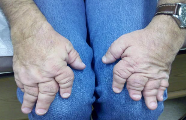
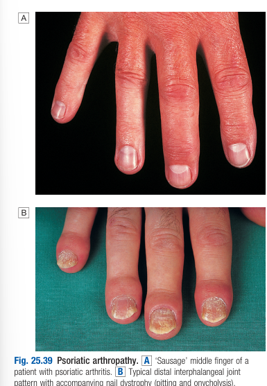

# Psoriatic Arthritis

- **Definition** - A seronegative spondyloarthritis with strong associations with psoriasis
- **Epidemiology:**
    - <u>Prevalence</u> - 7-20% of patients with pre-existing psoriasis (0.6% in general population)
    - <u>Demographic</u> - onset at 25-40y
- **Pattern of clinical presentation:**
    - Arthritis on top of pre-existing psoriasis (70%)
    - Arthritis predates psoriasis (20%)
    - Synchronous presentation with arthritis and psoriasis
- **Clinical features of PsA:**
    - **Inflammatory arthritis and enthesitis** - several patterns of joint involvement (most are non-errosive except in arthritis mutilans):
        - <u>Asymetrical inflammatory oligoarthritis</u> (40%) - abrupt onset of synovitis and peri-articular inflammation over the hands and feet, characteristically resulting in dactylitis, and ocassionally involving large joints (with large effusions)
        - <u>Symmetrical polyarthritis</u> (25%) - typically manifests in F resembling RA, but has small and large joint involvement of UL and LL, and absent of nodules, and can be deforming due to tenosynovitis and soft tissue contractures
        - <u>DIP joint arthritis</u> - uncommon pattern (characeterostic in men) affecting DIP joint and periarticular tissues, invariably associated with nail dystrophy
        - <u>Psoriatic spondylitis</u> - typically unilateral or asymmetric sacroiliitis which may resemble AS, can occur in conjunction or alone with peripheral joint involvements
        - <u>Arthritis mutilans</u> (5%) - deformiing arthritis of fingers and toes, with characteristic findings of 'main en lorgnette' where didgits can be telescoped or and pulled back to original length

     
    
    - **Nail dystrophy** (85%) - nearly invariable feature of PsA, but only present in 30% of those with uncomplicated psoriasis:
        - Pitting - puctate nail depressions
        - Onycholysis - distal nail plate separated from nail bed
        - Subuncal hyperkeratosis - accumulation of tissue between nail and nail bed
        - Oil drops - circular discolouration of the nail bed
    - **Psoriatic lesions** - widespread, over scalp, natal cleft and umbilicus
    - **Ocular manifestations** - conjunctivitis can occur, where uveitis only occurs to HLA-B27 +ve individuals with sacroiliiitis
- **Ix:**
    - <u>Inflammatory markers</u> (ESR, CRP) - non-specifically elevated or normal even in active disease
    - <u>Imaging</u>:
        - Radiographs - may be normal or show cartilage destruction with JSN (arthritis mutilins), differentiated from RA by:
            - Distribution over joints
            - Proliferative erosions with marked new bone formation
            - Absent periarticular osteoporosis and osteosclerosis
        - Radiograph of SI joint - coarse, asymetrical sacroiliitis with coarse, asymetrical syndesmophyte formation
        - +/- MRI or US - detect synovitis and enthesitis
- **Mx:**
    - NSAIDs - for symptomatic management
    - Traditional DMARDS - for persistent synovitis:
        - Preferred agents - Methotrexate (1st line due to cutaneous efficacy), sulfasalazine, cyclosporin, leflunomide
        - Avoid hydroxychloroquine as it may cause exfoliative skin reactions
    - Anti-TNF alpha - as add on therapy fr patients who respond inadequately to traditional DMARDs
    - Other biologics - IL-12/23 inhibitors (Ustekinumab)
