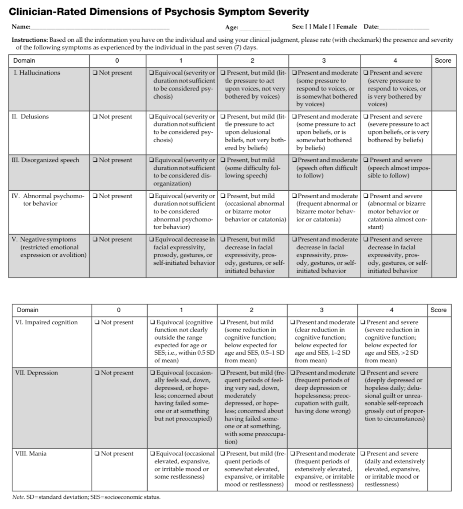

# Psychosis

- **Definition** - heterogenous group of disorders characterised by:
    - Delusions
    - Hallucinations
    - Disorganized thinking and speech
    - Grossly disorganized or abnormal motor behaviour
    - Negative symptoms
- **Delusions** - fixed beliefs that are not amenable to change in light of conflicting evidence:
    - <u>Theme of delusion</u> - content of delusion may include variety of themes:
        - Persecutory delusions
        - Referential delusions
        - Grandiose delusions
        - Religious delusions
        - Somatic delusions
        - Erotomanic delusions
        - Nihlistic delusions
    - <u>Bizzare delusions</u> - delusions that are deemed clearly implausible and not understandable to same-culture peers and do not derive from ordinary life experiences
- **Hallucinations** - perception-like experiences of any sensory modality that occur without an external stimulus that 1) occur in clear sensorium, 2) are vivid and clear, 3) with the full fource and impact of normal perception, and 4) not under voluntary control
- **Disorganised thought and speech** (less severe in prodromal and residual periods but marked in acute episode) - identification of <u>formal thought disorder</u> inferred from the individual's speech:
    - <u>Derailment or loose association</u> - switching rapidly from one topic to another
    - <u>Tangentiality</u> - answers to questions are obliquely related or completely unrelated
    - <u>Incoherance</u> (word salad) - speech is incomprehensible and is linguistically disorganised and may mimick receptive aphasia
- **Grossly disorganised or abnormal motor behavior** (including catatonia) - extremely variable presentation but generally results in 1) lack of goal directed behaviour, and 2) difficulties to perform ADL:
    - <u>General silliness</u> - often noted as a change in personality or as a un-seriousness by others
    - <u>Unpredictable agitation</u> - agitation often arises from disordered percept or delusional thinking
    - <u>Catatonia</u> - marked decreased reactivity to the environment, from resistance to instruction (negativism), maintaining a rigid, inappropriate or bizzare posture, or lack of verbal or motor response (mutism, stupor), or purposeless excessive motor activity (catatonic excitement)
- **Negative symptoms** - more marked in schizophrenia and less prominent in other psychotic disorders; when present, accounts for substantial morbidity:
    - <u>Affect blunting</u> - perceived as diminished emotional expression verbally (e.g. through intonation of speech), or non-verbally (eye contact, facial expressure, hand gestures)
    - <u>Avolition</u> - decrease in motivated self-initiated purposeful activity, and may sit for long-periods of time showing little interest in work or social activities
    - <u>Anhedonia</u> - inability to experience pleausre
    - <u>Alogia</u> - i.e. poverty of speech, deminished speech output
    - <u>Associality</u> - apparent lack of interest in social interactions and may be associated w/ avolition (but may also represent limitations of opportunities)
- **DDx of psychotic states:**
    - <u>Organic causes</u> - e.g. delirium, temporal lobe epilepsy, thyroid, adrenal disorders, B12 deficiency, neurosyphilis
    - <u>Psychiatric illnesses</u>:
        - Psychotic disorders - e.g. delusional disorders, brief psychotic disorders, substance-/ medication-induced psychotic disorders, psychotic disorders due to medical condition, schizophrenia-spectrum disorders
        - Mood disorders - major depressive disorders or bipolar disporders w/ psychotic features
        - Personality disorders - schizotypal personality disorders
- **Clinical approach to schizophrenia-spectrum and other psychotic disorders** - a gradient along domains of psychopathology:
    - <u>Disorders limited to single domain of psychopathology</u>:
        - Disorder of thought - delusional disorders
        - Motor disorders - e.g. catatonia
    - <u>Disorders w/ time-limiting features</u> (Brief psychotic disorders) - lasts \> 1d but remits by 1mo
    - <u>Psychosis induced by another condition</u>:
        - Substance/ medication-induced psychotic disorder - considered by a physiological consequences of drug of abuse, medications, or toxins andceases after removal of another agent
        - Psychotic disorder due to another medical condition - considered a physiological consequence
        - Bipolar disorders or psychotic depression - often mood congruent psychotic features, and mood Sx is more prominent than that of the psychotic features
    - <u>Schizophrenia spectrum based on prominence of Sx in different domains of pathology</u>:
        - Schizotypal personality disorder - onset and manifestation may reflect that of schizophrenia and causes functional impairment, but strongly held ideas never reach the delusional intensity
        - Schizophreniform disorders - symptomatology equivalent for its duration without the necessity for a decline in functioning, and duration lasting for 1-6 mo
        - Schizophrenia - symptomatology lasting for \> 6mo and includes at least 1 mo of active-phase symptoms
        - Schizoaffective disorder - similar criteria as schizophrenia but a/w prominent affective and mood Sx for 1 mo, preceeded by or followed by continuation of active Sx w/o prominent mood Sx
- **Approach to assessment** - questioning assumes the lack of insight:
    - <u>Hx and MSE</u> - elliciting psychotic Sx, mood Sx, substance use, risk assessment, as well as other domains of Hx
    - <u>P/E</u> - goitre, catatonia examination (if appropriate)
    - <u>Ix</u> - routines, CT brain, EEG for reversible organic causes
- **Salient points of Hx in abnormal beliefs or suspected delusions** - to demonstrate 1) form of the thought (i.e delusional intensity of convinction), 2) content of delusions, and 3) impact of delusions on emotion and action:
    - **Form of delusion** - demonstrated to be an unshakable belief, relative to the patients background:
        - Requires <u>tactful assessment</u> of the <u>degree of conviction</u> relative to the <u>level of evidence</u>
        - Take into account of the patient's cultural (including religion), educational, and SES <u>background</u>
        - The most gentle, and convenient way that is applicable to more delusions is to ask patient to "brainstorm alternative possibilities in interpreting the situation", or even suggest alternative possibilities from an outsider's view (but emphasize that it is just a suggestion and not denying their interpretation of reality)
        - Indirect method of assessing the delusional nature is to assess whether patient has revealed his ideas to others, what others think of them, and patients thoughts on others interpretations
        - Forceful shaking the belief may anger the patient and prevent them from further disclosure (or they may claim to not overvalue the idea although belief remains delusional)
    - **Content of delusion** - assess 1) the delusional theme, and 2) the form of the belief (as above), and 3) bizarre nature of the delusion, and 4) relations with mood, and 5) secondary delusions:
        - **Delusional themes** - the nature of central delusional themes may point to the likely pathology:
            - <u>Non-specific delusional themes</u> - delusions of references, delusion of persecution, grandiose delusion
            - <u>Delusion themes more suggestive of schiozphrenia or psychotic state</u> - delusion of control, thought alienation
            - <u>Delusional themes more suggestive of mania</u> - grandiose delusions, erotomanic delusions
            - <u>Delusional themes more suggestive of depression</u> - delusions of guilt, nihlistic delusions, hyponcondriac delusions (N.B. these delusions are present but do not cause much "distress" as they are justified by the patients supposed wickedness)
        - **Genesis of the delusion** - the available evidences and circumstances that results in such a delusion, principles of assessment involves:
            - 1\) Using terminology proposed by the patient and avoiding terms like "you think" to understand the delusion (rapport building)
            - 2\) For specific delusional themes, questions specific to the themes are asked in a way to <u>confound w/ a patient</u>, can be used based on the fact that much of these delusions are "<u>explanatory delusion</u>" of an "a priori experience":
                - For delusions of thought alienation or control, ask about the mechanisms by which these thoughts or actions are transmitted (e.g. divine, radiowaves, 5G, witchcraft)
                - For delusions relating to witchcraft or general persecution delusions, ask about whether one has offended others which resulted in such retribution (e.g. ?presence of spycams, ask if I would also be spied upon, or why specifically spying on you)
                - For delusions of grandiosity with a generalised self-esteem, ask about current special roles and how one might come about such a special role. Consider special skills and abilities, innovative ideas, and hidden connections w/ powerful people
                - For delusions of reference, ask about what it is exactly that makes the patient think others are referencing him (e.g. facial expressions, special codes), and what the patient thinks they are trying to convey
                - Many more examples to update with experience
            - 3\) Non-specific way of asking for evidence of a delusion (asking the initial circumstances that gave rise to this, using terms like "誅絲馬跡")
        - **Bizarre nature of delusions** - generally <u>inferred from the content</u>:
            - Not reliable hence not included in DSM-5 specifiers, esp. if clinician and patient are of widely different cultural, educational, and SES backgrounds
            - However, generally bizarre delusions across all culture (e.g. alien induction) holds more weight to schizophrenia
        - **Mood congruence of delusions** - determined when assessing mood of patient
        - **Secondary delusions** - asked tactfully by <u>thematic connections</u> as a single delusion may give rise to another:
            - If primarily a grandiose delusions, thematically flow towards delusions of reference, persecution, jealousy etc.
            - If primarily a persecutory delusion, delusion of reference often co-exist as well
            - If primarily a depressive cognition, link to delusions of guilt, reference, persecution, and subsequently catastrophic/ hypochondriacal and nihlistic
    - **Impact on emotion and behaviour of delusions** - part of risk assessment and for differentiating between disorders:
        - Risk assessment in terms of risky behaviour for grandiose delusions, suicide or violence for persecutory or many other delusions; in delusion of control tactful evaluation and documentation on the perceived degree of control has forensic implications
        - Impact of emotion and behaviour of the same delusion may differ amonst individuals, for example, a persecutory delusion is resented by an individual w/ manic episode or schizophrenia, but accepted by a depressed individual
- **Salient points of Hx in abnormal perceptual experiences or suspected hallucinations** - to demonstrate 1) form of the perception, 2) duration and frequency of the abnormal perception, 3) content of the abnormal perception, and 3) impact of abnormal perception:
    - **Form of the perception:**
        - <u>Absence of stimulus</u> - inferred from the fact that there is no stimulus around as attributed by others (e.g. absence of others)
        - <u>Consciousness</u> - hallucination occurs at full consciousness (cf hypnagogic and hypnopompic hallucinations)
        - <u>External</u> - perceived to be external and not a mental process (e.g. AH are at the ear rather than internal dialogues)
        - <u>Control</u> - hallucinations are by definition not under the control of the will
        - <u>Sense modality</u> - classification based on the sense modalities, primarily AH, and VH but others are also present
        - <u>Complexity of the phenomenon</u> - elementary vs complex
    - **Duration and frequency of the abnormal perception:**
        - Fleeting hallucinations may occur in non-psychotic states such as delusional disorders (N.B. these are usually congruent w/ the delusional themes)
        - Persistent, frequent hallucinations are more suggestive of a psychotic state, and can cause significant distress
        - Supposed duration of the hallucination has <u>diagnostic implications</u> for differentiating between the different psychotic disorders per DSM-5 conventions
    - **Content of the abnormal perception** - dependent on the sense modality:
        - For AH, characterise 1) general description (single vs multiple; male vs female; recognise the voice), 2) second- vs third-person, 3) presence of running commentary, 4) contents of the speech such as derogatory, commanding of actions, self-affirming
        - For VH, describe what is seen and its vividness (e.g. ask patient to clarify the features)
    - **Impact of abnormal perception** - effects on emotion and behaviour:
        - If this is the presenting problem, acknowledge the oddity, and distressing nature of the experience
        - Ask patients interpretation of the experience, may attribute to neighbours etc.
        - Behaviours to limit such experience
        - Behaviours that are reactive to the experience
- **Schizophrenia first-rank Sx** - coined by Kurt Schnider as being specific for schizophrenia, but subsequent literature demonstrates lack of PPV:
    - <u>Hallucination</u>:
        - Third person AVH with voices conversing w/ each other
        - AVH in the form of running commentary
        - AVH with voice repeating one's own thoughts aloud (thought echo)
        - Somatic hallucination
    - <u>Bizzare delusion</u>:
        - Thought alineation - thought insertion, withdrawal and broadcasting
        - Passivity or delusion of control - e.g. feelings, actions or impulses experienced as made or influenced by external agents
        - Delusional perception
- **Risk in psychosis** - dependent on:
    - 1) Level of conviction regarding the delusional belief or the perceptual experiences
    - 2) Emotional significance of the morbid experience (i.e. how emotionally charged)
    - 3) Degree of details of the morbid expdrience (e.g. knowing appearance of the supposed AH allows them to easily act on their delusions/ hallucinations)
    - 4) Level of insight regarding the morbid experience
- **Assessment measures** - dimensional assessment of the primary symptoms and co-morbid symptomatology: 

    - <u>Dimensional assessment of primary psychotic symptoms</u>:
        - Hallucinations
        - Delusions
        - Disorganized speech (not applicable for substance-/ medication-induced psychotic disorders and psychotic disorders due to another medical condition)
        - Abnormal psychomotor behavior
        - Negative symptoms
    - <u>Dimensional assessment of affective Sx</u> - often of prognostic value and guides Tx to identify mood pathology and Tx when appropriate:
        - Depression
        - Mania
    - <u>Dimensional assessment of cognitive impairment</u> - impairmnent in range of cognitive domains and can predict functional status:
        - Brief assessments by clinicial (usually sufficient for diagnostic purposes)
        - Standardised clinical neuropsychological assessment administered by trained personnel and use of testing instruments
