# Pulmonary Embolism

- **Definition** - a form of venous thromboembolism where a venous thrombus is formed (principally in proximal DVT), dislodges and emboli to the pulmonary vasculature.
- **Epidemiology:**
    - **Demographic:**
        - <u>Socioeconomic status</u> - rates of PE admission similar, but 30-d mortality persistently high in those disadvantaged community: 
        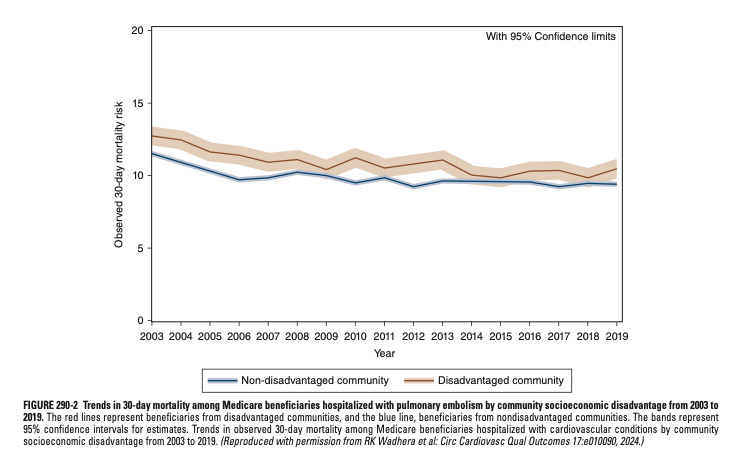
    - **Burden:**
        - <u>Readmission</u> - 30d all-cause re-admission was 11%, most common cause being **recurrent PE** (~11% readmissions)
        - <u>Mortality</u> - decreasing trend (6 to 4.5 per 100000 in the US since the turn of century), but increasing rates of mortality among young and female patients
        - <u>Long-term sequelae</u>:
            - **Post-PE syndrome** recognised as \> 50% experience persistent decline in QoL persistent dyspnoea, fatigue and reduced ET (~25% show objectively RV dysfunction on echo)
            - **Chronic thromboembolic pulmonary hypertension** (CTEPH) is rarer but can cause debilitating exertional dyspnoea
            - **Post-thrombotic syndrome** (chronic venous insufficiency) is a major complication of DVT and can worsen QoL
- **Etiology of PE:**
    - Deep vein thrombosis (80%) - typically proximal
    - Septic emboli - e.g. IE of tricuspid or pulmonary valves
    - Abnormal sites of venous thromboembolism - UL, intra-abdominal veins etc.
    - Non-thrombotic emboli - e.g. septic emboli, air emboli, amniotic emboli, marrow emboli etc.
- **Risk factors for DVT and PE** - related to Virhow's triad in one way or another:
    - **Clinical risk factors** - associations from clinical observations; multiple mechanisms may be implicated:
        - Malignancy
        - Cancer
        - Obesity
        - Cigarette smoking
        - Systemic arterial hypertension
        - Chronic obstructive pulmonary disease
        - Chronic kidney disease
        - Long-haul air travel ('Economy class syndrome')
        - Air pollution
        - Estrogen-containing contraceptives
        - Pregnancy
        - First 6-12 weeks postpartum
        - Post-menopausal HRT
        - Surgery
        - Trauma
    - **Pro-thrombotic states** (thrombophilia) - states of hypercoagulability:
        - <u>Inherited thrombophilia</u> - Antithrombin 3 (ATIII) deficiency, protein C deficiency, protein S deficiency, factor V Leiden, prothrombin gene mutation
        - <u>Acquired thrombophilia</u> - antiphospholipid syndrome (APS)
    - **Polygenic risk scores** (Ghouse et al 2023) - GWAS of VTE:
        - GWAS identified 93 risk loci, 62 of which is unreported
        - VTE polygenic risk score (PRS) enables identification of high-risk individuals; those in top 0.1% in distribution are equivalent of having a VTE risk of monogenic pulmonary embolism
        - Improves risk prediction between that of aforementioned thrombophilia astates and clinical risk factors
- **Pathophysiology of PE:**
    - **Predisposition:**
        - <u>Virchow's triad:</u>
            - Abnormal blood flow
            - Stasis
            - Endothelial injury
        - <u>Inflammation</u> - center-stage as a <u>trigger for acute DVT and PE</u> (?endothelial injury), where inflammation-related risk factors and medical illnesses are now linked as precipitants of PE: 
        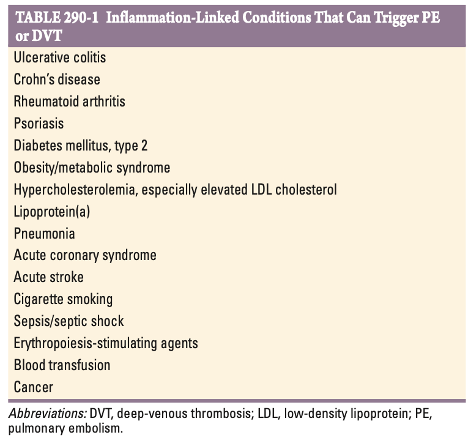
    - **Platelet activation** - combination of Virchow's triad w/ an inflammatory trigger leads to recruitment of activated platelets:
        - <u>Microparticle release</u> - released from platelets w/ proinflammatory mediators that bind to neutrophils resulting in release of neutrophil nuclear material forming a web-like extracellular networks called the **neutrophil extracellular traps**
        - <u>Neutrophil extracellular trap</u> - results in environment of 1) stasis, 2) low O2 tension, and 3) proinflammatory environment, leading to platelet aggregation and platelet-dependent thrombin generation
    - **Embolisation** - DVTs detact from site of formation and embolise via vena cava, right atrium, right ventricle, and lodge into the pulmonary arterial circulation:
        - <u>Absence of DVT in setting of PE</u> - absence of leg S/S (e.g. unilateral swelling and pain) does not r/o acute PE as the leg thrombus has already embolised to the lung
        - <u>Paradoxical emboli</u> - access to arterial circulation through PFO or ASD
    - **Effects on lung physiology** - gas exchange abnormalities include 1) arterial hypoxaemia, and 2) increased A-A O2 tension gradient, reflecting inefficiency of O2 transfer (due to dead space ventilation):
        - <u>Increased pulmonary vascular resistance</u> - due to vascular obstruction or platelet-release of vasoconstrictive agents (e.g. serotonin), producing areas of **VQ mismatch distal to emboli** (hence explain disconcordance between small PE and large A-A O2 gradient)
        - <u>Impaired gas exchange</u> - due to:
            - Dead space from vascular obstruction
            - Hypoxemia from alveolar hypoventilation relative to perfusion of non-obstructive areas of lung, i.e. low V/Q units elsewhere (esponds to O2)
            - Right-to-left shunting (postulated;debatable to the site of the shunt; hence O2 unresponsive)
            - Impaired DLCO due to loss of gas exchange surface (?infarction)
        - <u>Increased airway resistance</u> - due to constriciton of airway distal to the bronchi
        - <u>Decreased pulmonary compliance</u> - due to lung oedema, haemorrhage, or loss of surfactant (R2L shunts due to actelactesis)
    - **Effects on haemodynamics** - acute pulmonary HTN ensues (due to obstruction and vasoconstriction) resulting in rise in both pulmonary artery pressure and pulmonary vascular resistance: 
    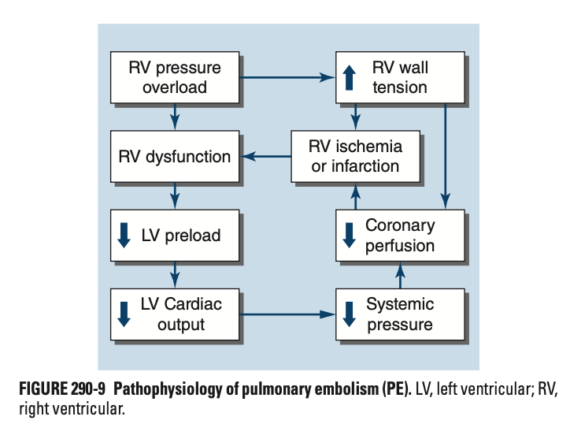
        - <u>Increased RV wall tension and RV dysfunction</u> - RV dilatation, stretch, and dysfunction ensues w/ **released of NT-proBNP**
        - <u>Buldging of the interventricular septum into the normal LV</u> - reduces LV distensibility and LV filling (**diastolic LV dysfunction**)
        - <u>Compression of RCA</u> - results in RCA ischaemia, and RV microinfarction, and hence **rise in troponin**
        - <u>LV underfilling</u> - as a result of aforementioned **LV diastolic dysfunction** and **vascular occlusion**, resulting in **reduction of BP** and hence **syncope** or even death (spontaneous return of consciousness may be a good prognostic sign suggestive of clot disintegration and return to near-normal haemodynamics)
- **Clinical features of PE** - S/S is non-specific (N.B. identification of risk factors from Hx): 
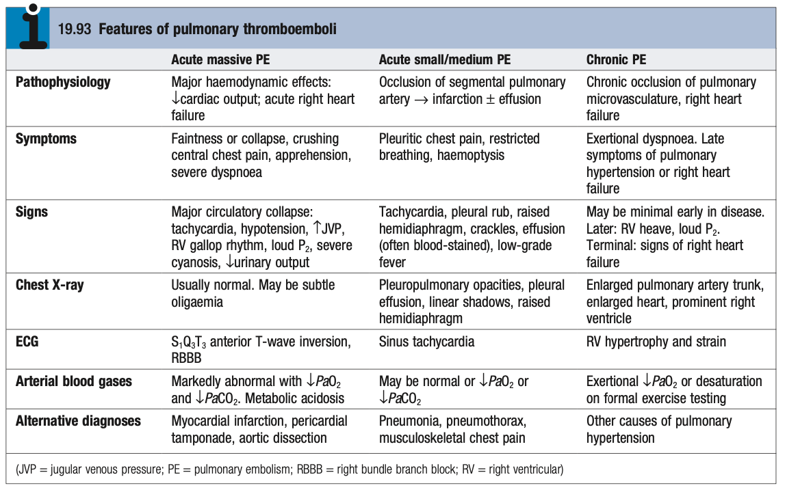
    - **Shortness of breath** (73%) - usually acute <u>unexplained SOB at rest</u> (ocassionally on exertion):
        - Largely driven by 1) <u>increased dead-space ventilation</u>, 2) <u>hypoxaemia and VQ mismatch</u>, 3) LV or RV dysfunction, and 4) bronchoconstriction
        - When initial presentation w/ overt CHF or pneumonia, clinical improvement often fails despite standard medical Tx, raising suspicion of co-existence of PE
    - **Pleuritic chest pains** (44%) - <u>pleurisy</u> as a result of pulmonary infarction:
        - Exquisitely painful as the area of infarct is innerated by pleural nerves
        - Ocassionally crushing chest pains associated w/ LV dysfunction
    - **Syncope and collapse** - often seen in massive PE due to systemic hypotension from <u>LV dysfunction</u> (see mechanism above), return of consciousness may in fact suggest clot disintigration
    - **Features of RHF** - ?bilateral LL oedema
- **Clinical features of DVT** - note features of DVT may be absent in acute PE due to embolisation:
    - **Pain** - most common Sx is a cramp or "charley horse" in lower calf that <u>persists and intensifies over days</u>; tender
    - **LL erythema** - often overlying erythema +/- palpable cord if superficial
    - **LL oedema** - rarely fully edematous (unlikely to be PE), except in the most serious form of DVT (phlegmasia cerulea dolens)
- **Signs of PE:**
    - <u>Small PE</u> - Sinus tachycardia, pleural rub, crackles, effusion, low-grade fever
    - <u>Large PE</u> -Tachycardia, hypotension, S/S of pHTN and RV failure (raised JVP, RV gallop, loud P2), severe cyanosis, reduced urinary output
- **DDx of DVT and PE** - not all unilateral leg pain is DVT; not all acute dyspnoea is PE: 
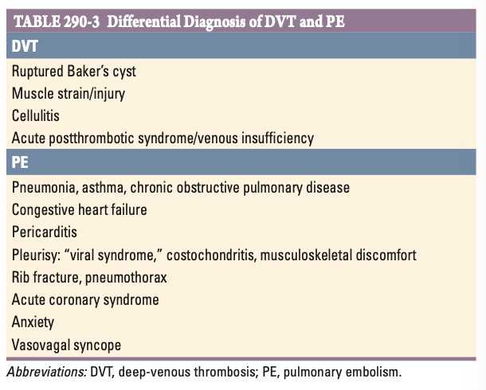
    - **DDx of acute unilateral leg pain:**
        - <u>Ruptured Baker's cyst</u> - a/w Hx of OA, and Hx of sudden onset of pain to maximal intensity suggests the diagnosis
        - <u>Cellulitis</u> - often septic-looking w/ fever and chills, where physical signs are less conscpicuous for cellulitis (mild tenderness and erythema) and are more prominent in DVT (extreme tenderness, swelling and erythema)
        - <u>May Thurner syndrome</u> - recurrent LL oedema due to right proximal iliac artery compression of the left proximal iliac vein; condition is in fact a/w DVT due to stasis
    - **DDx of acute dyspnoea and pleurisy** - see table above (also consider non-thrombotic pulmonary embolisms)
- **Classification of PE:**
    - <u>Massive or high-risk PE</u> (5-10%) - extensive thrombosis of \>50% pulmonary vasculature characterised by 1) RV dysfunction, 2) systemic hypotension and cardiogenic shock (LV dysfunction), presenting w/ dyspnoea, syncope, hypotension, and cyanosis
    - <u>Submassive or intermediate risk PE</u> (20-25%) - characterised by RV dysfunction despite normal systemic arterial pressure, features of RHF and release of NT-proBNP/ troponin indicates high risk of clinical deterioration
    - <u>Low-risk PE</u> (65-75%) - normal haemodynamics, LV and RV functions, having excellent prognosis
- **Approach to clinical evaluation** - known as "the great masquerader" as S/S are often non-specific and risk factors are not always evident ("unprovoked PE"):
    - <u>Stratification based on clinical severity</u>:
        - Massive PE reuslting in haemodynamic instability - initiate Tx on presumptive diagnosis of VTE based on compressive USG of LL (N.B. RUSH protocol for undifferentiated hypotension)
        - Haemodynamically stable PE - work up based on Well's Score and Ix results
    - <u>Modified Wells Point Score criteria</u>:
        - Validated in ambulatory patients but **not validated in hospitalised patients**
        - Guides initial diagnostic evaluation (low-risk for PE can be worked up w/ D-dimer alone w/o imaging; high0risk for PE straight for diagnostic imaging)

    
    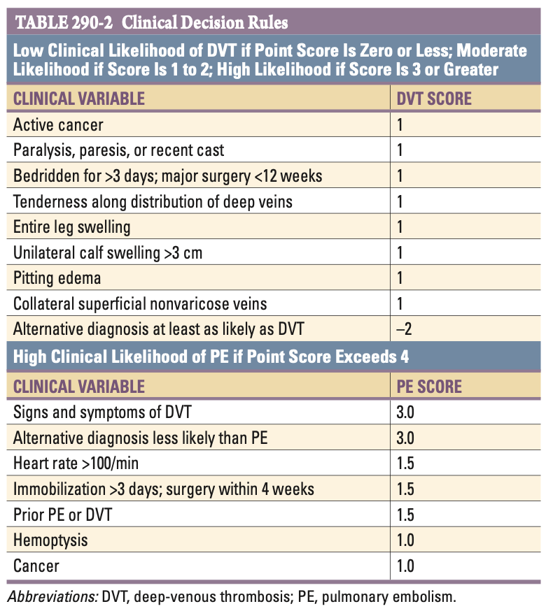
    - <u>Integrated diagnostic approach of DVT and PE</u>: 
    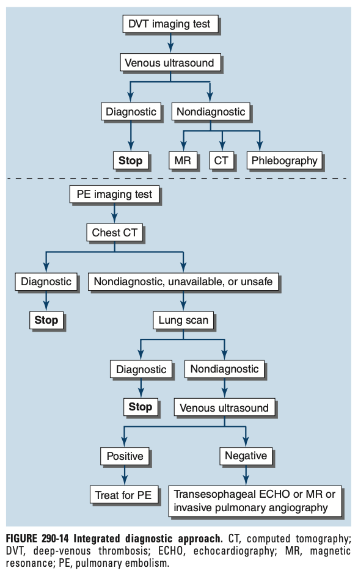
- **Ix:**
    - **Routine bloods** - CBC, LRFT, Clotting profile, ABG:

        - <u>CBC</u> - mild reactive leukocytosis
        - <u>RFT</u> - sufficient CrCl necessary for CTPA and subsequent anticoagulation
        - <u>Clotting profile</u> - baseline clotting profile
        - <u>ABG</u> - if hypoxaemic

    - **Non-diagnostic blood tests:**

        - **D-dimer** - quantitative plasma D-dimer ELISA:
            - <u>Interpretation</u> - elevation of D-dimer reflects endogenous thrombolysis, age-specific cutoffs used for patients \> 50y:
                - Normal ULN \< 500 ng/mL
                - Age-adjusted D-dimer by multiplying age by 10 (only for PE)
            - <u>Test-properties of D-dimer</u> - high Sn (\> 95% for PE), low Sp
            - <u>Falsely elevated D-dimers</u> - seen especially in prolonged hospitalisation due to systemic illnesses:
                - Post-operative states
                - Cancer
                - Sepsis
                - 2nd-3rd trimester of pregnancy
                - MI
            - <u>Role</u> - useful "rule out test" for patients w/ low PtP (reduces unnecessary exposure to ionising radiation during CTPA)
        - **Troponin** - elevation related to RV infarction
        - **NT-proBNP** - elevated due to increased RV wall tension

    - **ECG** - usually shows sinus tachycardia:

        - <u>Rate and rhythm</u> - sinus tachycardia
        - <u>Evidence of RV strain</u>:
            - TWI in V1-V4 (+/- inferior leads)
            - Right axis deviation
            - RBBB morphology
        - <u>S1Q3T3 pattern</u> - presence of 1) S wave in lead I, 2) Q wave in lead III, and 3) T wave in lead III

    
    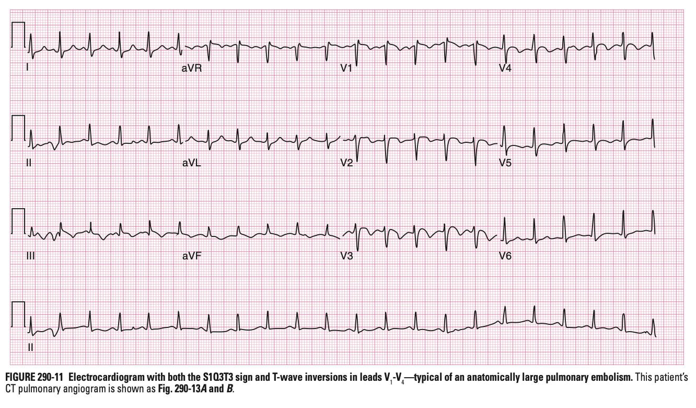

        - <u>r/o other pathogies</u> - e.g. AMI, pericarditis

    - **Venous ultrasonography** - +ve findings include:

        - Mildly dilated and absent colalteral channels
        - Loss of vein compressibility (diagnostic)
        - Presence of thrombus (homogenous hypo-echoic mass)

    
    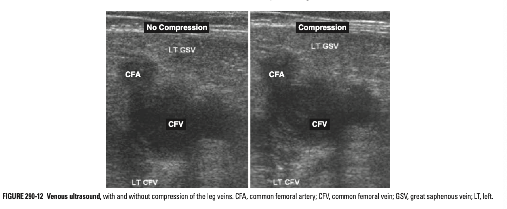

    - **CXR** - normal or near-normal CXR in PE: 
    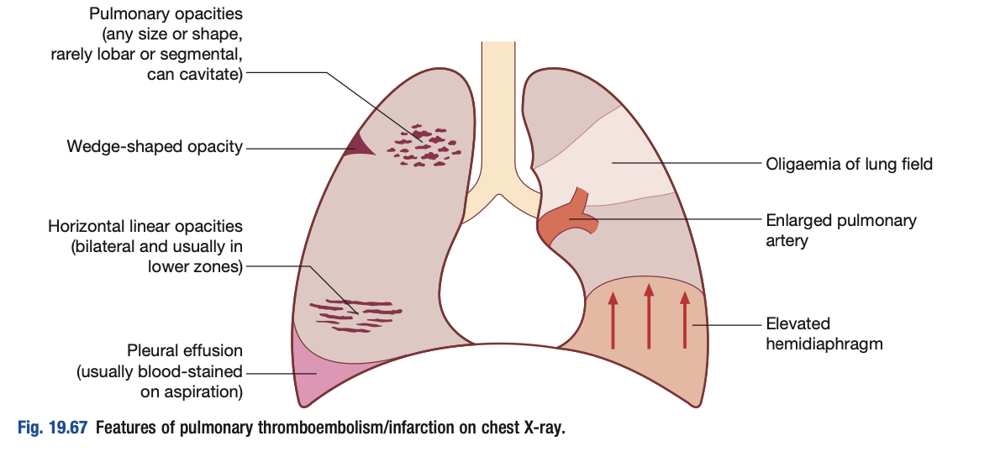

        - **Role** - r/o other causes of acute dyspnoea and chest pain (e.g. PTX)
        - **Non-specific findings:**
            - Pleural effusion
            - Collapse
            - Infiltrates
        - **Specific findings in PE:**
            - <u>Westermark's sign</u> - focal oligaemia 
            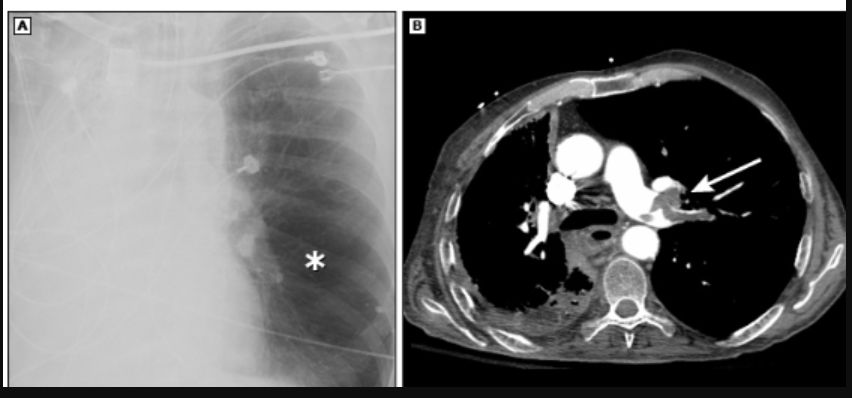
            - <u>Hampton's hump</u> - peripheral triangular-shaped density usually at pleural base due to pulmonary infarction 
            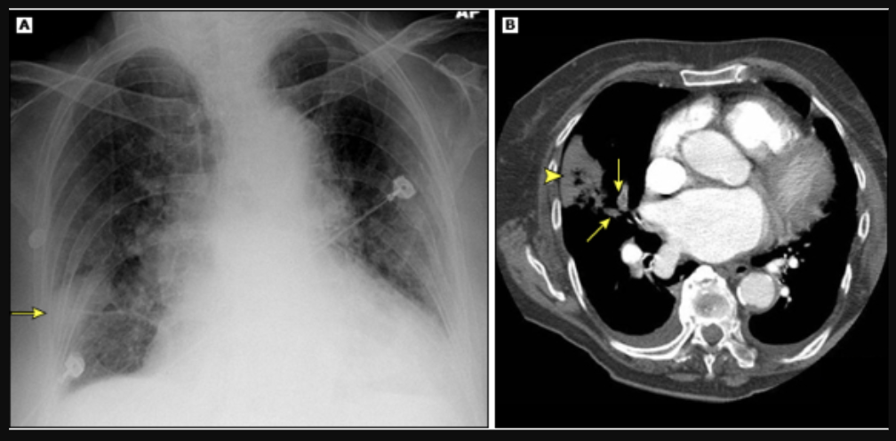
            - <u>Palla's sign</u> - enlarged right descending pulmonary artery

    - **CT pulmonary angiography** (diagnostic test for PE):

        - <u>Findings diagnostic of PE</u> - filling defects in pulmonary arterial vasculature
        - <u>Additional evaluation on CT thorax</u>:
            - RV enlargement (RV:LV ratio \> 1) - suggests higher 30d mortality as PE is more haemodynamically significant
            - Other significant pathologies - e.g. pneumonia, emphysema, IPF, mass, aortic pathologies etc.

    
    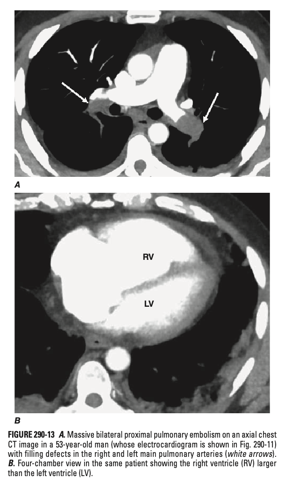

    - **Ventilation/perfusion lung scanning** - second-line diagnostic test for PE reserved for those unable to tolerate IV contrast:

        - <u>Rationale</u>:
            - Focal areas of reduced perfusion on perfusion scan indicates reduced blood flow due to possible PE
            - Ventilation scan as an adjunct to increase Sp, where normal ventilations suggest PE (N.B. abnormal ventilation does not r/o PE as may be co-morbid)
        - <u>Diagnostic findings</u> (high-probability scans) - defined as \>= 2 segmental perfusion defects in the presence of normal ventilation
        - <u>Test properties</u> - 90% certainty w/ high probability scans; high NPV of normal scans

    - **Echocardiogram:**

        - Non-diagnostic
        - r/o other mimics of PE such as AMI, pericardial tamponade and aortic dissection
        - May show thrombus in large pulmonary arteries
        - McConnell's sign: hypokinesis of RV free wall with normal or hyperkinetic RV apex

    - **MR venography** - to confirm DVT but not for PE

    - **Other invasive imaging modalities:**

        - Pulmonary angiography
        - Contrast phlebography
- **Mx:**
    - **Principles of Mx:**
        - <u>General measures</u> - O2, pain relief, resuscitation for massive PE
        - <u>Risk stratification</u> - based on haemodynamic stability, and evidence of RV dysfunction (ECG, troponin, echocardiography, CT) to guide Tx
        - <u>Anticoagulation</u> - various approaches taken taken, with various optimal duration depending on context
        - <u>Adjunctive therapies</u>:
            - Fibrinolysis, catheter-directed therapy, surgical interventions for massive PE
            - +/- IVC filter only if anticoagulation absolutely C/I
        - <u>Mx of complications</u> - esp. bleeding complications
    - **General measures:**
        - <u>O2</u> - titrate SpO2 \> 90%
        - <u>Pain relief</u> - opiates considered for patients with pain and distress, but <u>avoided if in cardiogenic shock</u>
        - <u>Manage haemodynamic instability</u> - IV fluids or plasma expanders (little role of inotropes as dilated RV is subjected to maximal sympathetic stimulation), withold diuretics and vasodilators
    - **Risk stratification of PE** - based on 1) haemodynamic instability, and 2) evidence of RV dysfunction: 
    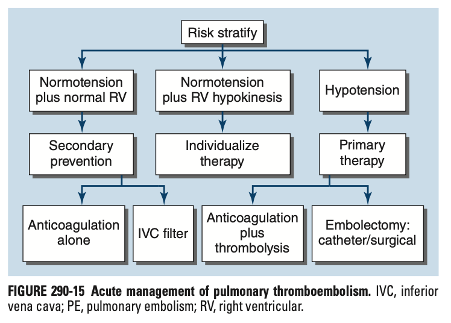
        - <u>Low-risk PE</u> - anticoagulation alone
        - <u>Intermediate-risk PE</u> (submassive PE) - individualised therapy
        - <u>High-risk PE</u> (massive PE) - resuscitation, followed by thrombolysis followed w/ anticoagulation
    - **Further risk stratification of PE for home Tx:**
        - Pulmonary embolism severity index (PESI) score predicts 30 day mortality for patients w/ pulmonary emebolism 
        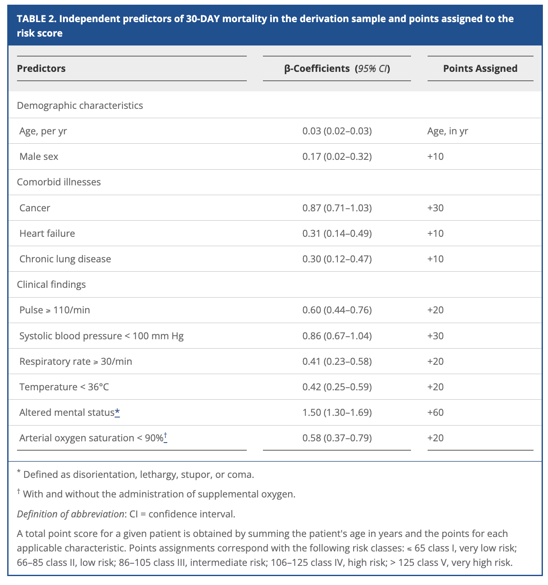
        - Aujesky et al 2011 demonstrated non-inferiority of outpatient care compared to inpatient care for selected low-risk PEs (PESI class I or II): 
        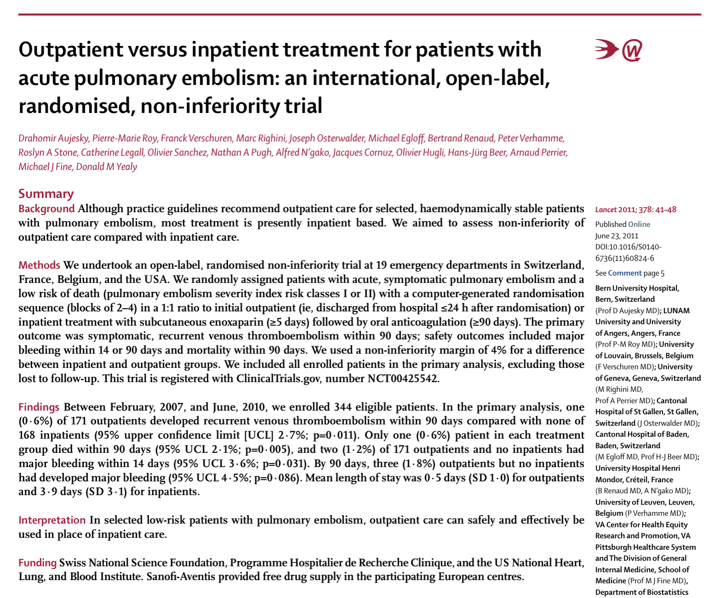
        - However, in practice, most Tx for PE is inpatient based before bridge to DOAC/ warfarin is performed
    - **Resuscitation for massive PE:**
        - <u>Fluid replacement</u> - 500 mL NS bolus (restrictive on fluids as may exacerbate RV wall stress causing further LV dysfunction and hypotension)
        - <u>Pressors and inotropic agents</u> - nor-epinephrine to raise systemic arterial pressure; Dobutamine to increase RV inotropy and decrease filling pressures
        - <u>Additional haemodynamic scope</u> - consider ICU admission and VA-ECMO
    - **Approaches to initial and primary Mx of PE** - 3 major strategies:
        - Parenteral (IV/ SC) anticoagulation w/ UFH, LMWH or fondaparinux and bridge to warfarin
        - Parenteral (IV/ SC) anticoagulation bridged to NOAC after 5d (edoxaban \[Xa inhibitor\] or dabigatran \[direct thrombin inhibitor\])
        - Oral anticoagulation w/ 3-week loading dose of rivaroxaban or 1-week loading dose of apixaban

    
    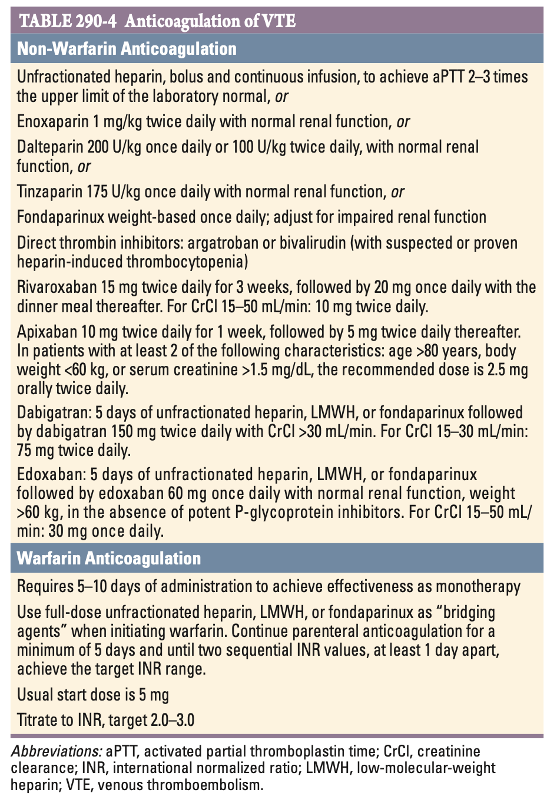
    - **Duration of anticoagulation** - moving away from dichotomy of provoked and unprovoked events as they appear to have similar rates; rather determine whether risk-factors are still persistent and risk of recurrences:
        - <u>Primary Tx for all w/ VTE</u> - initial 3-6 mo therapy
        - <u>Reassessment and determine enduring risk factors and risk of recurrence</u> - consider secondary risk prevention if intermediate risk or higher: 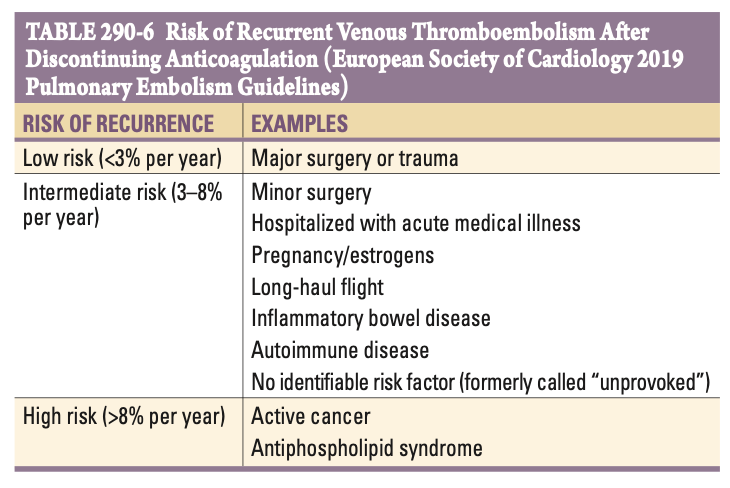 
        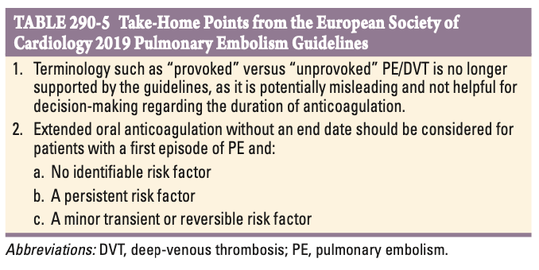
    - **Strategies for heparin-induced thrombocytopenia:**
        - IV direct thrombin inhibitors (argatroban, bivalirudin)
        - Subcutaneous fondaparinux
    - **Unfractionated heparin** (UFH):
        - <u>Indications</u> - for patients where hour-to-hour control of anticoagulation intensity desired
        - <u>Pharmacokinetics</u> - rather unpredictable dose response; short half-life
        - <u>MOA</u> - binds to and enhances anti-thrombin activity (prevents additional thrombus formation)
        - <u>Dosing</u> - target aPTT 2-3x ULN (i.e. 60-80sl correlating to anti-Xa level of 0.3-0.7U/mL):
            - Initial bolus of 80U/kg as loading dose of UFH
            - Subsequent initial infusion rates of 18U/kg/h
            - Dose adjustment for liver function
        - <u>Monitoring</u> - serial monitoring of APTT
        - <u>S/E</u> - HIT
    - **Low-molecular-weight heparins** (LMWHs):
        - <u>Selection and dosing</u> - dose adjustment for obese or CKD:
            - Enoxaparin 1mg/kg bid
            - Dalteparin 200U/kg od or 100U/kg bid
            - Tinzaparin 175U/kg bid
        - <u>Pharmacokinetics</u>:
            - More predictable dose-response relationship (as less binding to plasma protein and endothelial cells)
            - Longer half-life than UFH
    - **Fondaparinux:**
        - <u>MOA</u> - anti-Xa pentasaccharide (ulttra-low-molecular-weight heparin)
        - <u>Dosing</u> - weight-based, once-daily SC injection in pre-filled syringe (adjustment for renal function)
        - <u>Benefits</u> - does not cause HIT
    - **Warfarin:**
        - <u>MOA</u> - vitamin K antagonists, prevents activation of:
            - Factor II
            - Factor VII
            - Factor IX
            - Factor X
        - <u>Dosing</u>:
            - Target INR 2-3
            - Usual starting dose of 5mg
        - <u>Delayed onset of therapeutic levels of anticoagulation</u>:
            - Full effects (INR ~ 2.5) attained after daily therapy for 5-7d
            - Overlapping of parenteral anticoagulation (i.e. "bridiging agent") for minimum of 5 days and until two sequential INR values \>= 1d apart achieving target INR range
        - <u>Monitoring</u>:
            - Routine INR at centralized anticoagulation clinics
            - Self-monitoring INR w/ home POCT fingerstick machine
        - <u>S/E</u>:
            - Bleeding (ICH and other life-threatening haemorrhages can occur even within desired INR range)
            - Alopecia
            - Arterial vascular calcification
    - **DOAC:**
        - <u>Benefits</u>:
            - Effective anticoagulation within hours of ingestion
            - Do not require laboratory coagulation
            - Few drug-drug interactions
        - <u>Cautions</u>:
            - Avoided in pregnancy or breastfeeding for selected DOACs (emerging evidence regarding safety)
            - Not for APS or malignancy
    - **Mx of bleeding from anticoagulants:**
        - **Minor bleeding** - consider observation, vitamin K or FFP
        - **Major life-threatening bleeding** (e.g. ICH) - monitor for rebound thrombosis:
            - <u>Heparin or protamine sulfate</u> - administration of **protamine sulfate**
            - <u>Dabigatran</u> - **idarucizumab** (Ab against dabigatran)
            - <u>Direct-thrombin inhibitors</u> - **andexanet alfa** or PCCs
    - **IVC filter** (retrievable over permanent):
        - <u>Indications</u>:
            - 1\) Active bleeding that precludes anticoagulation
            - 2\) Recurrent venous thrombosis despite intensive anticoagulation
        - <u>Rationale for limited efficacy</u>:
            - Embolism via collateral veins that develop
            - Paradoxical provision of nidus for clot formation increasing rates of DVT
    - **Fibrinolytic therapy:**
        - <u>Indications</u> - for massive PE (or off-label use in submassive PE w/o clinical improvement)
        - <u>Timing of fibrinolysis</u>:
            - The sooner the better
            - However, systemic fibrinolysis remains effective for at least 14d after PE has occured
        - <u>Dosing</u>:
            - Recombinant tPA 100 mg IV infusion over 2h
            - Recombinant tPA 50 mg IV infusion over 2h (off label; less effective but associated w/ fewer complications)
        - <u>C/I</u>:
            - Intracranial disease
            - Recent surgery
            - Trauma
        - <u>Caution</u> - careful screening of patients to minimise bleeding risk
        - <u>S/E</u>:
            - Bleeding (overall major bleeding rate of ~10%, including 2-3% risk of ICH)
    - **Catheter-based therapy:**
        - Mechanical therapy (percutaneous thrombectomy)
        - Pharmacological therapy (low-dose continuous infusion of tPA)
        - Pharmacomechanical therapy (low-energy USG-fascilitated low-dose thrombolysis)
    - **Surgical therapy:**
        - Surgical pulmonary embolectomy
        - Pulmonary thromboendarterectomy for patients w/ CTEPH (major operation involving periods of hypothermic cardiac arrest and bypass, w/ mortality rates of 1-5% in experienced centres)
- **Prognosis:**
    - <u>Mortality</u> - greatest in those w/ RV dysfunction or cardiogenic shock, but risk sharply falls after commencement of anticoagulation
    - <u>Recurrence</u> - highest recurrence rate in 1st 6-12mo (1/3 subsequent event within 10y)
