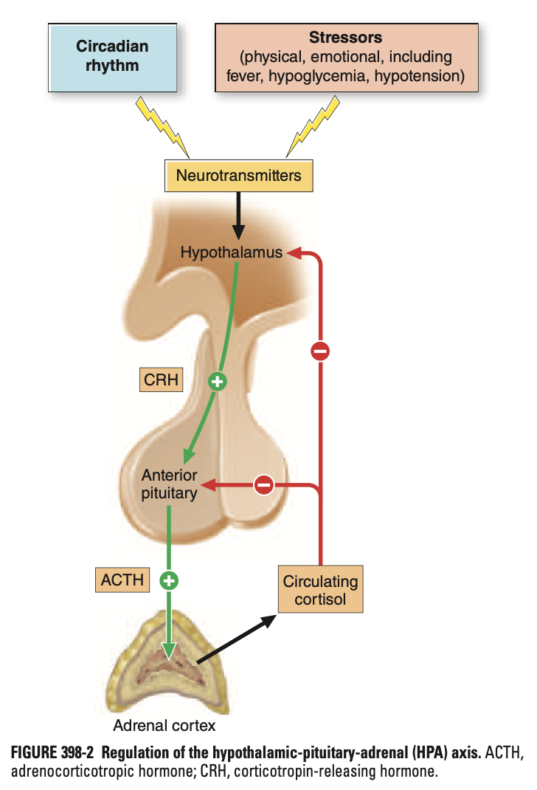
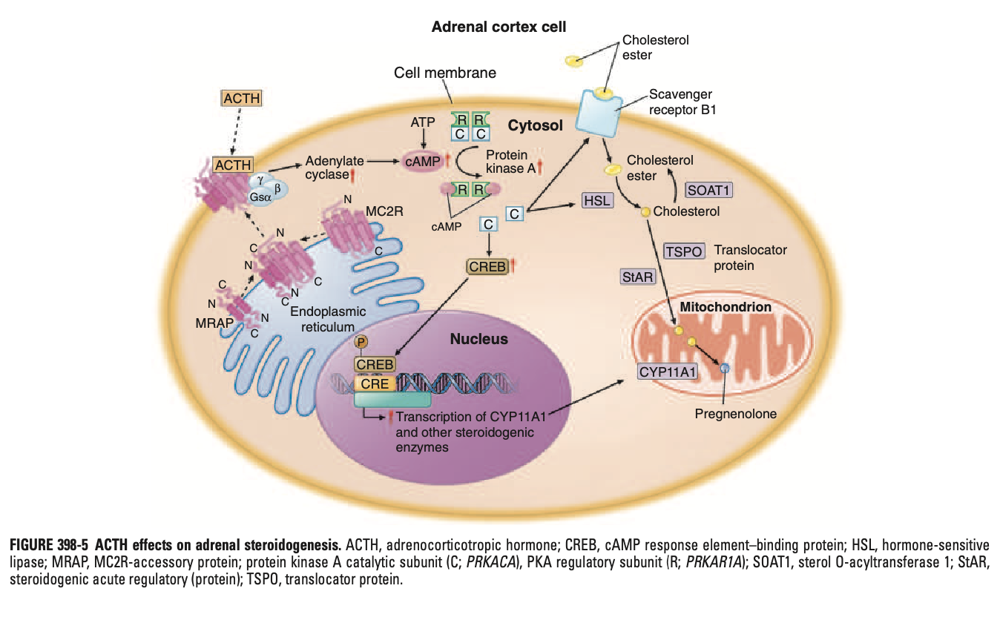
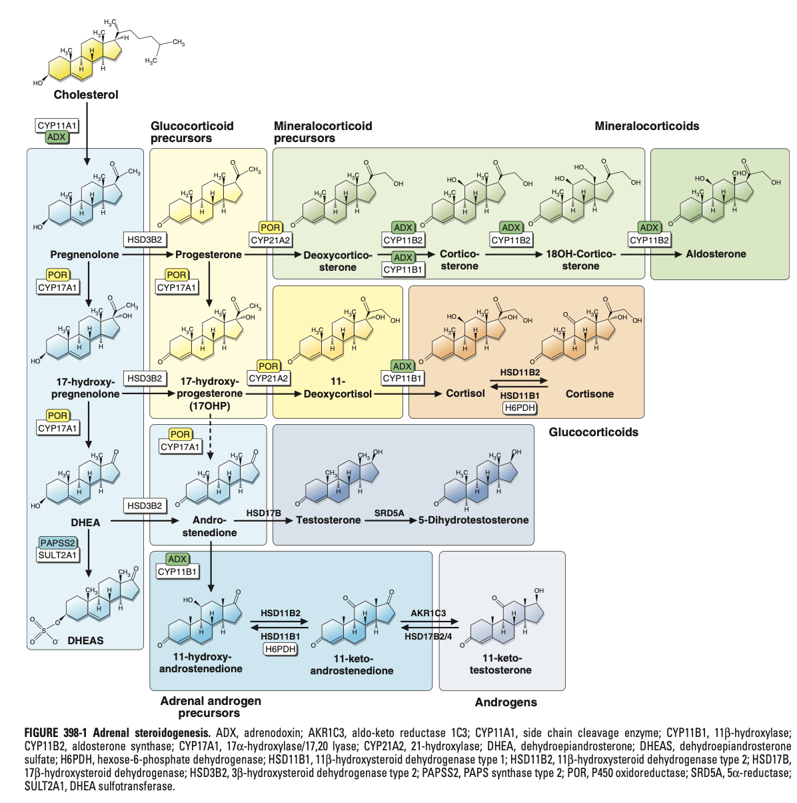
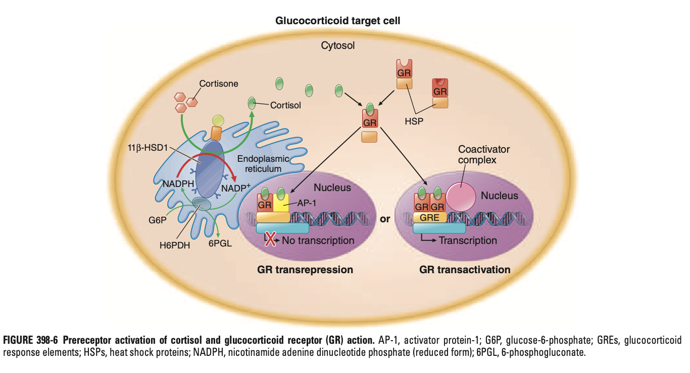
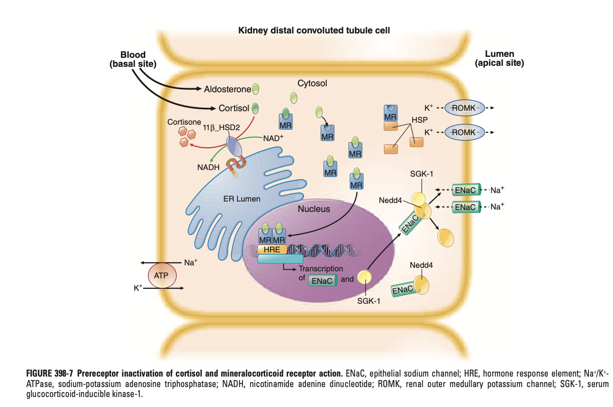

# Regulation of Cortisol Production and the Physiological Effects of Cortisol

- **Negative feedback control of glucocorticoid synthesis by the HPA axis:** 

    - **Hypothalamus** - release of corticotropin-releasing hormone (CRH):
        - <u>Stimulus</u> - endogenous or exogenous spress; under control of circadian rhythm of the suprachiasmatic nucleus (SCN):
            - Additional regluation by complex network of cell-specific clock genes
            - Ultimately manifests as a distinct circadian rhythm seen in cortisol secretion
        - <u>Effect</u> - stimulates cleavage of the 241 a.a. polypeptide proopiomelanocortin (POMC) by pituitary-specific prohormone convertase 1 (PC1), **yielding ACTH**
    - **Anterior pituitary glands** (specifically corticotropes) - release of ACTH:
        - <u>Stimulus</u> - by circadian stimulation of CRH; AVP exerts a secretagogue role
        - <u>Effects</u>:
            - Regulation of adrenal cortisol synthesis
            - Some short-term effects on mineralcorticoid and adrenal androgen synthesis:
    - **Adrenal cortex** (zona fasciculata) - release of cortisol:
        - <u>Stimulus</u> - ACTH
        - <u>Effects</u>:
            - Physiological effects of ACTH (see below)
            - **Negative feedback** on 1) ACTH secretion, and 2) CRH secretion
- **Molecular mechanisms for ACTH-induced steroidogenesis:**
    - <u>Receptor</u> - melanocortin 2 receptor (MC2R) in adrenocortical cells:
        - Form of G-protein coupled receptor (GPCR)
        - Requires interaction w/ MC2R-accessory protein (MRAP) where **complex is transported to the adenocortical cell membrane to recognise ACTH**
    - <u>Intracellular signalling</u> - raised cAMP levels resulting in **upregulation of protein kinase A** (PKA) **signalling pathway**:
        - PKA remains inactive at low cAMP levels
        - cAMP-mediated cleavage of PKA into 2 regulatory, cAMP-bound subunits and 2 free, active catalytic subunits
    - <u>Effects of PKA activation on steroidogenesis</u>:
        - Import of cholesterol esters
        - Increased activity of hormone-sensitive lipase for cleavage of cholesterol ester to cholesterol for import into mitochondria
        - Increased availability of cAMP response element binding (CREB), an important transcription factor for enzymes of glucocorticoid synthesis (esp **CYP11A1**)

    
    
- **Biochemical pathways for adrenal steroidogenesis:** 

- **Transport of cortisol in circulation:**
    - <u>Majority of cortisol is protein bound</u> - bound to cortisol-binding globulin (CBG), and to a lesser extent, to albumin
    - <u>Minority of cortisol is free and unbound</u> - however these can freely enter cells and not require active transport
- **Peripheral hormones as a mechanism of pre-receptor regulation of tissue-specific glucocorticoid actions:**
    - <u>11-beta-hydroxysteroid dehydrogenase type 1</u> (11-beta-HSD1) - generation of cortisol from inactive cortisone within the cell (NADPH-dependent reaction, requires H6PDH as well) 
    
    - <u>11-beta-hydroxysteroid dehydrogenase type 2</u> (11-beta-HSD2) - inactivation of cortisol into cortisone in primarily the kidneys, but also colon, salivary glands and other MR target tissues 
    
- **Role of peripheral inactivation of cortisol by 11-beta-HSD2:**
    - <u>Minerocorticoid receptor activation by corticosteroids</u>:
        - Cortisol binds to MR w/ equal affinity to aldosterone
        - However, circulating cortisol levels is at 1000-fold higher than that to aldosterol
    - <u>Prevention of MR activation by cortisol</u> - rapid inactivation of cortisol to cortisone by 11-beta-HSD2 prevents excessive MR activation (specific tissue-specific modulator of the MR pathway
- **Effects of cortisol on glucocorticoid target cells** (see illustration above):
    - **GR transactivation** - mediated by dimerisation of activated GR and binding to GREs:
        - <u>Binding to glucocorticoid receptors</u> - binds to GR and dissociation from heat shock proteins (HSPs) resulting in activation and dimerisation of complex
        - <u>Translocation into the nucleus</u> - serving as a transcription factor and bound to glucocortocoid response elements (GREs)
    - **GR transrepression** - mediated by activated GR complexing w/ other transcription factors such as AP-1 or NF-kappaB (<u>explains much of anti-inflammatory and immunosuppressive effects of glucocorticoids</u>)
