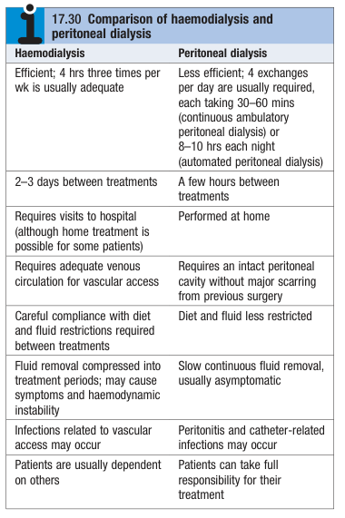
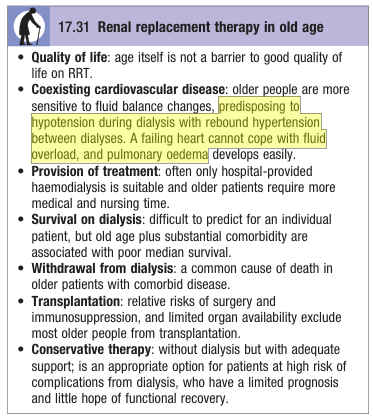
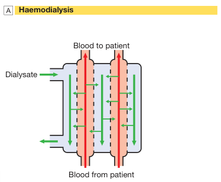
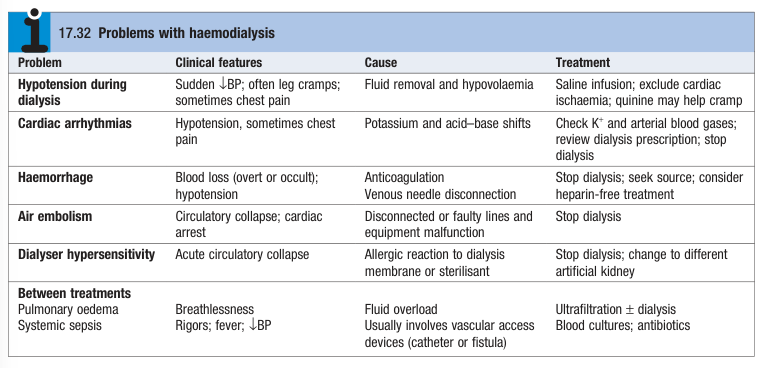
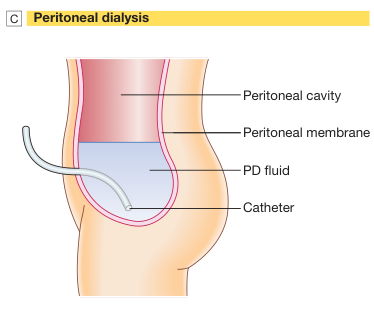
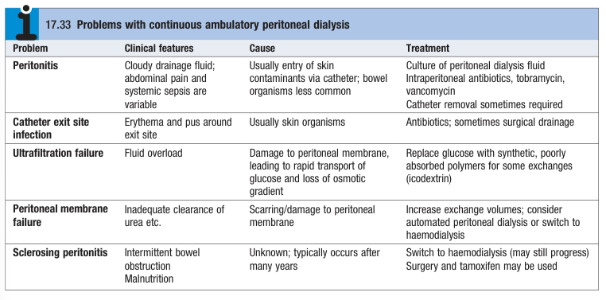

# Renal Replacement Therap

- **Definition** - Replacement of excretory functions of the failing kidney by dialysis (or transplant) that is required on a temporary basis in patients with AKI, or on a permanent basis for those with CKD
- **Epidemiology** - increasing number of patients w/ ESRD kept alive since the advent of long-term RRT in 1960s (UK data):
    - <u>Prevalence</u> - 51000 patients in the UK requiring RRT in 2010
    - <u>Incidence</u> - 107/1,000,000/y started on RRT
    - <u>Demographic</u> - median age 65y, 24% have a primary Dx of diabetic nephropathy
    - <u>Distribution</u> - 3mo after initiation of RRT:
        - Haemodialysis - 68%
        - Peritoneal dialysis - 18%
        - Renal transplant - 8%
        - Mortality - 6%
- **Options for RRT:**
    - Haemodialysis
    - Haemofiltration
    - Haemodiafiltration
    - Peritoneal dialysis
    - Renal transplantation
- **Comparison between PD and HD** - HK opts for PD-first policy:
- **Indications for initiation of maintenance dialysis** - shared decision making where there are no SCr, cystatin C, BUN or eGFR levels that confer an absolute indication:
    - Presence of uraemic Sx
    - Presence of hyperkalemia unresponsive to conservative measures
    - Persistent etracellular volume expansion despite diuretic therapy
    - Acidosis refractory to medical therapy
    - Bleeding diathesis
    - CrCl or eGFR \< 10 ml/min/1.73 m2
- **Treatment options:**
    - Haemodialysis - in-center (\>80% in the US) or at-home
    - Peritoneal dialysis - continuous ambulatory peritoneal dialysis (CAPD) or continuous cyclic peritoneal dialysis (CCPD)
    - Haemofiltration and Haemodiafiltration
    - Kidney transplantation
- **Comparison between HD and PD:**
    - PD offers more QoL but is continuous relative to HD
    - HD is generally more efficient and offers more solute clearance relative to PD
    - Important to note that to date no RCTs compare efficacy between PD and HD, but observation data suggests outcomes are similar
    - Selection is often based on personal preferences, quality-of-life considerations, and local guidelines

  
  
- **Preparation in advance of initiating RRT** - late referrals (i.e. at time or very close to requiring dialysis) a/w poorer outcomes:
    - <u>Timing of nephrologist referral</u> - best if nephrologist referral and initiation of preparations \>12 mo before the predicted start date (based on **serial SCr measurements**)
    - <u>Discussion of modalities of Tx</u>:
        - Decision between conservative treatment and RRT (esp. relevant to older patients w/ multiple comorbidities)
        - Detailed discussion regarding choices of RRT - detailed comparison between HD and PD (even if HK adopts a PD-first policy)
        - Referal for renal transplantation - based on indications and contraindications
    - <u>Psychological support</u> - adequate support from renal multidisciplinary teams to patient and relatives is important, as **depression and anxiety** is common in those awaiting RRT
    - <u>Social support</u> - renal multidisciplinary teams explain and help family to adaptive to lifestyle changes necessary once RRT commences
    - <u>Assessment of home circumstances</u> - access whether home treatment is viable
- **Conservative Tx** - increasingly viewed as a positive choice when prognosis on RRT do not justify frequent hospitalisations a/w complications of RRT:
    - <u>Indications</u> - no stict indications but typically not recommended for older patients w/ multiple comorbidities (esp. CHF), or those intolerant of QoL of RRT
    - <u>Rationale for conservative Tx</u>:
        - **Limited prognostic gain** - survival of older patients w/o dialysis can be similar or only slightly shorter than those who undergo RRT (5y survival 29% if \> 65y)
        - **Complications of RRT** - older patients w/ CV morbidity is more sensitive to fluid changes, and can easily develop debilitaitng APO
        - **Limited QoL** - limited QOL if require hospital-porived HD as older patients tend to require more medical and nursing care
        - **Unlikely to receive renal transplantation** - although not an absolute C/I, older patients are unlikely to undergo renal transplanation due to 1) limited organ availability, and 2) risk of surgery and subsequent immunosuppression

    
    
    - <u>Components of conservative Tx</u> - full medical, psychological and social support to sustain renal function and treat complications, with palliative care at terminal phase of their disease
- **Haemodialysis:**
    - **Principles of HD** - passive process dependent on concentration gradient of solute:
        - <u>Vascular access</u> - arteriovenous fistula, central venous catheter, arteriovenous shunt (e.g. Scribner shunt)
        - <u>Diasylate</u>:
            - **Removal of small solutes** - countercurrent flow of diasylate and patient blood in haemodialyser enables <u>bidirectional diffusion</u> across semipermeable membrane down a concetration gradient (composition of diasylate varied to achieve desired gradient)
            - **Removal of fluids** - excessive fluids (fluid overload) can be removed by applying -ve pressure to the dialysate side

    
    
    - **Haemodialysis in AKI:**
        - <u>Vascular access</u> - performed through large-bore dual lumen catheter:
            - **Femoral or internal jugular vein preferred** during AKI to provide temporarily renal replacement
            - **Subclavian lines avoided** as complications to vascular access will comprimise ability to form functioning fistula in the arm if patient requires chronic dialysis in the long run
        - <u>Modality and timing</u> - start gradually to avoid CNS complications (e.g. cerebral oedema):
            - Initial 1-2h of dialysis to avoid dialysis disequilibrium
            - 4-5h on alternate days or 2-3h every day if haemodynamically stable
        - <u>Complications</u>:
            - **CNS complications** - increased risk of cerebral oedema resulting in confusion and convulsions if HD too rapid (dialysis disequilibrium)
            - **Thrombosis** - standard practice to anticoagulate patients on heparin (but increases bleeding risk)
    - **Haemodialysis in CKD:**
        - <u>Vascular access</u> - formation of AV fistula performed ~1y before dialysis is contemplated:
            - **Principles of AV fistula** - arterialisation over 4-6 weeks of superficial arm veins by increased pressure transmitted to artery, providing superficial venous access
        - <u>Precaution</u> - screening for HBV, HCV and HIV and vaccination against HBV if not immune:
            - HBV +ve patients require segragation facilities given its easy transmissibility
            - HCV and HIV +ve patients can be treated using machine segregation and standard infection control measures
        - <u>Timing of HD</u> - principally, more frequent dialysis enables achieving better fluid and electrolyte balance (esp. PO4), but unsure if translates to better clinical outcomes:
            - Standard HD - 3-5h 3x per week
            - Frequent HD - 3-5h \>= 4x per week
            - Short, frequent dialysis sessions - 2-3h 5-7x per week
            - Nocturnal dialysis - 8h overnight 5-6x per week
        - <u>Intensity of dialysis</u> - adjusted to achieve urea reduction level of \> 65%
    - **Complications w/ HD:** 
    
- **Peritoneal dialysis:**
    - **Principles of PD** - also known as continuous ambulatory peritoneal dialysis (CAPD):
        - <u>Introduction of dialysate into peritoneal cavity</u> - 2L of sterile, isotonic dialysate introduced into peritoneal cavity through Tenkoff cathetor for 4-6h and drained or replaced in a continuous 4-times-daily cycle
        - <u>Passive diffusion of metabolic wastes</u> - diffusion through peritoneal capillaries into dialysis fluid down a concentration gradient until equilibrium attained
        - <u>Removal of excessive fluid</u> - inflow fluid rendered hyperosmolar by addition of glucose or glucose polymer, enabling water movement down osmotic gradient

    
    
    - **Complications of PD:** 
    
- **Renal transplantation** - see notes on renal transplantation
