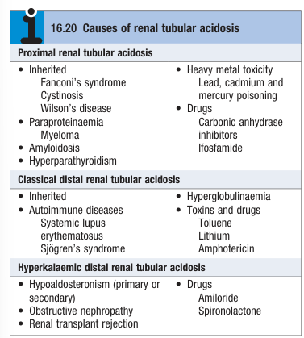

# Renal Tubular Acidosis

- **Definition** - a form of NAGMA resulting from impaired tubular secretion of H+ in DCT (type 1 RTA) or impaired proximal reabsorption of HCO3 in PCT (type 2 RTA)
- **Clinical suspicion of RTA:**
    - <u>Hyperchloraemic acidosis</u> w/ normal anion gap
    - No evidence of <u>GI disturbance</u>
    - <u>Alkalization of urine</u> (urine pH 6-7) despite systemic acidosis
- **Types of RTA and their pathophysiology:**
    - **Distal (Type 1) RTA** - classical form of RTA characterised by <u>imapired tubular H+ secretion</u> in the DCT resulting in 1) reduced HCO3 by buffering (metabolic acidosis), 2) compensatory hyperchloraemia, and 3) hypoK due to increased K secretion to balance -ve intraluminal potential
    - **Proximal (Type 2) RTA** - <u>impaired HCO3 reabsorption in the PCT</u> resulting in 1) reduced HCO3 (metabolic acidosis), 2) compensatory hyperchloraemia, and, 3) hypoK due to increased Na delivery to DCT
    - **Hyperkalaemic distal (Type 4) RTA** - <u>impaired Na reabsorption in DCT</u> resulting in <u>reduced -ve intraluminal potential to drive H+ and K secretion</u>
- **Etiology of RTA:** 

    - **Distal (Type 1) RTA** - 1) inherited, 2) autoimmune disease, 3) hyperglobulinaemia, 4) toxins and drugs:
        - <u>Inerited</u> - inherited distal RTA
        - <u>Autoimmune disease</u> - SLE, Sjogren's syndrome
        - <u>Hyperglobulinaemia</u>
        - <u>Toxins and drugs</u> - toluene, lithium, aphotericin B
    - **Proximal (Type 2) RTA** - 1) PCT damage, 2) impaired PCT tubular function, and 3) inhibition of CA-mediated reabsorption of filtered HCO3:
        - <u>PCT damage</u>:
            - Cast nephropathy - paraproteinaemia, multiple myeloma
            - Amyloidosis
            - Hyperparathyroidism - ?due to hypercalciuric-mediated renal damage
            - Cystnosis
            - Wilson's disease
            - Heavy metal toxicity - lead, cadmium, mercury poisoning
            - Ifosfamide
        - <u>Impaired PCT tubular function</u> - Fanconi syndrome
        - <u>Inhibition of CA-mediated reabsorption of filtered HCO3</u> - CA inhibitor
    - **Hyperkalaemic distal (Type 4) RTA** - 1) insufficient effects of aldosterone, 2) obstructive uropathy, renal transplant rejection:
        - <u>Insufficient effects of aldosterone</u>:
            - Hypoaldosteronism (primary or secondary)
            - Minerocorticoid antagonist (Spironolactone)
            - ENAC inhibitor (Amiloride)
        - <u>Obstructive uropathy</u>
        - <u>Renal transplant rejection</u>
- **Differentiating features of RTA:**
    - <u>Proximal RTA</u> - <u>less relenting</u>, as distal H+ secretion mechanisms intact which **can cope with excess acid load** for severe acidosis (by frank concentration gradient and hypoK) or when HCO3 \< 16 mmol/L (less systemic comprimise)
    - <u>Distal RTA</u> - <u>extremely relenting</u> and as distal H+ secretion mechanisms lost, and **cannot cope with excess acid load** (risk of osteomalacia, hypercalciuria, nephrocalcinosis and nephrolithiasis)
    - <u>Hyperchloraemic distal RTA</u> - most defining feature being **hyperK instead of hypoK**
- **Clinical features of incomplete RTA** - normal HCO3 under resting conditions:
    - <u>Failed NH4Cl test</u> - failure of acidification of urine in face of an acid load:
        - Ingestion of NH4Cl to sufficiently induce acidotic state
        - Failure to suppress urine pH \< 5.3 despite systemic acidosis
- **Mx:**
    - **Principles of Mx:**
        - <u>Dx and Tx of underlying cause</u> - e.g. autoimmune disease, withdrawal of drug
        - <u>NaHCO3 and KCO3 replacement</u> - typically required for proximal and distal RTA
        - <u>Loop diuretics, thazide</u> - indicated for type 4 RTA
