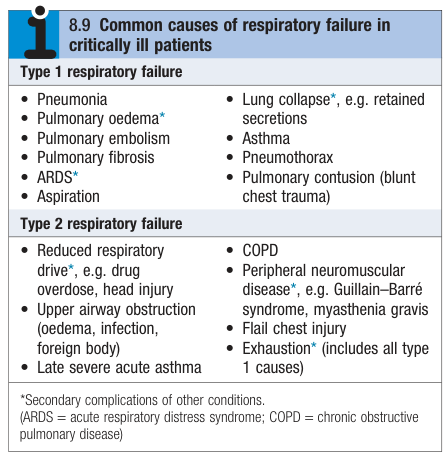
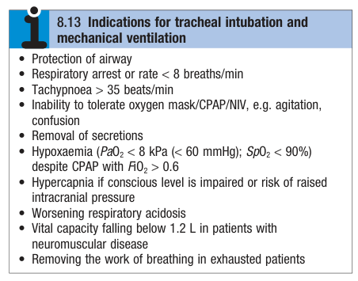
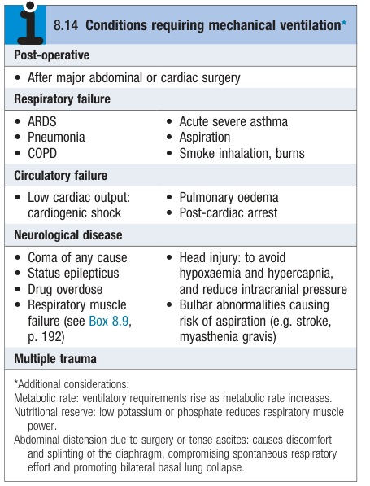
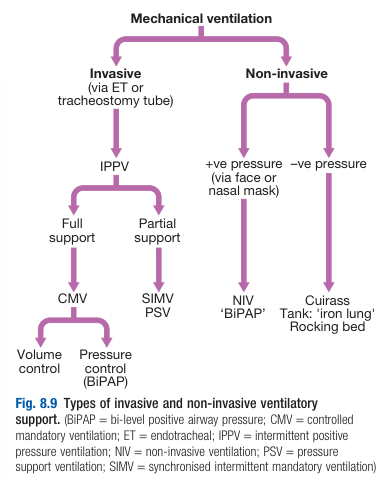
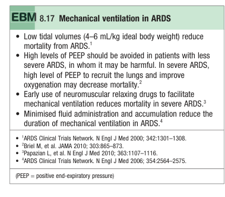
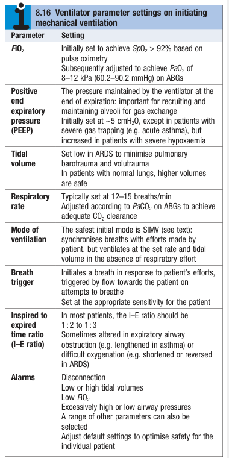

# Respiratory Failure

- **Classification of respiratory failure:**
    - <u>Type 1 respiratory failure</u> - hypoxaemia (PaO2 \< 8kPa \[60 mmHg\] on room air) without hypercapnia
    - <u>Type 2 respiratory failure</u> - hypoxaemia with hypercapnia (PaCO2 \> 6.5 kPa \[49 mmHg\]) due to **alveolar hypoventilation**
- **Etiology of respiratory failure** - may be a primary problem or constitute a secondary complication:
    - **Type 1 respiratory failure** - results from an increase in ventilation-perfusion mismatch and can arise from almost any pulmonary pathology:
        - <u>Pulmonary parenchymal disease</u> - pneumonia, pulmonary oedema, pulmonary fibrosis, lung collapse, aspiration, pulmonary contusion
        - <u>Pulmonary vascular disease</u> - pulmonary embolism
        - <u>Pleural disease</u> - pneumothorax
        - <u>Others</u> - acute pulmonary oedema, ARDS
    - **Type 2 respriratory failure** - results from alveolar hypoventilation:
        - <u>Central depression of respiratory drive</u> - drugs
        - <u>Peripheral neuromuscular disease</u> - e.g. Guillain-Barre syndrome, myasthenia gravis
        - <u>Severe airway obstruction</u> - upper airway obstruction (infection, oedema, foreign body), late severe acute asthma, AECOPD
        - <u>Reduced chest wall movement</u> - flail chest injury, exhaustion (includes all type 1 causes)

  
  
- **Assessment of respiratory failure** - clinical examination and Ix to determine most appropriate respiratory support:
    - **Respiratory rate and pattern:**
        - <u>Tachypnoea</u> - first indicator of respiratory illness
        - <u>Inspiratory stridor</u> - typically caused by partial upper airway obstruction
        - <u>Prolonged expiratory efforts</u> - indicates severe bronchospasm
        - <u>Rapid shallow breathing</u> - indicates more severe respiratory failure
    - **Conscious level** - reducing GC or agitation indicates more severe respiratory failure as a result of hypoxaemia, more importantly raises a <u>suspicion of hypercapnia</u>
    - **Pulse oximetry** - measurement of SpO2:
        - <u>Threshold for arterial hypoxaemia</u> - SpO2 \< 94% (recall O2-dissociation curve)
        - <u>Context of measurement</u> - failure to respond to to supplemental O2 esp. high flow (FiO2 \> 60%) is an indicator of severe VP mismatch
    - **Arterial blood gas** - detection of hypoxaemia, hypercapnia and VF ratio:
        - <u>Threshold of hypoxaemia</u> - 8 kPa (60 mmHg)
        - <u>Threshold of hypercapnia</u> - 6.5 kPa (49 mmHg)
        - <u>PF ratio</u> - ratio between PaO2 to fractional inspired oxygen delivered (PaO2/FiO2) as an indicator fo disease
- **Mx:** - respiratory support:
    - **Principles of Mx** - aims of respiratory support include:
        - Maintain patency of airway
        - Correct hypoxaemia and hypercapnia
        - Reduce work of breathing
    - **Oxygen therapy** - ensure adequate arterial oxygenation (SpO2 \> 90%):
        - <u>Mode of delivery</u>:
            - Facemask
            - Nasal canulae
        - <u>Indications for mechanical respiratory support</u> - if uncorrected hypoxaemia, or causing progressive hypercapnia (e.g. COPD)
        - <u>Caution in COPD patients</u> - risk of progressive hypercapnia overstated, as in patient who is acutely hypoxaemic, maintenance of cerebral oxygenation to avoid irreversible hypoxic brain injury takes precedance over theoretical risks
    - **Non-invasive respiratory support** - techniques that do not require sedation or airway management:
        - **Classification of non-invasive respiratory support:**
            - Continuous positive airway pressure (CPAP) therapy
            - Non-invasive ventilation (NIV) - i.e. CPAP plus additional support
        - **Role:**
            - <u>Correct hypoxaemia and hypercapnia</u> - used to support selected patients with type 1 and type 2 respiratory failure
            - <u>Reduce work of breathing</u> - preserve patient's respiratory muscle activity and reduces complications such as nosocomial infection
        - **Prerequisites:**
            - <u>Adequate consciousness</u> - not indicated for comatosed patients who cannot protect airway from aspiration
            - <u>Copoperative patient</u> - CPAP and NIV is uncomfortable and poorly tolerated
            - <u>Strength to breath and cough effectively</u> - neccessity for CPAP, less important for BiPAP
        - **CPAP therapy:**
            - <u>Principles of CPAP</u> - provision of continuous positive airway pressure throughout breathing cycle (5-10 mmHg):
                - **Recruitment of collapsed alveoli** - enhances VQ matching by recruiting collapsed alveoli in scenario of pulmonary atelectasis
                - **Clearance of alveolar fluid** - effective for treatment of pulmonary oedema and patients w/ consolidation (esp. if immunocomprimised)
            - <u>Mode of delivery</u>:
                - Tight-fitting facial mask
                - High-flow nasal nanulae
                - Castar hood
            - <u>Effectiveness in Tx of respiratory failure</u>:
                - **Type 1 respiratory failure** - extremely effective in correcting hypoxaemia
                - **Type 2 respiratory failure** - can be effective by increasing lung compliance (through increase lung volume and reduced alveolar fluid) and thus reduce work of breathing, but often these patients require NIV or mechanical ventilation
            - <u>Duration of trial</u> - failure to improve within 24-48h or further deterioration of GC and ABG indicates step up for invasive ventilation
        - **Non-invasive ventilation:**
            - <u>Principles of NIV</u>:
                - **Bi-level turbine ventilator** (BiPaP) - air delivered at different pressures based on respiratory cycle:
                    - <u>Phase of higher pressure</u> (15-25 cmH2O) - conincides with inspiration
                    - <u>Phase of lower pressure</u> (4-10 cmH2O) - conincids with expiration
                - **Ventilation can be spontaneous or timed** - systems that synchronise with the patient's effort are better tolerated and more effective
            - <u>Mode of delivery</u>:
                - Nasal cannulae
                - Full facemask
            - <u>Indications for NIV</u> - considered for patients deteriorating into **type 2 respiratory failure** by <u>reducing work of breathing</u>:
                - **AECOPD complicating with type 2 failure** - first line therapy to reduce work of breathing and offload of diaphragm and should be initiated early when severe respiratory acidosis or deterioriating GC
                - **Other causes of type 2 failure** - e.g. exhaustion secondary to pulmonary oedema, pneumonia (no good evidence on effectiveness)
                - **During weaning from invasive ventilation**
    - **Emergency endotracheal intubation and mechanical ventilation:**
        - <u>Indications</u> - based on clinical grounds and shared decision making rather than ABGs:  
        
        - <u>Techniques for endotracheal intubation</u> - see more detailed notes:
            - **Medications** - induction of anaesthesia + muscle relaxant in conscious patients or sedation in obtunded patients
            - **Pre-oxygenation** - pre-oxygenation enables lungs to be 100% filled with oxygen
            - **Apply cricoid pressure** - avoid aspiration
            - **Insertion of ET tube** - best in a critical care environment, with expert assistance, resuscitation facilities and appropriate medications
        - <u>Complications of intubation in the critically ill</u> - hypotension and cardiovascular collapse, particularly if associated CHF:
            - **Cardiac depression following sedation or anaesthesia** - direct CVS effects of anaesthetic agent and loss of sympathetic drive
            - **Increased intrathoracic pressure in PPV** - impaired venous return and hence reduced cardiac output
    - **Mx of ventilated patients:**
        - **Classification of ventilatory support:** 
        
        - **Principles of Mx:**
            - <u>Mandatory mode of ventilation</u> - choose between volume controlled modes or pressure controlled modes
            - <u>Initial settings</u> - ventilator parametor settings for patients, with re-assessment to see whether modification is needed
            - <u>Continuous monitoring</u> - reassessment to see whether changing parameters is necessary
            - <u>Weaning</u> - assess whether support can be gradually reduced as underlying condition is resolved: 
            
        - **Ventilator parameters and initial settings:** 
        
        - **Mandatory modes of ventilation:**
            - **Volume-controlled modes** - set to deliver preset tidal volume at set frequence to guarantee specified minute ventilation:
                - <u>Examples</u> - Synchronised intermittent mandatory ventilation (SIMV) as the safest option
                - <u>Complications</u>:
                    - Pneumothorax from lung barotrauma (pressure damage) or volutrauma (overstretch) - set volume delivered may occur at high pressures if lung compliance is low and lung volume is low
            - **Pressure-controlled modes** - set to deliver set pressure for a specific duration:
                - <u>Examples</u> - pressure-controlled ventilation (PCV), bi-level positive airway pressure ventilation (BiPAP)
                - <u>Complications</u> - minute ventilation depends on lung compliance:
                    - Insufficient ventilations - in stiff lungs (low pulmonary compliance), only small TV can be generated at given pressure
                    - Excess tidal volume - occurs in excessively high lung compliance
                - <u>Routine monitoring</u> - blood gases need to be routinely assessed to identify changes in pulmonary compliance
            - **Weaning or spontaneous breathing modes** - assisted breathing with additional pressure by flow trigger to augment each breathing effort:
                - <u>Selection</u> - pressure support ventilation (PSV) or assisted spontaneous breathing (ASB)
            - **Mixed modes** (mixing complete support with partial support) - e.g. specify frequency of SIMV or PCV and provide PSV for additional breathing efforts
        - **Additional ventilation strategies:**
            - Prone ventilation
            - High-frequency oscillatory ventilation (HFOV)
            - Nitric oxide
            - Extracorporeal membrane oxygenation therapy (ECMO)
            - Corticosteroids (conflicting evidence regarding use in acute lung injury)
    - **Weaning from respiratory support:**
        - **Problems with weaning from respiratory support** - patients unable to sustain modest degree of respiratory work:
            - Low lung compliance - e.g. from severe lung injury such as ARDS
            - Respiratory muscle weakness - from exhaustion or disuse of respiratory muscles
            - High work of breathing
        - **Criteria for weaning from respiratory support:**
            - <u>Indications for mechanical intervention</u> - original indication for mechanical ventilation has resolved
            - <u>Satisfactory gas exchange function</u> - PaO2 \> 10kPa (75 mmHg) on FiO2 \< 0.5; PaCO2 \< 6kPa (\< 45 mmHg)
            - <u>Stable circulation</u> - no S/S of pulmonary oedema, heart failure or excessive fluid overload
            - <u>Regaining of consciousness</u> - patient regains consciousness and able to cough and protect airway
            - <u>Adequate analgesics</u> - pain relief sufficient
            - <u>Metabolically stable</u> - no pending metabolic problems
        - **Approaches to weaning:**
            - <u>Spontaneous breathing trials</u> (SBTs) - removal of all respiratory support (along with sedation breaks) on daily basis and observing how long the patient breathes unassited
            - <u>Progressive reduction in pressure support ventilation</u> - progressive reduction in PSV applied for each breath over period of hours or days according to patients response
            - <u>Weaning protocols</u> - initiate and progress weaning within agreed guidelines to reduce ventilation times
