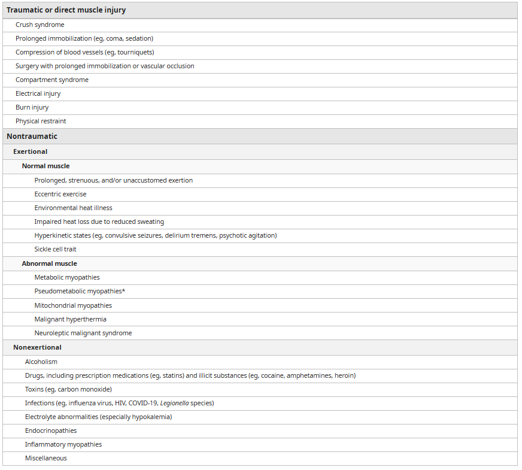

# Rhabdomyolysis

- **Definition** - syndrome characterised by muscle necrosis and the release of intracellular muscle constituents into circulation. characterised by markedly elevated CK, muscle pain, and myoglobinuria
- **Epidemiology** - variable rate of incidence:
    - <u>Etiology is often age-dependent</u>:
        - Adults - trauma, infections, drugs (including alcohol), and physical exertion
        - Paediatric - infections, metabolic myopathies, physical exertion
- **Risk factors for rhabdomyolysis:**
    - **Non-modifiable risk factors:**
        - <u>Demographic</u> - male sex, black race, age (\< 10y and \> 60y)
        - <u>Prior heat injury</u> - Hx of prior heat injury predisposes to rhabdomyolysis
    - **Modifiable risk factor** - BMI \> 40 kg/m2, chronic use of statins, low premorbid physical fitness, dehydration
- **Etiology of rhabdomyolysis** - classified by mechanism of injury: 

- **Clinical features of rhabdomyolysis** - characterised by triad (1-10%) of muscle pain, weakness, and dark urine:
    - **Systemic Sx** - fever, malaise, N/V, abdominal pain
    - **Muscle Sx** - develop over hours to days:
        - <u>Muscle pain</u> - most prominent over the proximaal muscle groups, such as the thigh, shoulder, lower back and calves
        - <u>Weakness</u> - weakness over the proximal legs is most frequently involved, but dependent on severity and site of muscle injury
        - <u>Swelling</u> - typically only develops w/ fluid repletion, caused either by 1) non-pitting myoedema, or 2) pitting peripheral oedema (esp. in those presenting w/ AKI)
    - **Dark urine** (\< 10%) - dark-coloured urine (tea-coloured, cola-coloured) occurs when there is significant myoglobinuria (100-300 mg/dL), but absence does not exclude myoglobinuria
    - **Associated manifestations** - other manifestations associated w/ severe myocardial necrosis:
        - **Fluid and electrolyte abnormalities** - may precede or occur in the absence of AKI:
            - <u>Hypovolaemia</u> - caused by "third-spacing" into injured muscles resulting in <u>increased risk of AKI</u>
            - <u>Hyperkalaemia</u> - due to release of intracellular K from damaged muscle cells predisposing to bradyarrhythmias, and may occur in the absence of, but also exacerbated by AKI
            - <u>Metabolic acidosis</u> - may or may not occur in the presence of severe AKI
            - <u>Hypocalcaemia</u> - due to entry into damage myuocytes and deposition of calcium salts in damaged muscles and decreased bone responsiveness to parathyroid hormone
            - <u>Hyperuricaemia</u> - due to release of purines from damaged muscle cells
        - **Acute kidney injury** (15-50%) - contributed by volume depletion, acidosis, and direct toxicity of heme pigmented casts on tubular cells
        - **Compartment syndrome** - caused by excessive oedema within anatomical compartments in the extremity, which can further exacerbate rhabdomyolysis
        - **Disseminated intravascular coagulation** - due to release of prothrombotic substances from damaged muscles
        - **Arrhythmias** - fata arrhythmias arising from hyperK or hypoCa
- **Mx:**
    - **Principles of Mx:**
        - <u>General measures</u> - acute Mx of hyperK, addressing underlying cause of rhabdomyolysis
        - <u>Volume repletion and forced-alkaline diuresis</u> - to minimise risk of acute kidney injury
        - <u>Haemodialysis</u> - if refractory to initial Tx
    - **Volume administration** - early and aggressive volume administration w/ crystalloid fluids:
        - <u>Rationale</u>:
            - Enhanced kidney perfusion - minimizing ischaemic injury to the kidney
            - Increased urinary flow rates - limit intratubular cast formation by diluting concentration of heme pigments within tuidubular fluids and wash out partially obstructing intratubular casts
        - <u>Choice of IV fluids</u> - isotonic saline (balanced solution avoided since hyperkalaemia complicates severe rhabodmyolysis)
        - <u>Rate of fluids</u> - typically very high in rhabdomyolysis due to volume depletion from sequestration of fluids within damaged muscles:
            - Initial rates - 1-2L/h
            - Titration - based on volume status and urine output to 200-300 mL/h (persistent oliguria may suggest established AKI and need for haemodialysis)
    - **Sodium bicarbonate** - "forced alkaline diuresis" in selected patients:
        - <u>Rationale</u> - urinary alkalisation (urine pH \> 6.5) w/ bicarbonate therapy:
            - Urinary alkalinization prevents heme-protein precipitation w/ Tamm-Horsfall protein and prevents intratubular cast formation
            - Alkalisation may also decrease the release of free iron from myoglobin, formation of vasoconstricting F2-isoprostanes, and risk of tubular precipitation of uric acid
            - However, absence of data suggesting superiority of forced alkaline diuresis compared w/ normal saline diuresis
        - <u>Indications</u> - considered only in severe muscle injury (CK \> 5000 U/L), rising CK, and in the **absence of**:
            - Hypocalcaemia
            - Alkalosis (arterial pH \> 7.5; HCO3 \> 30 mmol/L)
        - <u>Dosing</u> - 150 mmol of NaHCO3 administrated to 1L of D5 at initial rate of 200 ml/h titrated against urine pH \> 6.5
        - <u>S/E</u> - metabolic alkalosis can precipitate **hypocalcaemia**:
            - Promotion of CaPO4 deposition in face of alkalisation and hyperPO4 resulting in worsening of hypoCa
            - Alkalosis also results in reduction of ionised Ca
            - Acute manifestations of hypocalcaemia include seizures, arrhythmias, tetany, and laryngeal spasm
