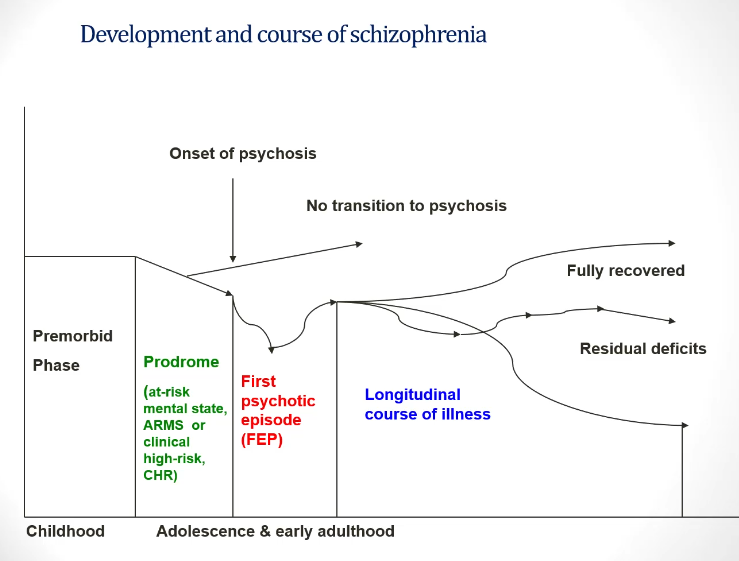
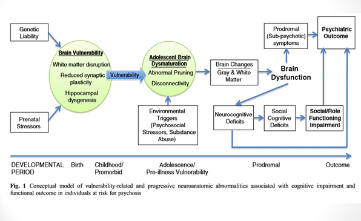

# Schizophrenia

- **Historical overview of schizophrenia and psychotic disorders:**
    - <u>Kraepelin's dementia praecox</u> - subset of psychotic disorders that is a/w dementia in the long run (cf bipolar disorders/ manic-depressive insanity w/ psychotic features)
    - <u>Brueler and schizophrenia</u> - term coined by Bleuler but in fact is a heterogenous disease
    - <u>Four classical subtypes of schizophrenia</u> - no longer included in DSM-5:
        - **Paranoid schizophrenia** - positive Sx (i.e. delusion and hallucinations) are prominent
        - **Hebephrenic schizophrenia** - considered primarily a formal thought disorder with younger onset and poorer prognosis
        - **Catatonic schizophrenia** - clinical picture dominated by abnormal motor behaviour (e.g. posturing, waxy flexibility, mutism)
        - **Simple schizophrenia** - absence of +ve Sx, and prominent negative Sx with gradual functional decline
- **Epidemiology of schizophrenia and related psychotic disorders:**
    - **Prevalence** - 2-3% of population have psychotic disorders (lifetime risk of schizophrenia ~1% classically, likely lower)
    - **Incidence** - 15.2/100,000/y (varied geographically, some socio-environmental factors e.g. urbanicity higher risk, migrants of ethnic minorities)
    - **Demographic** - onset at late adolesence and early adulthood for schizophrenia (may be later for non-schizophrenic psychosis), male preponderance (1.4:1), men have earlier onset:
        - <u>Age</u> - onset of schizophrenia usually occurs in late adolescence and early adulthood (may be later for non-schizophrenic psychosis):
            - Men typically have earlier onset of psychosis than F (bimodal diftribution)
            - Estrorgen may have mild anti-psychotic effect by dopamine blockade
        - <u>Sex</u> - slight male preponderance (M:F = 1.4:1)
    - **Burden** - one of leading disabilities worldwide (despite low incidence):
        - <u>Early onset</u> - late adolescence and early adulthood, causing profound irreversible disruption in individual's personality development, relationships, scholistic and vocational trajectories
        - <u>Chronic course</u> - relapse and remitting nature resulting in increasing DALY
        - <u>Functional limitation</u> - rather severe functional impact
        - <u>Direct and indirect cost to society</u> :
            - Direct cost due to hospitalisation, medication cost
            - Indirect cost from loss of productivity from patient and caregivers, and disability allowance
- **Development and course of psychotic disorders:**
    - **Premorbid phase** - normal functioning in a predisposed individuals
    - **Prodrome** - an identifiable phase often only in retrospective analysis although no role of early interventions as most do not progress into overt psychosis (15-20% over 3y):
        - <u>At-risk mental state</u> (ARMS) - a condition itself w/ mild psychotic symptoms that results in increased risk of developing into a psychotic disorder
        - <u>Clinically high-risk</u> (CHR) - state that is identified through structural assessment tools
    - **First psychotic episode** (FEP) - overt psychosis manifesting as a psychotic disorder, where <u>early identification and intervention</u> is demonstrated to have better short and median outcomes, such as shorter duration of psychosis \[DUP\]
    - **Subsequent lognitudinal course of illness** - single episode or may take a relapsing and remitting course, resulting in <u>varying degree of functional deficits</u>

  
  
- **Risk factors of schizophrenia:**
    - **Genetics** - high-degree of heritability as demonstrated by 50% monozygotic concordance rates, and increased incidence if +ve Hx in first-degree relatives (10-15%)
    - **Environmental factors:**
        - <u>Distal perinatal factors</u> - e.g. advanced paternal age at conception, maternal infections, obstetric complications
        - <u>Proximal social factors</u> - migration, urbanicity, substance abuse
- **Pathophysiology of schizophrenia:**
    - **Dopamine hypothesis** - increased pre-synaptic dopamine synthesis in the striatum resulting in <u>hyperdopaminergic transmission</u>, manifesting as psychosis:
        - <u>Active mesolimbic dopamine pathway</u> - attributed to positive Sx such as dellusions and hallucinations
        - <u>Active mesocortical dopamine pathway</u> - attributed to -ve Sx and cognitive impairments
    - **Neurological abnormalities** - as evident by normal and functional MRI:
        - <u>Reduced Gray matter volume</u> - cortical thinning, and reduction in volumes particularly in the prefrontal cortex, temporal lobes, thalamus and anterior cingulate gyruses w/ associated increased ventricular volume
        - <u>Altered resting state in neuronal connectivity</u> - white matter disruption, reduced plasticity, and hippocampal dysgenesis

    
    
- **Symptom domains of schizophrenia:**
    - Dellusions
    - Hallucinations
    - Negative symptoms
    - Disorganised thinking
    - Grossly disorganized or catatonic behaviour
- **Additional Sx domains of schizophrenia spectrum:**
    - Mood episodes
    - Cognitive impairment
- **Schizophrenia first-rank Sx** - coined by Kurt Schnider as being specific for schizophrenia, but subsequent literature demonstrates lack of PPV:
    - <u>Hallucination</u>:
        - Third person AVH with voices conversing w/ each other
        - AVH in the form of running commentary
        - AVH with voice repeating one's own thoughts aloud (thought echo)
        - Somatic hallucination
    - <u>Bizzare delusion</u>:
        - Thought alineation - thought insertion, withdrawal and broadcasting
        - Passivity or delusion of control - e.g. feelings, actions or impulses experienced as made or influenced by external agents
        - Delusional perception
- **DSM-V diagnostic criteria of schizohrenia:**
    - A. Two (or more) of the following, each present for a significant portion of time during a 1-month period (or less if successfully treated). At least one of these must be 1), 2) or 3):
        - 1\. Delusions
        - 2\. Hallucinations
        - 3\. Disorganized speech (e.g. frequent derailment or incoherence)
        - 4\. Grossly disorganized or catatonic behaviour
        - 5\. Negative symptoms (i.e. diminished emotional expression or avolition)
    - B. For a significant portion of the time since the onset of the disturbance, level of functioning in one or more major areas, such as work, interpersonal relations, or self-care, is markedly below the level achieved prior to the onset (or when the onset is in childhood or adolescence, there is failure to achieve expected level of interpersonal, academic, or occupational functioning)
    - C. Continuous signs of the disturbance persist for at least 6 months. This 6-month period must include at least 1 month of symptoms (or less if successfully treated) that meet Criterion A (i.e., active-phase symptoms) and may include periods of prodromal or residual symptoms. During these prodromal or residual periods, the signs of the disturbance may be manifested by only negative symptoms or by two or more symptoms listed in Criterion A present in an attenuated form (e.g., odd beliefs, unusual perceptual experiences)
    - D. Schizoaffective disorder and depressive or bipolar disorder with psychotic features have been ruled out because either 1) no major depressive or manic episodes have occurred concurrently with the active-phase symptoms, or 2) if mood episodes have occurred during active-phase symptoms, they have been present for a minority of the total duration of the active and residual periods of the illness
    - E. The disturbance is not attributable to the physiological effects of a substance (e.g., a drug of abuse, a medication) or another medical condition
    - F. If there is a history of autism spectrum disorder or a communication disorder of childhood onset, the additional diagnosis of schizophrenia is made only if prominent delusions or hallucinations, in addition to the other required symptoms of schizophrenia, are also present for at least 1 month (or less if successfully treated)
- **Cognitive impairment in Schizophrenia** - not a diagnostic feature in Schizophrenia but considered core and a key determinent in functional outcomes:
    - In general, 1-2SD below normal healthy controls, with healthy first-degree relatives of patients also demonstrating deficits in cognition although to a lesser extent
    - Impaired social cognition observed in deficits in theory of mind, lack of emotional recognition
- **Suicidal and non-sucidal mortality** - reduced 10-15y in lifespan (SMR 2-3):
    - **Suicide risk** - quoted at 5.6% lifetime risk:
        - 20% have suicide attempt on one or more occassions and many more have significant suicidal ideations
        - Rates highest in the first year after FEP, but risk remains high
        - Causes of suicide may include command by hallucinations, or depressed mood
    - **Non-suicidal mortality** - due to additional medical and psychiatric comorbidities:
        - <u>Lifestyle factors</u> - e.g. sedentary lifestyle and lack of exercise (avolition), poor nutrition
        - <u>Exposure</u> - cigarette smoking, substance or alcohol abuse
        - <u>Medical comorbidities</u> - metabolic syndrome
        - <u>S/E of Tx</u> - second generation antipsychotics
