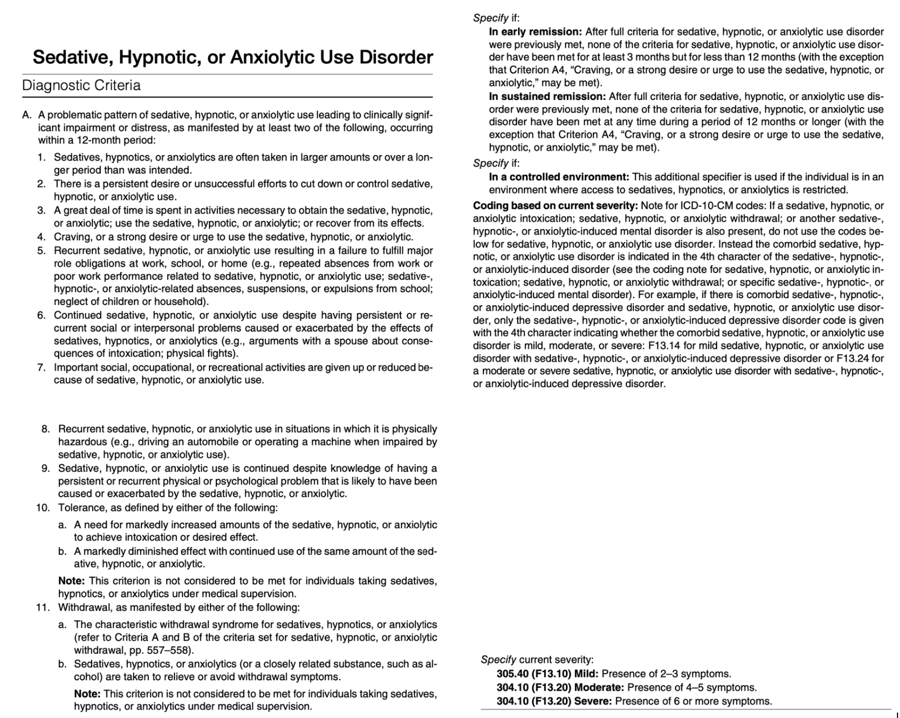
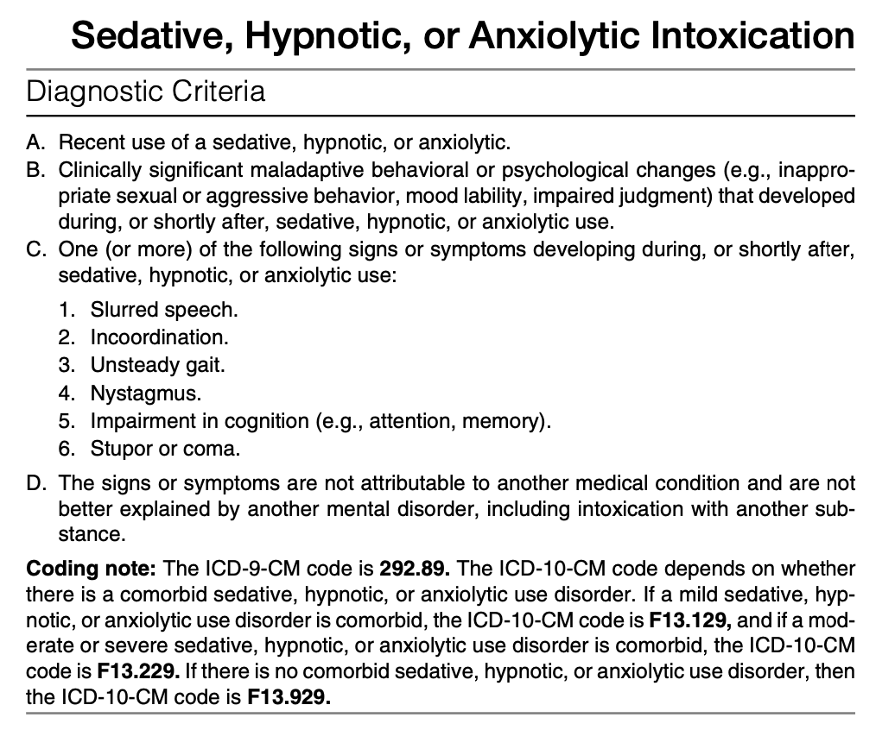
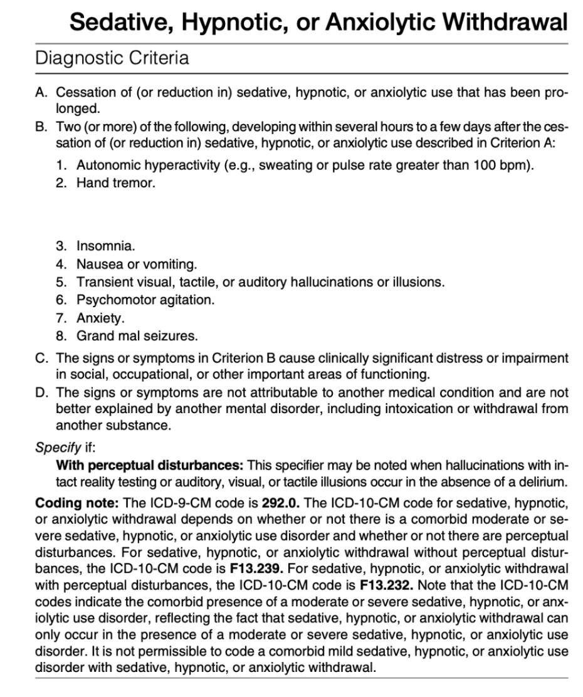

# Sedative, Hypnotic, or Anxiolytic Use Disorder

- **DSM-5 diagnostic criteria of sedative, hypnotic, or anxiolytic use disorder:** 

- **DSM-5 diagnostic criteria of sedative, hypnotic, or anxiolytic intoxication:** 

- **DSM-5 diagnostic criteria of sedative, hypnotic, or anxiolytic withdrawal:** 

