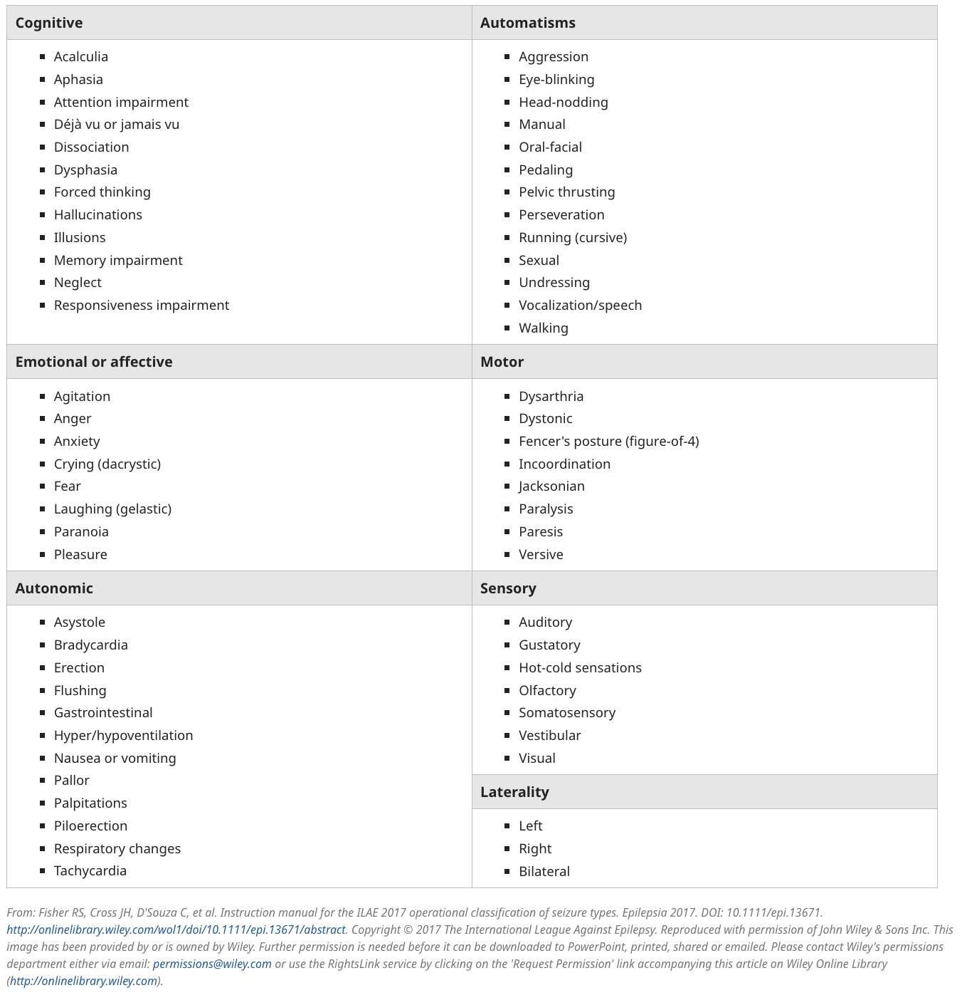
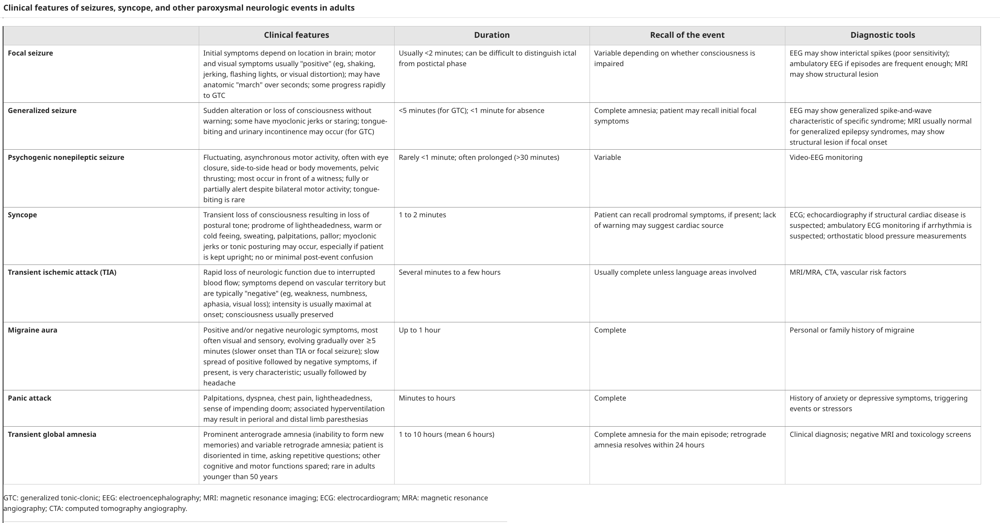
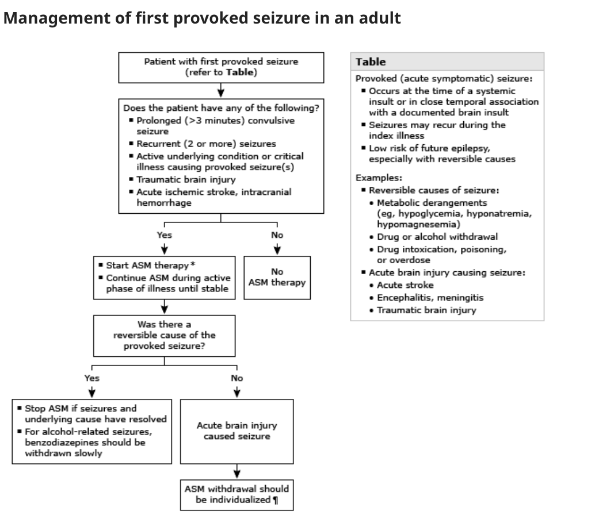
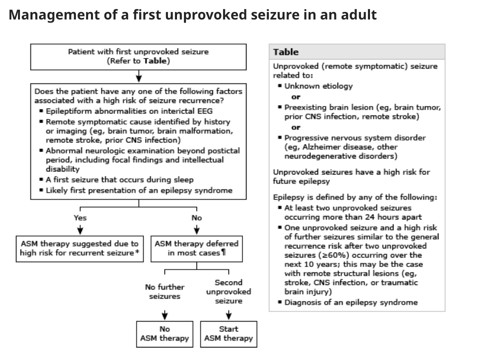

# Seizures

- **Definition** - a sudden change in behavior caused by electrical hypersynchronisation of neuronal networks in the cerebral cortex
- **Terminology:**
    - <u>Acute symptomatic seizures</u> (provoked seizures) - seizures that is attributed to a known systemic or brain insult based on close temporal association (see causes of seizures below)
    - <u>Unprovoked seizure</u> - seizures of unknown etiology as well as one that occurs in relation to a pre-existing brain leson or progressive CNS disorder
    - <u>Epilepsy</u> - a predisposition to seizures arbitrarily defined by any one of the following conditions:
        - At least two unprovoked seizure occuring \> 24h apart (\>= 60% 10y recurrence risk)
        - One unprovoked seizure similar risk of reccurence as those w/ having two unprovoked seizures likely due to some remote structural lesions such as stroke, CNS infections, TBIs
        - Diagnosis of epilepsy syndrome
- **Pathophysiology of seizure and epilepsy:**
    - **Imbalance between excitation and inhibition** - paroxysmal depolarisation shift in neuronal membrane potential, predisposing to recurrent action potentials with **repetitive discharges involving large neuronal networks**:
        - <u>Inhibitory neurotransmitters</u> - GABA (gamma-aminobutyric acid) acts on ion channels to enhance chloride influx and **hyperpolarisation**, preventing action potential formation
        - <u>Excitatory neurotransmitters</u> - Glutamate and asparate act on ion channels to enhance sodium and calcium influx and hence **depolarisation**, promoting action potential formation
    - **Principles of focal onset seizures:**
        - <u>Localised pathology causing focal seizure at first instance</u> - from focal infections, tumours, vascular event, or trauma-related scarring
        - <u>Semiology is dependent on cortical area affected</u> - e.g. origin in temporal lobe results in impaired awareness but w/o tonic-clonic movement
        - <u>Seizure activity can spread</u> - spread to different cortical areas will result in different clinical features, and subsequently secondary generalisation when spread to the contralateral hemisphere
    - **Principles of generalised seizures:**
        - <u>Seizures can be generalised in onset</u> - caused by genetic basis (e.g. channelopathies) involving **central mechnisms** controlling cortical activations (<u>diencephalic activating system</u>) and spreads rapidly
        - <u>Secondary generalisation after focal onset seizures</u> - caused by focal seizures that spread to bilateral hemispheres via spreading of abnormal electrical activity to the diencephalic activating pathways

    
    
- **Etiology of seizures:**
    - **Acute brain injury:**
        - <u>Cerebrovascular disorders</u> - acute ischaemic stroke, ICH (particular lobar haemorrhage), subdural haematoma, SAH, cerebral venous thrombosis
        - <u>Acute traumatic brain injury</u> - subdural haematoma or concussion
        - <u>Pregnancy-related</u> - eclampsia
        - <u>Hypoxic-ischaemic encephalopathy</u> - ischaemic damage to brain due to prolonged cardiac arrest, hypotension or hypoxaemia
        - <u>CNS infections</u> - brain abscess, encephalitis, meningitis
    - **Acute systemic disorders:**
        - <u>Drug or alcohol overduse</u> - typically cocaine, amphetamines, or some medications that lower seizure threshold
        - <u>Withdrawal states</u> - particularly alcohol (7-48h after last drink) or benzodiazepine withdrawal
        - <u>Hypoglycaemia</u> - often a/w prodromal adrenergic or neuropsychiatric symptoms prior to seizure
        - <u>Hyponatraemia</u> - often a/w prodromal Sx of confusion and decreased GC, and subsequently precipitating generalised tonic-clonic seizure due to generalised cerebral oedema
        - <u>Hypocalcaemia</u> - rare cause of seizure and only occurs in neonates, and often a/w medical conditions a/w hypoCa
        - <u>Hypomagnesemia</u> - a/w convulsions and often accompanied with hypoCa
        - <u>Uraemia</u> - a/w myoclonic seizures while GTCS can occur in up to 10% of CKD patients late in disease course
        - <u>Acute intermittent porphyria</u> - usually GTCS occurs in 15% of AIP attacks
        - <u>Non-ketonuric hyperglycaemia</u> - diabetes possibly resulting in subclinical strokes explaining focal motor seizures
    - **Underlying structural brain lesions** - first presentation may be seizures or epilepsy
    - **Epilepsy**
- **Focal seizures:**
    - **Causes of focal seizures:**

        - <u>Idiopathic</u> - benign rolandic epilepsy of childhood, benign occipital epilepsy of childhood
        - <u>Genetic structural lesions</u> - Tuberous sclerosis, von Hippel-Lindau disease, Neurofibromatosis
        - <u>Neoplastic</u> - primary or secondary tumours
        - <u>Infective</u> - e.g. cerebral abscess, subdural empyema, encephalitis, tuberculoma, toxoplasmosis, cysticercosis (parasitic)
        - <u>Vascular</u> - ICH, AVM, cerebral infarction

    
    

        - **Clinical features of focal seizures** - +ve neurological phenomena corresponding to the cortical area affected: 
        
            - <u>Occipital lobe involvement</u> - +ve visual phenomena (e.g. light and blobs of colour)
            - <u>Parietal onset</u> - sensory strip involvement results in sensory alterations (e.g. burning sensation, tingling)
            - <u>Frontal lobe involvement</u> - results in +ve motor Sx or bizzare behavioural patterns:
                - **Focal Motor Sx** - jerking (e.g. myoclonus)
                - **Bizzare behavioural patterns** - e.g. abnormal posturing, sleep walking, or even frenetic ill-directed motor activity (e.g. incoherent screening)
            - <u>Temporal lobe involvement</u> - results in impaired awareness, false recognition, or other features of automatism:
                - **Impaired awareness** - initially evident by its vacant stare and unresponsiveness
                - **False recognition** - sense of 'deja vu', occassionally presenting w/ <u>epigastric discomfort</u>
                - **Features of automatism** - repetitive, seemingly purposeful behaviour:
                    - Repetitive blinking
                    - Lip-smacking
                    - Fiddling of clothes (from simple picking to repetitive dressing and undressing)
                    - Pill-rolling movements
                    - Hand-clapping or rubbing

          
          
        - **Classification into focal aware seizures and focal impaired aware seizures:**
            - <u>Focal aware seizures</u> ('simple partial seizures') - if abnormal cortical activity never involves the temporal lobe, where individual retains awareness, and is often characterised by positive neurological S/S correspond to the normal function of the area
            - <u>Focal impaired aware seizures</u> ('complex partial seizures') - if abnormal cortical activity involves the temporal lobe, resulting in **impaired awareness**, and a/w signs of automatism
- **Generalised seizures** - may either be 1) generealised onset, or 2) secondary generalisation of focal seizures:
    - **Classification of generalised seizures** - based on whether there is a recognisable pattern of seizures:
        - <u>Generalised tonic-clonic seizures</u> - LOC a/w increased rigidity as a result of rapid discharge (tonic phase), followed by what appears to be jerking motions due to reduced discharge frequency (clonic phase), often associated w/ 1) central cyanosis, 2) tongue biting, 3) urinary incontinence, 4) post-ictal drowsiness and 5) sustained injury from fall
        - <u>Absence seizures</u> (previously petit mal) - brief periods of loss of awareness in childhood, mistakened for daydreaming or poor concentration in school
        - <u>Myoclonic seizures</u> - brief jerking movements predominantly in the arms, more marked in the morning, on awakening, and provoked by fatigue, alcohol or sleep deprivation
        - <u>Atonic seizures</u> - brief loss of muscle tone resulting in falls w/ or w/o LOC, and only occurs in epileptic syndromes w/ other seizure types
        - <u>Tonic seizures</u> - LOC a/w generalised increase in tone w/o being followed by a clonic phase, only occurs as part of an epielpsy syndrome
        - <u>Clonic seizures</u> - LOC a/w generalised jerking without a preceding tonic phase, similar to GTCS
- **Seizures of uncertain generalised or focal nature:**
    - <u>Epileptic spasms</u> - takes form w/ widespread marked contractions of axial musculature lasting \< 1s but recurring in clusters of 5-10, often on awakening (highlighted in classification system but seldom used in adulthood)
- **DDx of seizures:**
    - <u>Syncope</u> (including convulsive syncope) - characterised by brief (\< 20s) seizure-link motor activity w/ tonic extension or several clonic jerks, but characterised by **minimal post-event confusion** pertaining higher mortality than seizures
    - <u>TIA</u> - particularly in older adults w/ risk factors, focal Sx usually -ve and **consciousness is preserved**
    - <u>Migraine</u> - particularly migraine w/ aura, aura Sx have slower onset (\>= 5 min), and always followed by -ve Sx
    - <u>Panic attack and anxiety</u> - predominate somatic Sx a/w hyperventilation resulting in perioral and digital parasthesia (mimicking focal neurological deficits)
    - <u>Psychogenic nonepileptic seizure</u> - usually fluctuating and asynchronous motor activity, and almost always in front of a witness, fully alert despite bilateral motor activity
    - <u>Transient global amnesia</u> - prominant anterograde amnesia w/ variable retrograde amnesia, visibly disoriented in time, but other cognitive and motor functions spared
    - <u>Narcolepsy w/ cataplexy</u>
    - <u>Paroxysmal movement disorders</u>

  
  
- **Salient points of Hx** - characterise event as seizure and r/o alternative Dx:
    - **Informant:**
        - Focal aware seizures - can typically provide a complete description of event
        - Focal impaired awareness seizures or generalised seizures - unable to provide Hx and can only remember early stages of the seizure
    - **HPI** - onset and duration, description of seizure, description of postictal period, precipitants, triggers or prior events:
        - <u>Onset and duration</u> - abrupt onset and spontaneous abrupt within 2-3 minutes
        - <u>Description of event</u>:
            - **Alteration of consciousnesss** - sudden alteration or loss of consciousness w/o warning (unawaare, staring)
            - **Abnormal movement:**
                - <u>Focal jerks</u> - may have anatomical "march" over seconds
                - <u>Clonic movements</u> - generalised clonus bilaterally
            - **Abnormal tone** - tonic seizures (children may appear floppy)
            - **Other focal neurological Sx** - e.g. sensory disturbance, dysphasia for localisation of focal onset seizures
            - **Urinary incontinence** - any urinary incontinence during episode of seizure
            - **Tongue biting or other injury** - must attend to injuries caused by seizure activity
        - <u>Description of post-ictal period</u> - period of transition from ictal state back to preseizure baseline level of awareness and function (lasting from minutes to hours):
            - **Reduced consciousness** - confusion or suppressed alertness
            - **Focal neurological Sx** - typically occuring after focal seizures:
                - Postictal paresis (Todd paralysis in pattern of seizure)
                - Aphasia
                - Hemianopsia
                - Numbness
            - **Headache** - often follows during post-ctal period
        - <u>Precipitants or triggers</u> - trigger may point to epilepsy, but may also precipitate non-epileptic paroxysmal disorder:
            - **Common triggers for seizures in epileptic patients** - often experienced immediately before seizure:
                - Flashing lights
                - Loud music
                - Intense exercise
                - Strong emotion
            - **Precipitants for seizures** - probably by lowering seizure threshold:
                - Febrile illness
                - Menstrual period or pregnancy
                - Lack of sleep
        - <u>Prior events</u> - subtle events before index seizure:
            - Sudden jerks in arms or legs after awakening in the morning (juvenile myoclonic epilepsy \[JME\])
            - Olfactory or gustatory hallucinations (temporal lobe epilepsy)
            - Deja vu or prief episodes of fear, panic or anxiety (temporal lobe epilepsy)
            - Visual hallucinations (occipital-onset seizures)
        - **PMH** - risk factors for epileptic seizures:
            - <u>Neurological</u> - stroke, head injury, prior intracranial infection, Alzheimers
            - <u>Developmental</u> - abnormal early neurological development or intellectual disability
            - <u>Oncological</u> - Hx of malignancy (brain metastasis), immunosuppression
            - <u>Haematological disorders</u> - e.g. anti-phospholipid syndrome, porphyria, sickle cell disease
            - <u>Psychiatric</u> - alcohol or substance use disorder
        - **Drug Hx** - usually low risk of seizures unless taken in supraphysiological levels:
            - <u>Antiplatelets and anticoagulants</u> - increased risk of ICH
        - **SHx:**
            - <u>Smoking</u> - RF for strokes
            - <u>Alcohol</u> - alcohol overdose, or withdrawal can cause provoked seizures, but +ve Hx does not r/o other causes (e.g. subdural due to predisposition to falls)
        - **FHx** - +ve FHx is risk factor for epilepsy
    - **P/E** - typically unrevealing:
        - **Assessment of consciousness** (AVPU/ GCS) - depends on setting (asumed conscious if able to provide coherent Hx in seizure clinic)
        - **Assessment of meningism** - if CNS infections suspected
        - **Neurological examination:**
            - Lateralising abnormalities (points to contralateral structural brain lesion)
        - **Examination of seizure-related trauma:**
            - Tongue biting (low Sn, high Sp for GTCS) - usually on the side of the tongue, where tip of tongue is caused by falls which may or may not be caused by seizures
            - Other sites of trauma (e.g. shoulder)
    - **Ix:**
        - **Routine bloods** - CBC, LRFT, Ca, Mg, RBG +/- lactate, toxicology:
            - <u>CBC</u> - leukocytosis (signs of infection)
            - <u>RFT, Ca, Mg</u> - HypoNa, HypoCa, HypoMg as reversible causes of seizures
            - <u>RBG</u> - hypoglycaemia as a rapidly correctable cause of seizures
            - <u>Lactate</u> - **raised lactate** within 2h of event suggests it is caused by <u>generalised seizure rather than syncope or a psychogenic non-epileptic seizure</u> (normal levels do not r/o seizure)
        - **Urinalysis:**
        - **12-lead ECG** - detection of arrhythmogenic states leading to cardiogenic syncope (e.g. long QTc)
        - **Neuroimaging** - CT or MRI:
            - <u>Urgency</u> - depends on clinical context:
                - Immediate - if SOL suspected (esp. new focal deficit, persistent altered consciousness, fever, raised ICP, trauma, focal-onset etc.)
                - <u>Outpatient</u> - reasonable in patients reverting to normal baseline and normal neurological examination
            - <u>CT vs MRI</u>:
                - CT in urgent setting to exclude acute neurological problems (e.g. haemorrhage, large tumours, strokes)
                - MRI (epilepsy protocol) in outpatient setting for detecting remote causes of seizures (e.g. old infarcts, tumors, mesial temporal sclerosis, focal cortical dysplasia)
        - **EEG** - for patient who fail to return to baseline \< 60 min despite Tx w/ antiseizure medications (detection of subclinical nonconvulsive seizure activity)
        - **Lumbar puncture** - considered acute CNS infection or suspected alternative meningeal process (e.g. chronic meningitis, meningeal cancer, SAH)
- **Mx:**
    - **Principles of Mx:**
        - <u>Hospitalisation</u> - depends on:
            - Duration of seizure - e.g. status epilepticus
            - Recovery - incomplete recovery or prolonged postictal state
            - Seizure-related injury - if serious requiring inpatient care
            - Etiology of seizure - presence of acute brain injury or systemic illness requiring further workup or Mx
        - <u>Anti-seizure medications</u> - initiation principally depends on risk of recurrence (see below)
        - <u>Patient education</u> - precautions and on driving
    - **Initiation of anti-seizure medications:**
        - **Provoked seizures** - initiate if caused by acute brain injury or prolonged: 
        
        - **Unprovoked seizures** - dependent on features of high risk of recurrence:
            - 1\. Presence of remote symptomatic causes on Hx or imaging
            - 2\. Abnormal neurological examination after post-ictal period
            - 3\. Epileptic abnormalities on interictal EEG
            - 4\. First seizure at sleep
            - 5\. Likely presentation of epilepsy syndrome

      
      
