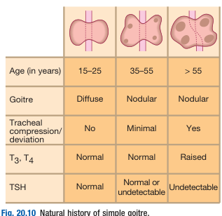
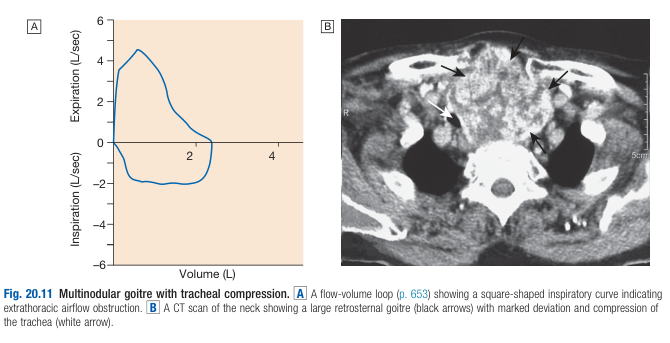

# Simple and Multinodular Goitre

- **Definition** - diffuse or multinodular enlargement of the thyroid of unknown etiology
    - **Simple diffuse goitre** - diffuse enlargement of thyroid with no associated thyroid dysfunction that does not require Tx and can spontaneously regress
    - **Multidoular goitre** - multinodular goitre often developing from pre-existing simple goitre, which may cause no thyroid dysfunction, but may subsequently gain areas of autonomous function
- **Pathophysiology of simple and multinodular goitre:**
    - <u>Simple diffuse goitre of unknown etiology</u> - idiopathic diffuse enlargement of thyroid gland at 15-25y which causes neck swelling +/- compressive Sx (dysphagia), but **spontaneously regress**
    - <u>Recurring episodes of hyperplasia and involution</u> - persistence of unknown thyroid stimulus, causing recurrent episodes of hyperplasia and involution over 10-20y, as the gland becomes nodular but remain euthyroid (or subclinical hyperthyroidism)
    - <u>Progression to toxic multinodular goitre</u> - thyroid nodules gain autonomous function secreting T4/T3, causing supression of complete suppression of TSH (25%) and inhibition of TSH-dependent growth of the rest of the gland

  
  
- **Clinical features of multinodular goitre:**
    - **Large goitre** - anterior neck swelling that may be noticed by friends and relatives rather than the patient (w/ no tenderness and lymphadenopathy)
    - **Compressive Sx:**
        - <u>Tight sensation of neck when swallowing</u> - the initial comprpession Sx that can be reported by patients
        - <u>Dysphagia</u> - occurs in large goitre
        - <u>Stridor</u> - caused by tracheal compression and deviation (often in multinodular goitre)
        - <u>Thoracic inlet obstruction</u> - caused by retrosternal extension
        - <u>Hoarseness</u> - caused by recurrent laryngeal nerve palsy, but is rare in nodular goitres, and **more suggestive of malignancies**
    - **Thyrotoxicosis** - in those with toxic multinodular goitre resulting in clinical thyrotoxicosis
    - **Painful neck swelling** - caused by haemorrhage into a nodule or cyst
- **Signs of simple and multinodular goitre:**
    - **Simple goitre:**
        - Inspection - diffuse, symmetrical enlargement of thyroid mass (moves up on swallowing)
        - Palpation - soft, smooth mass, non-tender and w/o lymphadenopathy and tracheal deviation
        - Auscultation - no audible bruit
    - **Multinodular goitre:**
        - Inspection - nodular, or lobulated enlargement
        - Palpation - nodular, lobulated, non-tender +/- retrosternal extension
        - Examination of thyroid status - may be thyrotoxic
- **Ix and diagnostic evaluation** - workup as thyroid swelling/ goitre:
    - <u>T3/4, TSH</u> - autonomous goitre relieves risk of malignancy:
        - **Simple goitre** - typically normal TSH and euthyrooid
        - **Multinodular goitre** - suprresed TSH (complete suppression in 25%) +/- elevated TSH
    - <u>Thyroid ultrasound</u> - showing multiple nodules where each nodule is assessed for risk of thyroid neoplasia (TIRADS)
    - <u>Thyroid scintigraphy</u> - one or more focal areas of increased radioiodine uptake ('hot' nodules) in toxic NMG, ocassionally with some 'cold' nodules requiring workup (USG)
    - +/- <u>Thyroid autoantibodies</u> - especially if diffuse uptake of thyroid scintigraphy to r/o Graves' Disease
    - +/- <u>Flow-volume studies</u> - to screen for significant tracheal compression in large goitres
    - \+*- <u>Cross sectional imaging</u> (CT* MRI) - thoracic inlet imaging to quantify the degree of tracheal compression and retrosternal extension if intervention contemplated
- **Mx:**
    - **Principles of Mx:**
        - <u>Conservative Mx</u> - for small simple goitres with normal thyroid function (annual thyroid function testing to assess progression of disease)
        - <u>Radioiodine therapy</u> - reduction of size of goitre or remission of subclinical hyperthyroidism, if there is no absolute indication for thyroid surgery
        - <u>Thyroid surgery</u> - indicated in patients with compressive symptoms, co-existing malignancy, requiring rapid correction of thyrotoxicosis, or cosmetic reasons
    - **Near-total thyroidectomy:**
        - <u>Indications of near-total thyroidectomy</u>:
            - 1\. Large goitre causing compressive symptoms (confirmed on CT, MRI, flow-volume studies) 
            
            - 2\. Co-existing malignancy (FNAC)
            - 3\. Rapid correction of hyperthyroidism as surgery superior to RAI (e.g. CVS comorbidities)
            - 4\. Cosmetic reasons
        - <u>Pre-operative preparations</u>:
            - **Render patient euthyroid** - antithyroid drugs (e.g. CMZ, MMZ) to render patient euthyroid to prevent operative thyroid storm
        - <u>Complications</u> - see notes under Graves' Disease
    - **Radioactive iodine therapy** (RAI) - modality of choice if no absolute indications of thyroid surgery
    - **Long term antithyroid drugs** - very little role as rarely controlled and high risk of exacerbations
