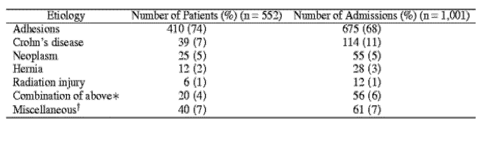

# Small Bowel Obstruction

- **Definition** - mechanical bowel obstruction at the level of the small bowel
- **Etiology of SBO** - most commonly caused by adhesions (74%): 

    - **Intraluminal** - foreign body, gallstone ileus, bezoars, worms
    - **Intramural** - tumour (primary or secondary), strictures (Crohn's, radiation, anastamosis, drug-induced strictures), intussusception
    - **Extramural** - adhesions, hernia, volvulus, intraperitoneal malignancy
- **Clinical features of SBO** - varying clinical presentation between high SBO and low SBO
- **Mx** - dependent on etiology (e.g. adhesive SBO vs others):
    - **Principles of Mx:**
        - <u>Conservative Mx</u> - indicated if adhesive SBO suspected
        - <u>Water soluble contrast follow-through</u> - demonstrated efficacy for adhesive SBO in QMH
        - <u>Surgical Mx</u>:
            - Adhesive SBO - surgical Tx only if showing signs of strangulation (see above), or non-responsive to conservative Mx
            - Other causes of SBO - surgical Tx indicated
    - **Conservative Mx** - trial of conservative Mx for 3-5d if not C/I (duration is controversial):
        - <u>Diet</u> - keep NPO to rest the bowel +/- parenteral nutritionl when prolonged fasting anticipated
        - <u>Drip and suck approach</u>:
            - **Drip** - fluid resuscitation via crystalloids (NS or lactate ringers) if clinically dehydrated (+/- correction of electrolyte abnormalities)
            - **Suck** - insertion of Ryle's tube for decompression to reduce vomiting and limit proximal decompression (and monitoring of drain output)
        - <u>Monitoring</u> - monitoring of vital signs, abdominal exam, abdominal X-ray for resolution or complication
    - **Water-soluble contrast follow-through** - indicated for selected <u>adhesive SBO</u> (studies not performed for other etiology):
        - <u>Selection of water-soluble contrast</u> - Gastrografin
        - <u>Indications</u> - adhesive SBO with no features of strangulation
        - <u>MOA</u> - Hyperosmolarity of gastrografin reduces bowel edema and stimulates peristalsis, encouraging resolution of obstruction
        - <u>Diagnostic role</u> - differentiation between partial and complete obstruction
        - <u>Clinical efficacy</u> - reduced operating rates, shorten hospital stay
    - **Surgical Mx** - dependent on etiology:
        - <u>Adhesive SBO</u> - enterolysis
        - <u>Hernia</u> - hernia repair
        - <u>Intraluminal SBO</u> (FB, Bezoars, gallstone ileus) - enterotomy and removal
        - <u>Bowel strangulation</u> - bowel resection if gangrenous bowel
- **Prognosis of SBO:**
    - <u>Non-strangulating obstruction</u> - 2% mortality
    - <u>Strangulation obstruction</u> - 30% mortality
