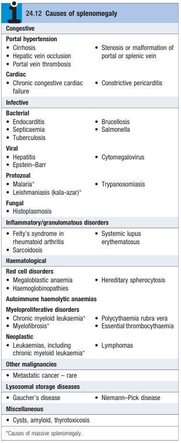

# Splenomegaly

- **Definition** - enlargement of the spleen due to:
    - 1\. Involvement by lymphoproliferative disease
    - 2\. Resumption of extramedullary haematopoiesis in myeloproliferative disease
    - 3\. Enhanced reticuloendithelial activity secondary to autoimmune haemolysis, infections, or sequestration
- **DDx of splenomegaly:**
    - **Vascular congestion** - increased pressure resulting in accumulation of blood in the spleen:
        - <u>Portal HTN</u> - pre-hepatic, intra-hepatic, and post-hepatic
        - <u>Vascular occlusion</u> - Budd Chiari syndrome, portal vein thrombosis, splenic vein thrombosis
    - **Increased splenic activity:**
        - <u>Increased red pulp activity</u> - red cell disorders, particularly haemolytic anaemia
        - <u>Increased white pulp activity</u>:
            - Autoimmune cytopenias (e.g. AIHA, ATP, autoimmune neutropenia, Felty syndrome, SLE)
            - Infection - e.g. endocarditis, TB, EBV, CMV, malaria, histoplasmosis
    - **Infiltration:**
        - <u>Haematological infiltration</u> - leukaemia, lymphoma, myeloproliferative neoplasms (e.g. CML, PV, ET), extramedullary haematopoiesis (e.g. Myelofibrosis, Thalasssaemia major)
        - <u>Non-haematological infiltration</u> - lysosomal storage diseases (e.g. Gaucher's disease), sarcoidosis

  
  
- **Classification of splenomegaly by size:**
    - <u>Massive splenomegaly</u> - chronic myeloid leukaemia, myelofibrosis
    - <u>Moderate splenomegaly</u> - portal HTN, haematological malignancies
    - <u>Mild splenomegaly</u> - haemolytic anaemia, autoimmune cytopenias
- **Clinical features of splenomegaly:**
    - **Features related to splenomegaly:**
        - <u>Abdominal discomfort</u> - often accompanying back pain due to mass effect of the splenomegaly
        - <u>Abdominal bloating and early satiety</u> - as a result of stomach compression
        - <u>Severe abdominal pain</u> - often occurs during splenic infarct and radiates to left shoulder tip, w/ associated splenic rub on auscultation
    - **Features related to underlying cause:**
        - <u>Pharyngitis</u> - suggestive of infectious mononucleosis
        - <u>Constitutional B symptoms</u> - suggestive of lymphoma
        - <u>Complication of cirrhosis</u> - e.g. ascites, variceal bleeding, hepatic encephalopathy
- **P/E** - certain findings on P/E points to a particular cause:
    - **Fever** - may be seen w/ an infection, but <u>PUO</u> may reflect underlying haematological malignancy
    - **General examination:**
        - <u>Pallor</u> - reflects underlying anaemia which may be a/w the splenomegaly
        - <u>Ruddy complexion</u> - may be seen in PV
        - <u>Stigmata of chronic liver disease</u> - suggestive of underlying liver disease
        - <u>Ascites or peripheral oedema</u> - reflects underlying portal hypertension and vascular occlusion
    - **Abdominal examination:**
        - <u>Hepatosplenomegaly</u> - may be caused by:
            - Liver disease (Alcoholic cirrhosis, Haemochromatosis, or HCC)
            - Lymphoproliferative disease
            - Myeloproliferative disease
            - Infiltrative disease (e.g. amyloidosis)
        - <u>Splenic tenderness</u> - suggestive of underlying infarction, rupture or acute infection
    - **Examination of LN** - lymphadenopathy reflects underlying lymphoproliferative disease
- **Ix** - should focus on suspected caused based on Hx and P/E:
    - **Routine bloods** - CBC, LFT, Clotting profile:
        - **CBC** - cytopenias may be a/w 1) hypersplenism, 2) autoimmune cytopenias, 3) herediatary haemolytic anaemia, or 4) bone marrow infiltration
        - **Peripheral blood smear** - certain abnormalities may prompt BM examination
            - <u>Immature or abnormal WBCs</u> - suggestive of underlying lymphoproliferative or myeloproliferative neoplasms
            - <u>Spherocytosis</u> - suggestive of underlying hereditary spherocytosis or AIHA
            - <u>Tear drop cells</u> - myelofibrosis or thalassaemia
        - **LFT** - to assess contribution of liver disease, although elevation of transaminases is non-specific and may reflect underlying infection
    - **Imaging** - abdominal or chest iamging:
        - **Abdominal imaging** - transabdominal USG, CT abdomen:
            - <u>Imaging of liver</u> - to detect liver disease
            - <u>Imaging of abdominal LN</u> - to detect intra-abdominal lymphadenopathy
            - <u>Imaging of speen</u> - variation in density may be a feature fo lymphoproliferative disease
        - **Chest imaging** - CXR, CT thorax:
            - Detection of mediastinal lymphadenopathy
    - **BM examiantion** - indicated when:
        - 1\. Splenomegaly w/ leukocytosis and abnormal white cells on PBS
        - 2\. Splenomeegaly with thrombocytosis or erythrocytosis
    - **LN biopsy** - if splenomegaly w/ peripheral lymphadenopathy suggestive of lymphoma
    - **Additional Ix:**
        - <u>Septic workup</u> - if infection is suspected
        - <u>HIV testing</u> - may be appropriate if no other causes of splenomegaly is immediately apparent
- **Mx:**
    - **Principles of Mx:**
        - <u>Dx and Tx of underlying cause</u> - Tx of underlying condition may reduce splenic size and lead to symptomatic improvement
        - <u>Sport participation and fall risk</u> - typically for individuals w/ infectious mononucleosis, which carries small but increased risk of splenic rupture and is potentially life threatening
        - <u>Splenectomy</u> - may be indicated for unexplained splenectomy or other autoimmune cytopenias
