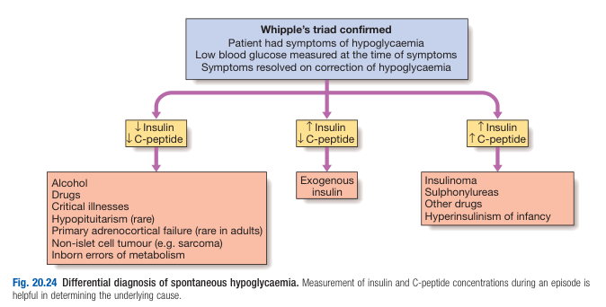
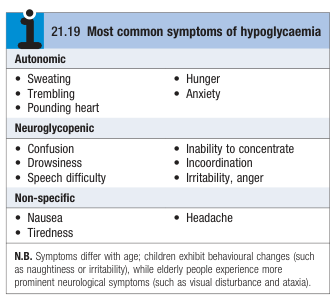
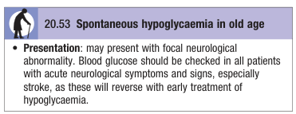

# Spontaneous Hypoglycaemia

- **Definition** - hypoglycaemia (\< 3.0 mmol/L) that occurs spontaneously and not related to treatments of DM (e.g. insulin, sulphonylurea), and results in symptoms
- **Whipple's triad** - triad of features that must be satisfied for consideration of hypoglycaemic disorder (as assymptomatic hypoglycaemia is not unccomon in normal individuals):
    - <u>Sx of hypoglycaemia</u> - patient had non-specific Sx (adrenergic or neuropsychiatric) that **may be attributable to hypoglycaemia**
    - <u>Documented hypoglycaemia</u> - low BG is documented **at time of Sx** (but does not equate to causing the Sx reported)
    - <u>Sx related to the hypoglyceamia</u> - Sx is said to be related to hypoglycaemia if they **resolve on correction of hypoglycaemia**
- **Etiology of hypoglycaemia** - most common is caused by treatments of DM (e.g. insulin, sulphonylurea):
    - **Impaired gluconeogenesis or low hepatic glycogen stores** - low insulin and C-peptides:
        - <u>Substances</u> - drugs and alcohol (depleted glycogen stores due to poor self care)
        - <u>Physiological stress</u> - critical illness (sepsis, liver and renal failure), hypopituitarism (ACTH deficiency), Addison's disease
        - <u>Congenital</u> - inborn errors of metabolism
        - <u>Non-islet cell neoplasias</u> - sarcoma
    - **Exogenous insulin** - high insulin, suppressed C-peptides
    - **Increased endogenous insulin secretion** - high insulin and C-peptides:
        - <u>Drugs</u> - sulphonylurea and other drugs
        - <u>Neoplasia</u> - islet cell tumours (insulinoma)
        - <u>Physiological</u> - hyperinsulinism of infancy

  
  
- **Clinical features of hypoglycaemia** - note atypical manifestations for chronic spontaneous hypoglycaemia due to attenuated autonomic responses and 'hypoglycaemia unawareness', manifesting as odd behaviours or convulsions:
    - <u>Autonomic Sx</u> - tremors, sweating, hunger, anxiety, palpitations
    - <u>Neuroglycopenic Sx</u> - drowsiness, confusion, irritability, anger, inability to concentrate, incoordination, speech difficulties

   
  
- **Salient points of Hx** - work up along the presenting complaint (e.g. confusion, coma, or convulsions):
    - <u>Timing</u>:
        - Sx occur during fasting or following exercise are more likely to represent pathological hypoglycaemia than if Sx occur after food (post-prandial Sx)
        - Sx that is relieved by carbohydrate intake is suggestive of hypoglycaemia
        - Known DM on SU or insulin
        - Prolonged fasting in alcoholics
- **Ix** - may be tricky if presenting in out-patient setting:
    - **Haemstix** - indicated for all drows patients, or those presenting w/confusion, coma or convulsions
    - **Routine bloods** - RBG, insulin, C-peptide, random cortisol, SU levels:
        - <u>RBG</u> - more accurate than H'stix, especially in hypoglycaemic range
        - <u>Insulin and C-peptide</u>:
            - **Low insulin and C-peptide** - suggestive of low insulin resistance (e.g. critical illness, hypopituitarism, addison's disease etc.)
            - **High insulin and low C-peptide** - diagnostic of insulin excess
            - **High insulin and C-peptide** - suggestive of increased insulin release (consider insulinoma)
        - <u>Random cortisol</u> - screen for primary or secondary adrenal insufficiency
        - <u>Sulphonylurea levels</u> - sulphonylurea excess may cause hypoglycaemia
    - **72h fast** (dynamic test) - demonstration of <u>Whipple's triad</u> by 1) inducing symptomatic hypoglycaemia, 2) blood test confirm hypoglycaemia, and 3) Sx corrected by oral or IV glucose (only for patient presenting in-between episodes in outpatient settings, where all other causes of confusion, coma, syncope and convulsions are excluded)
    - +/- **Beta-hydroxybutyrate** - suppressed level confirms inappropriate insulin secretion during fast
    - **Abdominal cross-sectional imaging** (CT, MRI, EUS) - detection of insulinoma (10% malignant w/ potential of liver metastasis)
- **Mx:**
    - **Principles of Mx:**
        - <u>Correct hypoglycaemia</u> - immediate if H'Stix shows hypoglycaemia
        - <u>Dx and Mx of underlying causes</u> - insulinoma Tx as neuroendocrine tumours
        - **Glucose replacement:**
            - <u>IV dextrose</u> - indicated if poor oral intake due to mental obtundation
            - <u>Oral refined carbohydrates</u> - if tolerate oral intake with hepatic glucose reserve
        - **IM glucagon** (1mg) - not effective if depleted glucagon stores (e.g. liver failure, alcohol excess)
