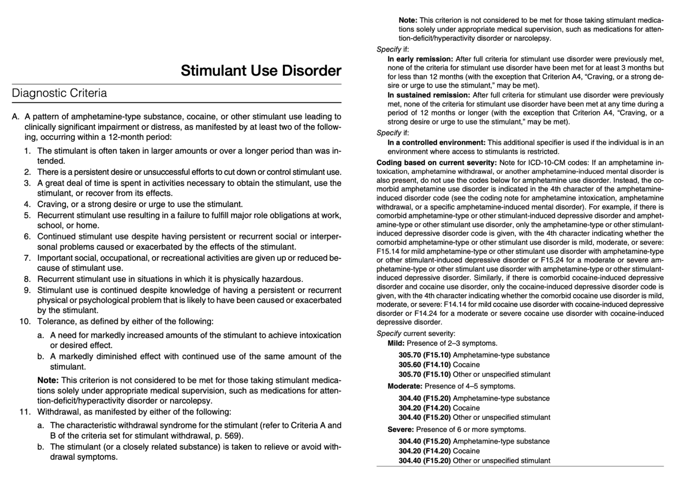
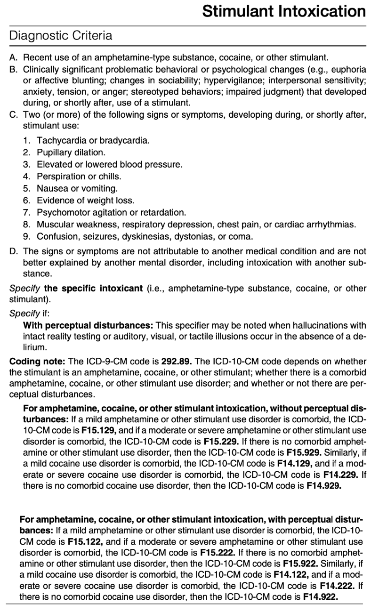
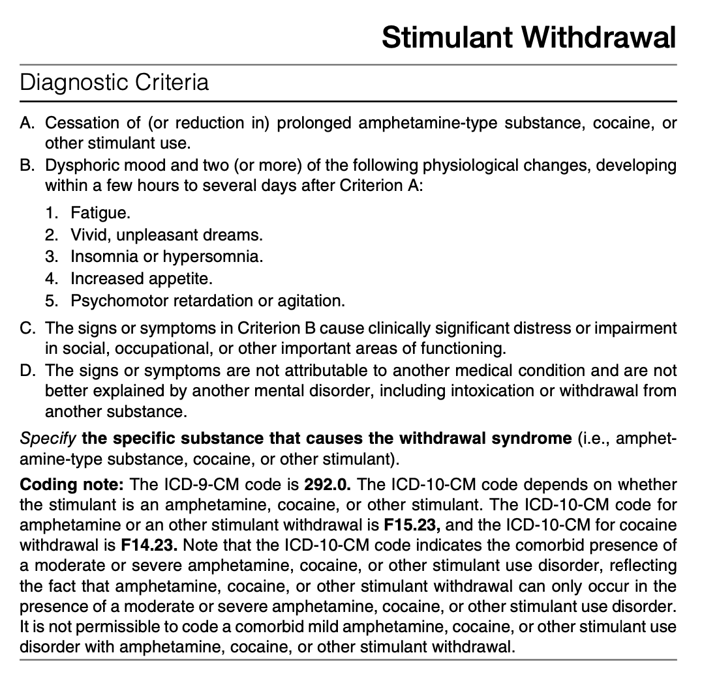

# Stimulant Use Disorder

- **Classes of stimulants:**
    - <u>Amphetamines-type substance</u> (substances w/ a substituted phenyletylamine structure) - amphetamines, dextroamphetamines, methamphetamines (nasal \> IV \> oral), methylphenidate
    - <u>Cocaine</u> - in various preparations (e.g. coca leaves, coca paste, cocaine hydrochloride (usually nasal), cocaine alkaloids (e.g. crack or freebase), differing in potency and speed of onset
    - <u>Other stimulants</u> - other unspecified stimulants
- **Prescription of amphetamine-type substances** - prescription amphetamines may be diverted to illegal markets:
    - Obsesity
    - Attention-deficit/ hyperactivity disorders
    - Narcolepsy
- **Physiological effects of stimulants:**
    - Psychoactive effects - e.g. mood, perception, near-psychotic features, CVS stimulation
    - Sympathomimetic effects - e.g. CVS manifestations
- **Pharmacological effects of stimulants** - extremely prone to stimulant developing stimulant-use disorder esp in as little as 1 week:
    - <u>Rapid development of tolerance</u> - almost always occurs w/ repeated use (most will have **evidence of tolerance**), irrespective of the route of admministration, however some users of amphetamine-type stimulant develop **sensitization**, characterised by enhanced effects w/ similar dose
    - <u>Withdrawal states</u> - withdrawal states is almost always seen in stimulant-use disorder, where characteristic features such as **dysphoriia** (~ 1 week but so intense that mimics MDE), **increased appetite**, and **hypersomnelence**, would **enhance cravings**
- **Duration of action of different stimulants** - may have impact on patterns of use:
    - <u>Amphetamine-type stimulants</u> - longer acting than cocaine, and used fewer times a day
    - <u>Cocaine</u> - shorter acting than amphetamines, and used more times a day
- **Epidemiology:**
    - **Amphetamine-type stimulants:**
        - <u>Prevalence</u> - estimated 12 mo prevalence in the US ~ 0.2%
        - <u>Demographic</u>:
            - Age - highest among 18-29y (0.4%), compared to 45-64y (0.3%) or 12-17y (0.2%)
            - Sex - no sex preponderance (however male preponderance for IV stimulant use \[M:F = 3-4:1\])
            - Race - whites and African Americans (0.3%) compared w/ Asian Americans (0.01%)
    - **Cocaine:**
        - <u>Prevalence</u> - estimated 12 mo prevalence in the US ~ 0.2%
        - <u>Demographic</u>:
            - Age - highest among 18-29y (0.6%), compared to 12-17y (0.2%), or 45-64y (0.1%)
            - Sex - male preponderance (M:F = 4:1)
- **DSM-5 diagnostic criteria of stimulant-use disorders:** 

- **Development and course of stimulant use disorder:**
    - <u>Onset</u> - occurs in all levels of society more commonly seen in 12-25y compared w/ \> 25y
    - <u>First regular use</u> - among individuals in treatment:
        - Reported to an average of ~ 23y for all forms of stimulant
        - Slightly later onset of first regular use of ~ 31y for methamphetamines
    - <u>Pattern of stimulant use</u>:
        - Daily (or almost daily) use, usually a/w increasing dose and frequency over time (tolerance)
        - Episodic use, usually separated by \>= 2 days of non-use, w/ binge using in high doses over hours or days (usually weekends) and only non-use when supplies depleted or exhaustion ensues
    - <u>Route of administration predicts rate of progression of substance use disorders</u>:
        - Intranasal/ IV - rapidly deeloped stimulant use disorder (66% smoking, 18% injecting, 10% snorting), and progression to severe level stimulant use disorder
        - Oral - slower development, and progression to severe level stimulant use disorder
    - <u>Shift from positive reinforcement to negative reinforcement</u> - w/ continued use:
        - Diminution of pleasurable effects due to tolerance
        - Increasing dysphoric effects w/ withdrawal
- **Risk and prognostic factors**
    - <u>Temperamental</u>:
        - Personality traits - e.g. impulsivity, sensation seeking
        - Personality disorders - conduct disorders and antisocial personality disorders predicts later development, where antisocial also predicts higher risk of relapse
        - Other psychiatric comorbidities - bipolar disorders, schizophrenia, polysubstance use
    - <u>Environmental</u>:
        - Parental - perinatal cocaine exposure, parental use of cocaine
        - Chilhood/ Adolescence - unstable home environment, childhood exposure to community violences, associating w/ dealers and users
- **Ix:**
    - **UTOX:**
        - <u>Benzolecgonine</u> - metabolite of cocain remaining in urine for 1-3d after single dose or present for 7-12d for individuals w/ repeated high-doses
        - <u>Amphetamine-type stimulants</u> (MDMA, methamphetamines) - directly detected in urine for 1-3d
    - **Hair samples** - can detect amphetamine-type stimulants for 90d
- **Medical consequences of stimulant use disorders** - dependent on 1) dosage, and 2) route of administration:
    - <u>Consequences of intranasal administration/ smoking</u>:
        - Sinusitis or irritation of nasal mucosa
        - Epistaxis
        - Perforation of nasal septum
        - Coughing/ bronchitis/ pneumonitis
    - <u>Consequences of IV injections</u>:
        - Puncture marks and tracks in forearms a/w abscesses (e.g. groin abscesses)
        - HIV and hepatitis
        - Other sexually-transmitted diseases if a/w unsafe sexual activities
    - <u>Other consequences</u>:
        - Chest pain/ palpitations/ Cardiovascular manifestations - myocardial infarctions, arrhythmias or sudden cardiac death can occur during stimulant intoxication due to syphatominmetic effects
        - Seizures and strokes - have been a/w young and otherwise healthy individuals w/ stimulant use
        - Neurocognitive impairments - common among chronic methamphetamine users
        - Oral health problems ('meth mouth') - dental carries, gum diseases, mouth sores related to toxic effects of smoking and to bruxism while intoxicated
        - Phenothorax - from performing Valsalva-like maneuvers done to better absorb inhaled smoke
        - Traumatic injuries - due to violent behaviours, esp for drug traffickers
        - Obstetrics complications - premature labour and delivery, abruptio placentae, low birth weights
- **Differential diagnosis of stimulant use disorders:**
    - <u>Other mental disorders</u> - due to psychological manifestations during the acute intoxication and withdrawal states
    - <u>Phencyclidine intoxication</u> - similar mixed autonomic and psychoactive features which are distinguished based on urine toxicology
    - <u>Stimulant-induced mental disorders</u> - symptoms predominate clinical presentation and are severe enough to warrant independent clinical attentions
- **Comorbidities of stimulant use disorders:**
    - <u>Other substance use disorders</u> - esp. those w/ sedatpive properties to reduce insomnia, nervousness or other unplessant S/E:
        - Cocaine users often have comorbid alcohol use disorders
        - Amphetamine-type stimulants users often use cannabis
    - <u>Medical comorbidities</u> - cardiopulmonary problems, usually chest pain
- **DSM-5 diagnostic criteria of stimulant intoxication:** 

- **Clinical features of stimulant intoxication:**
    - **Problematic behavioural or psychological changes** - developing during or shortly after use of stimulants but magnitude dependent on 1) dosage, 2) premorbid character, 3) context of use disorder (e.g. tolerance, rate of absorption, chronicity of use, context in which it is taken):
        - <u>Euphoria or 'high'</u> (most common) - an elevation of the pervasive mood states, usually seen in high-dose, but non-chronic use, and use in a relatively safe environment, manifesting as:
            - General Euphoric sensation w/ enhanced vigor
            - Gregariousness, highly talkative
            - Grandiosity
            - Hyperactivity, restlessness, w/ stereotyped and repetitive behaviour
            - Often accompanied w/ evidence of incrased sympathetic tone such as racing pulse and elevated blood pressures
        - <u>Paranoia and agitation</u> - characterised by:
            - Hypervigillence, alertness, and interpersonal sensivity
            - Overall anxiety or tension
            - ?Possibly a/w perceptual disturbances
        - <u>Depressive effect</u> - less common and only emerge during intoxication w/ chronic high-dose use:
            - Psychologically manifest as dysphoria w/ psychomotor retardation
            - Accompanied by physical signs such as bradycarida, decreased BP etc.
    - **Physiological manifestations:**
        - <u>Effects of autonomic instability</u>:
            - CVS - tachycardia/ bradycardia, HTN/ hypotension, chest pain, palpitations, or cardiac arrhythmias
            - Others - pupillary dilatation, perspiration or chills, hyperthermia N/V, evidence of weight loss
        - <u>Effects of CNS stimulation</u>:
            - Dystonia, or seizures
            - Confusion or coma
            - Psychomotor agitation or retardation
        - <u>Other features</u>:
            - Muscle weakness
            - Respiratory manifestations
- **DDx of stimulant intoxication:**
    - <u>Stimulant-induced disorder</u> - based on whether these features predominate the clinical feature and warrant independent attention
    - <u>Other mental disorders</u> - other mental disturbances identified as per DSM-5 criteria
- **DSM-5 diagnostic criteria of stimulant withdrawal:** 

- **Clinical features of stimulant withdrawal** - developing within few hours to days after cessation or reduction in prolonged stimulant use (usually high-doses):
    - **Dysphoric mood** (Criterion B) - often bordering on intense depressive symptomatology:
        - <u>Quality</u> - described as a "crash" from the initially euphoric intoxication state:
            - An intense, unpleasant feeling of depression
            - Ocassionally described as lassitude
        - <u>Depressive features</u>:
            - **Anhedonia** often present but are not part of diagnostic criteria, but accounts for clinically significant distress, or impairment in social, occupational, or other important areas of functioning
            - **Biological symptoms**, especially sleep disturbances, such as **hypersomnia** or ocassionally insomnia, but decreased appeitite never seen due to physiological effects
            - **Negative cognition** often prominent, where major problem being the genesis of **suicidal ideations and behaviours**
        - <u>Duration</u>:
            - Usually brief and does not meet the duration criteria of MDE, requiring few days to 1 week of rest and recuperation
            - Very rarely persistent and meets the symptomatology and duration criteria of MDE
    - **Physiological changes** - opposite of the stimulant effects (2/5):
        - Fatigue
        - Vivid, unpleasant dreams
        - Hypersomnia and insomnia
        - Increased appetite
        - Psychomotor retardation or agitation
    - **Other features:**
        - Bradycardia - not part of the diagnostic criteria but often present, and is a reliable measure of stimulant withdrawal
        - Drug cravings - often present, w/ Sx attributing to the withdrawal effects
- **DDx of stimulant withdrawal:**
    - <u>Stimulant-induced disorders</u> - e.g. stimulant induced intoxication delirium, depressive disorders, bipolar disorders, psychotic disorders, sleep disorders, anxiety disorders
