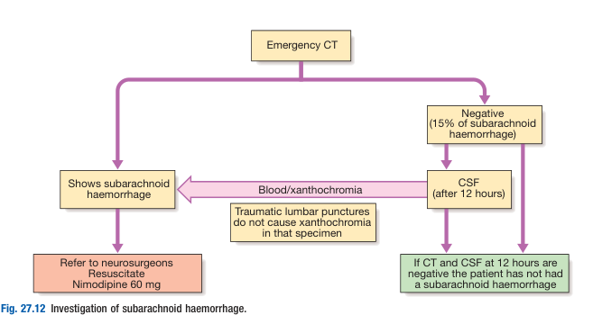

# Subarachnoid Haemorrhage

- **Definition** - haemorrhage into subarachnoid space, which is usually traumatic, but can be spontaneous
- **Epidemiology** - less common than ISS and ICH, but pertains a much greater mortality:
    - <u>Incidence</u> - 6/100000/y
    - <u>Demographic</u> - typically present \< 65y, F \> M
    - <u>Mortality</u> - 30% immediate mortality for aneurysmal SAH
    - <u>Risk of recurrence</u> - 40% in first 4 weeks, and 3% annually thereafter
- **Etiology of SAH** - most are traumatic:
    - **Saccular aneurysms** (85%) - occurs at bifurcation of cerebral arteries mostly in circle of Willis:
        - Anterior communicating artery (ACoA) - 30%
        - Posterior communicating artery (PCoA) - 25%
        - Middle cerebral artery (MCA) - 20%
    - **Other aneurysms** - e.g. mycotic aneurysm
    - **Non-aneurysmal haemorrhage** - e.g. AVMs, vertebral artery dissection, drug abuse
- **Saccular aneurysms:**
    - <u>Clinical association</u>:
        - Polycystic kidney disease
        - Connective tissue defects - e.g. Ehlers-Danlos syndrome
- **Clinical features of SAH** - acute onset of severe headache described as the "worst headache of my life":
    - **Headache** - also referred as "thunderclap headache", sudden onset, severe headache described as the "worst headache of my life":
        - <u>Site</u> - classically felt in occipital region, but is not of use as can be <u>localised or generalised</u>
        - <u>Onset</u> - classically sudden onset to maximal intensity (however do not r/o based on description deviating from classical teaching as highly dependent on patient percept)
        - <u>Progression</u> - typically pain to maximal intensity, w/ progression of other Sx (e.g. meningism, consciousness), developing over time
        - <u>Quality</u> - explosive and un-expected (like a clap of thunder)
        - <u>Severity</u> - extremely severe
        - <u>Timing</u> - unexpected, although classically associated w/ physical exertion, Valsalva maneuver, or intercourse
    - **Nausea and vomiting** (75%) - often a marked complaint, w/ projectile vomiting as a result raised ICP
    - **Neck pain and meningism** (61%) - onset of neck pain, photophobia may suddenly develop <u>several hours after the headache</u>, as a result of breakdown of blood products within the subarachnoid space resulting in **aseptic meningitis**
    - **Altered states of consciousness** - transient loss of consciousness may occur, and subsequent decreased GC and sensorium is often observed as a result of raised ICP, although coma is unusual
    - **Seizure** (\< 10%) - may occur as a result of acute brain injury, and is an independent predictor of poor-outcome
- **Signs of SAH:**
    - **Assessment of conscioussness** - assessed by GCS/ AVPU score
    - **Assessment for meningism** - Kernig's sign, Brudzinski sign
    - **Neurological examination:**
        - <u>Surgical 3rd nerve palsy</u> - ptosis w/ fixed dilated pupils sparing EOM usually associated w/ an expanding, unruptured PCoA aneurysm comperssing to where CN III exits the brain stem
        - <u>Focal neurological S/S</u> - any neurological sign may be present depending on site of haemorrhage (or ischaemia)
        - <u>Subyaloid haemorrhage on fundoscopy</u> (rare) - blood tracking along subarachnoid space around optic nerve
    - **BP measurement** - typically raised (risk factor, but also a compensatory mechanism to main CPP)
- **Clinical suspicion of SAH** - <u>Ottawa Subarachnoid Haemorrhage Rule</u> suggests in neurologically intact patients w/ acute non-traumatic headache, presence of any of the following features has a pooled Sn of 100% and Sp of 15% for SAH:
    - Characteristic thunderclap headache (approximately 1 in 8 patient presenting w/ sudden severe headache have SAH)
    - Onset at exertion
    - Witnessed lost of consciousness (considered in all patients presenting unconscious)
    - Limited neck flexion on examination
    - Neck pain or stiffness
    - Age \>= 40y
- **Assessment of severity** - multiple grading system but general principles are that <u>assessment at nadir or after neurological resuscitation</u> is more predictive of outcome:
    - **Hunt and Hess Grading System:** 
    
    - **World Federation of Neurological Surgeons** (WFNS): 
    
- **Ix and Dx approach to suspected SAH:**
    - <u>Urgent NCCT brain</u> - may reveal findings diagnostic of SAH (normal CT does not r/o SAH)
    - <u>LP</u> - if NCCT brain non-diagnostic to r/o SAH
    - <u>CT/MR Angiography</u> - to localise the source of bleeding if initial Ix +ve

  
  
- **Ix:**
    - **Non-contrast CT brain** - urgent CT for all w/ characteristic headaches:
        - <u>Test properties</u> - time-dependent and size-dependent:
            - Up to 100% Sn if evaluated within first 6h of SAH
            - Progressive declines over time (58 percent at 5d) due to physiological lysis of RBCs and clearance from CSF
            - Sn also affected by low-volume bleeds
        - <u>Findings of SAH</u> - although distribution of blood is poor predictor of source of bleeding:
            - Hyperdense lesions in the basal cisterns (diagnostic finding), ocassionally in the sylvian fissures, interhemispheric fissures, and other areas
            - Intracerebral extension of haemorrhage (20-40%)
            - Intraventricular blood (15-35%)

      
      
    - **Lumbar puncture** - to exclude SAH for patient w/ normal head CT:
        - **Timing** - 12h after onset
        - **Findings:**
            - <u>Appearence</u> - presence of blood or xanthochromasia that is persistent during collection (from tube 1 to tube 4)
            - <u>RBC</u> - presence of RBC in CSF, with inadequate clearing of blood (i.e. persistent RBC counts in successive collection tubes) but does not r/o a traumatic tap
            - <u>Xanthochromasia</u> - pink or yellow tinge due to presence of bilirubin (detected visually or by spectrophotometry)
    - **Angiography** - CT/ MR angiography (or DSA) to identify the source of aneurysmal bleeding
- **Acute complications of SAH** - medical and neurological complications are common after SAH and contribute substantially to morbidity and mortality:
    - **Rebleeding** - up to 4-14% risk of early rebleeding in first 24h, often manifestating as an acute deterioration of neurological status (w/ evidence of haemorrhage on repeat CT), and can only be addressed by aneurysmal treatment
    - **Vasospasm and delayed cerebral ischaemia** - occurs in up to 30% of patients w/ aneurysmal SAH with peak incidence on D7-8 after SAH; attributes to significant proportion of morbidity and mortality
    - **Elevated ICP** - often an acute complication as a result of haemorrhage volume, or acute hydrocephalus often suspected on acute neurological deterioration:
        - <u>Haemorrhagic volume</u> - due to local mass effect
        - <u>Hydrocephalus</u> - often due to 1) obstruction of CSF flow by blood products (i.e. non-communicating hydrocephalus), or 2) reduced reabsorption of CSF due to adhesions (i.e. communicating hydrocephalus)
    - **Hyponatraemia** - may occur as a result of 1) SIADH (euvolaemic) or 2) cerebral salt wasting syndrome (hypovolaemic)
    - **Seizures** - presents in 8-15% of patients w/ SAH and may require ASM (usually levatiracetam)
    - **Anaemia** - 18% of those w/ SAH, although a restrictive transfusion strategy is still pursued
    - **Cardiopulmonary complications** - ECG abnormalities, LV dysfunction possibly due to HF or MI
    - **Ventilator-associated pneumonia** - for patients requiring initial ET intubation (may require prophylactic ABx)
    - **Other complications** - e.g. DVT, pressure sores, stress hyperglycaemia, fever, hypothalamic-pituitary dysfunction
- **Mx:**
    - **Principles of Mx** - unable to reverse initial injury, but targeted at preventing recurrence, secondary injury, or systemic complications:
        - <u>General measures</u> - Primary assessment, general care, neurological monitoring, antithrombocic reversal, BP control, ICP control, fluid balance, vasospasm prevention, seizure prophylaxis
        - <u>Prevention of early and late rebleeding</u> - neurosurcial interventions through aneurysm repair or Mx of AVM
        - <u>Monitoring and Mx of acute complications</u>:
            - 1\. Vasospasm and delayed cerebral perfusion
            - 2\. Aucte hydrocephalus
            - 3\. Hyponatraemia (SIADH or CSWS)
            - 4\. Seizures
            - 5\. Other medical complications (e.g. DVT, chest infections, pressure sores)
    - **BP control** - optimal therapy of HTN in SAH unclear but in general permissive HTN is allowed to maintain cerebral perfusion pressure:
        - **Rationale** - balance between rebleeding risk and risk of infarction:
            - Gradual reduction of severely elevated BP may decrease a risk of bleeding
            - Reduction of BP may result in reduction of CPP, resulting in higher incidence of infarction
        - **Indications for BP lowering** - dependent on whether there is ICP measurement:
            - In absence of ICP measurement, anti-HTN indicated in a patient w/ severe HTN (SBP \> 180 mmHg, MAP \> 120 mmHg) if retained GC to SBP \< 160 mmHg, MAP \< 110 mmHg
            - In presence of ICP measurement, target CPP of 70 mmHg
    - **Neurosurgical monitoring:**
        - <u>Frequent neurological examination</u> (q1-2h) - assessment of GC, new focal neurological deficits to identify patients w/ rebleeding, cerebral infarction or hydrocephalus
        - <u>Transcranial doppler</u> (TCD) - monitoring and detecting for vasospasm in setting of SAH, evident by **velocit changes** that precede clinical sequelae of vasospasms
        - <u>Continuous EEG</u> - to detect subclinical seizures or non-convulsive status epilepticus, especially for patients w/ poor-grade SAH who develop unexplained neurological deterioration or fail to improve
    - **Nimodipine** - vasospasm prevention:
        - <u>MOA</u> - CCB:
            - Vasodilatory effects on cerebral vessels to combat post-SAH vasospasm
            - Prevents morbidity and mortality attributed to acute or delayed cerebral ischaemia
        - <u>Dosing and regimen</u> - PO/ enteral Nimodipine 60 mg q4h starting within 48h of Sx onset for 21d (never given IV due to A/E)
        - <u>Clinical efficacy</u> - multiple meta-analyses have demonstrated **effiacy of prophylactic nimlodopine in improving patient outcome**:
            - Lower overal mortality (OR 0.73 \[95% CI 0.53-1.00\])
            - Reduced rate of delayed cerebral ischaemia (OR 0.53 \[95% CI 0.39-0.72\])
            - However, no convincing evidence that nimodipine actually reduces incidence of angiographic-detected vasospasms, such that it is postulated that it improves outcomes by additional MOA (e.g. reduced Ca-mediated excitotoxicity)
        - <u>S/E</u>:
            - Hypotension (BP monitoring is essential to avoid hypotension, as it results in reduced CPP and paradoxical cerebral ischaemia)
    - **Neurosurgical approach to prevention of recurrence** - e.g. obliteration of aneurysm, Mx of AVMs etc:
        - **Obliteration of cerebral aneurysms** - aim at complete obliteration to prevent re-rupture as soon as feasible:
            - <u>Modalities</u> - coiling preferred as fever perioperative Cx and better outcomes:
                - Surgical - Microsurgical clipping
                - Endovascular interventions - e.g. embolisation, coiling, and flow diverters
        - **Mx of AVMs** - e.g. ligation of feeders, injection sclerotherapy into fistula or draining veins
    - **Obstructive hydrocephalus** - required CSF shunting by EVD
    - **Mx of other complications** - e.g. seizures, chest infections, pressure sores, DVT
