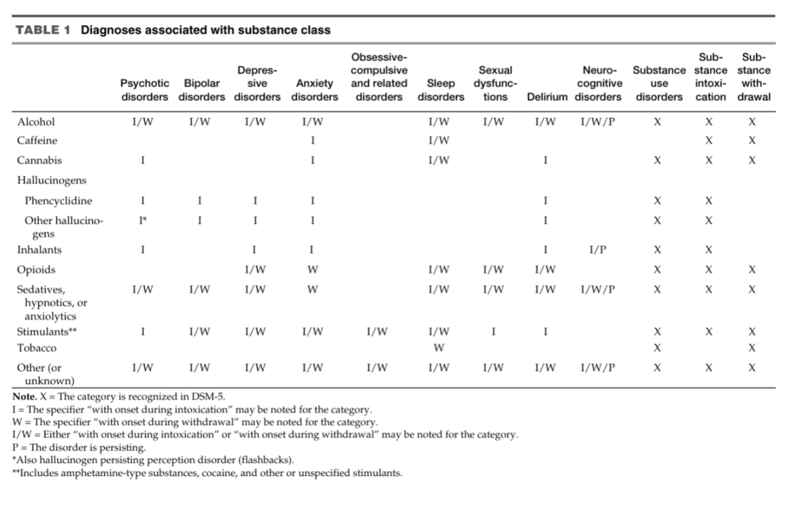
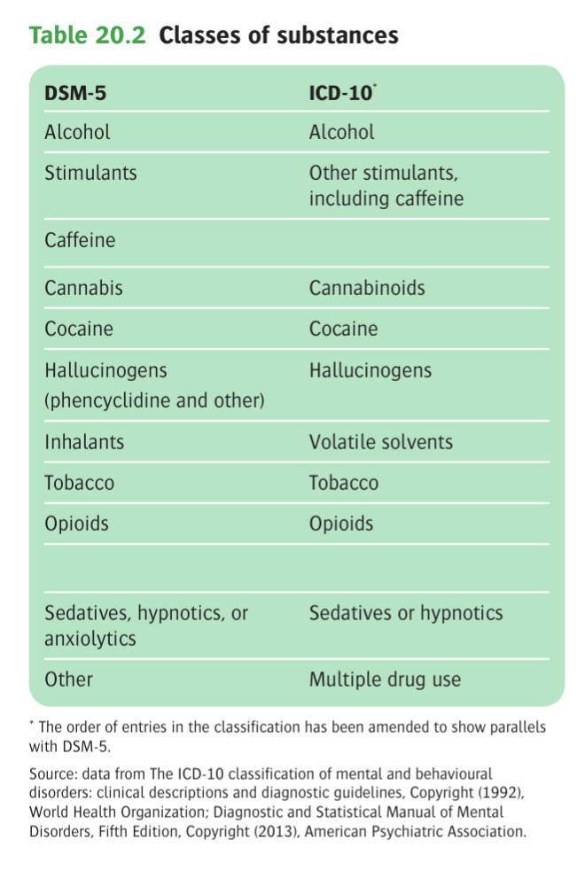
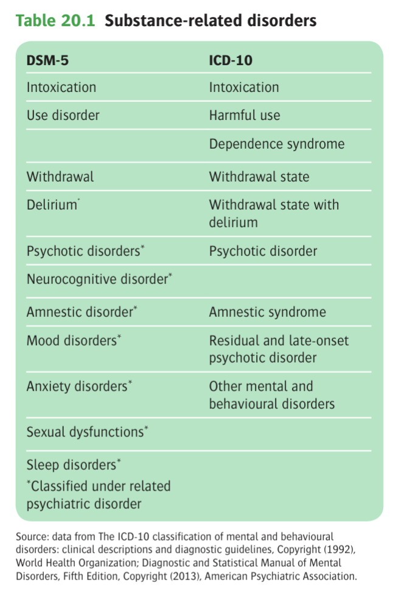
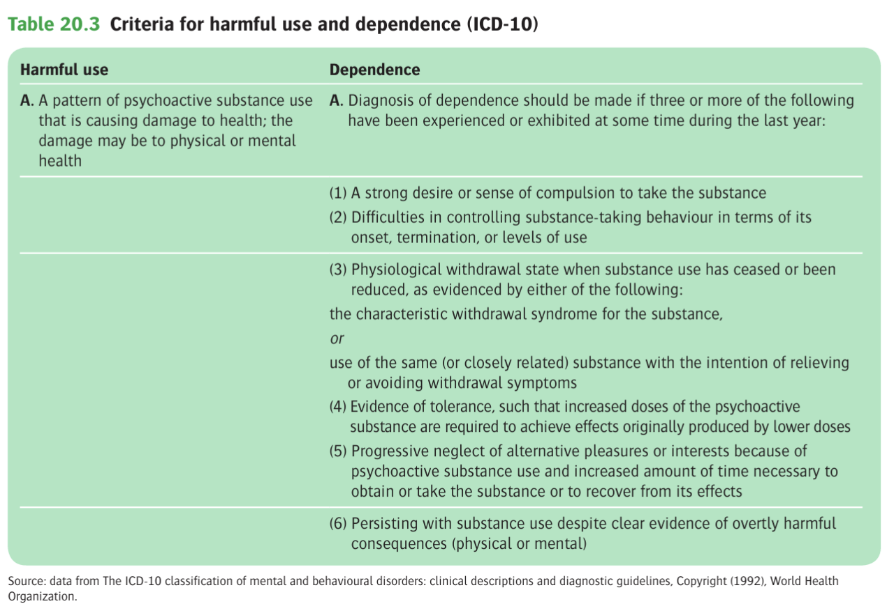
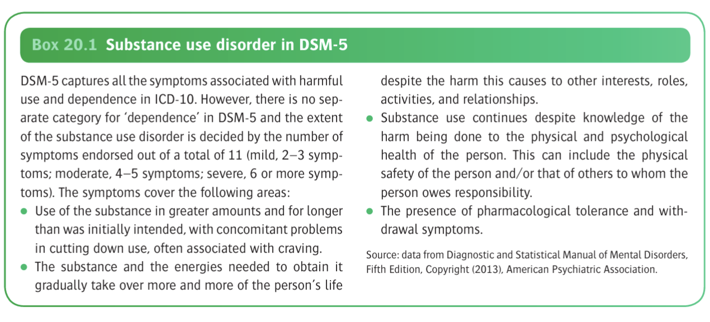
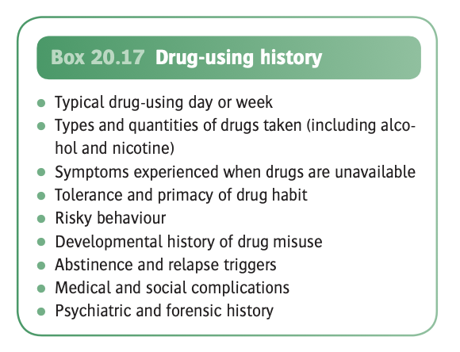
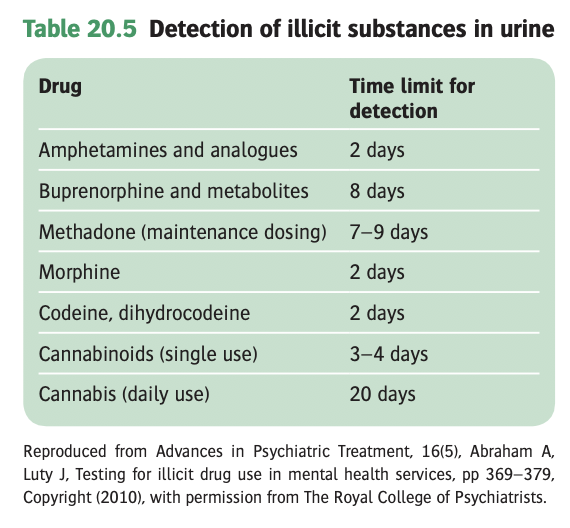
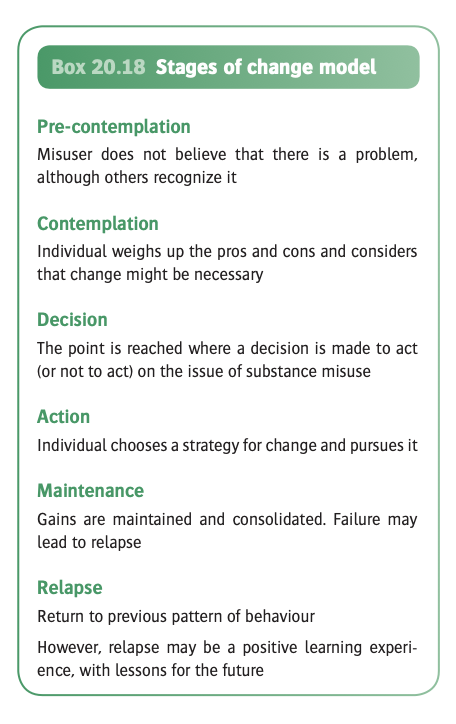

# Substance-Related Disorders

- **Definition and terminology** - conditions arising from the use of alcohol, psychoactive drugs, or other chemicals such as volatile substances, termed:
    - Substance use disorders in DSM-5
    - Disorders due to psychoactive drug use in ICD-10
- **DSM-5 and ICD-10 use broadly similar categories for substance-related disorders but group them in different ways:**
    - In both schemes, the primary diagnostic category involves specifying the substance or class of substance that is involved
    - Both schemes recognises states of 1) intoxification, and 2) withdrawal
    - DSM-5 only has single category of 'use disorder' ranging from a continuum from mild to severe based on the number of features, including the state of 'drug dependence'
    - ICD-10/11 has separate categories for 'harmful use' and 'dependence'
    - ICD-10/11 also recognises amnesic states or psychotic states under the broader category of substance use disorders; while the DSM-5 also recognises these entities, they are grouped under psychiatric disorders with which they share the same phenomenology
    - ICD-10 also recognises a specific category, 'residual and late-onset psychotic disorder', which describes physiological or psychological changes that occur when a drug is taken but then persists beyond the period during which a direct effect of the substance would reasonably be expected to operate (e.g. '<u>hallucinogen-induced flashbacks</u>', '<u>alcohol-related dementia</u>')
- **Limitations of the primary diagnostic category** - classification becomes difficult when:
    - The culprit substance is not reported or otherwise unknown
    - Use is chaotic and indiscriminate, where the culprit cannot be pinpoint
    - When the clinical manifestation is non-specific (in principle, the any manifestation can be attached to the drug, although in practice, certail disorders do not develop w/ individual drugs \[e.g. withdrawal rare w/ hallucinogens\])
- **Classes of substances in substance use disorder** - 10 separate classes of drugs determining intoxication, withdrawal features and different psychological manifestations:
    - Alcohol
    - Caffeine
    - Cannabis
    - Hallucinogens (w/ separation for phenycyclidine \[or similarly acting arylcyclohexylamines\] and other hallucinogens)
    - Inhalants
    - Opioids
    - Sedatives, hypnotics, and anxiolytics
    - Stimulants (amphetamine-type substances, cocaine, and other stimulants)
    - Tobacco
    - Other or unknown substances
	   
	  
- **Common features of the 10 classes of substances:**
    - Direct activation of the brain reward system, which is involved in reinforcement of behaviours and the production of memories; intense activation of such reward system may result in neglect in normal activities
    - Pharmacological mechanisms in triggering the reward system may differ, but the endpoint of activating such system is a feeling of pleasure, or high
- **Classification of substance-related disorders:**
    - Substance use disorders
    - Substance-induced disorders (intoxication, withdrawal, and other substance/ medication-induced mental disorders \[psychotic disorders, bipolar and related disorders, depressive disorders, anxiety, obsessive compulsive and related disorders, sleep disorders, sexual dysfunction, delirium neurocognitive disorders\])

	  
	  
- **Other important terminologies:**
    - **Definition of tolerance and withdrawal:**
        - <u>Tolerance</u> - a state that appears after repeated administration, where the same dose of drug produces a decreased effect, or increasing doses are required to produce the same effect (think altered pharmacodynamics possibly at the receptor level)
        - <u>Withdrawal states</u> - constellation of S/S that occur when a drug is reduced in amount or withdrawn, lasting for a limited time, and the nature of the experience is dependent on the substance use (N.B. allowing for cross-tolerance e.g. benzodiazepines used in alcohol withdrawal)
    - **Definition of intoxication** - represented as a <u>transient syndrome</u> due to recent substance ingestion that produces a clinically significant <u>psychological or physical impairment</u>, which varies w/ the drug AND the individual
    - **Definition of use disorder, harmful use, and dependence syndromes** - use disorders in DSM-5 encapsulates the spectrum of disorders in ICD-10:
        - <u>Use disorders</u> - terminology used in ICD-10 encapsulating the spectrum of mal-adaptive pattern of substance use in the broadest sense
        - <u>Harmful use</u> - a pattern of psychoactive substance use that is causing damage to physical or mental health
        - <u>Dependence</u> - the experience of 'pharmacological tolerance', 'withdrawal', a sense of compulsion to take the substances, and 'neglect of alternative goals and interests'
			 
			
    - **Seven features of dependence** - 6 + 1 (functional impairment):
        - <u>Difficulty of control</u> - inability to control start, stop, and amount of substances, resulting in taking in large amounts for time longer than intended (w/ prior unsuccessful attempts at cutting down)
        - <u>Craving</u> - strong desire or urge to use the substance
        - <u>Primacy</u> - great deal of time spent in activities to obtain, use, and recover from the substance, where there is neglect of alternative interests
        - <u>Persistence despite harmful effects</u> - use in which physically hazardous, or w/ knowledge where persistent or recurrent physical or psychological problems that is likely to have been caused or exacerbated by the stimulant
        - <u>Tolerance</u> - increasing amounts to achieve the desired effect, or markedly deminished effect when continued use of the same amount of the drug
        - <u>Withdrawal</u> - S/S that arises from a fall in the blood levels of the substance
        - <u>Functional impairment</u> - recurrent social or interpersonal problems, or failure to fulfill major roles and obligations at work, school, or home
- **Epidemiology** - higher rates of drug use but includes those that are not classified as "misuse":
    - <u>Prevalence</u> - a survey in the USA showed 1 mo prevalence of ~ 8.7% in \>= 12y; a survey in the UK showed 1y prevalence of ~ 9.2% in adults
    - <u>Demographic</u> - unemployed people 16-25y:
        - Age - common in younger people (M 25-34y \[28.9%\], F 16-24y \[21.9%\])
        - Sex - M \> F
        - Race - variable depending on sex
    - <u>Most common drug suse</u> - cannabis
- **Principles of diagnosis of substance-reated related disorders:**
    - Some criteria sets of substance use disorder, substance intoxication and withdrawal, and other substance/ medication-induced mental disorders are generalisable to all substance-related disorders
    - Some unique aspects dependent on the pharmacological properties of such substances
- **Substance use disorders** - reflects a spectrum of disorders from mild harmful use to severe dependence:
    - **General features of substance use disoders** - essential feature is a cluster of cognitive, behavioral, and physiological symptoms iindicating individuals continued use of substance despite significant problems:
        - **Impaired control** (A1-4):
            - <u>Extended use</u> - take the substance in larger amounts and for a longer duration than was originally intended
            - <u>A desire to cut down</u> - expresses a desire to cut down or regulate substance use, and may report multiple unsuccessful attempts to decrease or discontinue use
            - <u>Time-consuming</u> - spending a great deal of time obtaining the substance, using the substance or recovering from its effects
            - <u>Craving</u> - an intense desire or urge for the drug occuring at any time, but likely in an environment where the drug had previously been obtained and used
        - **Social impairment** (A5-7) - in addition to social and occupational impairments, patient appears more withdrawn from family and life in general in order to use the substance:
            - <u>Social and occupational impairments</u> - failure to fulfill major role obligations at work, school, or home
            - <u>Intepersonal problems excacerbated by susbtance use</u> - continued use despite causing problems w/ social and interpersonal relationships
            - <u>Primacy</u> - priority over normal activities, giving up or reducing other important social, occupational, or recreational activities
        - **Risky use** (A8-9):
            - <u>Use in hazardous conditions</u> - e.g. driving under the influence
            - <u>Use has already csused physical or psychological problems</u> - especially when admitted to have likely been exacerbated by the substance (N.B. key issue in evaluating this criterion is not the existence of the problem, but rather the individual's failure to abstain despite the difficulty it is causing)
        - **Pharmacological criteria** (A10-11):
            - <u>Tolerance</u> - markedly increased dose to achive the same desired effect or a markedly reduced effect when the usual dose to attain (e.g. variable in terms of the individual, across the substances, or different effects of the same substances), which is complemented objectively by laboratory results (e.g. exceedingly high levels in blood/ urine despite minimal intoxication features)
            - <u>Withdrawal</u> - syndrome that occurs when blood or tissue concentration of substance declines after an individual has maintained prolonged heavy use of it, depedent on the physiological action of drugs and hence different crteria is used for different substance classes
    - **Differentiating features based on substance classes** - not all symptoms apply:
        - e.g. Withdrawal symptoms are not specified for 1) phencyclidine use disorder, other hallucinogen use disorder, or inhalent use disorder
        - Withdrawal symptoms are often not prominant for stimulants, as well as cannabis and tobacco
        - Withdrawal symptoms are more prominent w/ alcohol, opioids, sedatives, hypnotics, and anxiolytics
    - **Severity** - from mild-to-severe based on number of symptoms endorsed:
        - Mild - presence of 2-3 symptoms
        - Moderate - presence of 4-5 symptoms
        - Severe - presnece of \> 6 symptoms
    - **Additional specifiers:**
        - In early remission
        - In sustained remission
        - On maintenance therapy
        - In a controlled environment
- **Substance intoxication** - problematic changes as a result of increased level of substance in the blood or tissue:
    - **Physiological intoxication** - when intoxication is used in a physiological sense, it pertains a much broader definition:
        - Physiological intoxication refers simply to changes in physiological and psychologicla functioning, which are <u>not necessarily problematic</u>
        - e.g. An individual that develop tachycardia only as a result of the physiological effects of the substance, but a diagnosis of intoxication cannot be applied if it is the only symptom and does not account for the change in behaviour
    - **DSM-5 diagnostic criteria of substance intoxication:**
        - Development of a reversible substance-specific syndrome due to ingesetion of a substance (Criterion A)
        - The clinically significant problematic behavioral or psychological changes associated with the intoxication (e.g. belligerence, mood lability, impaired judgement) are attributable to the physiological effects on the CNS, and develop during or shortly after the use of the substance (Crtierion B)
        - The substance-specific syndrome causes clinically significant distress or impairment of social, occupationa, or other important areas of functioning (Criterion C)
        - The symptoms are not attributable to another medical condition and are not better explained by another mental disorder (Criterion D)
    - **Features of intoxication:**
        - Dependent on the physiological effects of the substance and criteria are subsequently defined in substance-specific sections
        - Common changes include disturbances of perception, wakefulness, attention, thinking, judgement, psychomotor behavior, and interpersonal behavior
        - S/S may be dependent on the chronicity of the substance use, e.g. acute cocaine use produces gregariousness while chronic use may result in social withdrawal
        - Symptoms may ocassionally persist beyond the time in which the substance is detectable in the body, possibly due to enduring CNS effects which take a longer time for recovery
- **Substance withdrawal** - substance-induced syndrome that occurs w/ a decline of blood or tissue concentration of the culprit substance:
    - **DSM-5 diagnostic criteria of substance withdrawal:**
        - Development of a substance-specific <u>problematic behavioral change</u>, with <u>physiological and cognitive concomitants</u>, that is due to cessation of, or reduction in heavy and prolonged substance use (Criterion A)
        - The substance-specific syndrome causes clinically significant distress or impairment in social, occupational, or other important areas of functioning (Criterion C)
        - The symptoms are not due to another medical condition and are not better explained by another mental disorder (Criterion D)
    - **Route of administration and speed of substance effects** - faster absorption into blood stream tends to result in 1) more immediate intoxication, 2) more intense intoxication, and 3) increased likelihood of escalating pattern of substance use leading to withdrawal
    - **Duration of effects** - half-life of substances parallels with aspects of withdrawal:
        - Shorter-acting agents have higher potential for withdrawal than longer-acting agents
        - Longer-acting agents produce more prolonged withdrawal than shorter-acting agents
        - Longer-acting agents generally have a longer interval between cessation and the onset of withdrawal symptoms
    - **Use of multiple substances:**
        - Presentation of intoxication and withdrawal often involves several substances used simultaneously or sequentially
        - The likely culprit agent for current episode depends on the degree of dependence of each drug, the dose used, and the symptomatology
        - Each diagnosis should be recorded separately
    - **Associated laboratory findings** - blood and urine samples can help determine recent use and specific substances use:
        - Presence of +ve laboratory test does not indicate pattern of substance use that meets the Dx criteria of substance-use disorder or substance-induced disorder
        - A -ve laboratory test itself does not by itself r/o the Dx
        - Useful in identifying the culprit agent when individuals present w/ withdrawal from an unknown substance
        - Normal functioning in presence of high blood levels of substance suggests considerable tolerance
    - **Development and course:**
        - Substance-related disorders can present at any age, but relatively higher prevalence rates in virtually every substances in 18-24y
        - Intoxication is the usual initial presentation and begins in teens
        - Withdrawal can occur at any age as long as the relevant drug has been taken in sufficient doses over an extended period of time
- **Other substance-unrelated addiction disorder** - included in this chapter because similar effects on reward systems:
    - Gambling disorders
    - Behavioural addictions (e.g. internet gaming, sex addiction, exercise addiction, shopping addiction)
- **Causes of drug misuse** - no single cause, but generally argued that four factors are important:
    - Availability of drugs
    - A vulnerable personality
    - An adverse social environment
    - Pharmacological factors
- **Availability of drugs** - in fact illicit drugs are generally widely available:
    - Drugs can obtained in <u>three main ways</u>:
        - Legally w/o prescription (nicotine, and alcohol)
        - Prescription from doctors (benzodiazepines, gabapentin, opioids)
        - From illicit sources ('street drugs')
    - A young person who occasionally use the drug <u>can no longer be an abnormal behaviour</u>
    - However, issues stems from that <u>~10%</u> of those who experience w/ drugs will go on to develop substance-related disorders (Robson 2009)
    - Whether substance misuse and dependence will arise in an individual who experiments with drugs likely dependent on 1) personal, 2) social, and 3) pharmacological factors (i.e. other causes of drug misuse)
- **Personal factors** (i.e. a vulnerable personality):
    - <u>Personality traits</u> - sensation seeking, impulsivity
    - <u>Associated life events</u> - disrupted families from young age, a/w depression or anxiety
    - <u>Associated behaviours</u> - poor school record, truancy, deliquency
- **Social environment** - generally risk of drug misuse is greater in societies that condone drug use of one kind or another:
    - <u>Social pressures</u> - to achieve status, influenced by peers or even paraents
    - <u>Social deprivation</u> (Gill et al 1996) - homelessness (esp high prevalence of dependence but can be cause or effect), umemployment
- **Pharmacological factors** - principally serving as "<u>positive reinforcers</u>" because causing positive subjective experiences:
    - **Neurobiological mechanisms explaining change from use to misuse:**
        - <u>Activation of midbrain dopamine system</u> - increased dopamine release from ventral striatum projecting to forebrain, esp. w/ stimulants and alcohol, triggering a **physiological reward**
        - <u>Lessening of prefrontal 'reflective' processes</u> - in some sense underepins use of drugs despite "illogical circumstances", where drug use hijacks executive behaviour to almost exclusively serve the needs of drug habits
        - <u>Learning and conditioning factors</u> - lower levels of dopamine receptors in midbrain (a/w novelty seeking) results in attributing salience to drug-related cues
    - **Neurobiological mechanisms explaining principles of tolerance and dependence:**
        - <u>Adaptive changes in sensitivity of receptors</u> - accounts for tolerance, but also withdrawal (e.g. noradrenaline autoreceptor agonists for opioid withdrawal), w/ also significance of cross-tolerance between different agents
        - <u>Negative reinforcement</u> - withdrawal symptoms prevented by taking more of the drug, completing the transition from impulsive to compulsive use
        - <u>Reinstatement effect</u> - a sudden intense desire to consume the drug months after withdrawal syndrom, that a single exposure during this perioid may lead to full relapse
- **Importance of early diagnosis of drug misuse:**
    - Dependence is likely less established
    - Behavioural patterns is less fixed
    - Complications of intravenous use may not have developed
- **The nature of clinical presentation of people who misuse drugs:**
    - <u>Deceiving</u> - unusual position of trying to help a patient who may be attempting to deceive you (e.g. overstating daily dose of heroin to obtain extra supplies for sales, methedone reselling)
    - <u>Concealment/ evasiveness</u> - e.g. under-reporting usage of each drugs, and the phenomenon of polysubstance use; corroborate patient's accounts by detailed questions to check internal consistency (e.g. underreporting of amount may not correlate w/ financial difficulties)
- **Medical presentations:**
    - <u>Presentation w/ dependency</u> - declaring dependence on drugs and wishes to abstain
    - <u>Concealment of dependency w/ aims of obtaining more drugs</u>:
        - Complaining of insomnia/ anxiety to obtain hypnotics
        - Complaining of severe pain (e.g. renal colic, dysmenorrhoea) to obtain
    - <u>Presentation w/ other drug-related complications</u>:
        - Infections - cellulitis, pneumonia, hepatitis
        - Accidents - e.g. from hazardous use (e.g. driving on substances w/ sedative properties)
        - Disorganised behaviour/ psychological changes - acute presentation w/ features of intoxication or withdrawal
- **Salient points of Hx in a SA case** - narrative approch w/ 5 established time points for each substances:
    - **First encounter**:
        - Clarify first ever substance use, not just for the current drug
        - Screen for polysubstance uses, however usually a predominant substances
        - Motive for substance use in initial stage
    - **Daily use** - usually the time point where harmful use/ dependence, clarifying **dependence features**:
        - Characterise the <u>duration from first encounter to daily use</u>; rapid progression suggests relatively heavier use
        - Characterise <u>cravings and difficulty to control</u>, particularly escalation of frequency and amounts of use, and whether feeling uncomfortable after long time no use
        - Characterise <u>primacy</u>, through time spent in aquiring, using, and recovery frome effects of drugs, and whether give up social, occupational activities etc.
        - Characterise <u>persistence for harmful use</u>, particularly physical damage, broken relationships, financial difficulties
        - Characterise <u>tolerance</u>, particularly through 1) an unsatisfactory effects with the same dose, and 2) route of administration
        - Characterise <u>withdrawal and methods to dealing w/ withdrawal</u>, consider cross-tolerance and polysubstance use, as well as more specific mechanisms, e.g. eye-opener
    - **Attempts at abstinence and relapse** - characterise when the first time is abstinence:
        - <u>Duration of abstinence</u> - characterise how long abstinence
        - <u>Motivations</u> - in patient's own words, e.g. financial, relationships etc.
        - <u>Methods</u> - specific treatments, e.g. methadone for cocaine, specialised alcohol clinics
        - <u>Reason for relapse</u> - e.g. peer pressures, life stresses, note the "re-instatement effects"
    - **Other problematic times:**
        - Divorce
        - Unemployment
        - Homelessness
        - Violence/ run-ins against the law
        - Hospitalisation
- **Salient points of a drug Hx:** 
	
	
    - <u>Chronological Hx</u> (milestones approach) - first use of the drug, daily use of drug, first time experiencing withdrawal symptoms, first time IVDU (and sharing injection equipments), abstinence (motivations, treatments, and reasons for relapse), history of complications
    - <u>Supportive information</u>:
        - Family, social, occupational and legal problems
        - Sexual history (e.g. chemsex)
        - Past complications including adverse effects of the drug (intoxication/ withdrawal), complications with route of administration
        - Patient's views on drug use and changes they would like to make (guides Mx)
- **Physical signs** - evidence of IVDU:
    - <u>Concealment</u> - e.g. long sleeves in hot weather
    - <u>Needle tracks and venous thrombosis</u> - usually at the site of injection (e.g. antecubital fossa)
    - <u>Abscesses</u> - evidence of subcutaneous abscesses (esp. in the groin)
- **Behavioural signs:**
    - <u>Absenteeism</u> - school truancy, absence in work, or occupational decline
    - <u>Social isolation</u> - isolation from family, former friends, or previous supportive social circles, adoption of new friends in drug culture
    - <u>Minor criminal offences</u> - possibly a means of optaining additional money to obtain drugs, e.g. petty thefts, prostitution
    - <u>Self-neglect</u> - e.g. neglect in appearance (i.e. unkempt), dehydration, weight loss/ malnutrition etc.
- **Laboratory diagnosis** - primarily <u>urine toxicology</u>, but <u>saliva</u> now increasingly used as obtained under supervision and <u>lower risk of tampering</u>; screening based on immunoassays, while confirmation based on chromatography (Abraham and Luty 2010): 

- **Prevention:**
    - Restricting availability and lessening social deprivation dependent on policy makers and the government
    - Prevention of over-prescribing, especially with regards to BZD, anxiolytics, and opiates
    - Educational programmes do not appear to be effective but information about the dangers of drug misuse should be available
    - Family therapy and improvement of parental skills may be able to decrease uptake of illicit drugs in young individuals
- **Goals of treatment of drug misusers:**
    - Abstinence
    - Harm reduction (safer drug use)
- **Principles of Tx:**
    - **Motivations and stages of change** - motivational interviewing (Treasure 2004) applied onto the stages of change model (Prochaska and DiClement 1986): 
    
    - **Maintenance drug treatment** - can be considered a form of harm reduction:
        - <u>Rationale</u> - prescription of drugs that are less addicting (slower action), but offer a similar pharmacological action:
            - Control route of administration (primarily to oral), to reduce the medical complications arising from other routes of administration
            - Removal of the need to obtain 'street drugs', thereby reducing the associated physical or social damage
            - Ensure the patient returns (retained in treatment) and exposes to social and psychological help, aided by natural process of maturing, to increase chance of giving up the drug eventually
        - <u>Substance use disorder where maintenace drug treatment is in use</u>:
            - Opioid dependence (e.g. substituting heroin with methadone)
        - <u>Problems with maintenance drug treatment</u>:
            - Route of administration not fully controlled (e.g. tablets or capsules dissolved in water and injected), and thus does not resolve the entire risk
            - Source of supply, where attendence of a successions of clinics w/ concealment of prior attendance to obtain supplies for personal use or reselling
    - **Harm reduction programmes** - involves reducing the risks involved in drug misuse to the individual, community, and society w/ or w/o involving abstinence:
        - <u>Education and practical tips</u> - education on potential risks in a/w route of administration or associated acts, and offering practical tips
        - <u>Providing equipment</u> - provision of sterile injection equipments to avoid sharing needles for transmission of hepatitis and HIV
        - <u>Screening</u> - counselling and screening for hepatitis and HIV
        - <u>Prevention</u> - vaccination against HBV for non-immune patients
    - **Psychosocial interventions** - delivered through a <u>key worker</u> that institutes measures such as <u>counselling</u>, <u>education</u>, and <u>motivational interviewing</u>:
        - <u>Community therapy</u> - self-help or support groups such as Narcotics Annonymous by enabling frank discussions of effects of drug taking on person's life and relationship within the supportive setting
        - <u>Structural psychological therapy</u>:
            - Primarily adopted for alcohol use disorders
            - Aimed at increasing recreational and personal skills so that patient becomes less reliant on drugs and the drug culture for source of satisfaction
            - Modification w/ couples or family therapy if intense interpersonal issues
        - <u>Cognitive behavioural therapy</u> - aimed at identifying situations that triggers for drug use:
            - Relapse prevention - establish alternative coping methods when situations arises
            - Cue exposure - repeated exposure in a safe, structured environment to desensitize drug misuser to the effects of cues, and improve maintenance of abstinence
        - <u>Contingency management</u> - appears more effective than CBT, but politically sensitive (Lucy 2015):
            - Providing tangiable rewards for modification of drug use
            - Use of incentives such as vouchers, privileges, or modest financial rewards to encounrage individuals to modify drug misuse and increase health-promoting behaviours
