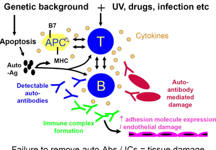
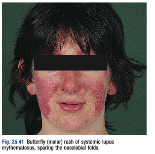
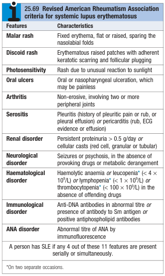
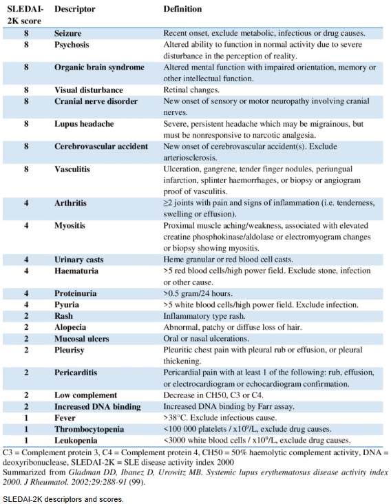
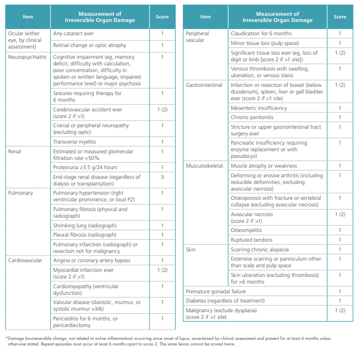
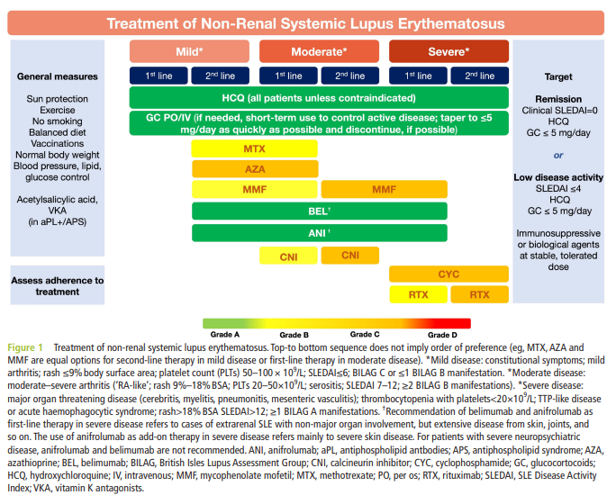
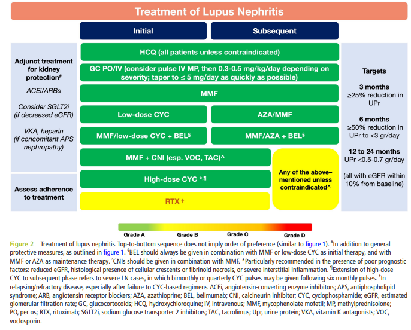

# Systemic Lupus Erythematosus

- **Definition** - The prototypical connective tissue disorder mediated by direct antibody-mediated cytotoxicity, and more importantly, immune complex (IC) deposition, leading to vasculitis and end-organ damage
- **Epidemiology** - rare disease, with genographical variation and female preponderance:
    - <u>Geographical variation</u>:
        - Prevalence: Caribbean blacks (0.2%) \> Orientals \> Caucasians (0.03%)
        - Prognosis: Caucasians \> Orientals \> Caribbean blacks
    - <u>Demographic</u> - Occurs at any age (peak onset at 20-30y), and extreme female preponderance (F:M = 9:1)
- **Pathophysiology** - unclear, but environmental exposure in a genetically predisposed individual is evident: 

    - **Genetic predisposition** - evident in higher concordance rates in monozygotic twins:
        - <u>Defects in apoptosis</u> - excessive apoptosis and inappropriate release in intracellular antigens (supports fact that lupus flares are caused by <u>factors increasing cell turnover</u>, e.g. UV light exposure, infections, increased oxidative stress)
        - <u>Defects in immune complex clearance</u> - e.g. Inherited mutations in complement components (C1q, C2, C4), and immunoglobulin receptor (Fc-gamma-RIIIb) resulting in reduced opsonisation of immune complexes
        - <u>Defects in immune function</u> - evident in genome-wide association studies (GWAS) to identify common polymorphisms in genes that predispose to SLE, much of which have immune-regulatory functions (T cell activation, B cell signalling etc.)
    - **Inappropriate exposure of intracellular antigens** - results in polyclonal B and T lymphocyte activation and autoantibody formation
    - **Circulating immune complex deposition** - main mechanism of wide-spread vasculitis and tissue damage
- **Triggers of lupus flares** - consider factors that induce apoptosis:
    - <u>UV light exposure</u> - direct induction of keratinocyte apoptosis
    - <u>Chemical agent exposure</u> - e.g. hairdye, eosin, heavy metals
    - <u>Infections</u> - EBV, rhinovirus, HIV-1, adenovirus, salmonella
    - <u>Drugs</u>:
        - Triggering agents - Hydrazine, Procainamide, BB, Penicillamine, Isoniazid, Phenytoin, Chorpromazine, Quinidine, Resrpine
        - Exacerbating agents - Lovastatin, Suplphonamide, Oestrogen

## Clinical features of SLE

- **Broad range of symptoms:**
    - Certain symptoms are prevalent at disease onset - e.g. cutaneous manifestations, arthritis or arthralgia
    - Certain symptoms only manifest late in the disease course - e.g. Lupus nephritis
- **Constitutional Sx** - certain Sx are associated with disease flares, while others are constant:
    - <u>Fever</u> (50%) - typically occurs in active flares
    - <u>Weight changes and genralised lymphadenopathy</u> - a/w activity of disease
    - <u>Fatigue, malaise, fibromyalgia-like Sx</u> - rather constant and not particularly a/w active inflammatory disease
- **Arthritis and arthralgia** (90%) - typically presents early at diseaase onset:
    - <u>Migratory polyarthritis</u> - typically symmetrical with RA-like distribution (but non-errosive), a/w pain and early morning stiffness, but clinically apparent synovitis and joint swelling is rare
    - <u>Jaccoud's arthropathy</u> (rare) - deforming arthritis due to tenosinovitis-mediated tendon damage
    - <u>Erosive arthropathy</u> - extremely rare deforming arthritis
    - <u>Osteoporosis</u> - often present as a result on long-term steroid use
    - <u>AVN of femoral head</u> - often iatrogenic
- **Raynaud's phenomenon** - common clinical feature that may precede other Sx for months to years, and becomes more prevalent later in disease course
- **Cutaneous features** - attributable to <u>cutaneous lupus</u> or <u>vasculitic phenomenon</u>:
    - **Cutaneous lupus** - 3 distinct types of cutaneous involvement classically <u>precipitated by UV light exposure</u>:
        - <u>Acute malar rash</u> (20%) - characteristic butteryfly facial rash over both malar areas connected by nasal bridges, with sparing of nasolabial folds, which are erythematous, raised, <u>tender</u> and <u>pruritic</u>
        - <u>Subacute cutaneous lupus erythematosus</u> - characteristic annular of psoriaform, migratory and non-scaring
        - <u>Discoid lupus</u> - characteristic hyperkeratosis and follicular plugging, with scarring alopecia if occurs in the scalp

    
    
    - **Vasculitic phenomenon** - periungal erythema (dilated capillary loops under nail), livedo reticularis, and other vasculitis
    - **Non-scarring alopecia** - may occur in active disease
    - **Erythema nodosum** - raised nodular papules on palms and soles
- **Renal involvement:**
    - **Lupus nephritis** - glomerular disease caused by IC deposition within glomerulus:
        - 6 pathological types - 1) Normal, 2) Mesangial, 3) Focal proliferative, 4) Diffuse proliferative, 5) Membranous, 6) Sclerosing
        - Clinical presentation (variable) - Glomerular haematuria, proteinuria, nephrotic syndrome, nephritic syndrome, RPGN, CKD
    - **Tubulointerstitial nephritis** - characterised by tubular dysfunction
- **Serosal involvemnt** - serositis principally in pleura and pericardium, causing increased vascular permeability:
    - <u>Pleural involvement</u> - pleural effusion
    - <u>Pericardial involvement</u> - pericardial effusion
- **Cardiovascular involvement:**
    - <u>Pericarditis</u> - most common manifestation
    - <u>Myocarditis and cardiomyopathy</u>
    - <u>Libman-Sacks endocarditis</u> - hypercoagulability (associated APLS) results in deposition of sterile fibrin on heart valves
    - <u>Generalised increased atherosclerotic risks</u> - as a result of systemic inflammation, steroid therapy, and hypercoagulability (increased arterial thrombus formation), and is a main cause of morbidity and mortality
- **Pulmonary involvement:**
    - <u>Recurrent chest infections</u> - must r/o in lupus patient presenting with SOB
    - <u>Parenchymal disease</u> - pneumonitis, Shrinking Lung Disease, and pulmonary fibrosis, in lupus patient presenting in progressive SOB
    - <u>Pulmonary vascular disease</u> - pHTN, PE (especially in APLS)
    - <u>Pleural disease</u> - pleural effusion and pleurisy
- **Neuropsychiatric involvement:**
    - Unexplained etiology - depression, psychosis, migraneous headaches
    - Explained etiology - cerebral ischaemia, transverse myelitis, chorea, cerebellar ataxia, meningitis
- **Haematological involvement:**
    - **Cytopenias** - varying degrees:
        - <u>Anaemia</u> - may be ACD or AIHA
        - <u>Leukopenia</u> (lymphopenia or neutropenia) - caused by anti-leukocyte antibody
        - <u>Thrombocytopenia</u> - due to APLS or anti-platelet antibody
    - **Generalised lymphadenopathy and splenomegaly** - occurs in lupus flares
    - **Arterial and venous thrombosis** - a/w vasculitic phenomenon and APLS
- **GI involvement:**
    - <u>Oral ulcers</u> - common and may or may not be painful
    - <u>Mesenteric ischaemia</u> - serious complication of lupus due to vasculitis

## Investigations in SLE

- **Principles of Ix:**
    - Diagnosis - based on classification criteria which combines clinical and <u>labooratory</u> findings
    - Assessment of severity - certain investigations are markers of disease severity
    - Detection of complications
    - Prognosis
- **Common Ix employed:**
    - CBC with differentials - autoimmune cytopenias
    - LFT - reversed A/G ratio, +/- unconjugated bilirubinaemia
    - RFT - renal dysfunction
    - Inflammatory markers:
        - ESR - marker of disease activity
        - CRP - not elevated in lupus flares, but raised levels can be seen in serositis, and more importantly, infections
    - Immunological screens:
        - Rheumatoid factor (RF) - r/o RA and Sjogren's syndrome
        - Antinuclear antibodies (ANA) - sensitive, but non-specific test (ANA negative lupus is extremely rare but can occur in anti-Ro +ve lupus)
        - +/- Other immune markers - Anti-dsDNA, Anti-ENA, Anti-phospholipid Ab
    - Complements (C3/4) - negatively correlates with disease activity
    - Specific organ Ix - CXR, ECG, renal biopsy
- **Typical findings in lupus flares:**
    - Routine bloods - raised ESR, leucopenia and lymphopenia characteristiaclly, +/- anaemia, thrombocytopenia
    - Immune markers - raised Anti-dsDNA and reduced C3/4
- **Antinuclear antibodies:**
    - <u>Definition</u> - group of antibodies that react with various nuclear antigens
    - <u>Test properties</u> - extremely sensitive but non-specific (low FPR but non-diagnostic)
    - <u>Types</u>:
        - Anti-dsDNA
        - Anti-histone
        - Anti-ssDNA
        - Anti-ENA - Anti-Sm, Anti-RNP, Anti-Ro, Anti-La, Anti-P
- **Role of ANA subtypes** - diagnostic (part of classification criteria) and prognostic:
    - **Anti-DsDNA** (60-70%) - specific and diagnostic, correlating with disease activity
    - **Anti-ENA Ab** - non-diagnostic, but offers prognostic values:
        - <u>Anti-Sm</u> (10-20%) - diagnostic and specific
        - <u>Anti-Ro</u> (60%) - associated with cutaneous manifestations and Sicca symptoms
        - <u>Anti-La</u> (40%)
        - <u>Anti-RNP</u> - associated with SSc and low-grade myositis

## Diagnosis of SLE

- **Classification criteria** - several classification have be developed for SLE as a means for patient inclusion and categorization in <u>research studies</u>, but limited by <u>imperfect sensitivity and specificity for diagnosis</u>:
    - <u>2019 EULAR/ACR criteria</u> - latest classification criteria with improved performance in detecting new-onset or early SLE, requiring entry requirement of +ve ANA test, and weighted scoring based on 7 clinical and 3 immunological categories
    - <u>2012 SLICC criteria</u> - addressing weakness of 1997 ACR criteria, particularly because it focuses on multi-system involvement
    - <u>1997 American Rheumatism Association (now ACR) criteria</u> - prototypical classification criteria by presence of 4 out of 11 features either serially or simutaneously
- **1997 ARA criteria for SLE:** 

## Management of SLE

- **Definition of disease activity** - incorporates 1) standardised scores for clinical activity, while taking into account of 2) level of Tx:
    - <u>Flare</u> - characterised by measurable increase in disease activity that is clinically meaningful to result n a change in therapy, further categorized by severity
    - <u>Remission</u> - absence of clinical disease activity as measured by the SLEDAI-2K and physicial global assessment \< 0.5
    - <u>Low-disease activity</u> - Lupus Low Disease Activity State (LLDAS) defines SLEDAI \<= 4 with no activity in major organ systems, no new clinical activity compared w/ previous assessment, a PGA of \<= 1, on minimal maintenance therapy as defined as prednisolone \<= 7.5 mg/d, antimalarials and immunosuppressive agents
- **Assessment of disease activity** - performed at each clinical visit due to heterogeneity of disease presentation and clinical course:
    - **Principles of assessment** - requires differentiation of:
        - Features attributable to active SLE (e.g. proteinuria caused by active lupus nephritis)
        - Chronic damage, drug toxicities or other comorbid conditions (e.g. proteinuria caused by CKD)
    - **Approach to assessment of disease activity:**
        - <u>Hx and P/E</u> - systems review for all organ Sx, and note any triggers if specific Sx are present (e.g. sun exposure, infection, or non-compliance to medications)
        - <u>Basic Ix</u> - basic laboratory evaluation to assess disease activity and monitor organ-specific complications
        - <u>Additional Ix</u> - additional studies may be required depending on the organ system
        - <u>Disease activity and damage indices</u> - compute disease activity indices and damage indices based on clinical findings
    - **Basic Ix:**
        - **Urine** - urinalysis w/ urinary sediments, spot UPCR:
            - <u>Urinalysis</u> - detection of proteinuria, celluular casts and haematuria (performed when not menstruating)
            - <u>Spot UPCR</u> - quantification of proteinuria to assess severity of glomerular disease
        - **Routine bloods** - CBC, LRFT, ESR/CRP, dsDNA, C3/4:
            - **CBC** - note cytopenias may be a marker of active disease, but also a result of drug toxicity:
                - <u>Leukpopenia</u> - often reflects active disease
                - <u>Anaemia and thrombocytopenia</u> - may result from active disease
            - **LRFT:**
            - **ESR/CRP** - ESR more readily reflects disease activity, while CRP is typically not raised in isolated lupus flares:
                - <u>ESR</u> - raised in disease flares
                - <u>CRP</u> - typically not raised despite inflammation, but **raised CRP** should **raise suspicion of infection**
            - **Anti-dsDNA** - raised during increasing disease activity, particularly in patients w/ active GN
            - **C3/4** - low C3/4 indicates active disease, particularly in patients w/ active GN
    - **Disease activity indices** - Systemic Lupus Erythematosus Disease Activity Index-2K (SLEDAI-2K): 
    
        - <u>Limtations</u> - global disease activity:
            - Does not capture improving or worsening trends
            - Does not include severity within a specific organ system
        - <u>Activity categories</u> - score \>= 5 is a/w probability of initiating therapy in \> 50% cases
    - **Damage indices** - Systemic Lupus International Collaborating Clinic American College of Rheumatology damage index (SLICC/ACR-DI): 
    
- **Principles of Mx:**
    - <u>Goals of therapy</u>:
        - 1\. Achieve remission or low disease activity
        - 2\. Prevent organ damage
        - 3\. Minimize drug toxicity
        - 4\. Improve QoL
    - <u>Personalised care by MDT</u>:
        - Personalised care depending on clinical manifestations (e.g. cutaneous, renal, haematological), disease activity, severity and comorbidities
        - Joint care between rheumatologist with involvement of nephrologist, dermatologist, and haematologist
    - <u>General measures</u> - applicable to all patients (see below)
    - <u>Approach to drug therapy</u> - individualised based on 1) predominant Sx and organ involvement, 2) disease severity and activity, 3) response to previous therapy, and 4) adverse effects of therapeutic agents:
        - **Hydroxychloroquine for all patients** - irrespective of disease severity and organ involvement, due to broad survival benefits:
            - <u>Benefits on survival</u> - HCQ a/w reduction in overal mortality, even among patients w/ Hx of lupus nephritis
            - <u>Benefits on disease control</u> - better disease control w/ reduced risk of disease flare
            - <u>Benefits on Sx control</u>:
                - Reduced constitutional Sx
                - Reduced musculoskeletal manifestation
                - Mucocutaneous manifestation
            - <u>Potential benefits on end-organ protection</u>:
                - Reduced organ damage accrual
                - Reduced maligancy risk
                - Reduction in thrombotic events
        - **Escalation of therapy based on disease activity and severity** - selection of steroid-sparing agents dependent on disease manifestation and patient comorbidities:
            - <u>Mild disease</u> - HCQ alone +/- short-term low-dose prednisolone (\< 7.5 mg/d) or NSAIDs for symptomatic relief
            - <u>Moderate disease</u> - HCQ with short-term therapy with prednisolone 5-15 mg/d (w/ taper and switch to steroid-sparing agent)
            - <u>Severe disease</u> - induction therapy w/ systemic steroids (e.g. IV pulse methylprednisolone or high-dose oral prednisolone) +/- immunosuppressive agents

       
      
        - **Tx based on specific SLE manifestation** - varying Tx depending on the organ-specific disease activity
    - <u>Tx of co-morbidities</u> - screen for, and appropriate Tx of comorbid conditions, including:
        - **Rheuatological conditions** - Raynaud phenomenon, Sjogren's disease, Anti-phospholipid syndrome, Fibromyalgia
        - **Non-rheumatological conditions** - accelerated atherosclerosis, pulmonary HTN, CKD, osteoporosis
- **General measures** - applied to all patients:
    - **Preventitive care** - reduced risk of disease flare and developing certain complications related to their condition or Tx:
        - <u>Photoprotection</u> - avoid exposure to direct or reflected sunlight or other sources of UV right (and apply sunblock)
        - <u>Smoking cessation</u> - important as smoking is a/w higher disease activity and adds to baseline increased risk of accelerated ASCVD and osteoporosis seen in SLE patients
        - <u>Immunisation</u> - appropriate immunisation including influenzae, pneumococcus, HPV, HBV, COVID prior to initiation of immunosuppressive therapies
        - <u>Screening for cardiovascular disease</u> - importance of addressing traditional risk factors and testing to screen for asymptomatic disease
        - <u>Screening for osteoporosis</u> - due to cumulative burden from glucocorticoids, and may benefit from pharmacological and non-pharmacological therapy
        - <u>Screening for malignancy</u> - higher risk than general population related to underlying immune dysfunction and/or immunosuppressive therapies, and is strongly suggested for age-appropriate cancer screening as provided for general population
    - **Diet and nutrition** - standard balanced diet recommended:
        - Vitamin D supplement may be required if vitamin D deficiency in part due to sun avoidance
        - Salt restriction or DASH diet recommended w/ nephritis +/- HTN
    - **Exercise** - regular physical activity important for preventing ASCVD, minimising bone loss +/- symptomatic relief of arthritis
- **Hydroxycloroquine** - antimalarial agent:
    - <u>Indications</u> - indicated for all lupus patients as maintenance therapy irrespective of disease manifestation and activity
    - <u>S/E</u>:
        - Toxic retinopathy - risk minimised by using appropriate doses and routine occular monitoring
        - QTc prolongation and arrhythmias - esp if taking other medications that prolong QTc
- **Anifrolumab:**
    - <u>Indications</u> - adjuvant therapy for patients w/ moderate to severe SLE but w/o severe active nephritis or neuropsychetric SLE
    - <u>MOA</u> - MAb against type I INF receptor:
        - Reduced activity of INF-alpha, beta and kappa
    - <u>Clinical efficacy</u> - reduction of overall disease activity when added to standard therapy with glucocorticoids with earlier and more durable achievement of LLDAS
- **Belimumab:**
    - <u>MOA</u> - B cell depleting agent:
        - Blocks binding of soluble human B lymphocyte stimulator protein to B cell receptors
        - Takes 3-6 mo to achieve mechanism of efficacy
- **Rituximab** - current role of this B cell-depleting agent remains uncertain, w/ RCTs not showing significant benefit compared w/ control (LUNAR study)
