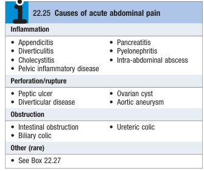
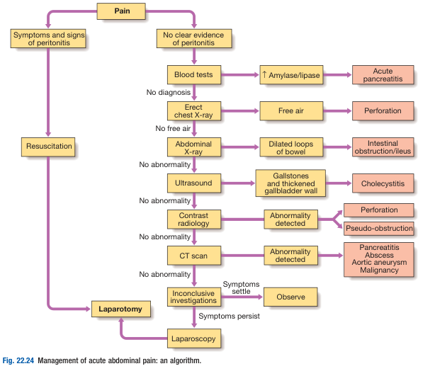

# The Acute Abdomen

- **Definition** - although no universal definition of an acute abdomen, it generally refers to surgical urgencies that demand an urgent admission into the surgical wards:
- **Epidemiology** - roughly 50% of urgent admissions into general surgical wards
- **Pathophysiology** - acute abdomen manifests in one or more of the following <u>pathological processes</u>:
    - **Inflammation of viscera** - initially dull, and poorly localised (rather diffuse), but becomes sharp and localised once parietal peritoneum is involved
    - **Perforation** - abrupt onset of sharp pain, often severe and progresses towards generalised peritonitis
    - **Obstruction** - colicky pain that comes as goes with peristalsis against the obstruction, if pain persistent between spasms, indicates <u>complicating inflammation</u>
- **Etiology of acute abdomen:** 

    - **Inflammation of viscus:**
        - **Bowel:**
            - <u>Appendicitis</u> - shifting pain with change in character from peri-umbilical region to RIF (accompanied by N/V, mild pyrexia, and leukocytosis)
            - <u>Meckel's diverticulitis</u> - essentially indistinguishable from appendicitis clinically
            - <u>Colonic diverticulitis</u> - gradual onset of lower abdominal pain but more common in the elderly population
        - **HBP:**
            - <u>Cholecystitis</u> - typically manifests as RUQ pain with fever, w/ Hx of gallstone disease or prior biliary colic
            - <u>Cholangitis</u> - typically manifests as RUQ pain in pattern of Charcot's triad and Reynold's pentad
            - <u>Pancreatitis</u> - typically epigastric pain (ocassionally RUQ pain) w/ Hx of gallstone disease or alcoholism (accompanied by N/V, pyrexia, leukocytosis and elevated amylase)
        - Others - pyelonephritis, intra-abdominal abscess, pelvic inflammatory disease, ectopic pregnancy
    - **Perforation of viscus:**
        - <u>Perforated peptic ulcer</u> - typically severe constant epigastric pain that extends throughout the entire abdomen, w/ Hx of dyspepsia, H. pylori, NSAID use (free gas under diaphragm on abdominal X Ray)
        - <u>Ruptured diverticulosis</u> - typically severe constant abdominal pain over both iliac fossas
        - <u>Ruptured aortic aneurysm</u> - sudden onset of severe abdominal pain radiating to back, w/ signs of shock and pulsatile abdominal mass
    - **Obstruction of viscus:**
        - <u>Intestinal obstruction</u> - true colicky pain associated with vomiting (billous or non-billous), abdominal distension, and absolute constipation (varying features for different levels of obstruction)
        - <u>Biliary colic</u> - typically epigastric or RUQ pain that suddenly comes on and is relieved within minutes to hours
        - <u>Ureteric colic</u> - colicky pain on background of loin pain radiating to the groin

## Clinical assessment of the acute abdomen

- **Salient points of Hx:**
    - HPI - immediately characterise the site, onset, character, radiation, time course, associated symptoms and exacerbating and relieving factors
    - PMH:
        - RFs of AAA - atherosclerotic risk factors
        - RFs for IO - previous abdominal surgery, colorectal cancer
        - Peptic ulcer disease - previous upper endoscopy, H. pylori infections, NSAID use
        - Gallstone disease - prior demonstration on health checks, prior cholecystectomy, or previous Hx of biliary collic
    - Drug Hx - mainly NSAID, corticosteroids, ABx
    - Relavent SHx and FHx
    - Relevant menstrual and sexual Hx
- **P/E:**
    - General examination:
        - **General appearance/ posture:**
            - Lying motionless - rAAA, peritonitis
            - Restless, writhing in pain - ureteric or intestinal colic
            - Relieved on bending forward - pancreatitis
        - **Vitals and hydration status:**
            - Haemodynamic instability - resuscitate before proeeding
            - Hydration status - mucous membrane, skin turgour, +/- orthostatic hypotension
            - High-grade fever - consider abscesses, cholangitis, pancreatitis, pelvic inflammatory disease
        - **Other peripheral signs** - septic loocking, jaundice, pallor
    - Abdominal examination:
        - Inspection - distension, scars, pulsatile mass, skin changes
        - Palpation - peritoneal signs, Murphy's sign
        - Auscultation:
            - Absent bowel sounds - generalised peritonitis resulting in paralytic ileus
            - Hyperactive bowel sounds - IO
- **Ix:**
    - **Commonly employed Ix for acute abdomen:**
        - Blood tests - CBC, LFT, RFT, Amylase, cardiac enzymes, RBG, ABG, lactate, clotting/T&S
        - Urine - dipstick and pregnancy test
        - Radiographs - Erect CXR, Plain Abdominal X Ray, KUB
        - US
        - CT scan

    
    
    - **Blood tests:**
        - <u>CBC</u> - anaemia, leukocytosis
        - <u>LFT</u> - dLFT, obstructive jaundice
        - <u>RFT</u>:
            - Urea/ Cr - dehydration
            - HypoCl, HypoNa - prolonged vomiting
            - HypoK, HypoCa - can cause ileus
            - Cr - sutability for contrast CT
        - <u>Amylase</u> - \> 3x ULN diagnostic of pancreatitis
        - <u>RBG</u> - for DKA
        - +/- <u>Cardiac enzymes</u> - r/o MI if clinically suspicions
        - +/- <u>lactate</u> - bowel ischaemia
    - **Urine:**
        - Dipstick - for urological causes, ketonuria, glucose
        - Pregnancy test - ectopic pregnancy
    - **Radiography:**
        - <u>Erect CXR</u> - free gas under diaphragm (Perforation)
        - <u>Supine AXR</u>:
            - **Dialated bowel loops** (\>3cm in SB, \>5cm in LB) - IO
            - **Coffee bean sign** - sigmoid or caecal volvulus
            - **Radio-opaque stones** - most urinary stones, some gallstones
        - <u>Supine AXR</u>:
            - **Multiple air fluid levels** - SBO
    - **USG:**
        - Gallstones - acoustic shadowing (extremely sensitive and specific)
        - Acute cholecysititis:
            - Thickned GB wall (\>3cm)
            - Pericholecystic fluid
            - Stone at neck of HB
            - Sonographic Murphy's sign
    - **Contrast CT** - abscess, aortic aneurysm, pancreatitis
