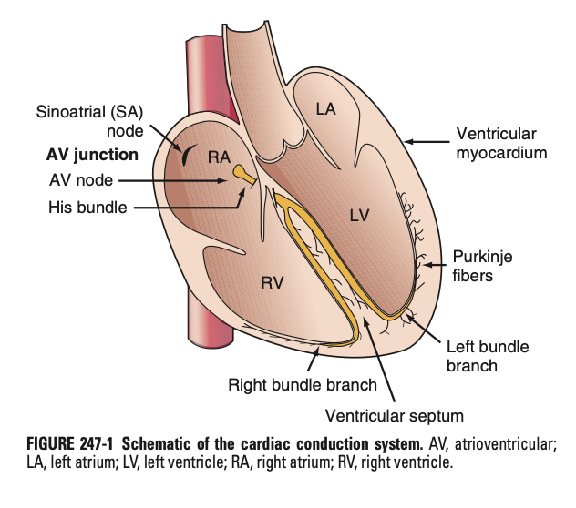
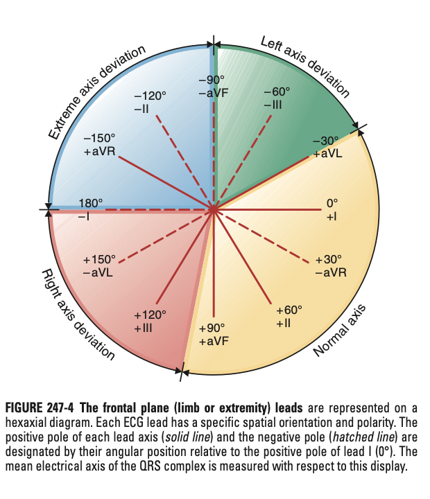
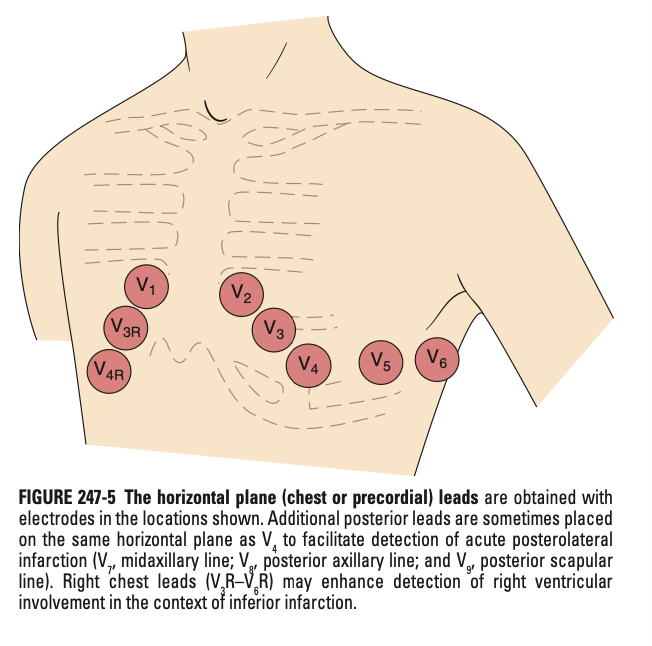
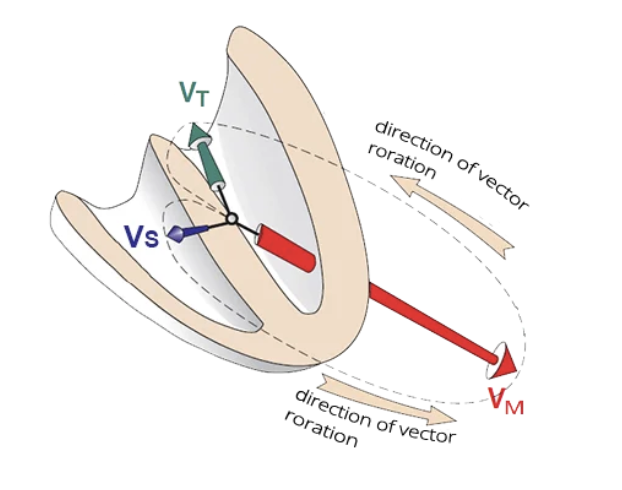
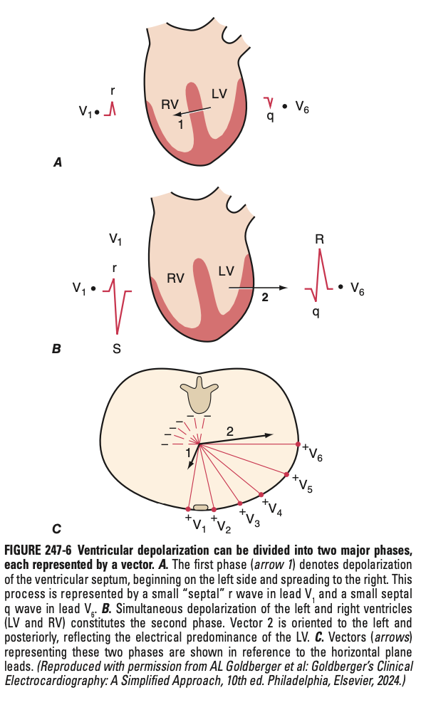

# The Electrocardiography (ECG) and its Principles

- **ECG:**
    - Graphical representation of electrical activity of the heart
    - Detected by means of metallic electrodes attached to extremities and the chest wall, the so called electrocardiograph device
    - ECG leads represent instantaneous differences in electrical potentials between specific sets of electrodes
- **Electrophysiology behind the cardiac cycle** - electrical activity that spread are produced by 1) cardiac pacemaker cells, 2) specialised conduction tissue, 3) heart muscle:
    - <u>SA node activation and atrial depolarisation</u> - spotaneous automaticity w/ spread of depolarisation wave from **right atria to left atria** and towards the AV node
    - <u>Stimulation of AV junction</u> - the AV nodal tissue and Bundle of His slows conduction velocity such that V contracts after A
    - <u>Stimulation of bundle branch</u> - rapid transmission of depolarisation wavefronts in a synchronised manner via the Purkinje fibres:
        - RBBB - single bundle branch responsible for depolarisation of the RG wall
        - LBBB - fans out into the left anterior and left posterior fascicular subdivisions
    - <u>Synchronised depolarisation of the ventricular wall</u> - spread of depolarisation and repolarisation wave fronts **from endocardium to epicardium**

  
  
- **Principles of deflections in the ECG:**
    - <u>Upward deflection</u> - reflects depolarisation of the myocardium
    - <u>Downward deflection</u> - reflects repolarisation of the myocardium
- **Standard calibration of an ECG** - divided into a gride of small 1x1 mm boxes, and large 5x5 mm boxes:
    - <u>Horizontal axis</u> - represents time; sweep speed of 25 mm/s, where one small box corresponds to 40ms (0.04s) while one large box corresponds to 200ms (0.2s)
    - <u>Vertical axis</u> - represents amplitude; 1 mV = 10 mm (2 large boxes)
- **Standard ECG configuration** - configured in a way that is easy for interpretation:
    - Positive (upright) deflections - corresponds to wave of depolarisation towards the positive pole of that lead
    - Negative (downward) deflections - corresponds to wave of depolarisation towards negative pole of that lead
    - Biphasic deflections (equally +ve and -ve deflections) - correspond to wave of depolarisation perpendicular to the lead axis
- **12 leads of the 12-lead ECGs** - each lead analogous to a video-camera angle "looking" at the same events at different spatial orientation:
    - <u>Limb leads</u> (I, II, III, aVL, aVR, aVF) - records potential transmitted on the frontal plane
    - <u>Precordial leads</u> (V1-6) - records potential transmitted on the horizontal lanes

   
  
- **Basic ECG waveforms and intervals:**
    - **Waveforms:**
        - <u>P wave</u> - representation of atrial depolarisation
        - <u>QRS complex</u> - representation of ventricular depolarisation
        - <u>ST-T-U complex</u> (ST segment, T wave, and U wave) - representation of ventricular repolarisation (atrial repolarisation waveforms \[ST-Ta\] are too low amplitude to be detected but may be seen in certain pathological conditions)
    - **Intervals:**
        - <u>RR interval</u> - for instantaneous heart rate (dividing number of large boxes \[0.2s\] into 300)
        - <u>PR interval</u> - representaiton of the delay between atria and ventricular depolarisation (usu. 120-200 ms as imposed by the properties of the AV junction)
        - <u>QT interval</u> - subtends both ventricular depolarisation (QRS complex), and repolarisation, which normally varies w/ HR (QTc = QT / sq. root of RR)
- **QRS-T waveforms** - correspond to the <u>sequential phases of ventricular action potentials</u>:
    - Phase 0 (rapid upstroke) - corersponds to onset of QRS, prolonged by factors affecting Na influx (e.g. hyperK, Na channel blockers)
    - Phase 2 (plateau) - corresponds to the iso-eleectric ST segment
    - Phase 3 (active repolarisation) - corresponds to the inscription of the T wave index
- **P wave** - normal depolarisation is oriented downwards and towards the left (as spreads from the right atrium over to the left atrium), <u>sinus P waves</u> are:
    - +ve on lead II
    - -ve on aVR
    - Biphasic in V1 (w/ initial small +ve component reflecting RA depolarisation, followed by a small \[\< 1 mm2\] component reflecting left atrial depolarisation; influenced by atrial enlargements)
- **QRS complex** - record of "vector rotation over time":
    - <u>Sequential depolarsisation of the ventricles</u>:
        - 1\. Interventricular septum (usu. accounts for physiological Q waves)
        - 2\. Ventricles
        - 3\. Base of left ventricles
    - <u>Principles of QRS complex</u> - reflected by a combination of ventricular vectors:
        - Small ventricle vector (Vs) - depolarisation of interventricular septum from left to right anteriorly
        - Large main ventricular vector (Vh) - depolarisation of the LV and RV; oriented towards **towards the left and posteriorly** due to bulky LV (RV activation has limited influence on Vh)
        - Small terminal vector (Vt) - depolarisation of the base of LV (minimal effects)

     
    
    - <u>Manifestation on QRS complexes on precordial eads</u>:
        - Right precordial leads - usually small +ve deflection (septal r wave), followed by large -ve depolarisation (S wave)
        - Left precordial leads - usually small -ve deflection (septal q wave), followed by large +ve depolarisation (R wave)
        - Transitional zone (normally V3/4) - perpendicular to Vh such that R and S wave is of equal amplitude
    - <u>Manifestation of QRS complexes on limb leads</u> - extremely variable:
        - Electrical axis of the QRS is the mean orientaiton of the QRS vector w/ reference to the 6 limb leads
        - Variable in normal individuals (e.g. RAD in adolescents)
        - Variable in pathological conditions
- **T wave and U wave:**
    - <u>Sequential repolarisation of the ventricles</u>:
        - Normal repolarisation must be in reverse direction from depolarisation (i.e. epicardium to endocardium)
        - However, as depolarisation and repolarisation are electrically opposite processes, the interpretation of the polarity must be switched
        - QRS-T wave vector concordnace
    - <u>U wave</u> - smal rounded deflection folowing T wave w/ same polarity as T wave
- **Clinical approach to interpretation of the ECG:**
    - **Systematic approach before reading the ECG:**
        - <u>Patient demographic</u> - age, sex, race
        - <u>Context of ECG</u> - e.g. clinical status of the patient when ECG is taken
    - **Systematic approach for ECG** - comparison w/ old ECG is invaluable:
        - 1\. Standardization (calibration) and technical features (lead placement and artifacts)
        - 2\. Rhythm
        - 3\. Heart rate
        - 4\. PR interval/ AV conduction
        - 5\. QRS interval
        - 6\. QT/QTc intervals
        - 7\. Mean QRS electrical axis
        - 8\. P waves
        - 9\. QRS voltages
        - 10\. Pre-cordial R wave progression
        - 11\. Abnormal Q waves
        - 12\. ST segments
        - 13\. T waves
        - 14\. U Waves
