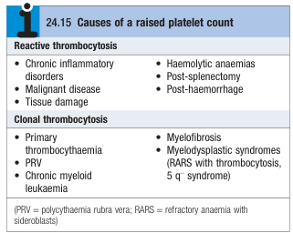

# Thrombocytosis

- **Definition** - high platelet count
- **Etiology of thrombocytosis:**
    - **Reactive thrombocytosis** - raised platelet count as a reaction to another process:
        - <u>Inflammatory processes</u> - infection, chronic inflammatory disorders (CTD), malignancies, tissue damage, post-haemorrhage
        - <u>Anaemia</u> - acute blood loss, post-GI bleeding, acute haemolytic anaemia
        - <u>Post-splenectomy</u>
    - **Clonal thrombocytosis** -reflects an underlying myeloproliferative disorder (or MDS):
        - Essential thrombocythaemia
        - Polycythaemia vera
        - Myelofibrosis
        - Chronic myeloid leukaemia
        - Myelodysplastic syndromes (RARS w/ thrombocytosis, 5q- syndrome)

  
  
- **Clinical features of clonal thrombocytosis:**
    - <u>Increased risk of arterial thrombosis</u> - manifestation as stroke, TIAs, amaurosis fugax, digital ischaemia or gangrene
    - <u>Bleeding</u> - a rare complication of clonal thrombocytosis
    - <u>Other features of MPN</u> - e.g. systemic upset, aquagenic pruritis, abdominal mass (splenomegaly)
- **Differentiation between reactive and clonal thrombocytosis:**
    - <u>Hx</u>:
        - Clinical features of reactive thrombocytosis is typically a/w underlying disorder (e.g. acute blood loss)
        - Clonal thrombocytosis typically presents as systemic upset, features of MPN (e.g. aquagenic pruritis) and haemstatic defects (e.g. arterial thrombosis, or rarely bleeding)
    - <u>P/E</u>:
        - Causes of reactive thrombocytosis typically lack splenomegaly
        - Clonal thrombocytosis typically is characterised by presence of splenomegaly
    - <u>Ix</u>:
        - Reactive thrombosis is a/w improvement of PLT counts after resolution of underlying cause
        - Clonal thrombocytosis is typically characterised by severe, progressive thrombocytosis
