# Tuberculosis

- **Definition** - infection caused by <u>Mycobacterium tuberculosis</u> (MTB), part of a complex organisms including M. bovis (reservoir cattle), and M. africanum (reservoir human)
- **Epidemiology:**
    - **Incidence** - declining incidence of TB, but its impact on world health remains significant (8.8 million incident cases worldwide in 2010)
    - **Burden:**
        - <u>Mortality</u> - second most common cause of death attributable to infective disease (1.5 million deaths worldwide in 2010)
        - <u>Geographic variation</u> - high prevalence in world's poorest nations due to:
            - Economic struggle - unable to cover the cost of management and control programs
            - Lack of appropriate healthcare - particularly important factor in former Soviet Union and Baltic States
            - Increased HIV incidence - particular in Africa, where immunosuppression due to AIDs results in increased risk of TB

      
      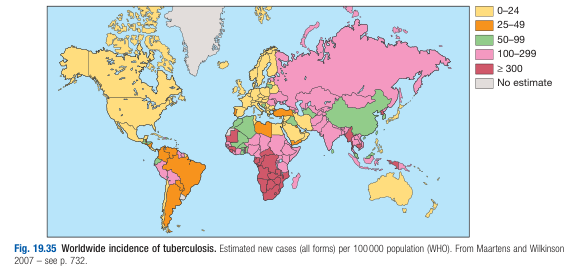
- **Microbiology of MTB:**
    - **Route of transmission:**
        - <u>Air-bourne transmission</u> - MTB spread by inhalation of aerosolised droplet nuclei from other infected agents
        - <u>Food-bourne transmission</u> - M. bovis infection arises from drinking non-sterilised milk from infected cows
- **Pathogenesis of TB:**
    - **Inhalation of inciting agent** - inhalation of aerosolised droplet nuclei from other infected patients, where MTB becomes lodged in the alveoli and incites a sequelae of immune response
    - **Type 4 Hypersensitivy Reaction** - delayed hypersensitivity reaction after phagocytosis of MTB by macrophages:
        - <u>Phagocytosis by macrophages</u> - AFB is subjected to phagocytosis by macrophages, but are resistant to lysosomal degradation, resulting in recruitment of lymphocytes to mediate a chronic granulomatous inflammation
        - <u>Formation of tuberculous granuloma</u> - Macrophage undergoes transformation into epitheloid cells, and fuse to form Langhans Giant Cell, surrounded by a belt of lymphocytes to form the classical tuberculous granuloma
        - <u>Formation of primary lesion</u> - multiple tuberculous granuloma aggregate to give the macroscopic lesion 'Ghon focus', a pale yellow, caseous nodule with a few millimeters to 1-2 cm in diameter
        - <u>Similar pathological process in regional LN</u> - spread of organisms in the to hilar LN will be followed by the same cell-mediated immunity, where the primary lesion and regional LN is referred to as the **Primary Complex of Ranke**
    - **Contained infection** - reparative process encases the primary complex of Ranke within a fibrous capsule to limit the spread of AFB - so called latent TB, the lesion becomes calcified and is clearly seen on CXR
    - **Failure of reparative measure:**
        - <u>Direct extension of primary lesion</u> - failure of reparative measures to contain the infection results in direct extension of primary lesion, resulting in primary progressive pulmonary disease (10% lifetime risk after primary infection)
        - <u>Lymphatic and haematogenous spread of AFB</u> - disseminated infection may occur before immunity is established, seeding secondary foci in organs, including LN, serous membranes, meninges, bones, liver, kidneys and lungs, remaining dormant but can manifest as <u>Extra-pulmonary TB</u>

    
    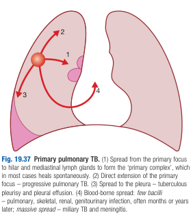
- **Natural history of untreated primary infection** - 10% lifetime risk of progressive primary disease (half of which occur within first 2y): 
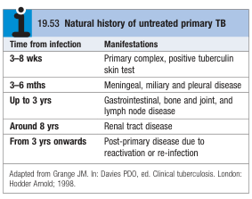
- **Risk factors of TB:**
    - **Patient demographic and TOCC Hx:**
        - <u>Age</u> - higher incidence in extremes of age (children and elderly)
        - <u>Travel</u> - travel to endemic regions; first generation immigrates from high-prevalence countries
        - <u>Contact</u> - close contact of patients with smear-positive pulmonary TB
        - <u>Clusters</u> - overcrowding (prisons, collective dormitories); homelessness (doss houses and hostels)
        - <u>Smoking</u> - increased riwk with cigarette smoking
        - <u>Documented TB</u> - CXR evidence of self-healed TB, primary infection \< 1y previously
    - **Associated comorbidities:**
        - Diabetes mellitus
        - Chronic kidney disease
        - Immunosuppression - HIV, Anti-TNF therapy (RA), high-dose corticosteroids, cytotoxic agents
        - Malignancy - especially haematological malignancies such as leukaemia and lymphoma
        - Interstitial lung disease - asbestosis and silicosis
        - Malnutrition - e.g. gastrectomy, jejuno-ileal bypass, CA pancreas, malabsorption
        - Vitamin deficiency - esp. Vit. A and D
        - Recent measles in children

    
    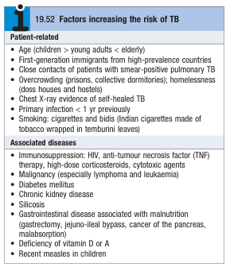
- **Clinical features of MTB** - great mimicker due to the variety of presentation:
    - **Clinical features of pulmonary TB:**
        - **Primary pulmnary TB** - infection of a previously uninfected (tuberculin-negative) individual:
            - **Asymptomatic** - incidental finding of pulmonary TB on CXR
            - **Prodrome** - most patients are completely asymptomatic during primary infection, but some develop **self-limiting febrile illness** (influenza-like illness)
            - **Progressive pulmonary disease** - progressive primary disease may present in the initial illness or after a latent period of weeks or months, which can present as:
                - <u>Chronic cough</u> - often characterised by a chronic dry cough, often with **haemoptysis**
                - <u>Constitutive Sx</u> - a prodrome of low-grade pyrexia of unknown origin, night sweats, anorexia, weight loss and general debility may be present prior to clinical presentation
                - <u>Unresolved pneumonia</u> - fever, cough with sputum, and dyspnoea with consolidation pattern on CXR not responding to empirical ABx Tx
                - <u>Collapse</u> - sudden onset of dyspnoea due to collapse (especially of right middle lobe)
                - <u>Pleural effusion</u> - progressive SOB with clinical and radiological evidence of exudative pleural effusion
                - <u>Spontaneous pneumothorax</u> - pleurisy and acute SOB with compatible clinical and radiological findings of pneumothorax
            - **Hypersensitivity reaction** - Erythema nodosum, Dactylitis, Phyctenular conjunctivitis may precipitate clinical presentation
            - **Miliary TB** - blood-borne dissemination of TB prior to the onset of reparative process to contain the infection, which may present 1) acutely as progressive pulmonary disease, or 2) with marked constitutional symptoms and a dry cough:
                - <u>Acute pneumonia-like illness</u> - pneumonia picture with wide-spread crackles bilaterally common in advanced disease
                - <u>Prodrome</u> - 2-3 weeks of dry cough and systemic upset prior to clinical presentation:
                    - Dry cough
                    - Low-grade fever
                    - Night sweats
                    - Anorexia
                    - Unintentional weight loss
                - <u>Classical CXR findings</u> - fine 1-2mm lesions ('millet seeds') distributed throughout lung fields
                - <u>Bicytopenia/ Pancytopenia</u> - anaemia and leukopenia on CBC reflect BM involvement
            - **Cryptic TB** - unusual presentation of miliary TB with normal CXR especially in infirmed patients: 
            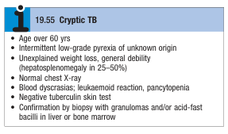
        - **Post-primary TB** - exogenous ('new' infection) or endogenous ('reactivation' of dormant primary lesion) infection in a person sensitised (tuberculin-sensitive) by earlier exposure:
            - <u>Preponderance to apex of upper lobe</u> - direct extension of a reactivated primary lesion towards the apex of upper lobe due to high O2 tension favouring growth of a strictly aerobic organism
            - <u>Similar clinical course as primary TB</u> - insiduous onset of systemic S/S and accompanied by progressive Sx: 
            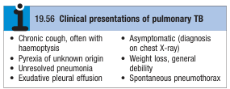
    - **Clinical features of extrapulmonary TB** - extra-pulmonary T accounts for 20% of cases in those who are HIV-negative, but is more common in HIV-positive individuals:
        - **Lymphadenitis** - most common extrapulmonary manifestation and represents a primary infection, spread from contiguous sites, or reactivation:
            - <u>Site</u> - cervical and mediastinal LN most common, followed by axillary and inguina LN (multiple regions may be involved)
            - <u>Onset</u> - insiduous onset
            - <u>Progression</u> - progressive enlargement
            - <u>Quality</u>:
                - Pain - painless enlargement of LN
                - Texture - soft and fluctuant due to caeseous necrosis and liquefaction, and may discharge through skin with the formation of 'collar-stud' abscess and sinus formation
                - Mobility - initially mobile but subsequently matted together
            - <u>Associated Sx</u> - 50% fail to show any constitutional features (e.g. fever or night sweats), but tuberculin test is always strongly positive
            - <u>Paradoxical enlargement</u> - during treatment, paradoxical enlargement represents immune reconstitution with new nodes and suppuration, but without evidence of continued infection
        - **Gastrointestinal TB** - can affect any part of the bowel, but 50% of cases are attributable to ileocecal disease
        - **Pericardial disease** - disease occurs in two forms, 1) pericardial effusion, and 2) constrictive pericarditis
        - **CNS disease** - TB meningitis is the most important forms of TB often presenting with headache and neck stiffness, and is highly fatal and debilitating
        - **Bones and joint disease** - TB spine (thoracic and lumbar) may manifest as chronic back pain, or in large joints such as hip or knee
        - **Genitourinary disease** - renal tract TB, endometritis, salpingitis, tubo-ovarian abscess, epididymitis or prostatitis

    
    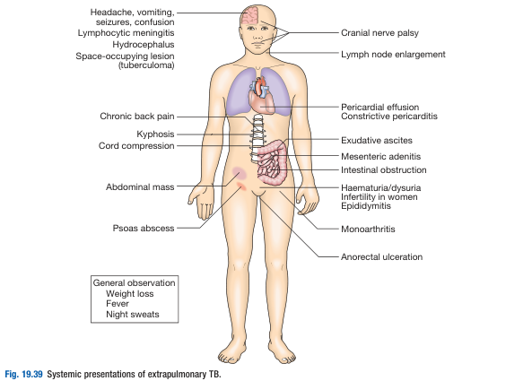
- **Chronic complications of TB:** 
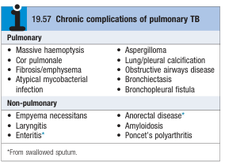
- **Ix and Dx of TB** - chronic cough or suspicious CXR changes should prompt further microbiological investigations:
    - **CXR** - characteristic findings of pulmonary TB:
        - <u>Consolidation</u> - pneumonia-like picture
        - <u>Collapse</u> - lobar opacification with ipsilateral mediastinal shift
        - <u>Cavitation</u> - cavitating lesions
        - <u>Miliary diffuse shadowing</u> - fine 1-2mm lesions distributed throughout lung fields, although ocassionally the appearance is coarser
        - <u>Pleural effusion</u> - blunting of costophrenic angle with fluid level

    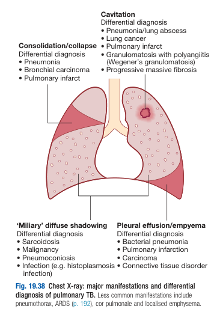 
    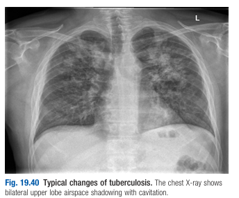
    - **Sputum examination** - G stain (microscopy), culture, nuclei acid amplification and ABx sensitivity testing:
        - <u>Sputum microscopy</u> (Ziehl-Neelsen staining) - +ve smear sufficient for presumptive Dx, Sn **proportional to bacillary burden in sputum** (typically +ve when 5000-10000 organisms present)
        - <u>Sputum culture</u> - **cornerstone for definitive Dx**, considered in both smear-positive cases and smear-negative cases:
            - **Medium and culture time:**
                - Solid media (LJ or Middlebrook media) - slower growth (4-6 weeks)
                - Liquid media (BATEC or MGIT) - faster growth (1-3 weeks)
        - <u>Drug Sn testing</u> - important in those w/ previous Hx of TB, treatment failure, or HIV positive patients
        - <u>Nucleic acid amplification</u> - potential role in aiding diagnosis and detection of rifampacine resistance (considered test of 1st choice in those w/ HIV or those suspected with MDR-TB)
    - **Immunoloigcal tests** - e.g. tuberculin skin test (low Sn/Sp only useful in primary or deep seated infections)
    - **Baseline bloods** - CBC, LRFT, ESR/CRP
    - **Additional Ix** - reserved for extra-pulmonary TB:
        - <u>Diagnostic thoracocentesis</u> - consider AFB smear and culture, ADA testing if present with pleural effusion
        - <u>Diagnostic paracentesis</u> - considered if suspecting tuberculous peritonitis
        - <u>Lumbar puncture</u> - if suspected TB meningitis
        - <u>Joint aspiration</u> - if suspected TB of a particular joint
        - <u>Early morning urine culture</u> - if suspected genitourinary TB
        - <u>Tissue biopsy</u> - e.g. BM examination/ liver biopsy may be diagnostic in milary TB
- **Mx:**
    - **Principles of Mx:**
        - <u>Prolonged multi-drug ABx</u> - 6mo therapy for all patients with new onset pulmonary TB, 12mo recommended for menigneal TB, TB spine
        - <u>Monitoring for treatment responsiveness</u> - further sputum smear or culture +/- radiographs to detect tratment responsiveness
        - <u>Regular monitoring for adverse drug reactions</u> - baseline LFT
    - **Anti-tuberculous therapy** - 2mo of HRZE an 4mo of HR for all pulmonary TB: 
    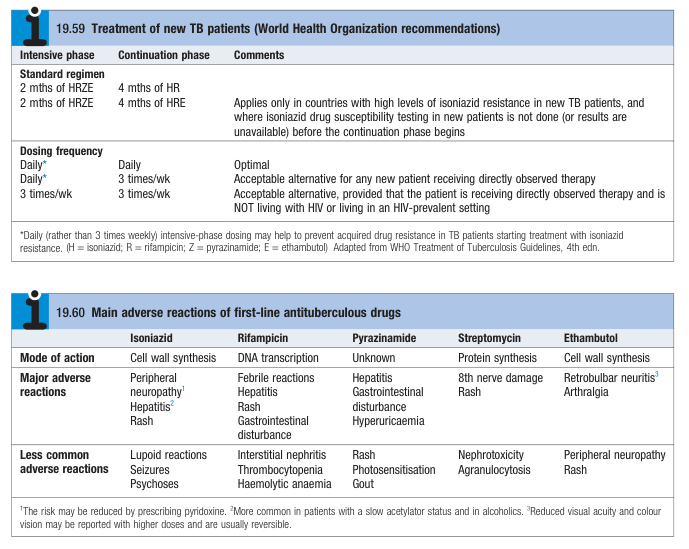
