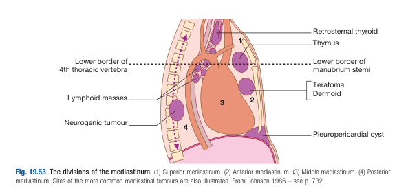
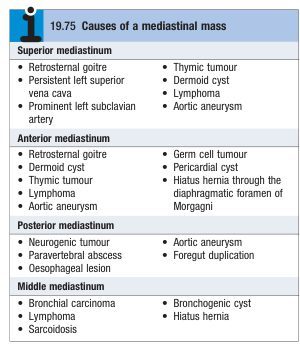

# Tumours of the Mediastinum

- **4 compartments of the mediastinum:**
    - Superior mediastinum
    - Anterior mediastinum
    - Middle mediastinum
    - Posterior mediastinum

  
  
- **DDx of mediastinal mass:** 

- **Clinical features of mediastinal mass:**
    - <u>Asymptomatic</u> - benign tumours and cysts in the mediastinum are often diagnosed incidentally for CXR, and are often asymptomatic as they do not invade vital structures
    - <u>Compressive effects on trachea and main bronchi</u> - manifests as cough, breathlessness, stridor or lung collapse if causing complete obstruction
    - <u>Compressive effects on esophagus</u> - due to dysphagia
    - <u>Left recurrent laryngeal nerve palsy</u> - results in hoarseness and bovine cough
    - <u>Sympathetic trunk</u> - Horner's syndrome
    - <u>Superior vena cava</u> - results in SVC obstruction
    - <u>Pericardium</u> - results in pericarditis and/or pericardial effusion
- **Ix:**
    - <u>CXR</u> - mediastinal tumour appears on CXR as sharply circumscribed mediastinal opacity encroaching on one or both lung fields
    - <u>CT thorax</u> - Ix of choice for mediastinal tumours
    - <u>Bronchoscopy</u> - if Dx of bronchial carcinoma clinically likely
    - <u>Mediastinoscopy</u> - visualisation and Bx of mass in the superior and anterior mediastinum
- **Mx** - surgical removal of mediastinal tumour as most results in compressive tumour sooner or later
