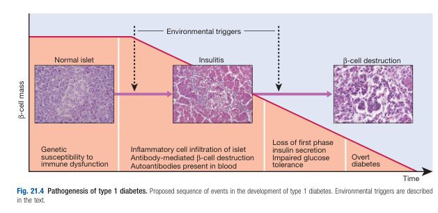
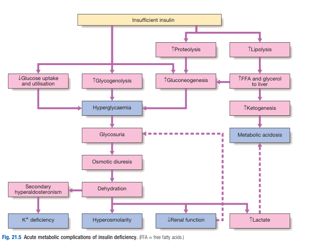

# Type 1 Diabetes Mellitus

- **Pathophysiology of T1DM:**
    - **Environmental triggers in a genetically predisposed individual** - genetic susceptibility appears to be a pre-requisite, but monozygous concordance rate is \< 40%, with wide geographical variations suggesting an environmental precipitant:
        - <u>Genetic predisposition</u> - \> 20 different regions shown some linkage with T1DM, most dnotably HLA-DQA1/DQB1 genes resulting in presentation of self antigens
        - <u>Environmental precipitant</u> - virus, drugs, chemicals or dietary constituents
    - **Autoimmune destruction of insulin-secreting B cells** - T cell-mediated autoimmune disease of the pancreatitis resulting in'insulitis' pathologically and subsequently beta-cell destruction 
    
    - **Progressive loss of beta-cell function** - loss of 80-90% of beta cell capacity results in marked hyperglycaemia and the manifestation of classical Sx of diabetes:
        - <u>Polyuria</u> - osmotic diuresis due to glycosuria
        - <u>Polydipsia</u> - increased fluid intake to maintain fluid balance against polyuria
        - <u>Marked weight loss</u> - due to catabolic effects of insulin deficiency
    - **Metabolic consequences of profund insulin deficiency** - occurs when beta cell dysfunction crosses a threshold, where hyperglycaemia results in beta-cell toxicity resulting in rapid progression of insulin deficiency:
        - <u>Profound hyperglycaemia and glycosuria</u> - results in polyuria and dehydration, nocturia, thirst, fatigue, and susceptibility to UTIs
        - <u>Unrestrained proteolysis and lipolysis</u> - underlies marked weight loss and diabetic ketoacidosis
        - <u>Hypokalaemia</u> - as a result of metabolic acidosis that drives K out of cells, and secondary hyperaldosteronism

    
    
