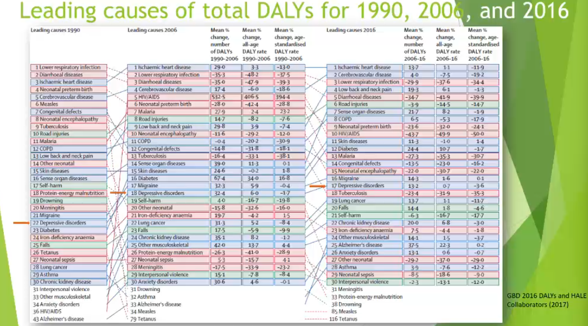
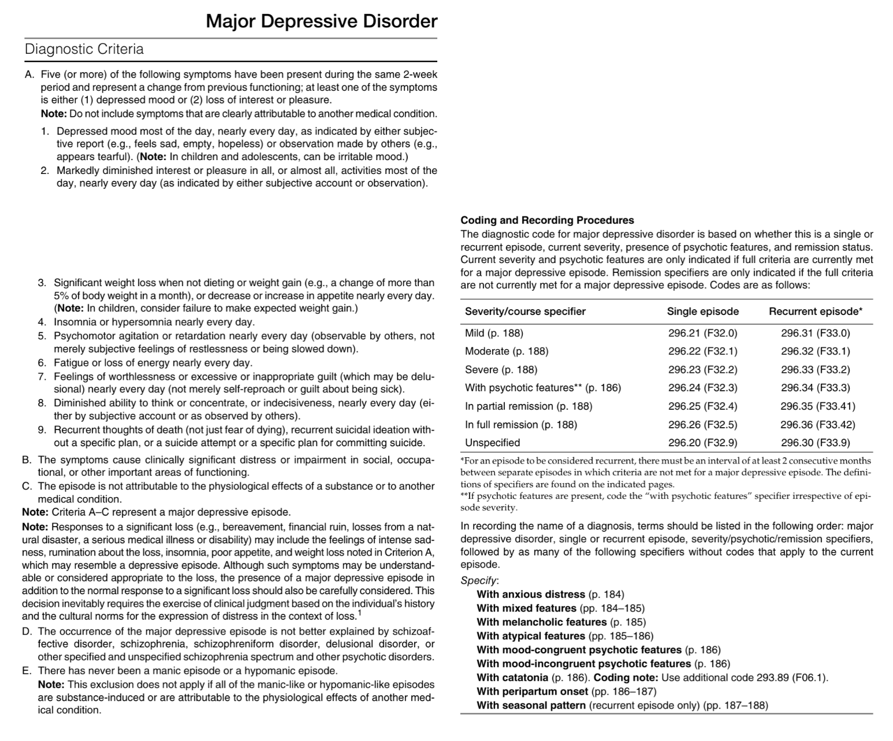
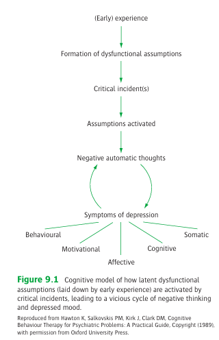
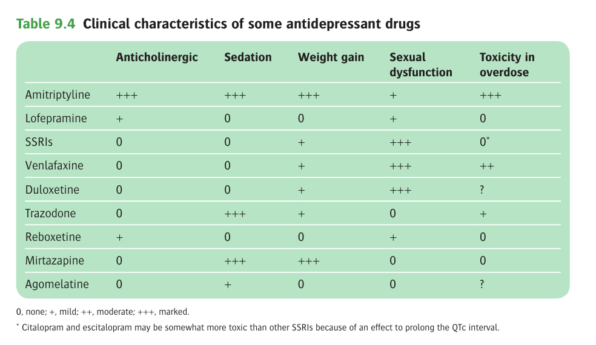

# Unipolar Depression and Major Depressive Disorder

- **Definition and terminology:**
    - <u>Mood disorders</u> - inappropriate mood characterised by persistent depression or elation (previously, some may consider anxiety a mood disorder)
    - <u>Depressive episode</u> - a clinical syndrome characterised by depressed mood, lack of enjoyment, negative thinking reduced energy and slowness
    - <u>Major depressive disorder</u> (MDD) - clinical diagnosis where predominant clinical picture is of a major depressive episodes where other psychiatric differential diagnoses have been ruled out (e.g. there has not been a manic or hypomanic episode)
- **Epidemiology:**
    - <u>Prevalence</u> - 5% of adults suffer from the disorder (280 million world wide)
    - <u>Geographic variation</u> - little variation between high-income and low-income countries interms of average lifetime risk and 12-mo prevalence
    - <u>Demographic</u> - mean age of onset ~27y, female preponderance (2:1)
    - Data in HK - Hong Kong Metal Morbidity Survey:
        - 6.9% - mixed anxiety and depressive disorder
        - 2.9% - depressive episode
    - <u>Societal burden</u> - one of the leading causes of DALY: 
    
- **Historical overview and psychodynamic perspectives:**
- **Depressive syndromes** - can be subdivided in different ways, but is grouped by severity:
    - Major depressive disorder (a/w various clinical variants or subtypes)
    - Mild depressive episodes (e.g. dysthymia)
    - Minor anxiety-depressive disorders
- **Clinical features of severe depiressive episode** - cardinal features include 1) low mood. 2) anhedonia, 3) negative thinking, and 4) reduced energy, all of which leads to decreased social and occupational functioning:
    - **Low mood** - one of pervasive misery, and does not improve substantially in circumstances where ordinary feelings of sadness would be alleviated (e.g. pleasant company, good news)
    - **Anhedonia** - lack of interest and enjoyment, where patients show no enthusiasm for activities and hobbies that they previously enjoy
    - **Depressive cognition** - negative thinking:
        - <u>Worthlessness</u> - patient thinks that they are failing in what they do and that other people see them as failure
        - <u>Pessimism</u> - pessimistic on future prospects, e.g. failure at work, misfortune in family, inevitable deterioration of health, and the patient generally expects the worst, which logically flows into the conclusion that life is not worth living and death would come as a welcome release, progression into thoughts of and plans for suicide
        - <u>Guilt</u> - unreasonable self-blame about minor matters (e.g. letting someone down), especially about past-trivial events that the patient have not thought of for years
    - **Psychomotor changes** - psychomotor retardation is frequent, although psychomotor agitation is also described:
        - <u>Psychomotor retardation</u> - slowness of thought evident by slowness of speech, with significant delay before questions are answered and excessive pauses in conversation, as well as a general slowness in daily actions (including walking)
        - <u>Agitation</u> - state of restlessness as observed by patient behaviour (e.g. plucking at their fingers, restless leg movement, pacing)
        - <u>Anxiety</u> - unexplained fear, that is frequent (although not invariably present) in severe depression
        - <u>Irritability</u> - tendancy to respond to w/ undue annoyance to minor demands and frustrations, which may be the predominent features in adolescents
    - **Biological symptoms** (melancholic/ somatic/ vegetive Sx) - very common in severe depressive episodes and less usual in mild depressive disorders:
        - <u>Sleep disturbances</u> - several kinds of sleep disturbance in depressive disorders:
            - **Early morning waking** - waking up 2-3h prior to usual times of waking and does not fall back asleep, often feeling restlness and agitated as the conscience is predominated by depressive thinking (pessimism about the upcoming day)
            - **Delay in falling asleep or interruptions in sleep** - alternative patterns of insomnia that may manifest in deppressive episodes
            - **Hypersomnia** - excessive sleeping despite waking up unrefreshed
        - <u>Weight changes</u> - weight loss in depressive episodes are typically explained by **loss of appetite** (weight gain occurs if eating provides temporarily relief of distressing feelings)
        - <u>Hypogonadotrophic hypogonadism</u> - can present w/ **loss of libido**, or **amenorrhoea** among women
        - <u>Other physical Sx</u> - non-specific complaints of fatigue, constipation, aching discomforts or pre-existing medical conditions
    - **Other features** - other psychiatric symptoms may occur <u>secondary to the depressive disorder</u>, and may dominate the clinical picture:
        - <u>Depersonalisation</u> - subjective detachment to one self
        - <u>Psychosis</u> - usually mood-congruent delusions and hallucinations revolving around the same themes as the non-delusional negative cognitions
        - <u>Obsession</u> - recurrent, persistent thoughts/ ideas that are experienced as unwanted and intrusive
        - <u>Panic attack</u> - often mixed w/ anxiety disorders
        - <u>Poor memory</u> - most patients commonly show some deficits in neuropsychological tasks, and may mimick that of dementia
- **Mild depressive episodes** - usually brief and co-incides w/ misfortune but usually recovers; those that <u>linger on for years on end w/o increase severity to MDD</u> are denoted as suffering from <u>dysthymia</u> (2y):
    - **Presence of the core features of depressive states** - low mood, anhedonia, and low energy states, occurs w/ less intensity and shorter duration
    - **Biological Sx generally absent in milder depressive states:**
        - <u>Sleep disturbances</u> - usually present, but usually inductional insomnia, or brief waking during the night, but **absence of EMW**
        - <u>Weight loss and poor appetite</u> - usually not found
        - <u>Loss of libido</u> - usually not found
    - **Additional neurosis** - more commonly seen in mild depressive states compared w/ MDD:
        - Anxiety and phobias
        - Obsessional Sx
        - Dissociative Sx
    - **Absence of psychosis** - absence of delusions and hallucinations
- **Minor anxiety-depressive disorders** (minor affective disorder) - applied when neither anxiety nor depressive Sx are severe enough to meet the criteria for an anxiety or depressive disorder:
    - **Clinical features of minor anxiety-depressive disorder** (Goldberg et al 1976) - most generally complain of somatic Sx:
        - Fatigue
        - Anxiety
        - Depression
        - Poor concentration
        - Insomnia
        - Somatic Sx and bodily preoccupations
    - **Burden** - can cause significant distress despite being "mild", w/ serious impact on personal and occupational dysfunction
- **Other clinical variants of depressive disorders:**
    - <u>Psychotic depression</u> - delusions and hallucinations secondary to the morbid mood states:
        - Usually mood congruent, as typically resolves around the same themes as the non-delusional thinking of moderate depressive disorders (e.g. worthlesness, guilt, ill-health), ocassionally are persecutory, although patients generally accept the supposed persecution as a punishment for themselves (cf non-affective psychosis)
        - Ocassionally mood-incongruent (Cotard's syndrome), rarely occurs, but presence appears to worsen prognosis of the illness
    - <u>Agitated depression</u> - depressive disorders where agitation is prominent, typically seen more in middle-aged and elderly patients than among younger individuals
    - <u>Retarded depression</u> - depressive disorders in which psychomotor retardation is especially prominent
    - <u>Depressive stupor</u> (of interest to Kraepelin) - form of retarded depression where **slowing of movement** and **poverty of speech** may become so severe that the patient is motionless and mute, although **recall of events after recovery is usually intact** (cf cases first described by Kraepelin is clouded due to other physiological disturbances like dehydration)
    - <u>Atypical depression</u> - a/w **temperental factors** such as rejection sensitivity, typically of depression of moderate severity characterised by 1) variable depressed mood w/ mood reactivity to +ve events, 2) overeating and oversleeping, 3) extreme fatigue (leaden paralysis), 4) pronounced anxiety
    - <u>Mixed depression</u> - depressive episodes w/ mixed features suggestive of mania, butdo not reach the threshold for Dx of bipolar disorder
- **Clinical course and prognosis of MDD:**
    - <u>Onset</u> - varies widely but 50% onset \< 21y; likely contributary factors varies widely between early- and late-onset cases
    - <u>Duration</u> - average length of depression episode arround 6 mo, but up to 25% will have episodes lasting 1y, or may develop a chronic unremitting course
    - <u>Relapse</u> - 80% with major depresison will experience further episodes:
        - On average 4 episodes over 25y follow up
        - Interval between episodes become progressively shorter
    - <u>Clinical remission</u>:
        - Only 25% achieve 5y of clinical stability w/ good social and occupational performance
        - 50% of patients do not achieve complete Sx remission in between episodes and experience continuing subsyndromal depressive symptomatology of fluctuating severity
    - <u>Mortality</u> - due to suicide and non-suicide causes (SMR 2x):
        - Rate of suicide in patients w/ depression \> 15x that of general population (and more common than in bipolar depression)
        - Risk of suicide tends to decrease as period of follow-up increases, possibly because mortality from natural causes become significant (also possible that risk of suicide highest in early stages)
        - Non-suicidal causes include cardiovascular disease, comorbid substance abuse etc.
- **Prognostic factors** - best predictor of future course is Hx of previous relapse, while other predictors of relapse include:
    - Incomplete Sx remission
    - Early age of onset
    - Poor social support
    - Poor physical health
    - Comorbid substance misuse
    - Comorbid personality disorder
- **Transcultural factors** - cultural variations impact clinical presentation:
    - Somatic presentations of depression are more frequent and prominent in <u>non-western cultures</u>, where important factor leading to somatisation appears to be related to <u>extent of stigmatisation to mental illnesses</u> (Nagayogo et al 2013)
    - Somatic metaphors of painful emotional states in certain cultures, where they are in fact aware of their low mood
- **Diagnostic criteria of major depressive disorder:** 

- **Etiology of unipolar depression:**
    - **Approach to understanding etiology of depression** - likely different in level of enquiry and should eventually involve one another:
        - <u>Psychological approach</u> - concerns psychosocial mechanisms to which recent and remote life-experiences can lead to depressive disorders
        - <u>Biological approach</u> - acknolwledges role of genetics, and neurobiological changes that contribute the symptomatology of depression
    - **Predisposing, precipitating and perpectuating factors:**
        - **Genetic causes** - however, estimated heritability is only 37% suggesting multifactorial causes:
            - +ve FHx of MDD in first-degree relatives increases risk by 3 fold
            - Twin studies showed high monozygotic concordance rate (45%), compared w/ dizygotic concordance rate (20%)
            - Polygenic inheritence w/ combination of multiple genes of modest effect, in the context of gene-environment interactions
            - GWAS showed potential candidates of several genes, such as receptors of the monoamine system but remains controversial at best
        - **Personality** - certain personality a/w predisposition of mood disorders:
            - <u>Premorbid anxiety</u> - clinical observations that pateints w/ depression often seem to have high levels of premorbid anxiety
            - <u>Sociotropic cognition</u> - a strong need for approval is a/w increased risk of depression after adverse life events
            - <u>Neurotism</u> - predisposes to major depression, although twin studies suggest neurotism and MDD share similar genetic traits
        - **Early environment:**
            - <u>Parental deprivation</u> - association cannot be demonstrated w/ parental death, but rather drawn w/ parental separation, suggesting that discord and diminished early care (in fact even in "intact families") predisposes to depression
            - <u>Relationship w/ parents</u>:
                - Physical/ sexual abuse is known risk factor of MDD
                - Parental style (including non-caring and overprotective parenting) a/w non-melancholic depression in adulthood
                - Post-partum depressions may result in poor attachment style in child and increases risk of deperssion
    - **Psychological approaches to etiology** - cognitive distortions:
        - **Cognitive distortions** - illogical ways of thinking that may be pathogenic:
            - <u>Arbitrary inference</u> - drawing a conclusion when there is no evidence for it and even some evidence against it
            - <u>Selective abstraction</u> - focusing on a detail and ignoring more important features of a situation
            - <u>Overgeneralisation</u> - drawaing a general conclusion on the basis of a single incident
            - <u>Personalisation</u> - relating external events to oneself in an unwarranted way
        - **Cognitive distortions may be interpreted as:**
            - Arising from the primary morbid mood state and results in depressive thinking
            - Results in dysfunctional beliefs (or schemas) that precede and predispose to depression
        - **Dysfunctional beliefs** - beliefs or schema that affects how we interpret life events:
            - <u>Origin of dysfunctional beliefs</u> - established early in life through childhood adversity
            - <u>Role of dysfunctional beliefs in precipitation of depression</u> - becomes activated by 'matching' life events:
                - e.g. in a person who has a dysfunctional belief of 'no one really likes me', depression may be easily provoked by a failed relationship
                - e.g. in a person who has a dysfunctional belief of 'I will never be competent', depression may be easily provoked by occupational failures

        
        
        - **Cognitive distortions may be tempermental:**
            - A negative biases in information processing
            - May predispose to the development of depression in context of psychosocial stress
            - As evident by studies demonstrating -ve biases in facial expression recognition, can be come demonstrated in both recovered depressed patients and those at high risk of depression prior to development of illness (consider the negative thought of presumably deemed worthless by others)
    - **Neurobiological approaches to etiology:**
        - **Assumption of the pathogenesis of depression:**
            - An organic brain disease a/w changes in brain neurochemistry and circuitry involved in emotional regulation
            - Irrespective of the provoking etiology
        - **Biological factors contributing to depression:**
            - Monoamine hypothesis
            - Amino acid neurotransmitters
            - Endocrine dysfunction
            - Immunological factors
- **DDx of depressive episodes:**
    - **Psychiatric differential diagnosis:**
        - <u>Sadness</u> - Dx of depression not to be made unless severe (\>5 Sx including cardinal features), prolonged (most of the day, nearly everyday for 2 weeks) and causes significant distress or functional impairment
        - <u>Adjustment disorder with depressed mood</u> - occurs in response to psychosocial stressor
        - <u>Anxiety disorder or mixed anxiety-depressive disorder</u> - esp. for those presenting w/ featuers of both
        - <u>Manic episodes with irritable mood or mixed episodes</u> - requires careful clinical evaluation of manic symptoms
        - <u>Mood disorders related to another medical condition</u> - e.g. neurological (MS, PD), endocrine (hypothyroidism), medication-induced, infectious disease
        - <u>Substance/medication-induced depressive or bipolar disorder</u> - a substance appears to be etiologically related to mood disturbance
        - <u>Attention-deficit hyperactivity disorder</u> - irritability, distractibility and low frustration tolerance are overlapping features in both disorders, esp. if the mood is characterized by irritable rather than depressed and anhedonic
    - **Medical differential diagnosis:**
        - <u>Neurological disorders</u> - e.g. Parkinson's disease, dementia, multiple sclerosis etc.
        - <u>Endocrinopathies</u> - e.g. hypothyroidism, hyperthyroidism, Addisons disease, Cushing's syndrome, hyperparathyroidism
        - <u>Medication-induced depression</u> - e.g. sedatives, methyldopa, alcohol, cocaine, amphetamines etc.
        - <u>Infectious disease</u> - e.g. HIV, Lyme disease, syphilis
- **Assessment of suspected depression:**
    - <u>Hx and MSE</u> - detailed psychiatric Hx, and medical Hx
    - <u>Standardised instrument</u> - objective measures of severity of depression
    - <u>Ix</u> - r/o medical conditions that cause depressive symptoms:
        - **Routines** - CBC, LRFT, TFT
        - **Additional Ix:**
            - Blood alcohol level
            - Toxicology screen
            - HIV test
            - ACTH stimulation test
            - Hormonal profile +/- MRI pituitary for causes of hypopituitarism
- **Goals of assessment of suspected depression:**
    - Decide whether Dx is depressive disorder
    - Assesment of severity and complete clinical picture
    - Assessment of risk of self harm and suicide
    - Form an opinion on the causes (including other psychiatric comorbidities such as substance misuse)
    - Assess patient's social resources
    - Guage the effect of the disorder on other people (e.g. effects of depressive delusions, most prominently infanticide in post-partum depression)
- **Standardised instruments for assessment of depression:**
    - Patient Health Questionnaire-9 (PHQ-9)
    - Hamilton Rating Scale for Depression (HAM-D)
    - Montgomery-Asberg Depression Rating Scale (MADRS)
    - Beck Depression Inventory (BDI)
    - Geriatric Depression Scale
    - Edingburgh Postnatal Depression Scale
- **Mx:**
    - **Principles of Mx:**
        - <u>Acute Tx</u> - pharmacological treatment as first line of Tx w/ adjuvant roles of psychological Tx
        - <u>Continuation and maintenance Tx</u> - to prevent the relapse and recurrence
    - **Continuation therapy for relapse prevention:**
        - Based on the fact that 1/3 of patients who are withdrawn from medication relapse within 1y, most occuring in the first 6mo
        - Continuation of AD Tx at <u>original effective dose</u> for <u>6mo past the point of remission</u> halves the relapse rate
        - In those w/ low risk of recurrence, prolonged continuation of AD confers little benefit except for in elderly (12 mo)
    - **Maintenence Tx for recurrence prevention** - indicated for those w/ Hx of recurrent depression (\>= 3 episodes in 5y):
        - Indefinite continuation of AD treatment for prevention of recurrence shown to reduce relapse rate (22% vs 78% over 3y \[Frank et al 1990\])
        - Prophyaltic dosing should be continued on the original effective dose or maximally-tolerated dose
        - Some role of lithium in maintenance therapy, but usually reserved for those on lithium augmentation
    - **Antidepressant drugs** - effective in the acute Tx of major depression, with greatest effect in those of at least moderate severity:
        - **Current evidences for antidepressant drugs:**
            - Guidelines by Cleare et al 2015 generally supports use of antidepressants in MDD (response rate 50% compared w/ placebo)
            - Similar response rates for dysthymia also supports use of antidepressants in dysthymia in meta-analysis by Levkovitz et al 2011
            - Antideppressants generally do not appear to be more effective than placebo in minor depression (Barbu and Cipriani 2011)
        - **Tricyclic antidepressants** - effectiveness demonstrated in severe depression compared w/ Placebo (Morris and Black 1974):
            - <u>Selection</u> - e.g. Lofepramine (relatively safe in overdose)
        - **Selective serotonin receptor inhibitors and Serotonin and noradrenaline reuptake inhibitors** (SSRIs and SNRIs):
            - <u>Selection</u>:
                - SSRIs - fluoxetine, setraline, escitalopram, citalopram
                - SNRI - venlafaxine, duloxetine
            - <u>Considerations</u>:
                - Venlafaxine (SNRI) appears to be more effective than SSRI in more severe depressive states
                - SSRIs are more effective than TCA where depression occurs in association w/ OCD
                - Escitalopram and setraline are demonstrated the most effective of SSRIs, but whether these differences are of clinical relevance
            - <u>Tolerance</u> - lower dropout rates due to S/E relative to tricyclics, and generally safe (although safety of velanfaxine and duloxetine has not been clarified)
        - **Monoamine oxidase inhibitors:**
            - <u>Considerations</u> - controversial role in the Tx of MDD w/ melanchoic features, limited by the dangerous reactions w/ high-tyramine foods:
                - Demonstrated to be equally effective as TCAs in placebo-control trials for moderate-to-severe depressive disorders
                - Reversible type A MAOI moclobemide appears to be effective in those non-responders to TCAs and SSRIs
        - **Clinical characteristics of antidepressants and S/E profiles:**
            - Anticholinergic S/E except in reboxetine and amitriptyline
            - Trazodone and mirtazapine are a/w sedation
            - Different drugs are a/w various extent of caridometabolic risks
            - Non-TCA drugs are generally less toxic in overdose compared w/ TCAs

      
      
    - **Lithium:**
        - <u>Role</u>:
            - Limited role as monotherapy in unipolar depression, but established role in bipolar disorders
            - Mainly used as adjuvant therapy, i.e. "lithium augmentation of antidepressant regimen" in Tx-resistant depression (not restricted to class of AD)
        - <u>Clinical efficacy</u>:
            - Nelson et al 2014 found that 40% respond to lithium augmentation (compared to 15% in placebo)
            - Some report marked improvement of Sx in as little as 48h, but gradual resolution of Sx over 2-3 weeks
    - **Anticonvulsants:**
        - No therapeutic efficacy in unipolar disorders
        - However known to prevent episodes of major depression in bipolar disorders, where lamotrigine shown to be effective for bipolar depressed patients w/ major symptomatology
    - **Atypical antipsychotics:**
        - Generally combined with AD for psychotic depressions
        - Some evidence for SGAs (e.g. ariprazole, quetiapine, risperidone, olanzapine) to have effect in Tx-resistant depressive diseases (Spielmans et al 2013)
    - **Electroconvulsive therapy:**
        - <u>Indications</u> - based on the prevailing evidence (UK ECT Review Group, Heijnen et al):
            - Psychotic depressions (esp. w/ delusions)
            - Prominent melancholic features such as early morning waking, marked weiht loss, psychomotor retardation
        - <u>Clinical efficacy</u>:
            - Comparison w/ simulated ECTs - 5 RCTs demonstrated that ECT is more effective than simulated ECT (anaesthesia w/ electrode application but no passage of current) for MDD
            - Comparison w/ AD - generally quicker effect, and possibly superior to TCAs (6 studies demonstrate superiority while 3 studies showed non-significant differences), w/ and most effective in the most severe episodes
    - **Psychological treatment:**
        - **General clinical management:**
            - Education, reassurance and encouragement to the patient
            - Care for patient's parner, other close family and people involved in care
        - **Forms of psychological treatment for depressive disorders:**
            - <u>Supportive psychotherapy</u> - identification and resolution of current life adversaries through problem identification and devising step-wise approach to tackling them (?probably less applicable for loss or financial difficulties)
            - <u>Cognitive behaviour therapy</u> - modification of depressed cognition or premorbid cognitive dysfunction and modification of behaviour towards life situations, generally useful (as effective as pharmacological therapy in moderate depression, but not effective as sole Tx in severe depression)
            - <u>Interpersonal psychotherapy</u> - systemic and standardised Tx approach to personal relationships and life problems
            - <u>Behavioural activation</u> - operant conditioning by tracking the links between action and emotional outcomes, assisting patients to engage in scheduled activities that have a positive impact on mood
            - <u>Couples therapy</u> - offered where interactions w/ partner appear to precipitating and perpectuating the depressive episodes
            - <u>Psychodynamic psychotherapy</u> - milder form of psychoanalysis directed towards uncovering inner developmental conflicts in the unconscious and attendant life difficulties causing the depressive disorder
    - **Other therapies:**
        - Sleep deprivation (brevity of effect makes it unpractical)
        - Bright light treatment (for seasonal \[winter\] depression)
