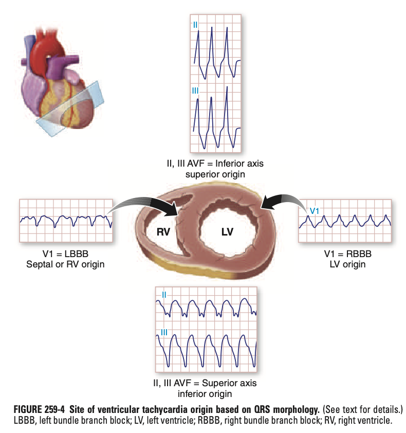
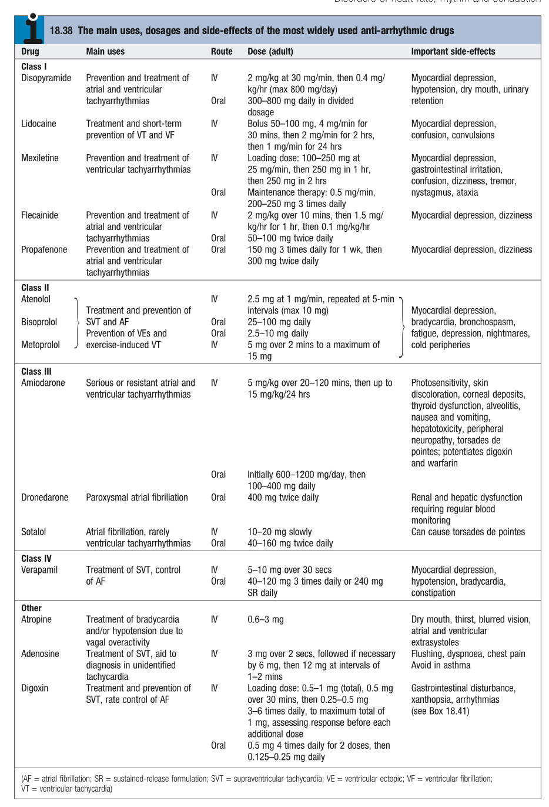
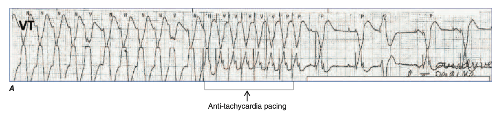
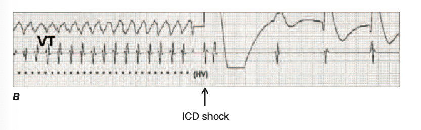

# Ventricular Arrhythmias

- **Definition** - broad group of rhythm disorders of ventricular origin
- **Spectrum of ventricular arrhythmias:**
    - <u>Nature</u> - benign to life-threatening VAs
    - <u>Structural cause</u> - in normal heart vs those w/ structural heart disease
- **Substrate of VAs:**
    - <u>Focal site of origin</u> - myocardial or specialised Purkinje cells capable of 1) automaticity, or 2) triggered activity
    - <u>Re-entrant circuit</u> - arises from several mechanisms:
        - Myocardial fibrosis (most common) - usually from an old MI, or a cardiomyopathic process
        - Diseased Purkinje conduction pathways - occurs less commonly
- **Types of VAs:**
    - **Premature ventricular complexes** (PVC) - also known as premature ventricular beats or premature ventricular complexes:
        - <u>Definition</u> - single ventricular beat that occurs earlier than the next anticipated supraventricular (usu. sinus) beat
        - <u>Unifocal vs multifocal PVCs</u> - based on morphology of the QRS complex:
            - Unifocal PVCs - originate from the same focus and hence have similar QRS morphology
            - Multifocal PVCs - originate from multiple foci, and hence have different QRS morphology
        - <u>Ventricular couplets and ventricular bigeminy</u>:
            - Ventricular couplets - two consecutive ventricular beats
            - Ventricular bigeminy - alternating sinus beat and PVC, resulting in a regularly irregular rhythm (N.B. causes pseudobradycardia as PVCs do not cause separate pulse wave)
    - **Ventricular tachycardia:**
        - <u>Terminology</u>:
            - Ventricular tachycardia - \>=3 consecutive beats of ventricular origin occuring at a rate \> 100 bpm
            - Idioventricular rhythm - \>=3 consecutive beats of ventricular origin occuring at a rate \< 100 bpm
            - Non-sustained ventricular tachycardia - VT that terminates spontaneously \< 30s
            - Sustained ventricular tachycardia - VT that persists for \> 30s or terminated by an active intervention (incl. shock from ICD)
        - <u>Monomorphic VT vs polymorphic VT</u>:
            - Monomorphic VT - VT w/ the same QRS morphology from beat-to-beat, indicating that the activation sequence is the same from beat to beat
            - Polymorhpic VT - VT w/ different QRS morphology from beat-to-beat, indicating changing ventricular activating sequence (N.B. congenital and acquired LQTS)
        - <u>Origin of VT</u> - see above on characterisation of VAs
    - **Ventricular flutter:**
        - <u>Definition</u> - very rapid monomorphic VT w/ sinusoidal appearance, as impossible to distinguish QRS complex from VT
        - <u>DDx of slow sinusoidal VTs</u>:
            - HyperK
            - Cx of Na channel blockers (tricyclic antidepressants, flecainide, propafenone)
            - Severe global myocardial ischaemia
    - **Ventricular fibrillation:**
        - <u>Definition</u> - continuous irregular activation w/ no discrete QRS complexes
        - <u>Etiology</u> - any causes of sustained monomorphic or polymorphic VT (esp. cardiac ischaemia)
- **Characterisation of VAs based on ECG appearance and duration:**
    - <u>Duration</u> - typically wide QRS (\> 120 ms), often rather broad if VTs (\> 140 ms):
        - Depolarisation throughout the ventricular myocardium from ventricular focus or re-entrant circuit exit, is slower than activating ventricles over healthy Purkinje system
        - Unusual situations can arise w/ narrow QRS complex as well
    - <u>Axis and morphology</u> - often reveals the site of origin of the arrhythmia, suggesting whether idiopathic or associated w/ structural heart disease:
        - Origin from RV or septum - late activation of much of the LV, resulting in prominent S wave in V1 in LBBB pattern
        - Origin from LV - late activation of much of the RV, resulting in RBBB pattern
        - Origin from cranial portion of ventricles - inferior axis, dominant R waves in II, III, aVF
        - Origin from inferior wall - superior axis, dominant S waves in II, III, aVF

    
    
- **Clinical manifestations of VAs:**
    - **Asymptomatic**:
        - <u>On routine clinical assessment</u> - through detection on P/E, cardiac monitoring, exercise stress test
        - <u>Pseudobradycardia</u> - erroneously low HR in case of ventricular bigeminy
    - **Palpitations** - awareness of an abnormal heart beat, whereby descriptions may vary for different VAs:
        - <u>PVCs</u> - an **instant sensation**, often a pounding beat (due to increased ventricular filling) after a dropped beat ("flip and jolt sensation"), ocassionally **radiates to the neck**
        - <u>Sustained monomorphic VTs</u> - discrete bouts of very rapid heart rate often a/w features of haemodynamic comprimise
    - **Haemodynamic comprimise:**
        - <u>Pre-syncope or syncope</u> - usually due to VT resulting in hypotension and subsequently reduced cerebral hypoperfusion, often w/o prodrome
        - <u>Exercise intolerance and SOBOE</u> - VT resulting in acute pulmonary oedema
        - <u>Chest pain</u> - VT resulting in myocardial ischaemia due to increased myocardial demand
    - **Sudden cardiac death** - cardiac arrest (pulseless) as a result of pulseless VT, or that of degeneration into VF (esp. in those w/ structural heart disease or sustained VT)
- **Approach to evaluation of patients w/ documented or suspected cardiac arrhythmia:**
    - <u>Initial Mx</u> - resuscitation of sustained WCTs and cardiac arrests as per ACLS protocol
    - <u>Evaluation of clinical significance of the arrhythmia through workup</u>:
        - Establish whether VA is the cause of Sx or clinical presentation
        - Determine association w/ a structural or non-structural cardiac disease
        - Prognostication of the disease, esp. association w/ SCD
    - <u>Mx geared towards prognostication</u> - guided by possibility of recurrence and risk imposed by a recurrence
- **Risk of cardiac arrest and SCD:**
    - Determined by the likelihood of arrhythmia recurence
    - Determined by Sx and risk imposed by the recurrence (largely determined by cause of arrhythmia and underlying structural heart disease)
- **Dx** - an electrophysiological Dx based on recording the arrhythmia on ECG, which may be:
    - Detection of 12-lead ECG correlating to the duration of sx
    - Detection by an ambulatory or implanted cardiac monitoring
    - Detection by an implanted rhythm management device such as a pacemaker or ICD
    - Detection by initiation of the arrhythmia in electrophysiological study
- **Evaluation of the patient w/ arrhythmia Sx:**
    - <u>Goals of initial evaluation</u> - determine 1) Sx severity, 2) provocative factors, and 3) presence of underlying heart disease
    - <u>Approach to evaluation evaluation</u>:
        - Hx (assessment of disease severity, evaluation of alternate explanations of Sx, PMH, Drug Hx \[esp. for drugs causing QTc prolongation\], and FHx)
        - P*E (evidence of structural heart disease +*- identification of genetic arrhythmia syndromes)
        - 12-lead ECG (obtained even when patient has no Sx at time of evaluation)
        - Cardiac imaging (echocardiography, cardiac MRI) for assessment of ventricular morphology and funciton in suspected heart disease
- **Approach to 12-lead ECG in patient w/ suspected VAs:**
    - <u>Rate and rhythm</u>:
        - Sinus rhythm - many patients w/ idiopathic arrhythmias usually present w/ sinus rhythm
        - Premature ventricular complexes - may ocassionally be detected
    - <u>Axis</u> - LAD, RAD etc.
    - <u>Intervals</u>:
        - QRS complex - wide vs narrow; **pathological Q waves**; bundle branch morphology; **epsilon wave** (ARVD)
        - QTc - esp. in patients w/o evidence of structural heart disease:
            - Long QT syndrome
            - Short QT syndrome
    - <u>Chamber enlargements</u> - detection of LVH or RVH which may indicate hypertrophic cardiomyopathy
    - <u>ST segments</u> - ischaemic changes; **Brugada syndrome**
- **Mx:**
    - **Principles of Mx:**
        - <u>Factors influencing Tx factors</u> - 1) Sx burden (frequency and severity), 2) presence of avoidable provocating factors, 3) underlying structural heart disease and SCD risk, and 4) occupation
        - <u>Tx options for ventricular arrhythmias</u>:
            - ICD implantation - provide a "safety net" for those w/ risk of SCD, by terminating life-threatening VT or VF, w/o preventing the arrhythmia
            - Arrhythmia suppression (consider risk and potential benefits imposed) - through 1) antiarrhythmic drugs, 2) catheter ablation, or 3) arrhythmia surgery
    - **Anti-arrhythmic drugs:**
        - **Considerations for the need of anti-arrhythmic drugs** - based on consideration of risks and potential benefits for the individual patients:
            - Efficacy for the patient is not always predictable and are assesed based on therapeutic trials
            - Side effects are unpredictable, but may include 1) non-cardiac drug intolerance (e.g. GI, pneumonitis), and 2) cardiac adverse effects
            - Cardiac adverse events include 1) "**proarrhythmia**" (increasing frequency of arrhythmia or produces a new arrhythmia), and 2) **aggravation of bradyarrhythmias**
        - **Classification of antiarrhythmic drugs** - conventionally classified based on actions on receptors or ion channels, but most have multiple effects:
            - Beta-adrenergic blockers (BB)
            - Non-dihydropyridine calcium channel blockers (CCBs)
            - Sodium channel-blocking agents (class I antiarrhythmic agents)
            - Potassium channel blocking agents (class III antiarrhythmic agents)

      
      
        - **Beta-blockers** (BB):
            - <u>Selection</u> - atenolol, bisoprolol, metoprolol
            - <u>MOA</u> - inhibition of sympathetic stimulation as most VTs are provoked by adrenergic stimulation (w/ synergistic effects w/ other antiarrhythmic agents)
            - <u>Indications</u> - 1st-line therapy:
                - Particularly useful for exercise-induced VAs or idiopathic VAs
                - Limited for VAs a/w structural heart disease
            - <u>S/E</u> - generally safe medication:
                - Aggravation of bradyarrhythmias
                - Negative inotropic effects (causes hypotension)
        - **Calcium channel blockers** (CCBs):
            - <u>Selection</u> - non-DHP CCBs such as **diltiazem** or **verapamil**
            - <u>MOA</u> - -ve inotropic effects
            - <u>Indications</u> - effective for some idiopathic VTs
            - <u>S/E</u>:
                - Low risk of proarrhythmias
                - Precipitate hypotension due to -ve inotropic and vasodilatory effects
        - **Sodium channel-blocking agents** (Class I anti-arrhythmic agents):
            - <u>Selection</u>:
                - Class Ia drug (prolongs action potential through K channel blockade) - disopyramide (PO), quinidine (IV, PO)
                - Class Ib drug (shortens action potential) - lidocaine (IV), mexiletine (PO)
                - Class Ic drug (no effect on action potential) - flecainide, propafenone
            - <u>MOA</u> - fast inward sodium current blockade in variable tissue, resulting in **prolongation of QRS complex**:
                - Reduced membrane excitability (and hence automaticity) of ventricular tissues
                - Reduced conduction velocity of ventricular tissues
                - N.B. quinidine, disopyramide and procainamide may have class III anti-arrhythmic effect
            - <u>S/E</u>:
                - Proarrhythmic effect (w/ possible exception of quinidine)
                - Bradyarrhythmias (possible contribution to increased mortality observed in post-MI patients when adminstered chronically)
                - Myocardial depression
        - **Potassium channel-blocking agents** (Class III anti-arrhythmic agents):
            - <u>Selection</u>:
                - Sotalol - class III antiarrhythmic effect w/ non-selective beta-adrenergic-blocking activity
                - Dofetilide - isolated class III antiarrhythmic effect
                - Amiodarone - multi-class effects (see below)
            - <u>MOA</u> - blockade of delayed rectifier K channels (Ikr):
                - Increased refractoriness
                - Prolongation of QT interval and hence action potential duration
            - <u>Dosing</u> - requires renal-dose adjustment and avoidance due to renal insufficiency
            - <u>C/I</u> - avoided in patients w/ increased risk of TdP:
                - QTc prolongation
                - Medications that prolong QTc
                - HypoK
                - Significant bradycardia
            - <u>S/E</u> - TdP due to QT prolongation (3-5%)
        - **Amiodarone** (most effective anti-arrhythmic drug for suppressing VAs):
            - <u>MOA</u> - class I-IV anti-arrhythmic effects
            - <u>Indications</u> - chronic use usu. in patient w/ structural heart disease:
                - IV bolus for active-life-threatening arrhythmias
                - Chronic PO therapy for arrhythmia suppression usually in patient w/ structural heart disease (EP effects takes days to develop)
            - <u>S/E</u>:
                - Ventricular proarrhythmias (TdP rare)
                - Hyper- or hypo-thyroidism
                - Pneumonitis or pulmonary fibrosis (~1%; in dose-dependent manner)
                - Hepatotoxicity
                - Peripheral thrombophlebitis (if IV amiodarone for \> 24h)
    - **Implantable cardioverter-defibrillators** (ICDs):
        - <u>Clinical efficacy</u> - decreased mortality and SCD in patients at risk for SCD due to structural heart disease
        - <u>MOA</u>:
            - Detection of sustained VT based largely based on HR
            - Possible **anti-tachycardia pacing** (ATP) for termination of monomorphic FT through bursts of rapid pacing faster than VT 
            
            - Delivery of synchronised shock if ATP fails, as in the case of rapid VT 
            
            - VF termination through unsynchronised shock between lead in RV and ICD generator (transvenous device)
            - Additional pacing for bradycardia
        - <u>Indications</u> - recommened only if an **expectation for survival \> 1y w/ acceptable function capacity** (except if awaiting cardiac transplatation or those awaiting CRT)
        - <u>Complications of transvenous ICD</u>:
            - Vascular occlusion
            - Risk of lead fracture (results in delivery of unecessary theray)
            - Infective endocarditis/ device infection (1%)
            - Difficulty w/ removal
            - Delivery of unecessary therapy (ATP or shocks against SVT or noise as a result of lead fractures)
            - PTSD (as shocks are uncomfortable and distressing for the conscious patients)
        - <u>Approach to evaluation of a patient after ICD shock</u> - note occurence of arrhythmia, despite terminated predicts subsequent increased mortality or increased risk of HF:
            - Retrieval of ECG readings from the ICD to determine rhrythm diagnosis and exclude unnecessary therapy
            - Identify reversible causes - 1) myocardial ischaemia, 2) electrolytes, 3) worsening HF
            - Consider arrhythmia suppression through 1) antiarrhythmics (esp. amiodarone) or 2) catheter ablation
    - **Catheter ablation for VT:**
        - <u>Indications</u> - only performed for those w/ recurrent VAs associated w/ poor cardiac function (as means to improve cardiac function)
        - <u>Procedure</u> - applying RFA current to induce thermal injury of the **arrhythmia substrate**:
            - Electroanatomical construction through **electroanatomic mapping system** (via electrode catheters) to identify the arrhythmia substrate (regions of low-voltage and slow conduction)
            - Deliver RFA to the identifiable substrates either 1) through endovascular approach (if endocardial substrate) or 2) through percutaneous pericardial puncture (if subepicardial substrate)
        - <u>Factors affecting effectiveness of procedure</u>:
            - **Size** of arrhythmia substrate (idiopathic VTs and PVCs usually have small substrate and higher chance of success)
            - **Location** of arrhythmia substrate (e.g. those a/w old infarct will localise to endocardium, where as those a/w ischaemic CM may be intramural and difficult to ablate)
        - <u>Complications</u>:
            - Procedure-related mortality (0.5-3%)
    - **Arrhythmia surgery** - options include:
        - Surgical cryoablation
        - Aneurysectomy (for recurrent VT due to prior MI)
