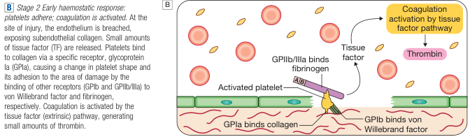
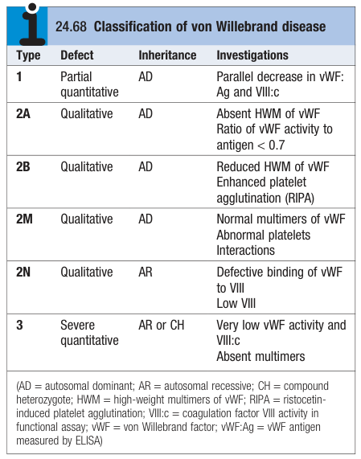

# Von Willebrand Disease

- **Definition** - most common inherited coagulation disorder, although usually mild, characterised by qualitative or quantitative defect of Von Willebrand factor (vWF)
- **Physiology of vWF** - expressed by megakaryocytes and endothelial cells w/ role in regulating platelet function and coagulation:
    - <u>Platelet adherance</u> - vWF essential for interaction of subendothelial collagen and platelets necessary for platelet plug adherance to site of vessel injury 
    
    - <u>Protection of factor VIII</u> - carrier protein for factor VIII to prevent it from proteolysis (vWF deficiency results in lowered factor VIII levels)
    - <u>Association w/ blood group Ag</u> (antigen A and B) - vWF is often expressed w/ antigen A or B if present, preventing its degradation (hence blood group O patients tend to have lower levels of vWF)
- **Types and pathophysiology of Von Willebrand disease:**
    - <u>Type 1 von Willebrand disease</u> - quantitative decrease in a normal functional vWF
    - <u>Type 2 von Willebrand disease</u> - qualitative defect of vWF, where nature of abnormality depends on site of mutation:
        - **Type 2A disease** - mutations in platelet binding site affecting platelet function
        - **Type 2B disease** - mutation in the platelet glycoprotein Ib binding site affecting platelet function
        - **Type 2N disease** - mutations in the factor VIII binding site resulting in lower levels of factor VIII
        - **Type 2M** - mutations resulting in other abnormalities in platelet binding
    - <u>Type 3 von Willebrand disease</u> - rare, near-total asbence of vWF and subsequently absence of multimers

  
  
- **Clinical features of von Willebrand disease** - similar clinical manifestation as platelet function disorders:
    - Mucocutaneous bleedings - e.g. superficial bruising, epistaxis, menorrhagia, or GI bleeding
    - Excessive haemorrhage may be observed after trauma or surgery
- **Ix** - Dx of type of bleeding by characterising reduced activity of vWF and factor VIII:
    - Functional measure of vWF (vWF activity)
    - Antigenic measure of vWF
    - Multimeric analysis of protein
    - Functional testing (e.g. binding to glycoprotein Ib \[RIPA\])
    - Factor VIII assay
- **Mx:**
    - **Principles of Mx:**
        - <u>Tx of bleeding episode</u> - e.g. local measures or w/ DDAVP +/- antifibrinolytic (tranexamic acid)
        - <u>Supplementary factor VIII concentrates</u> - for serious or persistent bleeds or type 3 patients
    - **DDAVP:**
        - <u>MOA</u> - raised vWF and subsequently raised factor VIII
        - <u>C/I</u>:
            - Severe arterial disease
            - Young children
            - 2B disease (risk of thrombocytopenia)
