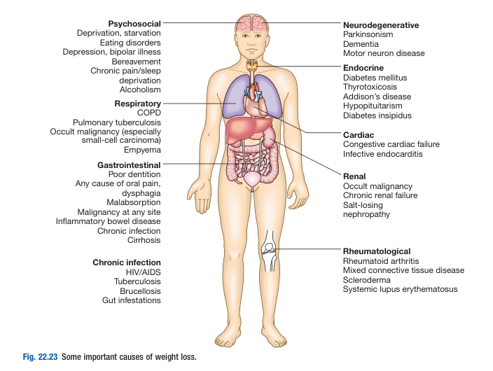
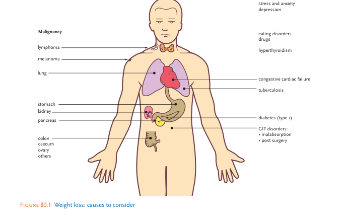
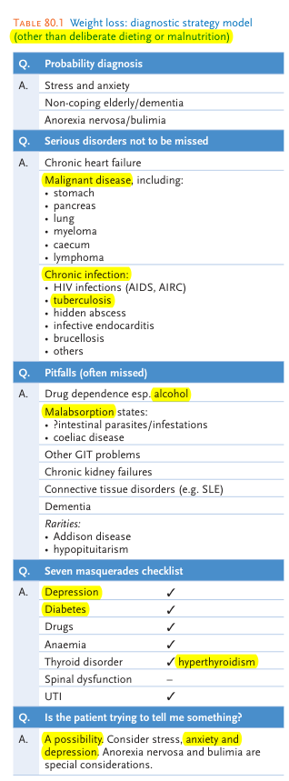

# Weight Loss

- **Definition** - decrease in body weight, where loss of \> 3kg (or \> 10%) over 6 mo is considered significant weight loss
- **Key facts and checkpoints:**
    - Significant weight loss is defined as any loss of \> 5% of normal body weight
    - Most common cause of recent weight loss is stress and anxiety
    - Key organic diseases to consider:
        - Malignant disease
        - Thyrotoxicosis
        - Diabetes mellitus
        - Chronic infections
    - Most important variable to consider is appetite - appetite and weight goes hand in hand except for certain organic conditions such as thyrotoxicosis and late DM
    - Organic diseases a/w weight loss may also result in 1) anaemia, and 2) fever, which must be excluded
    - Early detection of eating disorders improves outcomes
- **DDx of weight loss:**
    - <u>Physiological weight loss</u> - esp. in patients w/ change in diet, physical activity or social circumstances
    - <u>Psychiatric illnesses</u> - e.g. eating disorders (anorexia nervosa, bulimia), affective disorders, alcoholism (due to self-neglect and poor dietary intake)
    - <u>Gastrointestinal disease</u>:
        - **Dysphagia and GOO** - causes significant weight loss by reducing food intake
        - **Malabsorption** (pancreatic or SB disease) - causes weight loss by reducing absorption and specific nutritional deficiencies
        - **GI malignancies** - causes weight loss by mechanical obstruction, anorexia, or cytokine-mediated systemic effects
    - <u>Systemic diseases</u>:
        - Respiratory diseases - COPD, pulmonary TB, occult malignancy, empyema
        - Cardiac diseases - congestive heart failure, infective endocarditis
        - Rnenal disease - chronic renal failure, salt-losing nephropathy
        - Endocrine disease - DM, Thyrotoxicosis, Hypopituitarism, Addison's disease
        - Chronic inflammatory or rheumatological diseases - during active flares of RA, SLE, Mixed CTD, polymyalgia rheumatica
        - Chronic infections - HIV/ AIDS, TB, Brucellosis, gut infestations by parasites or protozoas
        - Occult malignancy - often a **late feature of disseminated malignancy**
	  
	  
- **Murtagh's diagnostic approach to weight loss:** 
    - 
    
    - 
    
	- **Probability diagnosis:**
		- <u>Planned dietary restriction</u> - most common cause of weight loss (although typically do not present)
		- <u>Malnutrition</u> - esp. in elderly, deprivation, neglect, alcoholism
		- <u>Psychological factors</u> - **stress and anxiety** is the most common cause of weight loss that presents, although more serious psychiatric illnesses (e.g.GAD, MDD) must be ruled out
	- **Serious disorders not to be missed:**
		- <u>Malignancies</u> - can theoretically arise from any malignancy, but may be <u>the sole presenting symptom</u> in GI cancers (particularly, **stomach**, **pancreatic tail**, **caecum**), **lymphoma** and **myeloma**
		- <u>Chronic infections</u>:
			- **Tuberculosis** - must be considered considering our locality
			- **Infective endocarditis** - some cases may be more chronic and present w/ non-specific general debility, weight loss and fever as major features (absence of S/S of HF)
			- **HIV infection** - must be considered in high-risk groups
			- **Hidden abscesses**
			- **Other infections** - brucellosis, fungal infections, parasitic infections
	- **Pitfalls:**
		- <u>Subsance abuse</u> - alcohol and narcotic drug abuse often a/w <u>malnutrition</u> and hence weight loss (often w/ peripheral oedema often due to long-standing hypoalbuminaemia)
		- <u>Malabsorption</u> - many non-malignant GI disorders may be a/w weight loss (see notes on malabsorption)
		- <u>Rare endocrine disorders</u>:
			- **Addison disease** - cortisol deficiency presents often w/ non-specific Sx, but should prompt consideration if presenting w/ vascular comprimise (postural hypotension), while hyperpigmentation is often a late sign
			- **Hypopituitarism** - may present as medical emmergency due to ACTH deficiency
	- **Seven masquerades checklist** - all applicable but most important being 1) Depression, 2) Diabetes, and 3) thyroid disorders and 4) drugs:
		- <u>Depression</u> - proportional to severity, a/w loss of 4 classical drives (appetite, energy, sleep and sex)
		- <u>Diabetes mellitus</u>:
			- **T1DM** - typically initial subacute presentation w/ **classical triad** of polyuria, polydypsia and weight loss **within weeks**, ocassionally with DKA in a young patient
			- **T2DM** - rarely initial presentation, but may occur in late DM
		- <u>Thyrotoxicosis</u> - key differentiating feature includes **weight loss despite excellent appetite**, +/- presence of thyrotoxic symptoms (excellent differentiation from psychoneurotic disturbances like depression)
		- <u>Drugs</u> - many drugs (importantly digoxin, cytotoxic agents, NSAIDs) can cause weight loss by causing anorexia
	- **Special considerations:**
		- <u>Psychogenic disorders</u> - feature of anxiety, depression, but also in psychotic disturbances (e.g. schizophrenia and mania) may present w/ weight loss
		- <u>Eating disorders</u> - anorexia nervosa and bulimia, almost **confined to 12-20y F**
		- <u>Hypopituitarism</u> - strong differential for eating disorders as occuring in a similar demograhic, but with confounding effects as anorexia nervosa can result in inhibition of HPO axis, while hypopituitarism may also manifest as reduced appetite
- **Salient points of Hx:**
    - **Demographic** - age, sex, occupation has <u>greatest bearings on the likely DDx</u> (e.g. eating disorder of young female, malignant disease in elderly)
    - **HPI** - onset, duration, exact quantification of weight loss, association w/ diet and appetite:
        - <u>Onset and duration</u> - when have you noticed a recent weight loss?
        - <u>Quantification of weight loss</u>:
            - Exactly how much weight have you lost and over how long?
            - Have your clothes become looser?
        - <u>Association w/ diet and appetite</u>:
            - Have you recently changed your diet in any way?
            - Has your appetite changed? Do you feel like eating?
    - **Ideas, concerns and expectations:**
        - <u>Ideas</u> - what do you think of your recent weight loss (你點睇最近輕咗)?
            - In fact some patients welcome the weight loss and aren't too anxious about it
            - Some patients may attribute it to general features such as loss of appetite (still many DDx), stress and anxiety, poor sleep etc.
            - Some patients are more concerned regarding potential for organic diseases (see below)
        - <u>Concerns</u> - what are you most concerned about your recent weight loss (有冇最擔心啲咩)?
            - Malignant disease
            - Thyroid disorders
            - Diabetes
            - Gastrointestinal disturbances
        - <u>Expectations</u> - what are your expectations for this consultation?
    - **Associated Sx:**
        - <u>Heat intolerance and sweating</u> - heat intolerance is specific for thyrotoxicosis, but may reflect underlying fever (chronic infections), while sweating may point towards thyrotoxicosis, but may be a Sx of hypoglycaemia (DM), or anxiety
        - <u>Tremors</u> - thyrotoxic, hypoglycaemic, or anxiety Sx
        - <u>Polyuria and polydipsia</u> - presence of polyuria, polydipsia weight loss points towards DM
        - <u>Diarrhoea</u> - reflects underlying gastrointestinal disease from colorectal cancer, to others
        - <u>Nausea and vomiting</u> - retracted vomiting may result in poor nutrition
        - <u>Altered bowel habits</u> - for lower GI malignancies
        - <u>Tenesmus</u> - for rectal CA
        - <u>Fever</u> - points towards underlying chronic infection (esp. TB and IE), as well as haematological malignancies (e.g. lymphoma)
        - <u>Night sweats</u> - due to lymphoma or TB
    - **PMH** - ask about general health, past GI surgery, and drug Hx
    - **SHx:**
        - <u>Smoking</u> - risk of lung and GI malignancies
        - <u>Alcohol</u> - chronic alcoholism may attribute to serious disorders, but in general can result in general malnutrition
    - **Menstrual Hx for female of reproductive age** - screen for hypopituitarism
    - **FHx** - for malignancies
    - **Systems review:**
        - Cardiorespiratory Sx - cough and sputum, shortness of breath
        - GI Sx - abdominal pain, stearrhoea
    - **Psychiatric assessment** - if applicable:
        - Do you feel uptight, worried or anxious?
        - How is your mood recently?
        - Do you ever force yourself to vomit (if bulimia concerning)
        - I feel like there is something you're trying to tell me
- **P/E:**
    - **General examination** - vital signs, general appearance (cachexia), pallor, temperature
    - **Examination of neck and thyrotoxic signs** - goitre, sinus tachycardia/ AF, lid lag, lid retraction etc.
    - **Abdominal examination:**
        - Tenderness
        - Masses
        - Hepatomegaly
    - **PR examination** - any melaena
    - **Reflexes**
    - **Chest examination**
- **Ix:**
    - **Routine bloods** - CBC, LFT, ESR/CRP, TFT, RBG
    - **Urine** - urinalysis
    - **CXR**
    - **Additional Ix** - dependent on likely diagnosis:
        - Faecal calprotectin
        - USG/ CT
        - OGD
        - Colonoscopy
