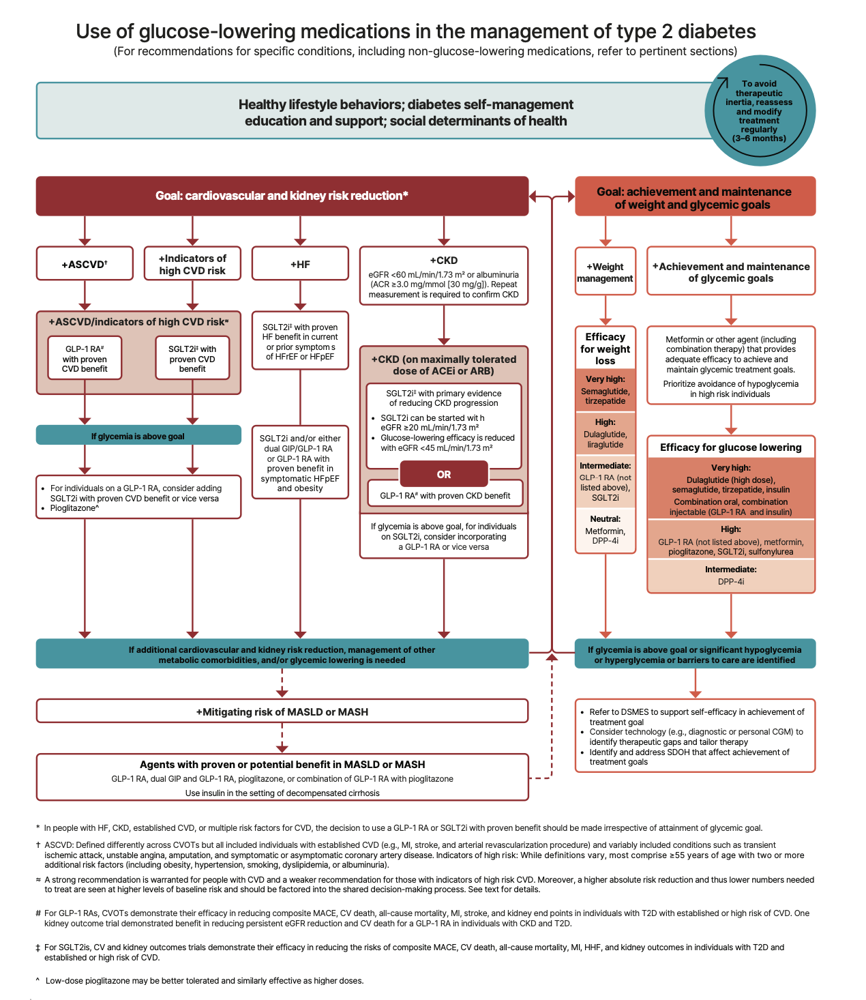
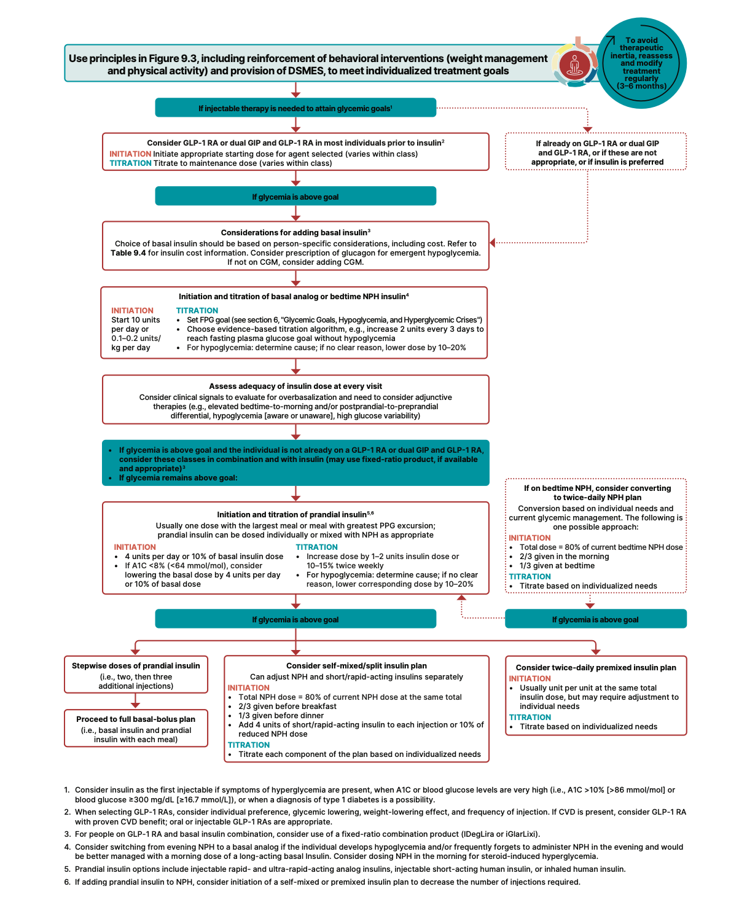

# 1. Improving Care and Promoting Health in Populations

# 2. Diagnosis and Classification of Diabetes

# 3. Prevention or Delay of Diabetes and Associated Comorbidities

# 4. Comprehensive Medical Evaluation and Assessment of Comorbidities

# 5. Facilitating Positive Health Behaviors and Well-being to Improve Health Outcomes

# 6. Glycemic Goals, Hypoglycemia, and Hyperglycemic Crises

# 7. Diabetes Technology

# 8. Obesity and Weight Management for the Prevention and Treatment of Diabetes

# 9. Pharmacological Approaches to Glycemic Treatment

## Pharmacologic Therapy for Adults with Type 1 Diabetes

## Pharmacological Therapy for Adults with Type 2 Diabetes

- **Recommendations:**
    - 9.5 (Level E): A person-centered shared decision-making approach should guide the choice of glucose-lowering medications for adults with type 2 diabetes. Use medications that provide sufficient effectiveness to achieve and maintain intended treatment goals with consideration of the effects on cardiovascular, kidney, weight, and other relevant comorbidities; hypoglycemia risk; cost and access; risk for adverse reactions and tolerability; and individual preferences
    - 9.6 (Level A): Consider combination therapy in adults with type 2 diabetes for initial treatment to shorten time to attainment of individualized glycemic goals
    - 9.7 (Level A): In adults with type 2 diabetes and established or high risk of atherosclerotic cardiovascular disease, the treatment plan should include medications with demonstrated benefits to reduce cardiovascular events (e.g., glucagon- like peptide 1 receptor agonist \[GLP-1 RA\] and/or sodium–glucose cotransporter 2 \[SGLT2\] inhibitor) for glycemic management and comprehensive cardiovascular risk reduction (irrespective of A1C)
    - 9.8 (Level A): In adults with type 2 diabetes who have heart failure (HF) (with either reduced or preserved ejection fraction), an SGLT2 inhibitor is recommended for both glycemic management and prevention of HF hospitalizations (irrespective of A1C)
    - 9.9a (Level A): In adults with type 2 diabetes, obesity, and symptomatic heart failure with preserved ejection fraction (HFpEF), the glucose-lowering treatment plan should include a dual glucose- dependent insulinotropic polypeptide (GIP) and GLP-1 RA with demonstrated benefits for HF-related symptoms and reduction in HF events (irrespective of A1C)
    - 9.9b (Level A-B): In adults with type 2 diabetes, obesity, and symptomatic HFpEF, the glucose-lowering treatment plan should include a GLP-1 RA with demonstrated benefits for HF-related symptoms
    - 9.10 (Level A): In adults with type 2 diabetes who have chronic kidney disease (CKD) (with confirmed estimated glomerular filtration rate \[eGFR\] 20–60 mL/min/ 1.73 m2 and/or albuminuria), an SGLT2 inhibitor or GLP-1 RA with demonstrated benefit in this population should be used for both glycemic management and for slowing progression of CKD and reduction in cardiovascular events (irrespective of A1C) (Fig. 9.4). The glycemic benefits of SGLT2 inhibitors are reduced at eGFR \<45 mL/min/ 1.73 m2
    - 9.11 (Level B-C): In adults with type 2 diabetes and advanced CKD (eGFR \<30 mL/ min/1.73 m2), a GLP-1 RA is preferred for glycemic management due to lower risk of hypoglycemia and for cardiovascular event reduction. Individuals on dialysis can be safely initiated or continued on GLP-1–based therapy (that is not dependent on kidney clearance) to reduce cardiovascular risk and mortality.
    - 9.12 (Level A): In adults with type 2 diabetes, metabolic dysfunction–associated steatotic liver disease (MASLD), and overweight or obesity, consider using a GLP-1 RA with demonstrated benefits in metabolic dysfunction–associated steatohepatitis (MASH) or a dual GIP and GLP-1 RA with potential benefits in MASH for glycemic mmanagement and as an adjunctive therapy to intervention for weight loss.
    - 9.13a (Level A): In adults with type 2 diabetes and biopsy-proven MASH or those at high risk for liver fibrosis (based on noninvasive tests), a GLP-1 RA is preferred for glycemic management due to beneficial effects on MASH. Pioglitazone or a dual GIP and GLP-1 RA can be considered for glycemic management due to potential beneficial effects on MASH.
    - 9.13b (Level B): Combination therapy with pioglitazone plus a GLP-1 RA can be considered for the treatment of hyperglycemia in adults with type 2 diabetes with biopsy-proven MASH or those at high risk of liver fibrosis (identified with noninvasive tests) due to potential beneficial effects on MASH.
- **Considerations in the selection of oral antidiabetic drugs** (OAD) in the Mx of T2DM:
    - Glycaemic goals
    - Weight goals (achievement of weight goals a/w multifaceted benefits including reduction of A1c, reduction of hepatic steatosis, and improvement of cardiovascular dissease)
    - Risk for hypoglycaemia
    - History or risk factors for cardiovascular, kidney, liver, and other comorbidties and complications of diabetes
    - Tolerability and side effects of medications
    - Complexity of the medication plan (relative to individual's capacity to implement in the specific situation and context)
    - Access to, cost of, and availability of medications
- **Timing of pharmacotherapy:**
    - At the time of type 2 diabetes mellitus, without delay
    - Medication plans should have adequate efficacy to achieve an dmaintain individualised treatment goals with respect to glucose lowering, reduction of cardiovascular, and kidney disease risks, weight management, and effects on other health conditions and treatment burden
- **Approach to choice of OAD in the Mx of T2DM:** 

    - In those w/ evidence of ASCVD, high risk of ASCVD, HF, or CKD, the goal is for cardiovascular and kidney risk reduction, and Tx plan should include agents that reduce cardiovascular and kidney disease risk
    - Additional considerations regarding the mitigation of metabolic dysfunction-associated steatotic liver disease (MASLD) to guide selection of initial therapy
    - In those w/o additional considerations informing choice of therapy, initiation or intensification of pharmacological therapy usually involves metformin due to its safety and efficacy compared to sulphonyurea and DPP-4 inhibitors
- **Metformin:**
    - <u>Pharmacolkinetics</u> - renal clearance
    - <u>S/E</u>:
        - Gastrointestinal intolerance (bloating, abdominal discomfort, diarrhoea) - may be mitigated by gradual dose titration +/- using extended-release formulation
        - Lactic acidosis - increased risk in those w/ eGFR \< 30 ml/min, and those w/ eGFR 30-45 ml/min due to periodic decreases of eGFR to lower ranges
        - B12 deficiency - can mimic worsening of symptoms of neuropathy (periodic testing of B12 levels)
- **Comparative glucose-lowering efficacy of different pharmacological agents** - primarily examined through network meta-analysis and a f ew prospective head-to-head RCT (e.g. GRADE trial):
    - Largest reductions of A1c levels achieved in treatment plans that include insulin, select GLP-1 RAs (semaglutide), and dual GIP-GLP1 RAs (tirzepatide)
    - Smallest reductions of A1c levels was seen in use of DDP-4 inhibitors
- **Considerations early intensification through initial combination therapy** - traditionally as step up from metformin:
    - People presenting w/ A1c 1.5-2% above individualised goals (incorporation of high-glycaemic efficacies)
    - People high risk of ASCVD, established CVD, CKD <u>irrespective of A1c therapy</u> (combination w/ GLP1-RA and SGLT2i)
- **Early intensification through combination therapy:**
    - Rationale is to achieve legacy effect or early provision of cardiorenal protection
    - Increased risk of hypoglycaemia and weight gain which is a/w worse CVOTs
    - Generally combination therapies are less tolerated
- **Approach to escalation of pharmacological therapy of T2DM** - should not be delayed (therapeutic inertia):
    - <u>Combination OAD therapy</u> (or switch to more potent OAD) - considered if A1c is \>= 1.5% above the individualised glycaemic goals
    - <u>Insulin therapy</u> - should be oconsidered as part of combination therapy as:
        - Extremely severe hyperglycaemia (A1c \>= 10%; FBG \>= 16.7 mmol/L; or presence of polyuria and polydipsia)
        - Evidence of catabolic features (e.g. weight loss, hypertriglyceridaemia, ketosis)
        - Trial of GLP-1 RAs as first injectable as these may be sufficient for achieving individualised A1c goals w/ lower risk of hypoglycaemia, and a more favorable weight, cardiovascular, renal, and liver profiles
- **Indications for Tx deintensification** - when fewer pharmacological agents thought to be able to maintain A1c levels:
    - Weight loss
    - Optimization of lifestyle behaviour
    - Intolerable S/E including hypoglycaemia (consider discontinuation of causative agent, and avoid discontinuation of agents w/ no cardiorenal or metabolic benefits)
- **Glucose-lowering therapy for people with cardiovascular disease or risk factors for cardiovascular disease** - includes ASCVD, high-risk of ASCVD, and HF:
    - **Evidence favourable selection of certain therapy** - less robust data available for low-to-moderate risk of ASCVD although acceptable:
        - **High risk or established cardiovascular disease:**
            - <u>SGLT2i</u> - demonstrable cardiovascular benefit independent of A1c w/ or w/o metformin use, and in consideration of person-specific factor
            - <u>GLP1-RA</u> - demonstrable cardiovascular benefit independent of A1c w/ or w/o metformin use, and in consideration of person-specific factor
            - <u>Dual GIP GLP-1 RA</u> - demonstrable effects for patients w/ obesity and HFpEF
        - **Low-to-moderate risk of ASCVD:**
            - GRADE trial demonstrate benefits of liraglutide (GLP-1 RA) in reducing cardiovascular effects, although no significant differences for MACE, HF hospitalisations or cardiovascular death
    - **Approach to selection of OAD:**
        - Can be considered as monotherapy or w/ add-on metformin for glycaemic control and cardiovascular protection
        - If already on other OADs w/ target glycaemic control achieved, consider switching to these preferred agents for added cardiovascular benefit
- **Glucose-lowering therapy for people with chronic kidney disease:**
- **Glucose-lowering therapy for people with metabolic comorbidities:**
- **Approach to insulin therapy** - main role is for achieving glycaemic control (and thuse CVOTs, although absence of effect independent of A1c): 

    - <u>Basal insulin</u> - often initial regimen w/ added to non-insuling glucose-lowering medications, titrated upwards from 0.1-0.2 units/kg/d (however note phenomenon of over-basalisation)
    - <u>Basal plus regimen or bidaily pre-mixed insulin</u> - indicated if A1c remains high despite acceptable fasting blood glucose level, evidence of significant post-prandial hyperglycaemia, or signs of hyperbasalisation
    - <u>Basal-bolus insulin</u> - as intensive insulin therapy, requires significant pattern management
- **Basal insulin:**
    - <u>Selection</u> - insulin NPH vs insulin glargine/ degludec:
        - Insulin NPH is an intermediate-acting hypoglycaemia and is the conomical choice
        - U-100 glargine demonstrated to reduce the risk of level 2 hypoglycaemia and nocturnal hypoglycaemia compared to NPH insulin
    - <u>MOA</u> - replacement of insulin, principally to restrain hepatic production during:
        - Overnight fast
        - Between meals
    - <u>Dosing</u> - dependent on body weight and degree of hyperglycaemia:
        - Starting dose of 0.1-0.2 U/kg/d
        - Up-titration using evidence-based titration algorithm at 2 units every 3 days
        - Titrate for fasting plasma glucose goal of \< 7.8 mmol/L
    - <u>Limitations and S/E</u>:
        - Nocturnal hypoglycaemia (aware or unware) - reduce dose by 10-20% and evaluate for cause
        - Overbasalisation (esp. if evidence of normalisation of FG despite suboptimal A1c suggesting of glucose variability esp in post prandial state)
- **Prandial insulin and combination injection therapy:**
    - <u>Indications</u>:
        - Suboptimal A1c despite acceptable FBG
        - Evidence of significant postprandial hyperglycaemia
        - Signs of over-basalisation
    - <u>Rigemens</u> - total daily dose (TDD) up to 1 unit/kg/d:
        - Basal-plus regimen - prandial insulin for the largest meal or meal w/ greatest post-prandial excursion to suppress post-prandial hyperglycaemia, w/ starting dose of 4 units or 10% of basal insulin, titrate upwards by 2-3 units twice weekly against post-prandial glucose
        - Bidaily insulin - two doses of premixed insulin (different doses)
        - Basal-bolus regimen - prandial insulin for all meals
    - <u>Comparison between regimens</u>:
        - Basal-plus regimen - greater flexibility for those who eat on irregular schedules or have variable meal content
        - Bidaily insulin - simple and more convenient, and often less costly
- **DDx of suboptimal A1c despite normal fasting glucose:**
    - Hidden hyperglycaemia (e.g. Dawn phenomenon, postprandial hyperglycaemia)
    - Falsely elevated A1c due to increased RBC survival
- **Concentrated insulin:**
    - Allows for higher dose of basal insulin administration per volume used (fewer ingestions for goal dose)
    - May have distinct pharmacokinetics, e.g. U-500 regular insulin has similar onset but delayed, blunted, or prolonged peak effect than U-100 insulin
- **Alternative insulin routes:**
    - Continuous insulin pumps (may be connected to CGM as artificial pancreas)
    - Inhaled insulin (as prandial corrective doses and appears to have faster onset and shorter duration converting to clinically meaningful A1c reductions and weight reductions but significant increase risk of deteriorating lung functions)\* 10. Cardiovascular Disease and Risk Management

# 11. Chronic Kidney Disease and Risk Management

# 12. Retinopathy, Neuropathy, and Foot Care

# 13. Older Adults

# 14. Children and Adolescents
