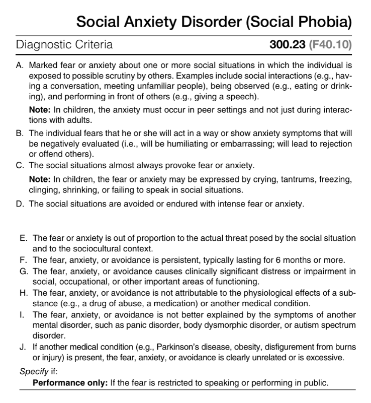
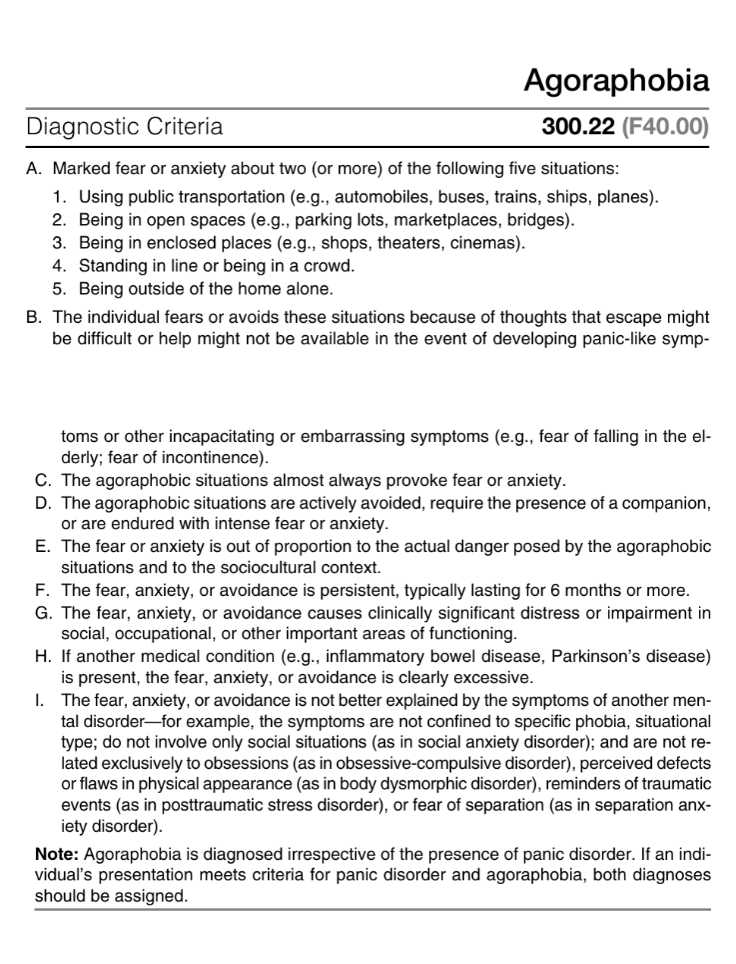

# Anxiety Disorders

- **Overview** - anxiety disorders are heterogenous groups of disorders that share features of <u>excessive fear and anxiety</u>, and <u>related behavioural disturbances</u>:
    - **Fear** - an emotional response to real or perceived imminent threat
    - **Anxiety** - fear due to anticipation of future threat
- **Associated features of fear:**
    - <u>Surges of autonomic arousal</u> - necessary fo fight or flight
    - <u>Cognitions</u> - thoguths and preparation of imminent danger
    - <u>Behaviour</u> - associated escape behaviour
- **Associated features of anxiety:**
    - <u>Somatic symptoms</u> - often less autonomic arousal Sx (but do occur in panic attack disorders), but more commonly a/w muscle tension
    - <u>Cognition</u> - vigilance in preparation of future danger
    - <u>Behaviour</u> - cautious or pervasive avoidance behaviour to limit fear or anxiety
- **Distinguishing between developmentally normative fear or anxiety and anxiety disorders** - how to differentiate normal from abnormal:
    - <u>Timing in relations to development</u> - persistance beyond developmentally appropriate periods is a/w anxiety disorders
    - <u>Severity</u> - excessive anxiety where the clinician deems the individual has <u>overestimated the danger in situations</u> in the situations feared or avoided
    - <u>Duration</u> - persistance anxiety state with a diagnostic cut-off at \> 6mo, with allowance for some degree of flexibility and shorter duration in children
- **Approach to anxiety disorders:**
    - <u>Classification by objects or situations</u> - a/w single objects (phobic disorders), or diffused
    - <u>Classification by age of onset</u> - different anxiety disorders are a/w different typical age of onset

## Separation Anxiety Disorder

## Selective Mutism

## Specific Phobia

- **DSM-V diagnostic criteria for specific phobias:**  

- **Diagnostic features:**
    - **Phobic stimulus** - fear or anxiety that is <u>immediately</u> circumscribed to presence of a particular situation or object, that does not <u>remind them of a past traumatic event</u>
    - **Nature of fear response** - must differ from normal, transient fear that commonly occurs in normal socio-cultural context:
        - <u>Intense and severe</u> (Criterion A) - the degree of anxiety posed may have a dose-response relationship and vary with proximity (e.g. in anticipation or in actual presence of object or situation)
        - <u>Immediate</u> (Criterion B) - fear and anxiety occurs as soon as the phobic stimulus is encountered (i.e. immediate and not delayed)
        - <u>Predictable</u> (Criterion C) - fear or anxiety is evoked **nearly every time** the individual comes into contact with the phobic stimulus, but degree may vary with each encounter due to various contextual factor (e.g. duration of exposure, other threatening factors)
        - <u>Avoidance</u> (Criterion C) - individual actively avoids the situation if able to:
            - **Active avoidance** - behaviour that are designed to prevent or minimise contact with phobic stimulus, or changed living environment to accomodate their fears, such that there may be the absence of overt anxiety
            - **Passive avoidance** - behaviour to limit proximity to and duration w/ the exposure
        - <u>Out-of-proportion</u> (Criterion D) - individual often overestimates the danger of the feared situations (which is deemed by the clinician), and often the individual often recognises their reaction as disproportionate
    - **Persistence of fear and anxiety response** (Criterion E) - typically lasting for \> 6mo, but only serve as a general guide, especially has causing clinical distress
    - **Distress and functional limitation** (Criterion F) - causes clinically significant distress or impairments in social, occulational or other importance areas of functioning (often as a result of active avoidance or the general incapacity upon encounter of phobic stumulus)
- **Associated features:**
    - **Autonomic arousal symptoms** - typically mild and variable, in anticipation of or during exposure of phobic stimulus as a result of SNS stimulation by the amygdyla
- **Epidemiology:**
    - <u>Prevalence</u> - 7-9% in US (lower in Asian countries, e.g. 2-4%)
    - <u>Demographic</u>:
        - Age - more common in children (5%) and adolesence (16%), but rates lower in older patients (diminished severity to subclinical level possibly due to adaptation)
        - Sex - female preponderance (M:F = 2:1), but rates vary across different phobic stimuli
- **Development and course:**
    - **Age of onset** - typically developing in <u>early childhood</u> usually \< 10y (median age of onset between 7-11 y/o), but likely dependent on the phobic stimulus (e.g. situational specific phobias tend to have later stage of onset than natural environment, animals or blood-injection-injury)
    - **Precipitating event** - many individuals are <u>unable to recall</u> the specific reason for the onset of phobia, but may develop:
        - Following a <u>traumatic event</u> (e.g. being attacked by animal)
        - Observation of <u>others going through a traumatic event</u> (e.g. watching someone drown)
        - <u>Information transmission</u> (e.g. via social media of a plane crash)
        - <u>Unexpected panic attack</u> in to be feared situation (e.g. unexpected panic attack in subway)
    - **Clinical course** - typically wax and wane during childhood and adolescence, but may never remit if enabled to persist during childhood
- **Risk and prognostic factors:**
    - **Temperamental factors:**
        - <u>Negative affectivity</u> - e.g. neuroticism
        - <u>Behavioural inhibition</u>
    - **Environmental factors:**
        - <u>Previous negative encounters</u> - e.g. previous precipitating traumatic effects as above
        - <u>Parental factors</u> - e.g. parental over protectiveness, parental loss and separation
    - **Genetic and physiological factors:**
        - <u>Genetic factors</u> - genetic susceptibility to a certain category of specific phobia which results in increased risk of developing the same specific phobia if present in first-degree relatives
        - <u>Physiological factor</u> - excsesive physiological response to phobic stimulus may reinforce the 'learned' fear (e.g. propensity of blood-injection-injury phobia to have vasovagal syncope)
- **Functional consequences of specific phobia** - similar pattern of impairment in psychosocial functioning and decreased QoL as other anxiety disorders:
    - <u>Nature of functional limitation may be related to the specific phobia</u>:
        - Individuals with blood-injection-injury specific phobias are often reluctant to obtain medical care even when a medical concern is present
        - Fear of falling may result in reduced mobility and engagement in social activities
    - <u>Degree of distress and impairment correlates to number of phobic stimulus</u> - possibly because there are more avoidance behaviour that leads to limited activities that do not result in fear and anxiety
- **Psychiatric DDx of specific phobias:**
    - **Other anxiety disorders:**
        - <u>Agoraphobia</u> - situational specific phobias may resemble agoraphobia (e.g. fear of flying and elevators resemble fear of public transportation), hence probing for other phobias (e.g. of crowds), or reason for phobia (e.g. difficulty in escape) to identify agarophobia
        - <u>Social anxiety disorder</u> - considered if reason for fear is explicitly because of -ve evaluation
        - <u>Separation anxiety disorder</u> - if the situational specific phobia is separation from attachment figure
        - <u>Panic disorder</u> - raises suspicion if panic attacks are unexpected and not response to the phobia stimulus
        - <u>Obsessive-compulsive disorders</u> - considered if the fear is related to an obsessive thought
    - **Trauma- and stressor-related disorders** - traumatic events can precede both trauma-related disorders or specific disorders, but if both diagnostic criteria, a diagnosis of PTSD should be assigned instead
    - **Eating disorder** - if avoidance behaviours are related to avoidance of food and food-related cues
    - **Schizophrenia spectrum and other psychotic disorders** - when the fear and avoidance are due to delusional thinking

## Social Anxiety Disorder (Social Phobia)

- **DSM-5 diagnostic criteria of social phobia:** 

- **Diagnostic features of social phobia:**
    - **Social anxiety** - anxiety, or marked, intense, fear of social situations in which the individual may be scrutinized by others:
        - <u>Setting</u> - occurs in one or more social situations (A), and the fear or anxiety is out-of-proortion to actual threat imposed (E):
            - Social interactions such as conversations, meeting unfamiliar people
            - Being observed while performing an act (e.g. eating or drinking)
            - Performing in front of others (including public speaking, or other performances due to their profession \[e.g. musicians\])
            - Note that in children, it must occur also in peer settings, not just in front of adults
        - <u>Timing</u> - almost always provoked by the specific social situation (B), although the anxiety manifestation may vary across different occasions
        - <u>Cognition</u> - the individual fears that he or she will be **negatively evaluated**:
            - Concerned will be judged for a variety of reasons, as anxious, weak, crazy, stupid, boring, intiidating, dirty, or unlikable
            - Meta-cognition that he or she will show anxiety symptoms such as blushing, trembling, sweatling, or stammering, that may be negatively evaluated by others
            - Some also fear offending others, e.g. by gaze or showing anxiety symptoms, which is a predominant fear in **cultures with strong collectivistic orientations**
            - Some fear rejection from others
        - <u>Avoidance</u> - certain maladaptive behaviours to avoid certain social conditions, but if unavoidable, social situation is endured w/ intense fear or anxiety (D):
            - Avoidance may be subtle:
                - Overpreparing of speech if related to performance
                - Limiting eye contact and diverting attention to others especially with unfamiliar people
                - Fear of trembling may avoid drinking, writing, or pointing in public
                - Fear of sweating may avoid shaking hands or eating spicy food
                - Fear of blushing may avoid performance, bright lights, or discussion about intimate topics
                - Some fear urination in public restrooms (i.e. paruresis or "shy bladder syndrome")
            - Avoidance may be extensive, e.g. not going to school, not going to paraties
            - Fear in children and wish for avoidance may be expressed by crying, tantrums, freezing, clining, or shrinking in social situations
        - <u>Duration</u> - persistent, typically lasting \>= 6mo (F):
            - Usually used as a general guide, but to avoid overdiagnosis of transient social fears that are common particularly among children and in the community
            - Allowance of some degree of flexibility
        - <u>Distress and functional impairment</u> - fear, anxiety and avoidance must cause significant clinical distress, or impairment in social, occupational, or other important areas of functioning (G):
            - Usually interferes w/ normal routines, or results in passing up important social/ occupational/ schooling opportunities through avoidance
            - Likely dependent in normal social and occupational roles, e.g. fear of public speaking would not be impairing if one does not require to speak
- **Associated features supporting diagnosis** - certain features could be identified through interview and the mental state examination:
    - **General shyness** - patient may be <u>inadequately assertive</u> (push-over) or <u>excessively submissive</u>:
        - <u>Appearance and behaviour</u>:
            - Overly rigid body posture
            - Inadequate eye contact
            - Blushing (hallmark physical response of social anxiety disorder)
        - <u>Speech and thought</u> - overall less open to conversation:
            - Tone and volume - overly soft voice
            - Content - disclose little about themselves, may divert attention away from oneself (ocassionally manifests as highly controlling of the conversation)
    - **Occupation:**
        - May seek employment in jobs that do not require social contact
        - May not be the case for performance-only social anxiety disorder
        - Women who normally wanted to work outside of home may live life as a homemaker and mother
    - **Maladaptive behaviours:**
        - <u>Self-medication</u> - substance use, e.g. drinking alcohol before going out to party
        - <u>Staying at home</u> - esp. for M, living at parental home longer
    - **Somatic complaints** - older adults may result in exacerbation of symptoms and medical illnesses, e.g:
        - Tremors
        - Tachycardia
- **Epidemiology:**
    - <u>Preavlence</u> - 12mo prevalence worldwide ranges from 0.5-2% (7% in the US)
    - <u>Demographic</u>:
        - Age - median age of onset is 13y; prevalence **decreases w/ age**
        - Sex - rather complex relationship:
            - Estimated female preponderance (F:M = 1.5-2.2:1)
            - Most pronounced in younger ages
            - However slightly more M in clinical settings
            - Assumed to be due to gender roles and social expectations resulting in heightened help-seeking behaviour in male patients (i.e. more likely to affect work)
- **Development and course:**
    - <u>Onset</u> - 75% onset between 8-15y (median age of onset 13y):
        - Usually emerges from childhood Hx of social inhibition or shyness in US and European studies
        - May follow a stressful or humiliating experience (e.g. being bullied, vomiting during public speaking)
        - First onset in adulthood is relatively rare, usually a/w life changes that result in a change in social roles
    - <u>Setting, level and reason of fear, anxiety and avoidance may be dependent on age</u>:
        - **Broader pattern of fear and avoidance w/ age:**
            - Younger adults may express higher level of social anxiety for specific situations, while older adults may express lower level of social anxiety but experienced in a broader range of situations
            - The same can be said when compared between young children and adolescence
        - **Cognition may differ w/ age:**
            - Older adults may be more concerned w/ disability, embarassment of symptoms due to medical conditions (e.g. tremors in Parkinsonism), or functioning (e.g. incontinence, cognitive impairment)
    - <u>Progression</u>:
        - In the community, 30% undergo remission within a year, and 50% experience remission in several years
        - Those that present to clinical setting take a more persistent course
        - 60% of individuals who do not receive specific treatment will take a longer course
- **Risk and prognostic factors:**
    - <u>Temperamental factors</u> - fear of negative evaluation, behavioral inhibition
    - <u>Environmental factors</u> - early-onset psycosocial adversities, childhood maltreatment
    - <u>Genetic factors</u> - heritable, first degree relatives have 2-6x greater chance of having social anxiety disorders
- **Culture-related diagnostic issues:**
- **Gender-related diagnostic issues:**
    - F w/ social anxiety disorder report greater number of social fears and have greater psychiatric comorbidities, such as depressive, bipolar, and anxiety disorder
    - M w/ social anxiety disorder may present w/ paruresis, and are more likely to fear dating (since rejection), have oppositional defiant disorders or conduct disorder, and use alcohol or illicit drugs to relieve the disorder
- **Differential diagnoses of social anxiety disorder:**
    - <u>Normative shyness</u> - common personality trait that may even be evaluated positively in some societies, but does not cause severe distress or impair fucntioning (esp. would not give up key opportunities due to avoidance)
    - <u>Agoraphobia</u> - differentiated by the reason to avoid social situations, e.g. fear of difficult escape or unpredictable panic symptoms, or fear of scrutiny; also differentiated by mental state when left alone, i.e. calm in social anxiety disorder, and anxious in agoraphobia
    - <u>Panic disorder</u> - based on cognition, i.e. fear of negative evaluation in social anxiety disorder, and the fear of panic attack itself
    - <u>General anxiety disorder</u> - usually more free-floating and generalised, involving non-social performances as well
    - <u>Separation anxiety disorder</u> - usually in young children, w/ main concern being separation from attachment figures, i.e. the same social scenario would not induce anxiety if attachment figure is present as well
    - <u>Specific phobias</u> - e.g. fear of embarrassment or humilation, but generally not fearing negative evaluation in others
    - <u>Selective mutism</u> - fear of negative evaluation when one speaks, but not in non-verbal social scenarios
    - <u>Major depressive disorder</u> - differentiating negative evaluation due to worthlessness or due to behaviour or physical features
    - <u>Body dysmorphic disorder</u> - preoccupation w/ one or more perceived defects or flaws that are not observable or appear slight to others
    - <u>Delusional disorder</u> - may be nonbizarre delusions relating to the delusional them of being rejected or offending others
    - <u>Autism spectrum disorder</u> - based on age-appropriate social relationship and social communication capacities
    - <u>Personality disorders</u> - difficult to differentiate from avoidant PD because also onset from childhood, but generally a broader avoidance pattern vs limited to certain social situations
    - <u>Other mental disorders</u> - e.g. schizophrenia, eating disorder, obsessive-compulsive disorder
    - <u>Other medical conditions</u> - due to certain physical symptoms, e.g. incontinence, tremors in PD
    - <u>Oppositional defiant disorder</u> - refusal of speak is due to opposition to authority figures rather than fear of negative evaluation
- **Psychiatric comorbidities:**
    - May be comorbid w/ autism spectrum disorder and selective mutism in children
    - Specific phobia and separation anxiety disorder may precede social anxiety disorder
    - Other anxiety disorder, major depressive disorder and substance use disorder may follow

## Panic Disorder

![[Pasted image 20260407124112.png]]
## Panic Attack Specifier

## Agoraphobia

- **DSM-5 diagnostic criteria of agoraphobia:** 

## Generalized Anxiety Disorder

- **DSM-V diagnostic criteria of Generalized Anxiety Disorder:** 

- **Diagnostic feature:**
    - **Free-floating anxiety** - excessive anxiety and worry (aprehensive expectation) about a number of events, often out-of-proportion to the actual likelihood or impact of the anticipated event
    - **Nature of anxiety in GAD** - differences from non-pathological anxiety:
        - <u>Free-floating</u> - the worries associated are usually pervasive, have longer duration, and frequently occurs without precipitants
        - <u>Difficult to control</u> - the worries are difficult to control and **difficult to put off when more pressing matters arise**, which may functionally manifests as psychosocial impairments, difficulty in concentration etc.
        - <u>Range</u> - greater range of life circumstances about which the person worries, and the focus of worry may **shift from one concern to another**
        - <u>Out-of-proportion</u> - the intensity, duration, and frequency of anxiety is usually out of proportion to the actual likelihood or impact of the anticipated event
        - <u>Accompanied by physical symptoms</u> (Criteria C) - presence of physical symptoms accompanying anxiety (e.g. being keyed up) is often present w/ GAD and never present in everyday worries
    - **Contents of worries** - dependent on age, and also life circumstances, but acharacteristically free-floating and shifting:
        - <u>Adults</u> - worry about everyday routine life circumstance, such as job responsibilities, personal health and finances, well-being of family members, misfortunes to children, or otherwise minor matters
        - <u>Children</u> - worries about competence and the quality of their performance (e.g. musical, sporting, schooling)
    - **Physical symptoms** - \>= 3 necessary for Dx of GAD (only 1 needed in children):
        - Restlessness or feeling keyed up or on edge
        - Being easily fatigued
        - Difficulty concentrating or mind going blank
        - Irritability
        - Muscle tension
        - Disturbed sleep
    - **Associated features of GAD:**
        - <u>Features a/w muscle tension</u> - e.g. tremors, twitching, feely shaking, and muscle aches or soreness
        - <u>Features of other somatic manifestations</u> - e.g. sweaeting, nausea or diarrhoea
        - <u>Features of autonomic hyperaroual</u> - usually less prominent in GAD comared w/ other anxiety disrders:
            - Dizziness
            - Shortness of breath
            - Accelerated heart rate
        - <u>Medical comorbidities</u> - e.g. IBS, primary headache (esp. tension-type headache)
    - **Epidemiology:**
        - <u>Prevalence</u> - 0.4% - 3.6%
        - <u>Demographic</u>:
            - Age - peak incidence in middle age (median age of onset 30y) and declines across the later years of life
            - Sex - female preponderance (F:M = 2:1)
    - **Development and course:**
        - **Premorbid condition** - most individuals w/ GAD report to have <u>felt anxious and nervous</u> throughout their lives, although the worry may be non-pathological and manageable in pre-morbid condition
        - **Age of onset** - extremely broad range, median age of onset is 30y (typically later than other anxiety disorders):
            - <u>Age-appropriateness of content of worries</u> - likely performance related in childhood, while related to well-being of family and personal health in older adults
            - <u>Extent of distress by physical symptoms</u> - younger adults experience greater severity of symptoms, while older patients may attribute them to medical conditions
            - <u>Psychiatric comorbidities and impairment</u> - more comorbidity and greater functional impairment in those w/ earlier diagnosis of GAD
        - **Clinical course** - wax and wane course fluctuating between syndromal and subsyndromal forms of the disorder, although rates of full remission are very low
    - **Risk factors:**
        - **Temperamental factors:**
            - <u>Behavioural inhibition in infancy</u> - often a/w temperamental vigilence and excessive fear
            - <u>Negative affectivity</u> - i.e. neuroticism
            - <u>Harm avoidance</u> - anticipatory anxiety
        - **Environmental factors** - no environmetal factors have been identified as specific to GAD (some attribute to childhood adversities and parental overprotection)
        - **Genetic and physiological factors:**
            - <u>Genetics</u> - one-third of risk is genetics, and may overlap with the risk of neuroticism and are shared with other anxiety and mood disorders particularly major depressive disorders
    - **Functional consequences of GAD** - excessive worrying results in physical Sx that is a/w functional impairment:
        - Muscle tension and restlessness - awareness of such somatic symptoms takes away concentration for normal functioning
        - Over fatigued - likely attributed to excessive worrying and sleep disturbances
        - Difficult to concentrate - as worying thoughts dominate
        - Sleep disturbances - as worrying thoughts are pervasive and difficult to control

## Substance/ Medication-Induced Anxiety Disorder

## Anxiety Disorder Due to Another Medical Condition

## Other Specified Anxiety Disorder

## Unspecified Anxiety Disorder
