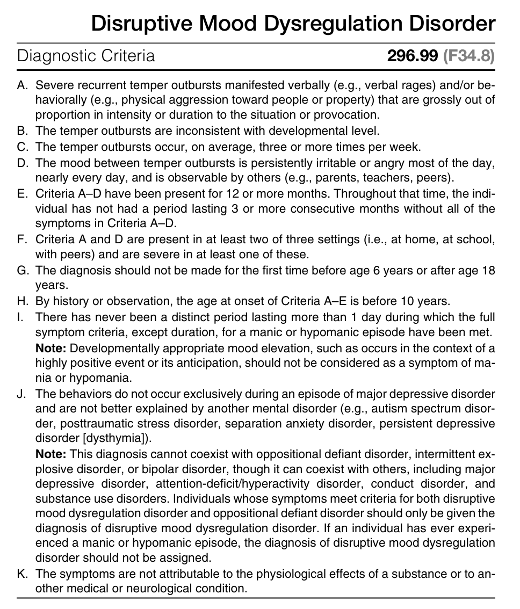
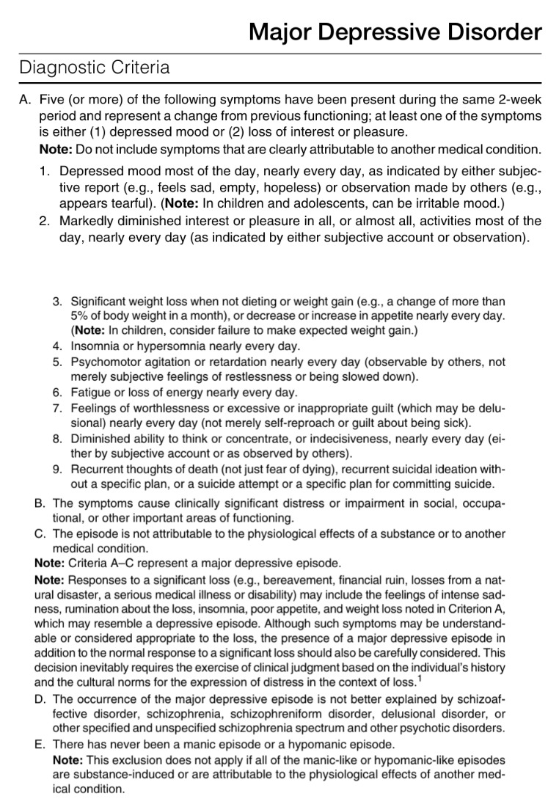
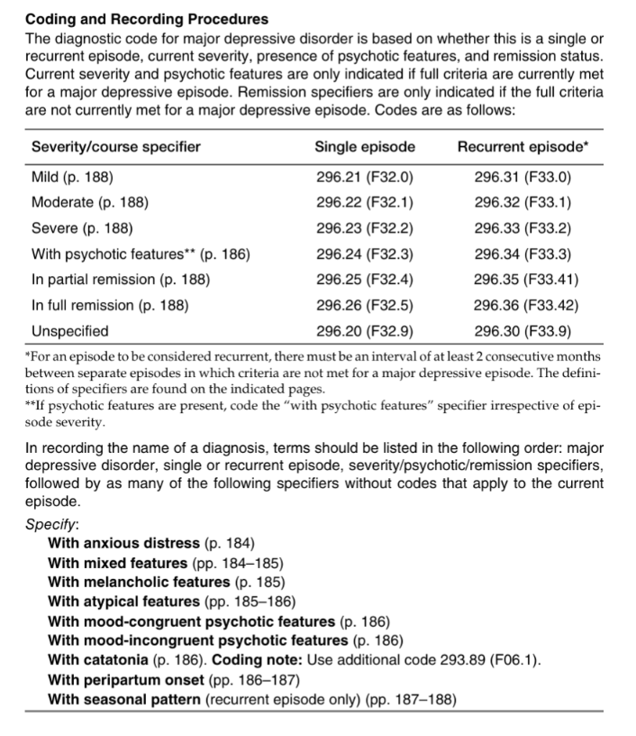

# DSM-5: Depressive Disorders

- **Changing views regarding unipolar depressive illness and bipolar disorders underlie changes from DSM-IV conventions:**
	- In DSM-IV, depressive disorders are considered under the section on "Bipolar and Depressive Disorder"
- **Common features of depressive disorders:**
	- Changes of mood reflecting sadness, emptiness, or ocassionally irritability
	- Somatic changes
	- Cognitive changes
	- Significantly affects the individual's capacity to function
- **Differences between different depressive disorders:**
	- Duration
	- Timing
	- Presumed etiology
- **Depressive disorders under DSM-5 conventions:**
	- <u>Disruptive mood dysregulation disorder</u> - diagnosis for mood dysfunction in children that predicts progression to unipolar depression and anxiety as they mature into adolescence and adulthood
	- <u>Major depressive disorder</u> (including major depressive episode) - prototypical depressive disorder characteristic of clear cut changes in affect, neurovegetative functions, cognition, each episode lasting at least 2 weeks with complete inter-episodic remission
	- <u>Persistent depressive disorder</u> (dysthymia) - a chronic form of mood disturbances that persist for at least 2 years in adults, or 1 year in children
	- <u>Premenstrual dysphoric disorder</u> - specific, and treatment responsive form of depression that begins following ovulation and remits in a few days of menses and has a marked impact on functioning
	- Substance/ medication-induced depressive disorder
	- Depressive disorders due to another medical condition
	- Unspecified depressive disorder

## Disruptive Mood Dysregulation Disorder

- **Reason for classification:**
    - To prevent overdiagnosis and treatment of bipolar disorder in children
    - Epidemiologically, children meeting such classification criteria go on to develop unipolar depressive disorders or anxiety disorders, rather than bipolar disorders, as they mature into adolescence and childhood
- **DSM-5 diagnostic criteria of disruptive mood dysregulation disorder:** 

## Major Depressive Disorder ([[Unipolar Depression and Major Depressive Disorder]])

- **DSM-5 diagnostic criteria of major depressive disorder:**  

- **Distinguishing major depressive episodes and grief:**
        - response of significant loss (e.g. bereavement, financial ruin, losses from natural disaster, serious medical illness, or disability) may mimic much of features noted in criteria a, namely intense sadness, ruminations of the loss, insomnia, poor appetite, and weight loss
        - however, although the response can be considered appropriate for the loss, the presence of mde on top of normal grief should be carefully considered
        - **core distinguishing features of major depressive episodes:**
        - depressed mood in criteria a should be present for most of the day, for every day
        - all symptoms in criteria a must be present nearly every day to be considered present, except for 1) weight changes, 2) or suicidal ideations
        - certain features have high prevalence in mdes (fatigue, sleep disturbances) where absence should raise alternative dx
        - certain features are less common (psychomotor disturbances, delusional guilt) but are more specific, and indicative of greater overall severity
	
	
- **Diagnostic features of major depressive episode:**
        - **Depressed mood** (A1) - by definition, either depressed mood or anhedonia must be present for a diagnosis of MDE/MDD to be made, although often depressed mood is denied:
                - <u>Timing and progression</u> - for at least two weeks, although usually much longer:
                        - Usually persistent, and occurs for most of the day, nearly everyday
                        - Unrelated to any specific thoughts or occupations
                        - Morning depression is characteristic of major depressive episode, as with loss of diurnal variations of mood
                - <u>Description of depressed mood</u> - sadness may be denied, but may be elicited during interview (e.g. commenting that the patient appears that is about to cry):
                        - May be described as hopeless, "down in the dumps", discouraged, sad
                        - Description of depressed mood may be described in somatic terms depending on cultural contexts, but may have insight to their prevailing mood
                        - Some present w/ somatic complaints (e.g. bodily aches and pain, insomnia) but does not attribute to mood
                        - Irritability may manifest as persistently angry, tendancy to respond w/ outbursts, or severe frustrations over minor matters (usually common in children)
    - **Anhedonia** (A2) - nearly always present to some extent, by definition inability to experience pleasure or happiness, resulting in loss of interest:
        - <u>Assessment</u> - often requires eliciting personal descriptions, descriptions from family and friends, and views on other's perception:
                - What are your interests and hobbies? Do you still play? If yes, Do you still find them pleasurable? If no, why do you not perform yet?
                - Have family claimed that you have been more withdrawn?
        - <u>Manifestations</u> - N.B. this should be persistent nearly every day:
                - Acknowledged reduced interest in, and thus avoids hobbies previously find pleasurable ("not caring anymore")
                - Acknowledged social withdrawal and reduced pleasurable avocations but does not attribute to reduced interests
                - Continue to perform these hobbies but acknowledges reduced pleasure derived from them
    - **Biological symptoms:**
        - <u>Changes of appetite and weight</u> (A3) - can occur in either directions:
                - Some report that they have reduced appetite have to force themselves to eat
                - Appetite changes that are severe may result in significant loss or gain in weight
                - In children, consider a failure to make expected weight gains
        - <u>Sleep disturbances</u> (A4) - may take the form of insomnia or hypersomnelensce, which may be the **initial presentation of depression**:
                - Insomnia - difficulty in initiating, or maintaining sleep, where early-morning wakening a/w morning depression is specific for MDE
                - Hypersomnia - may be experienced as prolonged sleeping episodes or increased daytime sleep
        - <u>Psychomotor changes</u> (A5) - must be severe enough to be observable by others and not represent merely as subjective feelings:
                - Psychomotor agitation, e.g. inability to sit still, pacing, hand wringling, rubbing of skin, clothing, or other objects
                - Psychomotor retardation, slowing of speech, thinking and body movements, w/ reduced variety of content, tone, and volume observable during speech
        - <u>Fatigue</u> (A6) - loss of energy, fatigue, or tiredness subjectively felt everyday, but additional clarification include sustained fatigue w/o physical exertion, substantial efforts for initiation of small tasks, and reduced efficiency
        - <u>Poor attention or concentration</u> (A8) - easily distractable, memory problems, or general impaired ability to think, concentrate and make minor decisions (N.B. "pseudodementia" in elderly), but generally abate when mood improves
    - **Depressive cognition** (A7) - unrealistic evaluations of one's past, currrent worth and guilt, and hope for the future, but does not include the guilt of being sick:
        - <u>Ruminations of the past</u> - sense of guilt or ruminations regarding trivial past events
        - <u>Worthlessness or hoplessness</u> - sense of **low self-esteem**, is perpetuated by misinterpretation of neutral or trivial day-to-day events as evidence of personal defects, and have an exagerated self responsibility to untowards events
        - <u>Hopelessness</u> - strongly held belief that one has reached rock bottom and unable to recover
    - **Suicidal ideations, planning, and attempt** (A9) - motivations are variable and may include a desire to give up in facing insurmoutable obstacles, ending a perceived unending, excrutiating painful emotion, hopelessness regarding forseable future in life, and not being a burden for others:
        - <u>Passive suicidal ideations</u> - passive wish of to awaken in the morning or a belief that others would be better off if the individual were dead
        - <u>Active suicidal ideations</u> - ranging from transient but recurrent thoughts of suicide, to a specific suicide plan
        - <u>Active sucide planning</u>:
                - Contemplated on the approach to suicide, and acquiring the needed materials (e.g. rope, medications), and perceived lethality
                - Determining the the exact time and location
                - Putting affairs in orders (e.g. settling debts, death note, updating wills)
        - <u>Suicide attempt</u> - greatest predictor of subsequent suicide risk
- **Development and course:**
- **Risk and prognostic factors:**
        - <u>Temperamental</u> - neuroticism (negative affectivity) is a well-established risk factor for onset of MDD, and higher level predicts MDEs in response to stressful events
        - <u>Environmental</u>:
                - Childhood experiences - multiple adverse experiences of diverse types constitutes a set of potent risk factors for major depressive episodes
                - Stressful life events - recognised as a precipitating factor but presence or absence does not influence prognosis and Tx option
        - <u>Genetic and physiological</u> - first-degree family members of individuals w/ MDD have a 2-4x risk of developing major depressive disorder (40% heritability much of which accounted for the personality trait neurotism)
        - <u>Course modifiers</u>:
                - Non-mood major psychiatric illnesses - esp anxiety, substance use, BPD; increased risk of developing depression and often follow a more refractory course
                - Medical conditions - chronic or disabling medical conditions also increases risk of MDE, and increased risk of chronicity
- **Culture-related diagnostic issues:**
        - Substantial cultural differences in 12 mo prevalence rates of depression
        - Substantial cultural diffeerences in the expression of major depressive disorder, but does not permit linkage between particular culture and likelihood of specific symptoms
        - Such variations are likely due to most countries where majority of cases of depression go undrecognised
        - However among criteria A symptoms, insomnia and loss of energy are the most uniformly reported
- **Gender-related diagnostic issues:**
        - Reproducible finding of higher female prevalence irrespective to age of onset and culture
        - No clear differences regarding symptoms, course, treatment responsiveness or functional consequences
        - Higher risk of suicide attempts but lower risk of suicide completion
- **Suicide risk:**
        - <u>Risk</u> - exists at lll times during an MDE
        - <u>Predictors of sucide risks</u>:
                - Past Hx of suicide or threats of suicide (most consistent)
                - Male sex
                - Being single or living alone
                - Prominent feelings of hopelessness
                - BPD
- **Functional consequences of major depressive disorder** - impairment is variable:
        - Can be so mild that those who interact with the affected individual may be unaware of the symptoms
        - Impairment may be severe that it affects social, occupational, functioning, attending to daily needs, or rendering the patient mute, stuporous, or catatonic
- **Associated features supporting diagnosis:**
        - <u>Psychotic features</u> - usually mood-congruent delusions (e.g. guilt, nihlistic, hypochondriacal, persecutory) or hallucinations
        - <u>Agitation and anxiety</u> - general anxiety, obsessive ruminations, phobias, or worries over physical health, separation anxiety in children
        - <u>Laboratory and biological features</u> - hypercortisolism (a/w melancholic features, psychotic features, and linked to suicide), functional neuroimaging
- **Epidemiology:**
        - <u>Prevalence</u> - 12-mo prevalence of MDD in the US is approximately 7%
        - <u>Demographic</u>:
                - Age - common age of onset in early adulthood (3x risk in 18-29y compared to \> 60y), but late onset is not uncommon
                - Sex - female preponderance (1.5 to 3 fold higher rates in F than M to begin in earl adolescence)
- **DDx of MDD:**
        - <u>Manic episodes w/ irritable or mixed mood</u> - agitated/ irritable depressive episodes may mimick manic episodes requiring a careful clinical evaluation for presence of manic symptoms
        - <u>Mood disorders due to another medical condition</u> - based on Hx, P/E, and laboratory evidence of an underlying condition
        - <u>Substance/ medication-induced depressive or bipolar disorder</u> - a substance (drug of abuse, toxins, or medication) appears to be etiologically related to the mood
        - <u>Attention-deficit/ hyperactivity disorder</u> - distractability and low frustration tolerance can be observed in both conditions
        - <u>Adjustment disorder with depressed mood</u> - in response to a psychosocial stressor, and that the full criteria for MDE (criteria A-C) has yet to be met
        - <u>Sadness</u> - inherent aspects of human experience, and MDE should not be diagnosed if not severe enough (\< 5/9), insufficient duration and pervasiveness (\< 2 weeks, and not most of the day for every day), and cause significant distress or impairment
- **Psychiatric comorbidities:**
        - Substance-related disorders
        - Panic disorders
        - Obsessive-copulsive disorders
        - Anorexia nervosa
        - Bulimia nervosa
        - Borderline personality disorder

## Persistent Depressive Disorder (Dysthymia)

## Premenstrual Dysphoric Disorder

## Substance/ Medication-Induced Depressive Disorder

## Depressive Disorder Due to Another Medical Condition

## Unspecified Depressive Disorder
