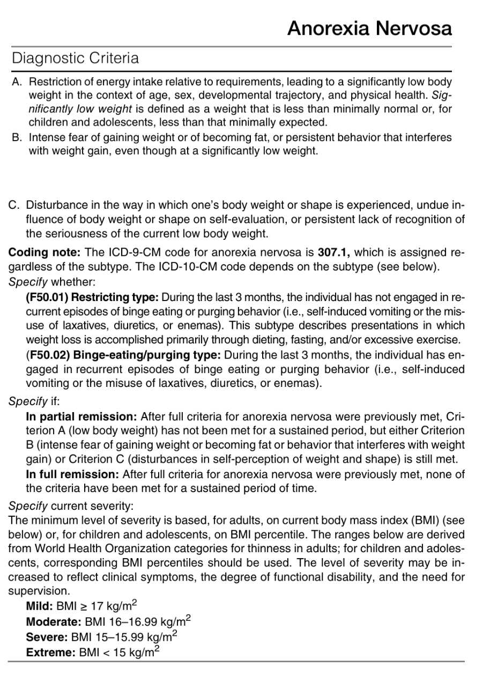

# DSM-5: Feeding and Eating Disorders

## Pica

## Avoidant/ Restrictive Food Intake Disorder

## Anorexia Nervosa

- **DSM-5 diagnostic criteria of AN:** 

- **Subtypes:**
    - <u>Binge-eating/ purging type</u> - those w/ AN who binge eat also purge through self-induced vomiting, or the misuse of laxatives, diuretics, or enemas, while a minority do not binge eat but regularly purge after consumption of small amounts of food
    - <u>Restrictive type</u> - primarily achieving weight loss through dieting, fasting, or excessive exercise w/o evidence of binge eating or purging
- **Diagnostic features** - 3 essential features of AN, 1) persistent energy intake restriction, 2) intense fear of gaining weight or becoming fat or persistent behaviour that interferes w/ weight gain, and 3) a disturbance in self-perceived weight or shape:
    - **Weight loss as a result of persistent energy intake restriction** (Criterion A) - the body weight is significantly low (i.e. less than minimally normal), in the given context of age, sex, developmental trajectory, and otherwise physical health:
        - In adults, <u>severity is defined by the BMI</u>, but no specified cutoff is offered in DSM-5, but the WHO defines severe thinness as \<= 17.0 kg/m2 (while 17.0-18.5 kg/m2 requires clinical judgement)
        - In children and adolescents, <u>failure to make expected weight gain</u> or <u>maintain a normal developmental trajectory</u> instead of actual weight loss (BMI-for-age percentile also used)
    - **Intense fear of gaining weight** (Criterion B) - or perceived from either objectively gaining weight, subjectively as becoming fat, which is counteracted by behaviour that interferes with normal weight gain:
        - <u>Concerns for weight gain</u> - usually present although usually not admitted especially in children (as weight gain is expected) and some adults, but **characteristically persistent and not alleviated by weight loss**
        - <u>Behaviour that interferes w/ weight gain</u>:
            - Dieting or fasting
            - Binge-eating w/ immediate purging through self-induced vomiting, misuse of laxatives or enemas
            - Excessive exercise (which may be overt or subtle)
            - Misuse of diuretics, and other weight loss agents
    - **Disturbance in self-perceived experience and significance of body weight and shape** (Criterion C) - various perception of body weight and image:
        - Globally overweight despite objective evidence of weight loss
        - Concerns regarding certain body parts being overweight, e.g. abdomen, buttocks, and thighs, with techniques to evaluate body parts such as measurements and mirror checking
        - Usually harsh on oneself if minute weight gain occurs, and is interpreted as evidence of failure of self control
- **Associated features supporting diagnosis:**
    - **Excessive level of physical activity** - in a subgroup of AN patients, and usually precedes onset of disorder:
        - Aimed at accelerating weight loss
        - May be difficult to control which jeopardizes weight recovering
    - **Medical conditions a/w semi-starvation:**
        - <u>Cardiovascular and respiratory system</u> - overall low BP, tachycardia, rhythm abnormalities, palpitations, dizziness, and subjective reduced ET
        - <u>Haematological abnormalities</u> - anaemia
        - <u>Endocrine abnormalities</u> - amenorrhoea (almost always present), osteopenia
    - **Medical manifestations a/w purging behaviours or other methods of interferring w/ weight gain** - electrolyte abnormalities are most common (hypoK, hypoMg, hypoPO4):
        - Laxatives
        - Diuretics
        - Enemas
    - **Depressive symptoms** - can be caused by the disorder itself in severe malnutrition (AN brain), but can also be a comorbid primary MDD:
        - Low mood (and irritability) and anhedonia
        - Social withdrawal
        - Biological symptoms (insomnia, diminished libido)
    - **Obsessive-compulsive features** (usually prominent) - may or may not be related to food:
        - <u>Obsessions on food</u> - often pre-occupied w/ the thoughts of food (may be exacerbated by under-nutrition), many focus on counting calories and focus on how to eat to minimise food intake, where some may collect recipes or hoard food (+/- binge eating), all of which may be time consuming
        - <u>Obsessions on body weight and image</u> - pre-occupation w/ problems of body weight, appearing fat, or overall body image
        - <u>Obsessions unrelated to food, weight, or image</u> - an aditional diagnosis of OCD may be warranted
    - **Other cognitive features:**
        - Concerns w/ eating in public (?high caloric)
        - Feeling of ineffectiveness
        - Strong desire to control one's environment
        - Inflexible thinking
        - Limited social spontaneity
        - Overly restrained emotional expression
- **Epidemiology:**
    - <u>Prevalence</u> - 12mo prevalence in young females ~ 0.4% (unknown prevalence in M)
    - <u>Demographic</u>:
        - Age - usually onset in young age during adolescence or young adulthood (fairly rare before puberty or after 40y)
        - Sex - female preponderance (F:M = 10:1)
- **Development and course:**
    - <u>Onset</u> - usually in adolescence and young adulthood (late-onset have been described):
        - Onset a/w a life-stressor that may be interpretted as 'losing control' (e.g. leaving home for college, academic stress, parents divorced)
        - Younger patients usually present w/ somatic complaints, and manifests atypically w/ verbal denying "fear of fat"
        - Older agents typically manifest w/ more S/S of a long-standing disorder
    - <u>Course</u> - outcomes of AN usually highly variable (most remission within 5y of presentation):
        - Some usually have changed eating habits for a duration prior to meeting full criteria of AN
        - Some recover fully after single episode
        - Some exhibit fluctuating of weight gain followed by relapse
        - Others experiencing a chronic course over many years
        - Hospitalisations may be frequent to restore weight and address medical presentations
- **Risk and prognostic factors:**
    - <u>Temperamental</u> - obsessional traits
    - <u>Environmental</u>:
        - Cross cultural variability where increased prevalence in cultures where thinness is valued
        - Occupational and avocations that encourage thinness (e.g. modelling) a/w increased risks
    - <u>Genetics and physiological</u>:
        - Twin studies and family studies demonstrate heritability
        - Increased risk of bipolar and depressive disorders also found among first-degree relatives
- **Physical signs and symptoms:**
- **Ix:**
    - **Bloods:**
    - **EEG:**
    - **DEXA:**
- **Suicide risk:**
    - <u>Rates</u> - reported as 12 per 100,000/y (accounts for significant portion of mortality in addition to medical consequences)
- **DDx:**
    - Medical conditions
    - Major depressive disorder
    - Schizophrenia
    - Substance use disorder
    - Social anxiety disorder, OCD, body dysmorphic disorder
    - Bulimia nervosa
    - Avoidant/ restrictive food intake disorder
- **Comorbidities:**
    - <u>Medical comorbidities</u> - a/w physical consequences of malnutrition
    - <u>Psychiatric comorbidities</u>:
        - Bipolar, depressive and anxiety disorder
        - OCD (esp. w/ restricting type)
        - Alcohol use disorder and other substance use disorder (esp. w/ binge-eating/ purging type)

## Bulimia Nervosa

## Binge-Eating Disorder

## Other Specified Feeding or Eating Disorder
