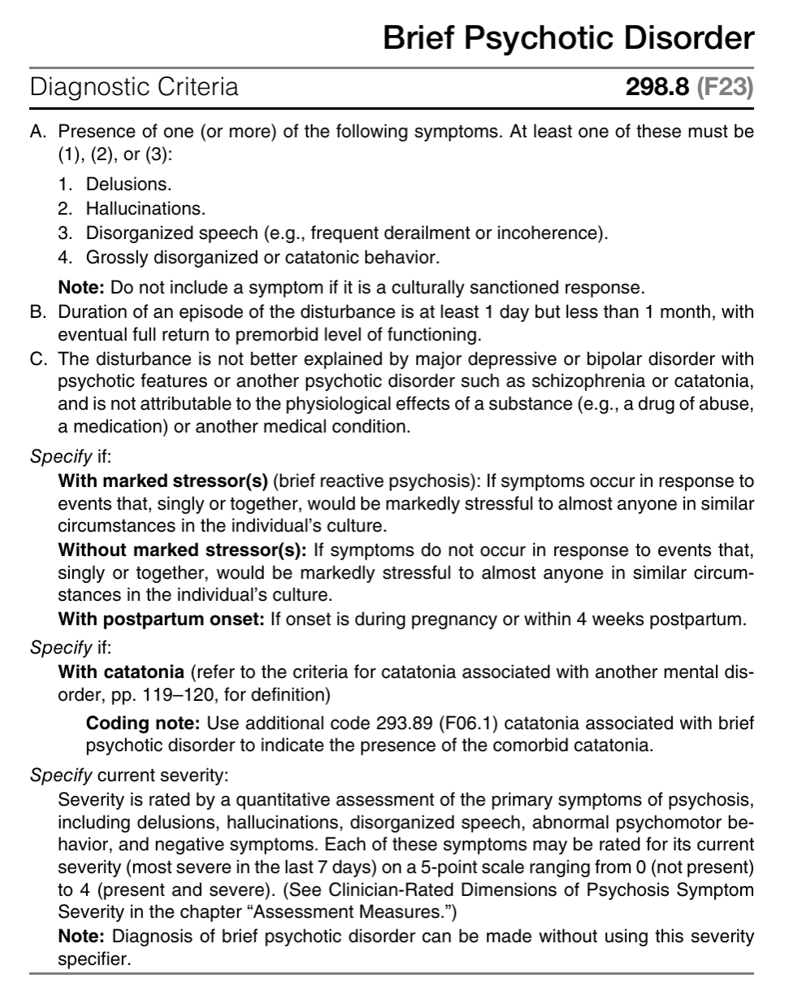
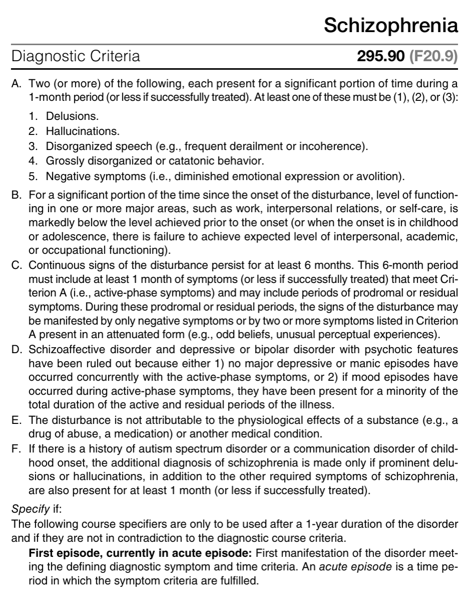
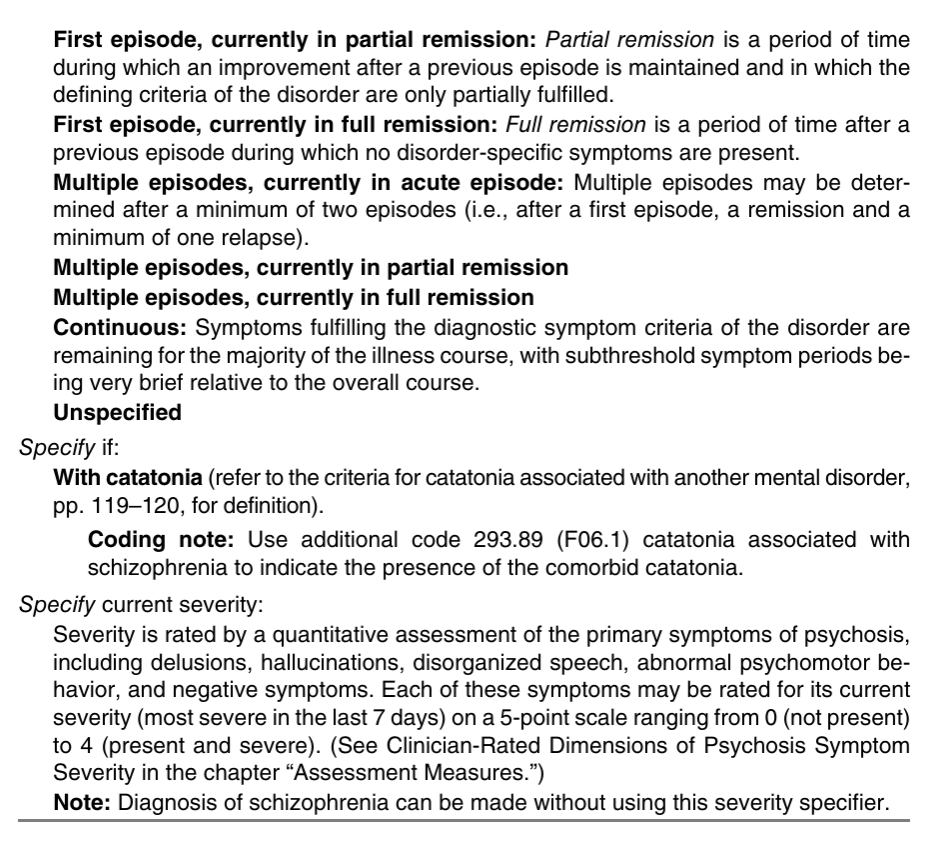

# Schizophrenia Spectrum and Other Psychotic Disorders

- **Definition** - heterogenous group of disorders characterised by:
    - Delusions
    - Hallucinations
    - Disorganized thinking and speech
    - Grossly disorganized or abnormal motor behaviour
    - Negative symptoms

## Key Features that Define the Psychotic Disorders

- **Delusions** - fixed beliefs that are not amenable to change in light of conflicting evidence:
    - <u>Theme of delusion</u> - content of delusion may include variety of themes:
        - Persecutory delusions
        - Referential delusions
        - Grandiose delusions
        - Religious delusions
        - Somatic delusions
        - Erotomanic delusions
        - Nihlistic delusions
    - <u>Bizzare delusions</u> - delusions that are deemed clearly implausible and not understandable to same-culture peers and do not derive from ordinary life experiences
- **Hallucinations** - perception-like experiences of any sensory modality that occur without an external stimulus that 1) occur in clear sensorium, 2) are vivid and clear, 3) with the full fource and impact of normal perception, and 4) not under voluntary control
- **Disorganised thought and speech** (less severe in prodromal and residual periods but marked in acute episode) - identification of <u>formal thought disorder</u> inferred from the individual's speech:
    - <u>Derailment or loose association</u> - switching rapidly from one topic to another
    - <u>Tangentiality</u> - answers to questions are obliquely related or completely unrelated
    - <u>Incoherance</u> (word salad) - speech is incomprehensible and is linguistically disorganised and may mimick receptive aphasia
- **Grossly disorganised or abnormal motor behavior** (including catatonia) - extremely variable presentation but generally results in 1) lack of goal directed behaviour, and 2) difficulties to perform ADL:
    - <u>General silliness</u> - often noted as a change in personality or as a un-seriousness by others
    - <u>Unpredictable agitation</u> - agitation often arises from disordered percept or delusional thinking
    - <u>Catatonia</u> - marked decreased reactivity to the environment, from resistance to instruction (negativism), maintaining a rigid, inappropriate or bizzare posture, or lack of verbal or motor response (mutism, stupor), or purposeless excessive motor activity (catatonic excitement)
- **Negative symptoms** - more marked in schizophrenia and less prominent in other psychotic disorders; when present, accounts for substantial morbidity:
    - <u>Affect blunting</u> - perceived as diminished emotional expression verbally (e.g. through intonation of speech), or non-verbally (eye contact, facial expressure, hand gestures)
    - <u>Avolition</u> - decrease in motivated self-initiated purposeful activity, and may sit for long-periods of time showing little interest in work or social activities
    - <u>Anhedonia</u> - inability to experience pleausre
    - <u>Alogia</u> - i.e. poverty of speech, deminished speech output
    - <u>Associality</u> - apparent lack of interest in social interactions and may be associated w/ avolition (but may also represent limitations of opportunities)

## Disorders in This Chapter

- **Clinical approach to schizophrenia-spectrum and other psychotic disorders** - a gradient along domains of psychopathology:
    - <u>Disorders limited to single domain of psychopathology</u>:
        - Disorder of thought - delusional disorders
        - Motor disorders - e.g. catatonia
    - <u>Disorders w/ time-limiting features</u> (Brief psychotic disorders) - lasts \> 1d but remits by 1mo
    - <u>Psychosis induced by another medical condition</u>:
        - Substance/ medication-induced psychotic disorder - considered by a physiological consequences of drug of abuse, medications, or toxins andceases after removal of another agent
        - Psychotic disorder due to another medical condition - considered a physiological consequence
        - Bipolar disorders or psychotic depression - often mood congruent psychotic features, and mood Sx is more prominent than that of the psychotic features
    - <u>Schizophrenia spectrum based on prominence of Sx in different domains of pathology</u>:
        - Schizotypal personality disorder - onset and manifestation may reflect that of schizophrenia and causes functional impairment, but strongly held ideas never reach the delusional intensity
        - Schizophreniform disorders - symptomatology equivalent for its duration without the necessity for a decline in functioning, and duration lasting for 1-6 mo
        - Schizophrenia - symptomatology lasting for \> 6mo and includes at least 1 mo of active-phase symptoms
        - Schizoaffective disorder - similar criteria as schizophrenia but a/w prominent affective and mood Sx for 1 mo, preceeded by or followed by continuation of active Sx w/o prominent mood Sx

## Clinician-Rated Assessment of Symptoms and Clinical Phenomena in Psychosis

- **Prognostic role of severity** - determines:
    - Degree of cognitive deficit
    - Degree of neurobiological deficit
- **Assessment measures** - dimensional assessment of the primary symptoms and co-morbid symptomatology:
    - <u>Dimensional assessment of primary psychotic symptoms</u>:
        - Hallucinations
        - Delusions
        - Disorganized speech (not applicable for substance-/ medication-induced psychotic disorders and psychotic disorders due to another medical condition)
        - Abnormal psychomotor behavior
        - Negative symptoms
    - <u>Dimensional assessment of affective Sx</u> - often of prognostic value and guides Tx to identify mood pathology and Tx when appropriate:
        - Depression
        - Mania
    - <u>Dimensional assessment of cognitive impairment</u> - impairmnent in range of cognitive domains and can predict functional status:
        - Brief assessments by clinicial (usually sufficient for diagnostic purposes)
        - Standardised clinical neuropsychological assessment administered by trained personnel and use of testing instruments

## Brief Psychotic Disorder

- **DSM-5 diagnostic criteria of brief psychotic disorders:** 

- **Diagnostic features of brief psychotic disorders** - a <u>sudden onset</u> of <u>positive psychotic symptoms</u>:
    - **Florid psychotic symptoms** - at least one positive psychotic symptom should be demonstrable:
        - <u>Onset</u> - usually sudden onset (change of non-psychotic to clearly psychotic state \< 2 weeks), usually w/o an identifiable prodrome (cf schizophrenia although onset can be abrupt as well)
        - <u>Duration</u> - episodes last for at least 1 day, but less than 1 month, w/ eventual full return to premorbid level of functioning (B)
        - <u>Manifestations</u> - presence of 1/4 Sx (cf schizophrenia defines 2/5 including negative Sx):
            - Delusions
            - Hallucinations
            - Disorganized speech (e.g. frequent derailment or incoherence)
            - Grossly disorganised or catatonic behaviour
- **Associated features supporting diagnosis:**
    - <u>Overwhelming confusion</u> - sudden onset puts patients into a trance resulting in very severe cognitive and functional impairment, and supervision may be required to ensure nutritional and hygienic needs met
    - <u>Emotional turmoil</u> - often very labile affect w/ rapid shifts from one intense affect to another
    - <u>Suicidality</u> - increased risk of suicide behaviour particularly during the active episode
- **Epidemiology:**
    - <u>Prevalence</u> - accounts for 9% of first-episode psychosis
    - <u>Demographic</u>:
        - Age - average age of onset around mid 30s (but can occur across lifespan)
        - Sex - female preponderance (F:M = 2:1)
- **Development and course:**
    - <u>Onset</u> - variable age (average age of onset being the mid 30s but may appear in adolescence or early adulthood)
    - <u>Course of psychosis</u>:
        - Usually quite brief (e.g. a few days in some individuals)
        - By definition requires full return of functioning within 1 mo of onset of disturbances)
- **Risk and prognostic factors:**
    - <u>Temperamental</u> - pre-existing personality disorders (e.g. schizotypal, BPD) or personality traits in the psychotism domains (e.g. perceptual dysregulation), and negative affectivity domain (e.g. suspiciousness)
    - <u>Environmental</u> - brief psychotic disorders may be triggered by:
        - Marked stressor (Brief psychotic disorder w/ marked stressor \[brief reactive psychosis\])
        - Postpartum (onset during pregnancy or within 4 weeks of postpartum)
        - Although symptoms may occur in the absence of a trigger
    - <u>Relapse</u> - high, although w/ inter-episodic full remission
- **Culture-related diagnostic issues:**
    - Distinguish pathological symptoms from culturally sactioned response patterns
    - As general rule of thumb, cultural and religious background must be taken into full consideration when considering whether beliefs are delusional
- **Functional consequences of brief psychotic disorders:**
    - High rates of relapse but generally manageable after induction of insight through psychoeducation and detection of relapse signatures
    - Outcomes excellent in terms of social functioning and symptomatology
- **Differential diagnosis:**
    - <u>Other medical conditions</u> - e.delusions or hallucinations as a direct physiological consequences of a specific medical condition (e.g. Cushing's syndrome, brain tumour)
    - <u>Substance-related disorders</u> - distinguished by the fact that a drug of abuse, medication, or toxin is judged to be etiologically related to psychotic symptoms
    - <u>Depressive and bipolar disorder</u> - should be considered if psychotic symptoms occurs in association w/ a mood episode (i.e. symptoms occuring exclusively during a full major depressive, manic, or mixed episodes)
    - <u>Other psychotic disorders</u> - considered if psychotic symptoms persist for \> 1 mo, Dx to consider includes delusional disorders, schizophreniform disorders, depressive disorders w/ psychotic features, bipolar disorders w/ psychotic features, and schizophrenia-spectrum disorders
    - <u>Malingering and factitious disorders</u> - there is usually evidence that the illness is being feigned for an understandable goal (e.g. run ins with the law)
    - <u>Personality disorders</u> - psychosocial stressors may precipitate brief perioods of psychotic symptoms and these episodes are usually transient (\< 1d) and do not warrant a separate Dx (additional Dx consideered if \> 1d)

## Schizophreniform Disorder

## [[Schizophrenia]]

- **DSM-5 diagnostic criteria of schizophrenia:**  

- **Epidemiology:**
    - <u>Prevalence</u> - lifetime risk appears approximately 0.3-0.7% (although reported variations by race, across countries, and geographic origins)
    - <u>Demographic</u>:
        - Age - peak onset of FEP is in early-to-mid 20s in M, and late 20s in F
        - Sex - overall no sex preponderance (however emphasis on -ve Sx and longer DUP observed in M)
- **Development and course:**
    - <u>Onset of psychotic features</u> - first episode psychosis (FEP):
        - Peak age of onset of FEP is in early- to mid-20s for males, and in late 20s for female
        - Onset may be abrupt or insiduous, but most have slow, gradually development
        - In fact, 50% of patients initially complain of depressive Sx
        - Late onset cases (\> 40y) is overrepresented by F, course often characterised by psychotic symptoms with preservation of affect and social functioning
    - <u>Progression and predictor of course of disease</u> - variable:
        - Most take a chronic course w/ progressive deterioration +/- puntated by episodes of psychotic relapse
        - Psychotic (Positive) symptoms tend to deminish over time reflecting age-related decreased dopamine activity although residual positive Sx such as abnormal beliefs and perceptual experience may linger on
        - Negative symptoms become more prominent in chronic schizophrenia and tend to be more persistent, w/ greater predictor on prognosis
        - Cognitive impairment persists in remission and contributes to disability
    - <u>Predictors of course at disease onset</u>:
        - Earlier age of onset (however likely confounded by gender, where M tend to have poorer premorbid adjustment, lower education levels, prominent negative Sx, and cognitive impairments)
- **Risk and prognostic factors:**
    - **Genetics** - strong contribution for genetic factors in determining risk of schizophrenia, although most who are diagnosed do not have FHx of psychosis
    - **Physiological factors** - many implicated but note that most w/ such risk factors do not develop schizophrenia:
        - <u>Prenatal adversities</u> - greater paternal age, pregnancy complications
        - <u>Perinatal abnormalities</u> - asphyxia during birth, stress, infection, malnutrition, maternal diabetes
    - **Environmental factors:**
        - <u>Season of birth</u> - late winter/ early spring in some locations, or summer for deficit forms
        - <u>Urbanicity</u> - higher incidence of schizophrenia and related disorder in urban environments compared w/ rural environments
- **Culture-related diagnostic issues:**
- **Gender-related diagnostic issues:**
- **Suicide risk** - risk persists throughout lifetime but is especially high after discharge in a psychotic episode:
    - <u>Mortality</u> - 5-6% die by suicide
    - <u>Rates of suicide attempts</u> - \> 20% have attempted suicide in \>=1 ocassion, likely many ore w/ significant ideations
    - <u>Risk factors</u>:
        - Psychotic features w/ derogatory AH commanding one to harm onself or others
        - Usually more common in younger men w/ comorbid substance use
        - Depressive symptoms
        - Unemployment
        - Recent discharge from hospital for psychotic relapse
- **Functional consequences of schizophrenia** - significant social and occupational dysfunction:
    - <u>Social consequences</u>:
        - Most do not marry (esp. M) and have limited social contacts outside of their family
        - Frequent disputes w/ family and may require temporary housing or HWH
    - <u>Occupational consequences</u>:
        - Most employed at a lower level than parents or siblings
        - Making educational progress and maintaining employment frequently impaired by **avolition**, even if cognitive skills are sufficient for task at hand
        - Additional effects of cognitive impairments and ?excessive stimulation limits occupational opportunities
- **Differential diagnoses of schizophrenia:**
    - Major depressive or biploar disorder w/ psychotic or catatonic features
    - Schizoaffective disorder
    - Brief psychotic disorders and schizophreniform disorders
    - Delusional disorders
    - Schizotypal personality disorders
    - Obsessive-compulsive disorder and body dysmorphic disorders
    - Post-traumatic stress disorder
    - Autism spectrum disorder or communication disorder
    - Other mental disorders associated w/ a psychotic episode
- **Comorbidities:**
    - <u>Psychiatric comorbidities</u> - substance-related disorders, anxiety disorders, obsessive-compulsive disorders, panic disorders
    - <u>Medical conditions</u> - weight gain, metabolic syndrome, and cardiopulmonary diseases (cardiometabolic risks), other chronic disease (likely due to lifestyle, and poor engagement in health maintenance behaviours, ?shared vulnerability)

## Schizoaffective Disorder

## Substance/ Medication-Induced Psychotic Disorders

## Psychotic Disorder Due to Another Medical Condition
