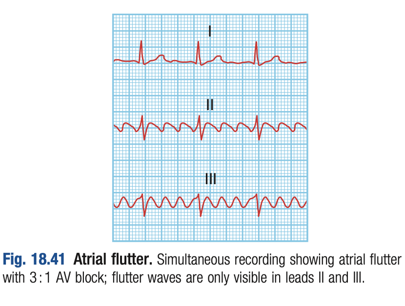
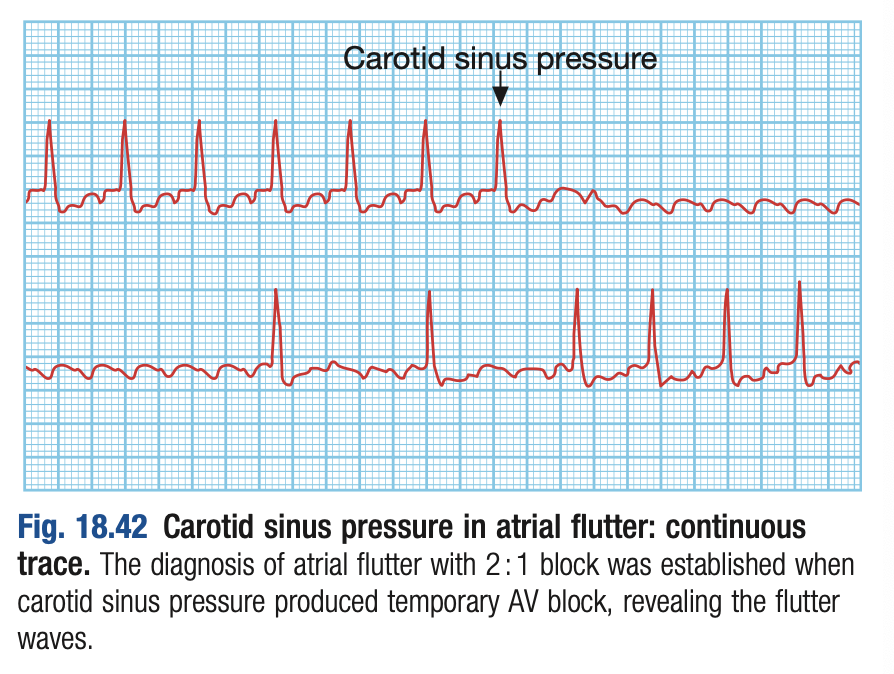
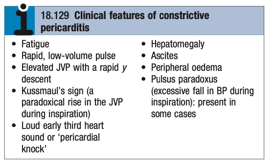
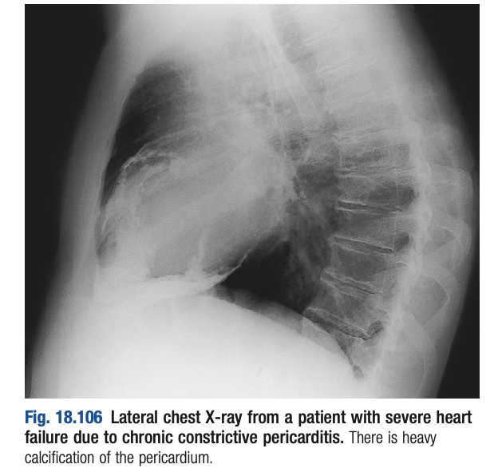

# Ch18 Cardiovascular Disease

## Clinical Examination of the Cardiovascular System

## Functional Anatomy and Physiology

## Investigation of Cardiovascular Disease

### Electrocardiogram

### Cardiac biomarkers

### Chest X-Ray

### Echocardiography

### Computed tomographic imaging

### Magnetic resonance imaging

### Cardiac catheterisation

### Electrophysiology study

### Radionuclide imaging

## Presenting Problems in Cardiovascular Disease

### Chest pain

ref note: [[Chest Pain]]

- **Definition** - chest pain, or discomfort which may be a common presentation of cardiovascular disease, but may be a manifestation of extra-cardiac disease, presenting acutely in A&E or chronically in outpatient setting
- **Etiology of chest pain:**
    - **Cardiac diseases:**
        - <u>Ischaemic heart disease</u> - Chronic coronary syndrome (stable angina), or Acute coronary syndrome (UA/ MI)
        - <u>Valvular heart disease</u> - mitral valve prolapse, aortic valve disease
        - <u>Disease of the myocardium</u> - hypertrophic cardiomyopathy, myocarditis
        - <u>Disease of the pericardium</u> - pericarditis
        - <u>Disorders of rhythm</u>
    - **Aortic disease** - symptomatic aortic aneurysm, aortic dissection
    - **Respiratory diseases:**
        - <u>Airway disease</u> - bronchospasm or asthmatic attacks
        - <u>Infective diseases</u> (resulting in pleurisy) - pneumonia with parapneumonic effusion, tracheitis, tuberculosis
        - <u>Pulmonary vascular disease</u> - pulmonary embolism and pulmonary infarction
        - <u>Pleural disease</u> - pneumothorax, pleural effusion, connective tissue disease (SLE and RA most common)
        - <u>Primary lung malignancy</u> - bronchogenic carcinoma
    - **Esophageal diseases:**
        - <u>GERD-related complications</u> - esophagitis, esophageal spasm (e.g. spastic esophageal motility disorders)
        - <u>Boorhaeve's syndrome</u> - usually manifests as severe epigastric pain
        - <u>Mallory-Weiss syndrome</u> - a/w vomiting and UGIB
    - **Musculoskeletal diseases:**
        - <u>Disease of bone</u> - rib fracture/ injury
        - <u>Disease of joints</u> - costochondritis (Tietze's syndrome), OA of chest wall
        - <u>Disease of mulscles</u> - intercostal muscle injury, epidemic myalgia (Bornholm disease)
    - **Neurological diseases:**
        - <u>Prolapsed intercostal disc</u>
        - <u>Thoracic outlet syndrome</u>
        - <u>Herpe's zoster reactivation</u>
    - **Anxiety/ emotion**
- **Differentiating features in different types of chest pain:**
    - **Ischaemic cardiac chest pains** - see notes on ischaemic heart disease
    - **Myocarditis and pericarditis** - central, retrosternal sharp pain, exacerbated by breathing, coughing or movement:
        - <u>Site</u> - retrosternal and central, ocassionally to left of sternum radiating to left or right shoulder
        - <u>Quality</u> - sharp, and catches patient during inspiration, or coughing
        - <u>Provacation</u> - varying in intensity in relation to posture (lying flat), respiration (during inspiration) or coughing
        - <u>Associated clinical features</u> - Hx of prodromal viral illness
    - **Aortic dissection** - abrupt onset of severe, sharp tearing pain that penetrates through the back, following the path of dissection
    - **Bronchospasm** (e.g. asthma) - acute onset of chest tightness and SOB which maybe in relation w/ exertion and relieved by rest, differentiated from ischaemic chest pain by wheeze, Hx of atopy, and cough
    - **Esophageal pain** - mimics cardiac chest pains closely as it is sometimes a/w exercise and relieved by nitrates, but may be suspected upon other upper GI Sx and provacation by posture and eating (often undergoes extensive cardiac workup to r/o CCS)
    - **Musculoskeletal pain** - variable site or intensity that does not fall into classical patterns, a/w local tenderness over a rib or costal cartilage
    - **Psychological aspects of chest pain** - emotional distress can cause atypical chest pains, keeping in mind that chest pain is a frightening experience and the presentation should not be immediately attributed to the psychological aspects
- **Evaluation of chest pain** - dependent on presentation of chest pain (i.e. acute vs chronic):
    - <u>Acute presentation</u> (e.g. to ED) - targeted Hx, P/E and Ix to diagnose or r/o **live-threatening cause** (e.g. ACS, Aortic dissection, PE, tension pneumothorax pericardial tamponade, myocarditis, PPU, perforated esophagus)
    - <u>Stable presentation</u> (e.g. to OPD) - detailed Hx, P/E and Ix to diagnose underlying cause

1.  Evaluation of stable angina

    - **Features suggestive of stable angina:**
      - <u>Chronicity</u> - symptoms over long term prior to clinical presentation in outpatient setting is more likely related to non-life threatening conditions
      - <u>Demand-led angina</u> - no symptoms at rest, and relationship of Sx w/ a certain degree of exertion
      - <u>Reproducibility and predictability</u> - onset of Sx isreproducible and predictable with a certain level of exertion
    - **Salient points of Hx:**
      - **HPI** - characteristic of chest pain to <u>differentiate between cardiac, and non-cardiac chest pains</u>: 
      
        - <u>Site</u>:
          - **Cardiac chest pain** - central, retrosternal, and poorly localised/ diffuse
          - **Non-cardiac chest pain** - peripheral, and well localised
        - <u>Onset</u> - ischaemic chest pain takes time to develop to maximum intensity:
          - **Sudden (instantaneous) onset** - features of aortic dissection, pulmonary embolism, or pneumothorax
          - **Gradual onset** - MI takes minutes or longer to develop towards maximum intensity in association w/ exertion (pain after exertion is likely due to musculoskeletal or psychological origins)
        - <u>Progression</u>
        - <u>Quality</u>:
          - **Cardiac chest pain** - dull, constricting, or heavy sensation over the chest (more of a discomfort than pain)
          - **Pleuritic chest pain** - sharp, stabbing, knife-like pain
        - <u>Radiation</u>:
          - **Cardiac chest pain** - radiation to the neck, jaw, or upper arms, ocassionally to the back
          - **Pleuritic chest pain** - usually non-radiating, or radiating laterally
        - <u>Provocation</u>:
          - **Cardiac chest pain** - often provacated during (not after) <u>exertion, emotion, eating, or in cold wind</u>, which may be promptly relieved by rest (\< 5 min), or increasing in intensity in unstable angina
          - **Pleuritic and pericardial chest pain** - provacated by breathing, coughing or movement
          - **Musculoskeletal chest pain** - provacated by specific movement (bending, stretching, turning)
        - <u>Severity</u> - severe chest pain seen in ACS, aortic dissection or massive PE
      - **Associated Sx:**
        - **Dyspnoea** - may be a marked accompanying feature of ACS due to pulmonary congestion, but may be present in respiratory diseases (accompanied by other respiratory Sx)
        - **Autonomic symptoms** (diaphoresis, N/V) - frequently accompany chest discomfort in <u>ACS</u>, <u>aortic dissection</u>, <u>massive PE</u>
        - **Respiratory Sx** - cough, wheezing, haemoptysis suggestive of respiratory disease (but cough and haemoptysis also occurs in ADHF)
        - **GI Sx** - prior dyspepsia, heartburns, regurgitation, dyspepsia
      - **PMH:**
      - **SHx:**
      - **FHx:**
    - **P/E:**
      - **Complete PE:**
        - <u>General examination</u>
        - <u>Cardiovascular examination</u>
        - <u>Respiratory examination</u>
        - <u>Examination of the peripheral arterial system</u>
      - **Clinical findings** - related to 1) risk factors, 2) features of LV dysfunction, 3) manifestations of atherosclerosis, 4) correctable exacerbating conditions:
        - <u>Risk factors</u> - xanthelesma
        - <u>Features of LV dysfunction</u> - displaced dyskinetic apex beat, gallop rhythm
        - <u>Manifestations of atherosclerosis</u> - bruits, signs of PAD
        - <u>Unrelated exacerbating conditions</u> - pallor, features of thyrotoxicosis
    - **Initial baseline Ix:**
      - **Bloods** - CBC, LRFT, FBG, A1c, lipid profile, TFT +/- cardiac biomarkers
      - **Resting baseline ECG** - features of ischaemia or LV dysfunction
      - \+*- **Echocardiogram** - in patients w* murmurs
    - **Subsequent evaluation** - based on clinical likelihood of CAD

2.  Evaluation of acute non-traumatic chest pain

    - **DDx of acute chest pain** - important to r/o:
      - <u>Cardiac disease</u> - **Acute coronary syndrome**, pericardial tamponade, acute decompensated heart failure
      - <u>Aortic disease</u> - aortic dissection
      - <u>Respiratory disease</u> - massive pulmonary embolism, tension pneumothorax, pneumonia
      - <u>Esophageal disorders</u> - perforation of esophagus
    - **Ix:**
      - **CXR** - urgent CXR for most patients (potentially diagnostic for aortic dissection, respiratory diseases etc, but non-diagnostic for ACS)
      - **ECG** - indicated for all patients
      - **Bloods** - CBC, LRFT, Troponin, CK, NT-pro-BNP, clotting profile, ESR,CRP +/- D-Dimer
      - **USG** - echocardiography, bedside USG for DVT
      - **Advanced imaging:**
        - CT angiography - for ACS and acute aorti dissection
        - CTPA - for pulmonary embolism

### Breathlessness

### Cardiogenic shock

- **Definition of shock** - clinical syndrome that develops where there is global tissue hypoperfusion due to some form of acute circulatory failure
- **Etiology of cardiogenic shock:**
    - <u>Acute coronary syndrome</u> - especially in massive MI causing LV dysfunction, and ocassionally due to RV dysfunction or mechanical complications
    - <u>Massive pulmonary embolism</u> - massive saddle PE resulting in impaired LV preload
    - <u>Cardiac tamponade</u> - collection of fluid or blood in pericardial sac (often small and \< 100 ml)
    - <u>Valvular heart disease</u> - usually a feature of acute valvular failure resulting in **acute AR** (e.g. aortic dissection, IE), **acute MR** (complication of MI, IE, ruptured chordae) or **prosthetic valuve failure**
    - <u>Arrhythmias</u> - e.g. bradyarrhythmias, or ventricular tachycardia, ventricular fibrillation
- **Cardiogenic shock due to myocardial infarction:**
    - **Etiology of cardiogenic shock in MI:**
        - LV dysfunction due to extensive LV infarct (\> 70%)
        - RV dysfunction due to extensive RV infarct
        - Mechanical complications - Cardiac tamponade (ruptured ventricular aneurysm), Acute MR (ruptured papillary muscles)
    - **Haemodynamics and pathophysiology:**
        - <u>Severe systolic dysfunction</u> - results in decreased CO, decreased BP and coronary perfusion, causing further ischaemia and ventricular dysfunction (cardiac ischaemia)
        - <u>Severe diastolic dysfunction</u> - due to increased LVEDP, pulmonary oedema, leading to hypoxaemia and myocardial ischaemia
        - <u>Myocardial stunning post-MI</u> - surrounding viable myocardium surrounding fresh infart contract poorly for a few days then recover (cardiogenic shock should be treated intenssely as cardiac function will eventually return)

    
    
    - **Haemodynamic subsets in AMI** - Forrester classification based on CO and pulmonary oedema, and influence on management:  
    
    - **Clinical features of cardiogenic shock in MI:**
        - <u>Features of MI</u> - chest pain, dyspnoea
        - <u>Features of pulmonary oedema</u> - dyspnoea, hypoxaemia, cyanosis, bibasilary crackles (+/- CXR features of pulmonary congestion)
        - <u>Features of shock</u> - **oliguria**, altered mental status, cold peripheries, hypotension
- **Cardiogenic shock in massive pulmonary embolism:**
    - **Haemodynamics and pathophysiology of massive PE:**
        - <u>Saddle embolism</u> - complicate DVT or pelvic vein thrombosis, with large emboli saddled in the pulmonary trunk
        - <u>RV dysfunction</u> - increased RVEDP and dilatation of RV
        - <u>LV dysfunction</u> - LV underfilling resulting in decrease in CO (and hence collapse)
- **Cardiogenic shock in cardiac tamponade:**
    - **Etiology of cardiac tamponade:**
        - <u>Pericarditis</u> - any cause of pericarditis
        - <u>Malignant pericardial effusion</u>
        - <u>Traumatic</u> - bleeding into pericardial sac
        - <u>Mechanical complication of MI</u> - e.g. ruptured free wall
- **Cardiogenic shock in acute valve failure:**
    - **Etiology of acute valve failure:**
        - <u>Acute AR</u> - aortic dissection, infective endocarditis
        - <u>Acute MR</u> - post-MI ruptured papillary muscles, infective endocarditis, complication of MVP
        - <u>Prosthetic valve failure</u>:
            - Mechanical valves - fracture, jamming, thrombosis, dehiscence
            - Biological valves - degeneration with cusp tear

### Heart failure

- **Definition** - clinical syndrome that develops when the heart <u>cannot maintain adequate cardiac output</u>, or can only do so at the expense of <u>elevated ventricular filling pressure</u>:
    - **Mild-to-moderate HF** - CO and LVEDP is normal at rest and becomes inadequate during exertion, when metabolic demands increase
    - **Severe HF** - CO or filling pressure is inadequate at rest

  
  
- **Epidemiology of HF** - extremely common syndrome of the elderly:
    - <u>Prevalence</u> - increases w/ age (1% in 50-59y to 10% in 80-89y)
    - <u>Etiology</u> - most commonly caused by CAD and MI
- **Etiology of HF** - arises from all forms of HF: 

- **Pathophysiology of HF** - CO is dependent on preload, afterload, and inotropy based on Starling's Law:
    - **Initial insult causing a decrease in CO** - due to reduced preload, increased afterload, or reduced inotropy, where <u>CO is temporarily sustained by neurohormonal activation</u> (SNS, AVP, RAAS)
    - **Compensatory neuro-hormonal activation** - initially sutained CO, but can result <u>viscious cycle of HF due to increased myocardial workload and reduced myocardial contractility in the long run</u>:
        - **Activated renin-angiotensin-aldosterone system** (RAAS) - initially maintain CO by increasing preload through salt and fluid retention:
            - <u>Excessively increased preload</u> (volume overload) - through aldosterone-mediated salt and water retention (secondary hyperaldosteronism)
            - <u>Increased afterload</u> - Ang-II mediated vasoconstriction and permanent vascular remodelling
            - <u>Reduced contractility</u> - Ang-II mediated ventricular remodelling
        - **Activated sympathetic nervous system** (SNS) - increased catacholamine drive to initially increase CO by positive inotropy and chronotropy, but in the long run:
            - <u>Reduced myocardial contractility</u> - inducing cardiac myocyte apoptosis, and focal myocardial necrosis (+/- induce arrhythmia), and hypertrophy of non-infarcted areas, and thinning/ dilatation of the infarcted areas (remodelling)
            - <u>Increased afterload</u> - severe peripheral vasoconstrction and increased myocardial workload
        - **Activated endothelin-1 system** - potent renal vasoconstriction resulting in excessive fluid retention
        - **Activated ADH axis** - free water retention (resulting in HypoNa) due to arterial underfilling

    
    
    - **Onset of pulmonary and peripheral congestion** - rise in LA and RA filling pressures respectively due to 1) ventricular dysfunction (reduced CO), 2) volume overload status
- **Classification of heart failure:**
    - **Classification by laterality** - left vs right vs biventricular HF
    - **Classification by ejection failure** - HFrEF (systolic dysfunction) vs HFpEF (diastolic dysfunction)
    - **Classification by output** - low-output failure vs high-output failure
    - **Classification by chronicity** - acute heart failure vs chronic heart failure vs acute-on-chronic heart failure 
    
- **Complications of advanced chronic heart failure:**
    - **Renal failure** - due to low cardiac output and may be exacerbated by over-diuresis, and RAAS blockade (ACEi, ARB)
    - **Hypokalaemia** - due to secondary hyperaldosteronism, or treatment with K-losing diuretics
    - **Hyperkalaemia** - due to RAAS blockade (ACEi, ARB) or K-sparing diuretics (MRA)
    - **Hyponatraemia** - poor prognostic sign suggestive of <u>advanced HF</u> due to arterial underfilling and water retention (ADH), diuretic therapy, or failure of Na/K pump
    - **Impaired liver function and cardiac cirrhosis** - due to hepatic venous congestion and poor arterial perfusion of liver, resulting in mild jaundice, deranged LFT +/- abnormal clotting profiles making anti-coagulation difficult
    - **Thromboembolism** - due to low cardiac output, enforced immobility, or cardiac thromboembolism (AF)
    - **Atrial and ventricular arrhythmias** - due to electrolyte changes (HypoK, HypoMg), causing deterioration of HF or even sudden death

1.  Acute decompensated heart failure

    - **Definition** - clinical syndrome characterised by sudden new or worsening S/S of heart failure requiring hospitalisation and emergency department visit
    - **Etiology of ADHF** - may occur de novo, or precipitated on background of pre-existing heart disease (cf notes on cardiogenic shock):
      - **Etiology of de novo ADHF:**
        - <u>Acute coronary syndrome</u> (most common cause) - sudden reduction of myocardial contractility
        - <u>Hypertensive emergency</u> - e.g. poorly controlled HTN with secondary cause (e.g. bilateral RAS)
        - <u>Arrhythmia</u> - AF in pre-existing heart disease, VT/ VF, bradyarrhythmias
        - <u>Acute mechanical cause</u> - e.g. cardiac tamponade
        - <u>Massive pumonary embolism</u> - from DVT or pelvic vein thrombosis
        - <u>Acute valvular failure</u> - acute AR, acute MR, prosthetic valve failure
      - **Precipitants of heart failure:**
        - <u>Intercurrent illness</u> - e.g. upper respiratory tract infection
        - <u>Iatrogenic causes</u>:
          - **Inappropriate reduction of therapy** - reduction of HF drugs
          - **Administration of drugs with negative chronotropic effects** - e.g. Beta-blockers
          - **Administration of drugs causing fluid retention** - e.g. NSAID, corticosteroids
          - **Vigorous fluid administration** - e.g. post operative IV infusion
        - <u>Other cardiac problems</u> (see above) - ACS, arrhythmias, pulmonary embolism
        - <u>Other Conditions a/w increased myocardial demand</u> - anaemia, thyrotoxicosis, pregnancy
    - **Clinical features of ADHF:**
      - **Features of precipitating events** - e.g. chest pain in MI, PE, aortic dissection etc.
      - **Features of acute pulmonary oedema:**
        - New-onset or worsening <u>dyspnoea at rest</u>, with progression to respiratory distress, orthopnoea, and prostration
        - Cough with pink frothy sputum
      - \+*- **Features of low CO** - e.g. oliguria, cold peripheries, normo-* hypo-tension
    - **Signs of ADHF** - vitals and PE important to assess haemodynamic status (Forrester's classification):
      - **General appearance** - respiratory distress, agitated (+/- pale, peripheral oedema)
      - **Vitals:**
        - <u>RR</u> - tachypnoea +/- hypoxaemia on SpO2
        - <u>HR</u> - tachycardia (bradycardia and excessive tachycardia may be the precipitating event)
        - <u>BP</u> - elevated due to sympathetic drive (<u>Normo- or hypo-tension signifify cardiogenick shock</u>)
      - **Cardiovascular examination:**
        - <u>Pulse</u> - rasing, but yields peripheral signs
        - <u>JVP</u> - elevated suggestive of **fluid overload** or RHF
        - <u>Palpation</u> - non-displaced apex in de novo ADHF, displacement signifies Acute-on-Chronic failure
        - <u>Auscultation</u>:
          - **3rd HS** - gallop rhythm suggestive of ADHF
          - **Murmurs** - look for AR, MR murmurs which may precipitate ADHF
          - **Back** - bilateral crackles at lung base +/- expieritory wheeze (pulmonary oedema)
    - **Initial Ix:**
      - **12-lead ECG** - routine for all patients for Dx of ACS (managed along protocols of ACS)
      - **CXR** - demonstration of HF and pulmonary venous congestion:
        - <u>Upper lobe cephalisation</u> - abnormal distension of upper lobe pulmonary veins is the initial finding of pulmonary venous hypertension
        - <u>Kerley B lines</u> - interstitial oedema causing thickened interlobular septal lines in the costo-phrenic angles
        - <u>Batwing opacity</u> - hazy opacification in peri-hilar regions
        - <u>Pleural effusion</u> - typically bilateral in advanced heart failure
        - <u>Cardiomegaly</u> - feature of chronic heart failure
      - **Echocardiography** - indicated for patients with suspected valvular heart disease
      - **Routine bloods** - CBC, LRFT, TFT, Troponin, NT-pro-BNP
    - **Mx of acute pulmonary oedema** - dependent on haemodynamic archetypes by Forrester classification:
      - **General measures** - sit patient up and bed rest, cardiac monitor, BP, pulse oximetry +/- Foley:
        - **Breathing** - High-flow O2, or CPAP of 5-10 mmHg for rapid clinical improvement
        - **Nitrates** - until clinical improvement or SBP \< 110 mmHg
        - **Diuretics** - furosemide 50-100 mg IV to treat pulmonary oedema
        - **Inotropes and IABP** - for hypotensive patients for treatment of shock
      - **Treatment of underlying cause:**

2.  Chronic heart failure

    - **Definition** - clinical syndrome of heart failure that follows a relapsing and remitting course, with period of stability and episodes of decompensation, leading to worsening symptoms
    - **Etiology of chronic heart failure** - all heart diseases (see above)
    - **Clinical features of heart failure** - predominant S/S dependent on underlying etiology:
      - **Features of low cardiac output:**
        - <u>Cold peripheries</u> - due to poor peripheral circulation
        - <u>Fatigue and weakness</u> - peripheral vasoconstriction to maintain perfusion to vital organs, resulting in skeletal muscle weakness
        - <u>Oliguria and uraemia</u> - poor renal perfusion
      - **Features of pulmonary congestion** - typically occurs in left heart failure:
        - <u>Progressive exertional dyspnoea</u> - shifting of Starling's curve results in excessive preload, resulting in a rise in atrial filling pressure, increased pulmonary congestion and exertional dyspnoea
        - <u>Orthopnea and paroxysmal nocturnal dyspnoea</u> - excessive preload due to increased venous return in supine position, resulting in pulmonary congestion when lying down or sleeping
      - **Features of systemic congestion** - typically caused by right heart failure:
        - <u>Oedema over dependent areas</u> - bilateral pitting oedema around the ankles, or around the thighs and sacrum in bed-bound patients
        - <u>Raised JVP</u> - reflects venous congestion due to RHF
        - <u>Ascites</u> - abdominal distension with buldging flanks and +ve shifting dullness
        - <u>Pleural effusion</u> - acute dyspnnoea due to collection of fluid bilaterally in the pleural cavity
      - **Cardiac cachexia** - markewd weight loss secondary to chronic heart failure due to a combination of:
        - Anorexia
        - Malabsorption due to gastrointestinal congestion
        - Poor tissue perfusion due to low cardiac output
        - Skeletal muscle atrophy due to immobility

      
      
    - **Complications of CHF:**
      - <u>Renal failure</u> - caused by a background of **poor renal perfusion** due to low cardiac output, and may be exacerbated by the use of <u>diuretic therapy</u> (i.e. overdiuresis), or <u>RAAS blockade</u> (ACEi, ARB, ARNI)
      - <u>Hypokalaemia</u> - often a **severe depletion of total body K** (even if plasma K within normal reference range), due to a combindation of secondary hyperaldosteronism due to RAAS activation, impaired aldosterone metabolism due to hepatic congestion, and use of diuretics
      - <u>Hyperkalaemia</u> - adverse effect often due to the **combination of RAAS blockade and MRA**, and exacerbated by comorbid renal dysfunction due to low cardiac output or atherosclerotic renal vascular disease
      - <u>Hyponatraemia</u> - extremely **poor prognostic sign** seen in advanced heart failure caused by diuretic therapy, excessive fluid retention (dilutional hyponatraemia) or failure of Na/K pump
      - <u>Impaired liver function</u> - mild jaundice and reduced synthetic function caused by combination of hepatic venous congestion and impaired arterial supply (anti-coagulation becomes difficult)
      - <u>Venous thromboembolism</u> - DVT and PE due to effects of a low cardiac output and enforced mobility
      - <u>Cardiac embolism</u> - occurs in patient with atrial fibrillation and atrial flutters or with intracardiac thrombus complicated mitral stenosis, MI or LV aneurysm
      - <u>Atrial and ventricular arrhythmias</u> - extremely common in patients with HF:
        - **Common arrhythmias** - Atrial fibrillation (20% of patients), Ventricular arrhythmias (accounts for 50% of SCD in patients with HF), ventricular ectopic beats, non-sustained VT (poor prognostic signs)
        - **Etiology** - attributable to pro-arrhythmic nature of SNS activation, underlying cardiac disease and chamber enlargements, and electrolyte disturbances (e.g. HypoK, HyperK, HypoMg)
    - **Ix of CHF:**
      - **Routine bloods** - CBC, LRFT, TFT, NT-ProBNP:
        - <u>CBC</u> - anaemia as a potential aggravating factor of HF
        - <u>RFT</u> - assess baseline renal function (Urea, Cr, eGFR) and electrolytes (K)
        - <u>LFT</u> - derranged liver function (including prolonged clotting) in advanced HF
        - <u>TFT</u> - hyperthyroidism as a potential aggravating factor of HF (thyroid heart disease)
        - <u>NT-ProBNP</u> - elevated in HF and is a marker of risk (expensive and typically only appied in Sx patients with acute breathlessness and peripheral oedema)
      - **12-lead ECG:**
        - <u>Rate and rhythm</u> - detection of atrial and ventricular arrhythmias (see above)
        - <u>Chamber enlargement</u> - detect chamber enlargements which may suggest valvular pathology
      - **CXR** - findings typically reflects underlying cardiac disease, exacerbation of acute pulmonary oedema, and pleural effusion:
        - <u>Evidence of underlying structural heart disease</u> - cardiomegaly (CT ratio \> 50%)
        - <u>Evidence of acute pulmonary oedema</u>:
          - 1\. Upper lobe cephalisation - increased prominence of vascularity of the upper lobe pulmonary veins
          - 2\. Kerley B lines - horizontal lines seen in costophrenic angle representing interstitial oedema
          - 3\. Batwing appearance - hazy opacification spreading from the hilar region
        - <u>Evidence of structural heart disease</u> - e.g. changes in cardiac sillhuoette
        - <u>Pleural effusions</u> - excessive fluid retention resulting in blunting of costophrenic angle
      - **Echocardiography** - role in determine etiology, detectation of unsuspected valvular pathologies, and assessment of ventricular function (guides BMT)
    - **Mx:**
      - **Principles of Mx:**
        - <u>General measures</u> - general patient education, diet modification, alcohol and smoking cessation, regular exercise, vaccination
        - <u>Pharmacological therapy</u> - 1st-line and second line pharmacological therapy comprising best medical Tx:
          - **1st line therapy** - RAAS blockade, Beta-blockers, Minerocorticoid receptor antagonists, SGLT2 inhibitors
          - **2nd line therapy** - vasodilator therapy (e.g. nitrate-hydralazine), ivabradine, digoxin, Vericuguat
          - **Additional diuresis** - loop or thiazide diuretics in severely fluid overloaded patients
        - <u>Non-pharmacological therapy</u> - non-pharmacological therapy based on specific etiology and indications
      - **General measures for Mx of CHF:** 
      
      - **Pharmacological therapy:**
        - **RAAS blockade:**
          - **Selection:**
            - <u>ACE inhibitors</u> - e.g. enalapril, lisinopril, ramipril
            - <u>Angiotensin receptor blockers</u> - e.g. losartan, valsartan, candesartan
            - <u>ARNI</u> - e.g. entresto (valsartan-sucubatril)

            
            
          - **MOA** - interrupts vicious cycle of neurohormal activation:
            - <u>Inhibition of AngII-mediated vsoconstriction</u> - reduces afterload
            - <u>Inhibition of Aldosterone release</u> - reduces salt and water retention resulting in reduced preload
            - <u>Inhibition of AngII-mediated SNS activation</u> - reduction of myocardial workload
          - **Indications for RAAS blockade:**
            - <u>HFrEF</u> - can produce substantial improvement in ET and in mortality (in moderate to severe HF)
            - <u>Poor LV function after MI</u> - prevent the onset of overt HF
          - **Clinical efficacy in HFrEF:**
            - Reduced mortality - RR 0.8
            - Reduced re-admission rates

            
            
          - **S/E:**
            - <u>Cough</u> - intractable dry cough in those prescribed w/ ACEi
            - <u>Angioedema</u> - a/w impaired bradykinin breakdown
            - <u>Postural hypotension</u> - esp. in older patients
            - <u>AKI</u> - especially in old patients, and those with bilateral severe renal artery stenosis
            - <u>Hyperkalaemia</u> - due to impaired aldosterone release and partly due to renal hypoperfusion
            - <u>Symptomatic hypotension</u> - short-acting ACEi can cause mark decrease in BP in the elderly, or when started in presence of hypovolaemia, hypotension, or hyponatraemia (can **safely start if SBP \> 100 mmHg**)
          - **Monitoring** - 1-2 weeks after initiation and uptitration:
            - BP
            - RFT (sCr, K)
        - **Beta-adrenoreceptor blockers:**
          - **Selection** - bisprolol, metoprolol, carvedilol
          - **Clinical efficacy in HFrEF:**
            - Reduced mortality - RR 0.67
            - Reduced readmission rates
            - Improved ejection fraction
            - Improved symptoms
        - **Minerocorticoid receptor antagonist:**
          - **Selection** - spironolactone, eplerenone
          - **Indications:**
            - HF with severe LV systolic dysfunction
            - Severe HFrEF post-MI
          - **S/E:**
            - Hyperkalaemia
            - Renal impairment
        - **Nitrate-hydralazine** - 2nd line agent with limited utility due to problems w/ tolerance
        - **Ivabradine:**
          - **MOA:**
            - <u>Inhibition of funny channels</u> - inhibition of inward funny current in SA node, inhibiting spontaneous depolarisation and -ve chronotropic effects
          - **Clinical effiacy of ivabradine** - reduced hospital admission and mortality in patients w/ moderate-to-severe HFrEF
          - **Indications** - effects most marked if following criteria met:
            - HR \> 77 bpm in sinus rhythm
            - Moderate-to-severe LV systolic dysfunction
        - **Digoxin:**
          - **Indications** - as rate control for patients with HF and AF (or NYHA III-IV HF)
      - **Non-pharmacological therapy:**
        - **Implantable cardiac defibrillators:**
          - **Rationale** - poor prognosis in patients that develop symptomatic defibrilators
          - **Effects** - improved survival irrespective of response to anti-arrhythmics
        - **Resynchronisation therapy:**
        - **Coronary revascularisation:**
          - **Rationale** - improved myocardial contractility by recruitment of 'hibernating' myocardium affected by atherosclerosis
        - **Ventricular assist devices:**
          - **Role of ventricular assist devices:**
            - Bridge to cardiac transplantation
            - Potential long-term therapy
            - Short-term restoration therapy following potentially reversible insult (e.g. viral myocarditis)
          - **Modalities of VADs** - roller, centrifugal or pulsatile pump:
          - **MOA of VAD** - unloads the ventricles by diverting blood from atria/ ventricular apex into great arteries
          - **Complications of VAD:**
            - Haemorrhage
            - Systemic embolism
            - Infection
            - Neurological sequelae
            - Renal sequelae
        - **Heart transplantation:**
          - **Indications** - most commonly indicated in refractory HF due to CAD or DCM
          - **C/I** - donor heart may fail in face of high pulmonary vascular resistance
            - Primary Pulmonary Hypertension
            - Pulmonary vascular disease secondary to long-standing HF, Eisenmenger syndrome
          - **Complications:**
            - <u>Rejection</u> - may present with new-onset HF, arrhythmias, or subtle ECG changes
            - <u>Accelerated atherosclerosis</u> - progressive atherosclerosis in the coronary arteries of donor heart
            - <u>Infections</u> - opportunistic infections

### Syncope and presyncope

- **Definition and terminology:**
    - <u>Syncope</u> - sudden loss of consciousness due to global cerebral hypoperfusion, that is rapid in onset, brief, and a/w spontaeneous recovery of consciousness
    - <u>Pre-syncope</u> - lightheadedness in which individual thinks he or she may black out
- **Epidemiology:**
    - <u>Prevalence</u> - up to 20% of individuals some time in their life
    - <u>Burden</u> - accounts for \> 5% of hospital admissions
- **Pathophysiology of recurrent presyncope or syncope:**
    - <u>Cardiac syncope</u> - due to mechanical cardiac dysfunction or arrhythmia
    - <u>Neurocardiogenic syncope</u> - due to an abnormal autonomic reflex resulting in bradycardia and/or hypotension
    - <u>Postural hypotension</u> - impaired peripheral vasoconstriction on standing
- **Features suggestive of syncope** - if these are elicited from Hx:
    - <u>Potential triggers</u> - medication, exertion, posture
    - <u>Features in premonitoring period</u> - often depends on underlying syncopal mechanism:
        - **Cardiac syncope** (a/w haemodynamic comprimise) - lightheadedness, SOB, palpitations (non-specific and implicated elsewhere), chest pain
        - **Neurocardiogenic syncope** (a/w anxiety) - flushing, N/V
    - <u>Features when unconscious</u> - as acquired from collateral Hx:
        - Pallor (death-like)
        - Cold and clammy
        - Brief and a/w rapid recovery (1-2 min)
    - <u>Features after regaining of consciousness</u> - return of full consciousness
- **DDx of syncope:**
    - **Neurocardiogenic syncope** - vasovagal syncope, carotid sinus hypersensitivity syndrome, situational syncope
    - **Cardiac syncope:**
        - <u>Arrhythmia</u> - presyncope a/w all arrhythmias but blackouts (Stokes-Adams attack) are often as a result of malignant ventricular tachyarrhythmias or profund bradycardia
        - <u>Structural heart disease</u> - LVOT obstruction (severe AS, hypertrophic obstructive cardiomyopathy), severe CAD (perhaps as a result of exertional arrhythmias rather than LV dysfunction)
    - **Postural hypotension:**
        - <u>Hypovolaemia</u> - any cause, most commonly as a result of diuretic therapy
        - <u>Autonomic dysfunction</u>:
            - Autonomic neuropathy (DM)
            - Aging
            - Parkinsonism
        - <u>Drug therapy</u> - impaired vasoconstriction (e.g. CCBs), or reflex tachycardia (BBs)
    - **Other causes of funny turns or blackouts:**
        - <u>Traumatic</u> - e.g. post-concussive syndrome
        - <u>Non-traumatic</u> - loss of balance, vertigo, hypoglycaemia, seizures

    
    
- **Arrhythmogenic syncope and pre-syncope** - frank black-outs often imply 1) profound bradycardia or 2) malignant ventricular tachyarrhythmias:
    - <u>Pathophysiology</u> - fall in HR or SV
    - <u>Principles of Dx</u> - requires detection of arrhythmia **while Sx is present** (haemodynamically insignificant rhythm disturbanecs are common)
    - <u>Clinical suspicion of arrhythmogenic syncope</u>:
        - Hx associated w/ cardiovascular disease that is known to be arrhythmogenic
        - 12-lead ECG shows pro-arrhythmic state, e.g. sick sinus syndrome, AV block, Bundle Branch block, axis deviation or chamber enlargements
        - Confirm the Dx through ambulatory ECG recordings
- **Left ventricular outflow tract (LVOT) obstruction** - severe AS, HOCM:
    - <u>Pathophysiology</u>:
        - Cardiac output is fixed and cannot further be increased as a result of LVOT obstruction
        - Failure to increase cardiac output during exertion, together with exercise-induced peripheral vasodilation is associated w/ presyncope and syncope
    - <u>Clinical suspicion of LVOT</u>:
        - Compatible demographic (e.g. AS suspicious in an old man)
        - Compatible P/E
        - Confirm Dx on 12-lead ECG (chamber enlargement and echocardiography)
- **Neurocardiogenic syncope** - family of syndromes a/w abnormal autonomic responses resulting in bradycardia and/or hypotension:
    - **Situational syncope** - syncope in the presence of an identifiable trigger (classically cough syncope or micturation syncope)
    - **Vasovagal syncope:**
        - <u>Pathophysiology</u> - a/w Bezold-Jarisch reflex:
            - Reduction of venous return due to prolonged standing, excessive heat or a large meal
            - Coordinated with sudden sympathetic activation, resulting in contraction of the under-filled ventricles
            - Ventricular mechanoreceptors produces parasympathetic vagal activation and sympahtetic withdrawal, resulting in bradycardia and vasodilation
        - <u>Dx</u> - head-up tilt table test:
    - **Hypersensitivity carotid sinus syndrome** - baroreceptor reflex triggered by external pressure over the carotid arteries:
        - <u>Pathophysiology</u> - baroreceptor reflex triggered by external pressure over carotid arteries
        - <u>Dx</u> - by monitoring BP and ECG on carotid sinus pressure (never in patient w/ carotid bruits):
            - Sinus pause for \> 3s (+ve cardioinhibitory response)
            - Fall in SBP \> 50 mmHg (+ve vasodepressor response)
- **Ix** - depends on whether Hx suggestive of a cardiac or neurological diagnosis: 

    - **12-lead ECG** - indicated to detect active arrhythmias or predisposing arrhythmogenic conditions
    - **Echocardiogram** - assessment of structural heart disease
    - **Ambulatory cardiac monitoring:**
        - <u>Holter monitor</u> - continuous measurements for 24-48h
        - <u>Continuous loop event monitoring</u> - records selected rhythms either triggered by ECG findings (e.g. bradycardia or tachycardia, or through command of the patient through a handheld device)
    - **ECG with carotid sinus massage:**
    - **Tilt table test** - a provacation test:
        - <u>Procedure</u> - positioning the patient supine on a table that is then tilted to an angle of 60-70% for up to 45 min (ECG and BP responses recorded)
        - <u>+ve findings</u> - onset of Sx a/w:
            - Bradycardia (cardio-inhibitory response)
            - Hypotension (vasodepressor response)
        - <u>Dx</u> - considered diagnostic of vasovagal response or postural hypotension

### Palpitation

- **Definition** - a common, subjective, and sometimes frightening symptom, described as an <u>awareness of one's erratic, rapid, slow or forceful heartbeat</u>
- **Etiology of palpitations:**
    - **Cardiac disease:**
        - <u>Arrhythmia</u> - idiopathic, secondary to structural heart disease, or conduction system abnormalities:
        - <u>Valvular heart disease</u> - e.g. increased pulse pressure of AR
        - <u>Cardiomyopathy</u> - all cardiomyopathies predispose to arrhythmias
        - <u>Pacing</u> - pacemaker syndrome (e.g. atrioventricular dyssynchrony due to ventricular pacing)
    - **Metabolic/ Hyperdynamic circulation:**
        - <u>Hyperdynamic circulation</u> - e.g. anaemia, pregnancy, thyrotoxicosis, Paget disease
        - <u>Metabolic disease causing high-output states</u> - e.g. **hypoglycaemia**, thyrotoxicosis, pheochromocytoma
    - **Psychiatric** - anxiety, stress, panic attack, somatisation etc.
    - **Drug-related:**
        - <u>Medications</u> - increased sympathetic drive or proarrhythmic:
            - Sympathomimetics
            - Anticholinergics
            - Beta blocker withdrawal
            - Vasodilators (reflex tachycardia)
        - <u>Substance abuse</u> - e.g. caffeine, nicotine, alcohol, amphetamine (meth), cocaine
- **Salient points of Hx** - aims at 1) diagnosis, 2) severity, 3) underlying cause, and 4) influence on Mx:
    - **HPI** - onset, frequency and duration, progression, quality, timing/ provacation, severity:
        - **Onset** - age of onset, and nature of onset:
            - <u>Age of onset</u> - no clear cut line, but:
                - **Younger onset** - a/w SVT such as AVRT or AVNRT
                - **Older onset** - a/w atrial tachycardia, AF, AFlu, life-threatening ventricular arrhythmias
            - <u>Onset</u> - nature of onset of each episode:
                - **Sudden onset** - likely to be SVT, VT, AF or ectopic beats etc.
                - **Gradual onset** - likely to be sinus tachycardia
        - **Frequency and duration:**
            - <u>Frequency</u> - assess severity
            - <u>Duration</u> - instant sensation or sustained:
                - **Instant sensation** - likely due to ectopic beats (e.g. PAC, PVC)
                - **Sustained rhythm** - more consistent with other supraventricular or ventricular arrhythmias
        - **Quality** - ascertain palpitation nature such as 1) intermittency vs continuous, 2) rate, 3) rhythm, 4) additional descriptions (<u>ask patient to tap out rhythm</u>):
            - <u>Intermittency</u> - continuous vs intermittent:
                - **Intermittent attacks** - e.g. suggestive of arrhythmias (SVT, VT, AF, ectopics etc.)
                - **Continuous** - sugestive of ST, high-output states, medication effects, or valvular heart disease
            - <u>Rate and rhythm</u>:
                - **Rapid regular rhythms** - SVT or VT
                - **Rapid irregular rhythms** - AF, AFlu, multifocal AT, AT with variable block
                - **Slow regular rhythms** - sick sinus syndrome
                - **Slow irregular rhythms** - e.g. 2nd-degree AV block (esp. Mobit II), complete AV block
            - <u>Additional discriptions</u>:
                - **Flip and jolts in chest or pounding beat followed by missed beat (recurrent but short-lived bouts of palpitation)** - ectopic beats (PAC, PVC)
                - **Discrete bouts of very rapid heart beat** - arrhythmias (differentiated by regularity)
        - **Timing** - provacation by exercise, alcohol or emotional distress, terminated by vagal maneuvers
    - **Associated Sx** - gauge severity based on haemodynamic comprimise, and assess etiology:
        - **Assessment of haemodynamic instability:**
            - <u>Chest pain</u> - during episodes of palpitations (haemodynamic comprimise) or in between (concurrent CAD)
            - <u>Syncope or presyncope</u> (lightheadedness) - severe haemodynamic comprimise
            - <u>Shortness of breath or peripheral oedema</u> - severe haemodynamic comprimise
        - **Assessment of etiology:**
            - <u>Polyuria after attacks</u> - suggestive of SVT such as AVRT and AVNRT
            - <u>Thyrotoxic Sx</u> - e.g. heat intolerance, hand sweating, unintensional weight loss, diarrhoea etc
            - <u>Hypoglycaemic Sx</u> -tremors, diaphoresis, weakness or confusion
    - **PMH** - underlying structural heart disease, metabolic conditions, and medications:
        - **Structural heart disease** - e.g. CAD, valvular heart disease, cardiomyopathies
        - **Metabolic diseases** - DM, thyroid diseases
        - **Medications** - e.g. antihypertensives, sympathomimetics (?asthma medications)
    - **SHx** - risk factors, and effects on ADL:
        - <u>Precipitants</u> - caffeine, smoking (nicotine), acohol, other substance abuse (e.g. meth, cocaine)
        - <u>Increased risks in ADL</u> - driving, occupation, recreation
    - **FHx** - risk of inherited cardiac conditions, early CVD or cardiac sudden death

### Cardiac arrest and sudden cardiac death

- **Definition of cardiac arrest** - the sudden and complete loss of cardiac output (<u>pulseless</u>) due to asystole, pulseless electrical activity, ventricular tachycardia, or fibrillations
- **Definition of sudden cardiac death** - death usually caused by catastrophic arrhythmia (accounting for 25-30% of deaths of cardiovascular disease), or rarely acute mechanical catastrophe
- **Etiology of sudden cardiac death:**
    - **Coronary artery disease** (85%) - AMI complicating with ventricular arrhythmias, old MI with myocardial scarring
    - **Structural heart disease** (10%):
        - <u>Valvular heart disease</u> - Aortic stenosis
        - <u>Cardiomyopathies</u> - HCM, DCM, Arrhythmogenic right ventricular hypertrophy
        - <u>Congenital heart diseases</u>
    - **Absent structural causes** (5%):
        - <u>Electrolyte abnormalities</u> - e.g. HyperK, HypoK
        - <u>Adverse drug reactions</u> - e.g. torsades de pointes
        - <u>Congenital disorders of rhythm</u> - e.g. Chanelopathies (Long QT syndrome, Brugada syndrome), Wolff-Parkinson-White syndrome
- **Etiology of cardiac arrest:**
    - <u>Ventricular fibrillations and pulseness ventricular tachycardia</u> -
    - <u>Asystole</u> - conduction tissue failure or massive ventricular damage secondary to MI
    - <u>Pulseness electrical activity</u> - often secondary to reversible causes

### Abnormal heart sounds and murmurs

## Disorders of heart rate, rhythm and conduction

- **Physiology of heartbeat** - conduction through the specialised cardiac conduction system by pacemaker cells, which subsequently depolarises cardiomyocytes:
    - **Spontaneous activity of SA node** - heart beat originates from spontaneous depolarisation of pacemker cells in the SA node which have the highest pacemaker activity
    - **Sequenced depolarisation along cardiac conduction system:**
        - 1\. Depolarisation of the AV node and atrial muscles
        - 2\. Depolarisation of the Bundle of His and the Bundle Branches
        - 3\. Depolarisation of the Purkinje Fibres
        - 4\. Depolarisation of the ventricular muscles
    - **Autonomic regulation of pacemaker activity** - regulation of SA node intrinsic rate:
        - <u>Sympathetic activity</u> (e.g. cardiac sympathetic nerves and circulating catacholamines) - positive chronotropic effect (increased intrinsic rate of SA node)
        - <u>Parasympathetic activity</u> (vagal stimulation) - negative chronotropic effect
- **Classification of arrhythmias:**
    - **Classification by rate** - tachyarrhythmia vs bradyarrythmia
    - **Classification by origin** - 'Supraventricular' (sinus, atrial, junctional) vs ventricular
- **Patho-mechanisms of arrhythmias:**
    - **Mechanisms of tachyarrhythmias:**
        - <u>Increased automaticity</u> - adrenergic drive by catacholamine stimulation resulting in spontaneous depolarisation of an ectopic focus which assumes pacemaker role
        - <u>Re-entry</u> - initiated by an ectopic beat, and subsequently sustained by a re-entry circuit 
        
        - <u>Triggered activity</u> - secondary depolarisation arising from an incompletely repolarised cells, often attributing to ventricular tachyarrhythmias
    - **Mechanisms of bradyarrhytmia:**
        - <u>Reduced automaticity</u> - i.e. sinus bradycardia due to sick sinus syndrome; when sinus rate becomes unduly slow, distal part of the conduction system assumes pacemaker role and results in **escape rhythm**
        - <u>Reduced conduction velocity</u> - i.e. AV block

### Sinoatrial and nodal rhythms

### Atrial tachyarrhythmias

1.  Atrial ectopic beats (extrasystoles, premature beats)

2.  Atrial tachycardia

    - **Definition** - supraventricular tachycardia of atrial tissue origin reflecting take-over of the pacemaker role by the atrial tissue over the sino-atrial tissue, resulting in <u>rapid ventricular response</u>
    - **Causes of atrial tachycardia:**
      - <u>Increased automaticty</u> - often due to increased **adrenergic stimulation**
      - <u>Decreased SA node activity</u> - sinoatrial nodal disease
      - <u>Anti-arrhythmics</u> - digoxin toxicity
    - **ECG characteristics of atrial tachycardia:**
      - Narrow-complex tachycardia
      - P-wave morphology
      - AV block if atrial rate is rapid
    - **Mx:**
      - **Principles of Mx:**
        - <u>Anti-arrhythmic agents</u> - beta-blockers, class I or III anti-arrhythmics
        - <u>Rate control</u> - by AV node-blocking drugs
        - <u>Invasive interventions</u> - catheter ablation

3.  Atrial flutter

    - **Definition** - characteristic atiral tachyarrhythmia characterised by a macro-re-entry curcit within RA encircling the tricuspid annulus, w/ atrial rate approximately 300 bpm
    - **ECG findings of atrial flutter:**
      - Saw-tooth flutter waves at roughly 300/ min
      - Fixed AV block at 2:1, 3:1 or 4:1 block (corresponding to ventricular rate of 150, 100, or 75 bpm)
      - Difficult to ascertain flutter waves if 2:1 block as may be buried in flutter waves

      
      
    - **Maneuvers to establish the Dx of AFlu** (increase degree of AV block to reveal flutter waves) - always consider for SVT 150 bpm:
      - Carotid sinus pressure or Valsalva maneuver
      - IV adenosine push

      
      
    - **Mx:**
      - **Principles of Mx:**
        - <u>ventricular rate control</u> - digoxin, beta-blockers, verapamil
        - <u>Restoration of sinus rhythm</u> - DV cadrioversion or IV amiodarone, flecainide avoided
        - <u>Prevention of recurrent episodes</u> - beta-blocker, amiodarone
        - <u>Invasive intervention</u> - catheter ablation
      - **Mechanism of flecainide-induced paradoxical tachycardia:**
        - Slow-down of flutter rate
        - Facilitation of 1:1 AV nodal conduction
        - Must be administered along AV node blocking drugs to avoid paradoxical tachycardia

4.  Atrial fibrillation

    - **Definition** - most common sustained cardiac arrhythmia resulting in an irregularly irregular rhythm
    - **Epidemiology:**
      - <u>Prevalence</u> - 0.5% in adult population of the UK
      - <u>Demographic</u> - prevalence increases w/ age (9% in \> 80y)
    - **Etiology and risk factors of AF:**
      - Idiopathic (lone atrial fibrillation) - 50% of paroxysmal AF and 20% of persistent or permanent AF
      - Hypertension (most common cause of AF)
      - Coronary artery disease - including CCS and acute MI
      - Atrial dilatation - e.g. from valvular heart disease (esp. rheumatic MS, or severe MR), or from CMP
      - Thyrotoxicosis
      - Alcohol excess
      - Chronic lung disease

      
      
    - **Pathophysiology of atrial fibrillation** - complex tachyarrhytmia characterised by enhanced automaticity and multiple interacting re-entrant circuits:
      - **Initiation of AF** - abnormal automaticity resulting in a rapid bursts of ectopic beats arising from sleaves of conducting tissue in the <u>pulmonary vein</u> or the <u>atria</u>
      - **Maintenance of AF** - multiple re-entrant circuits develop within the atria, which is more likely due to atrial enlargement resulting in diseased (fibrosed) atrial tissue, or when conduction is slow
      - **AF begets AF** - electrophysiological remodelling occurs within few hours, and subsequently structural remodelling occurs within months after AF onset if not aborted, resulting in persistent AF
    - **Clinical presentation of AF:**
      - <u>Asymptomatic</u> - identified in routine examination or ECG, especially if ventricular rate is not rapid
      - <u>Palpitations</u> - paroxysms of rapid, irregular heart beat
      - <u>Dyspnoea</u> - can precipitate pulmonary oedema on a background of structural heart disease due to impaired ventricular filling
      - <u>Pre-syncope/ syncope</u> - if AF precipitates hypotension
      - <u>Chest pain</u> - if AF a/w coronary artery disease
      - <u>Thromboembolic events</u> - precentation with stroke or acute limb ischaemia
    - **Ix** - Ix dependent on initial clinical presentation:
      - **Thyroid function test** - biochemical evidence of thyrotoxicosis is found in a small minority of patients with otherwise unexplained AF
      - **12 lead ECG** - irregularly irregular rhythm with no discernable p waves +/- evidence of structural heart disease
      - **Echocardiogram** - identify valvular heart disease or structural heart disease
    - **Mx:**
      - **Principles of Mx:**
        - **Tx of precipitating acute illness** - e.g. chest infection, pulmonary embolism
        - **Symptomatic relief** - rate control in periods of paroxysmal AF only if Sx are troublesome while awaiting self-termination
        - **Rate or rhythm control:**
          - <u>Rhythm control</u> - attempts to restore and maintain sinus rhythm through electrical or chemical cardioversion
          - <u>Rate control</u> - accept that AF will be permanent and treatment is targeted at controlling ventricular rates and to prevent thromboembolic risk
        - **Prevention of thrombo-embolic risk in permanent AF** - balance the risk of stroke vs the risk of anticoagulation
      - **Symptomatic relief in paroxysmal AF:**
        - **Beta blockers** - first-line therapy in paroxysmal AF if Sx are troublesome:
          - <u>Indications</u> - first-line, esp. useful in underlying CAD, HTN, or HF
          - <u>MOA</u> - reduces automaticity of ectopic foci that normally initiates AF through adrenergic blockade
        - **Class 1c drug:**
          - <u>Selection</u> - propafenonne, flecainide (usually co-prescribed w/ rate-limitng BB)
          - <u>Indications</u> - prevention of episodes of AF
          - <u>C/I</u> - coronary artery disease, LV dysfunction
        - **Class III drugs** - most effective in preventing AF:
          - <u>Selection</u> - Amiodarone (most effective), Dronedarone
          - <u>Indications</u> - prevention of AF if all other measures fail
          - <u>C/I</u> - HF, significant LV dysfuncion
      - **Catheter ablation** - attractive option for prevention of paroxysmal AF if drug-resistant:
        - <u>MOA</u> - terminate ectopic triggering of AF
        - <u>Indications</u> - prevention of AF in patients w/ prior drug-resistant episodes
        - <u>Clinical efficacy</u> - 75% effective in patients w/ prior drug-resistant episodes (may require repeated procedures)
        - <u>Complications</u> - 1) cardiac tamponade, 2) stroke
      - **Rhythm control** - appropriate if persistent AF causing troublesome Sx and there is a modifiable cause:
        - **Pharmacological cardioersion:**
          - <u>Selection</u> - high dose anti-arrhythmic drug:
            - IV flecainide - 2mg/kg over 30min, maximum dose 150
            - IV amiodarone (if flecainide C/I due to HF or IHD)
          - <u>Clinical efficacy</u> - successful in restoring sinus rhythm in 75% within 8h
        - **Electrical cardioversion:**
          - <u>Principles</u> - DC shock to restore sinus rhythm
          - <u>Indications</u> - reserved only if pharmacological cardioversion fails
          - <u>Timing</u> - deferred until patient established on warfarin (INR \> 2 for \> 4/52)
          - <u>Clinical efficacy</u> - successful in 75% patients
          - <u>Rate of relapse</u> - 25-50% at 1mo, 70-90% at 1y
          - <u>Factors influencing rate of relapse</u>:
            - Age - cardioversion more effective at young age at restoring and maintaining SR
            - Duration of AF - more effective if persistent for \< 3mo due to lack of remodelling
            - Structural heart disease - more effective if absent
      - **Rate control:**
        - <u>Selection</u> - digoxin, beta-blockers, rate-limiting CCBs
      - **Pace and ablate** - pacemaker implantation and deliberate induction of complete nodal block by catheter ablation
      - **Control of thromboembolic risk** - anti-coagulation in selected patients where stroke risk \> bleeding risk:
        - <u>Rationale</u> - adjusted-dose warfarin (INR 2-3) a/w reduced risk of stroke by 60%, at a cost of annual bleeding risk of 1-1.5%
        - <u>Assessment of risk of thromboembolism</u> - CHA2DS2-VASc Score: 
        
        - <u>Selection of anti-coagulants</u>:
          - Adjusted dose warfarin (INR 2-3) - Tx of choice of the past, but mandating regular blood testing
          - Direct oral anticoagulants - e.g. Dibigatran, apixaban, rivaroxaban (shown to have better eficacy and safety profiles than warfarin)

### Supraventricular tachyarrhythmias

- **Definition** - heterogenous group of tachycardias that present as regular, narrow-complex tachycardias with similar appearance of ECG
- **Types of SVTs** - SVT is a misnomer, as also include certain rhythms with involvement of the AV node (e.g. nodal re-entrant tachycardias):
    - <u>Atrial origin</u> - caused by autonomic focus on the atria (e.g. unifocal atrial tachycardia, multifocal atrial tachycardia)
    - <u>Nodal involvement</u> - caused by re-entrant circuit formed between atria and ventricles (e.g. AVNRT, AVRT)
- **Pathophysiology of SVTs:**
    - <u>Increased automaticity</u> - results from spontaneous depolarisation of ectopic foci (i.e. atrial tissue), likely a response to increased sympathetic activity
    - <u>Re-entrant circuits</u> - initiated by an ectopic beat sustained by a re-entrant circuit

1.  Atrioventricular nodal re-entrant tachycardia

    - **Definition** - an arhythmia caused by re-entrant circuit involving the AV node and its two RA inputs: a superior fast pathway and an inferior slow pathway
    - **Pathophysiology of AVNRT:**
      - **Dual AV nodal pathway** - connection of AV node to SA node is via two pathways (20% in normal polulation) with variable conduction velocity:
        - <u>Superior fast pathway</u> - fast conduction velocity but long refractory period
        - <u>Inferior slow pathway</u> - slow conduction velocity but short refractory period
      - **Timed premature atrial ectopic** - initiation of timed premature atrial ectopic when the fast pathway is in refractory period, and the slow pathway is viable for conduction
      - **SVT sustained by re-entrant circuit** - by time AP reaches the AV node, the fast pathway has repolarised, enabling <u>retrograde conduction along the fast pathway to SA node</u>, resulting in sustained tachycardia
      - **Spontaneous termination** - usually caused by another ectopic beat to abort the rhythm
    - **Clinical features of AVNRT** - classically occurs in young patient w/ no evidence of structural heart disease:
      - <u>Asymptomatic</u> - AVNRT may be asymptomatic especially if short lasting (e.g. few seconds) with no haemodynamic comprimise
      - <u>Palpitations</u> - sudden onset of fast, regular forceful heartbeat that may spontaneously abrupt within seconds or hours
      - <u>Presyncope or syncope</u> - due to haemodynamic compromise
      - <u>Dyspnoea</u> - sudden onset of dyspnoea due to pulmonary congestion
      - <u>Chest pain</u> - due to insufficient coronary supply relative to increased myocardial demand
      - <u>Polyuria</u> - occurs after episode of AVNRT due to release of atrial natriuretic peptide (ANP)
    - **ECG of AVNRT:**
      - SVT with rate 120-240 bpm (typically symptomatic if \> 240 bpm)
    - **Mx:**
      - **Asymptomatic AVNRT** - usually not detected clinically and not treated
      - **Symptomatic AVNRT** - treat per ACLS tachycardia with a pulse algorithm:
        - <u>Haemodynamically unstable</u> - direct DC cardioversion
        - <u>Haemodynamically stable</u> - vagal maneuvers, adenosine, rate control agents
      - **Recurrent tachycardia** - may seek definitive Tx:
        - <u>Cardiac ablation</u> - permanently prevent SVT in \> 90% of patients
        - <u>Prophylactic rate-control agent</u> - alternative for cardiac ablation but requires long-term drug therapy and creates difficult for female patients as these are normally avoided in pregnancy

2.  Wolff-Parkinson-White Syndrome and Atrioventricular Re-entrant Tachycardia

    - **Definition** - a pre-excitation syndrome characterised by presence of accessory pathway that is only considered WPW syndrome only if it manifests as rhythms such as AVRT and pre-excitation AF
    - **Terminology:**
      - <u>Manifest accessory pathway</u> - presence of anterograde accessory pathway comprising of rapidly conducting fibres that resemble Purkinje fibres that conduct from atria to ventricles
      - <u>Concealed accessory pathway</u> - presence of retrograde accessory pathway that conduct from ventricles to atria, and thus does not alter the appearance of the ECG in sinus rhythm
    - **Pathophysiology** - similar as AVNRT, where the accessory pathway forms the fast pathway, and the nodal pathway forms the slow pathway
    - **ECG:** 
    
    - **Pre-excitation AF** - manifests as AF \> 200 bpm due to conduction of atrial depolarisation down the accessory pathway which lacks the AV nodal blockade properties:
      - <u>Clinical presentation</u> - collapse, syncope, sudden cardiac death
      - <u>ECG</u> - irregular wide complex tachycardia (all assumed to be pre-excitation AF)
      - <u>Mx</u> - DC cardioversion
    - **Mx:**
      - **Symptomatic AVRT** - treat per ACLS tachycardia with a pulse algorithm
      - **Definitive Tx:**
        - Catheter ablation (almost curative)
        - Prophylactic anti-arrhythmic drugs (felcainide or propafenone)

### Ventricular tachyarrhythmias

1.  Ventricular ectopic beats

2.  Ventricular tachycardia

    - **Definition** - rapid ventricular rate that is not under sinus control, but arises from abnormal automaticity from ventricular tissue, re-entrant circuits from scarred ventricular tissues, or triggered activities
    - **Etiology of VT** - often occurs in association w/ severe LV dysfunction:
      - Acute myocardial infarction
      - Chronic coronary artery disease
      - Cardiomyopathy
    - **Pathophysiology of VT:**
      - **Initiation and sustaining the rhythm** - likely multifactorial:
        - <u>Initiation of rhythm</u> - caused by abnormal automaticity (e.g. from sympathetic stimulation), or triggered activity from myocardial ischaemia
        - <u>Sustaining the rhythm</u> - rhythm is established by **re-entrant circuit** by scarred ventricular tissue
      - **Haemodynamic effects** - low cardiac output as a result of insufficient time for ventricular filling:
        - <u>Low CO results in insufficient coronary and cerebral perfusion</u> - results in chest pain, light-headedness, and syncope
        - <u>Rise in LA pressure results in pulmonary congestion</u> - results in acute pulmonary oedema and hence acute shortness of breath
      - **Degeneration into ventricular fibrillation** - rapid uncoordinated movement of ventricles results in absence of pulse, and by definition **cardiac arrest**
    - **Ventricular rate in VT** - rapid, typically \> 120 bpm
    - **Clinical features of VT:**
      - <u>Effects of forward failure</u> - chest pain, light-headedness, syncope, **cardiac arrest**
      - <u>Effects of backward failure</u> - acute pulmonary oedema and dyspnoea
    - **ECG features of VT:**
      - <u>Rate and rhythm</u> - rapid, regular tachycardia
      - <u>QRS complex</u> - wide QRS complex (esp. very broad e.g. \> 140 ms):
        - Unifocal VT - a/w single QRS morphology
        - Multifocal VT - a/w multiple QRS morphology
      - <u>Presence of capture or fusion beats</u> (indicative of AV dissociation) - pathognomonic for VT (instead of AF w/ WPW):
        - **Capture beat** - P wave conducted to ventricle through AV node resulting in normal sinus beat (narrow QRS complex)
        - **Fusion beat** - conducted P wave fuses w/ an impulse from the tachycardia

        
        
    - **Differentiating between VT and pre-excitation AF:** 
    
    - **Mx:**
      - **Principles of Mx:**
        - **Principles of immediate Mx** - dependent on presence of a pulse:
          - <u>Pulseless VT</u> (cardiac arrest) - per ACLS cardiac arrest protocol
          - <u>VT with a pulse</u> - per ACLS 'tachycardia with a pulse' protocol
        - **Principles of prophylactic therapy:**
          - <u>Anti-arrhythmic drugs</u> - only beta-blockers and amiodarone are effective
          - <u>Tx of reversible causes</u> - consider H's and T's
          - <u>Insertion of ICD</u> - recomended for those at high risk of SCD by arrhythmia
      - **Immediate Mx:**
        - <u>Synchronised DC cardioversion</u> - immediate if haemodynamic instability
        - <u>IV amiodarone</u> - considered if haemodynamically stable VT
      - **Identification of reversible causes:**
        - Hypokalaemia
        - Acidosis
        - Hypomagnesaemia
        - ACS
      - **Prophylactic anti-arrhythmic drugs:**
        - <u>Selection</u> - beta-blockers preferred:
          - Beta-blockers - reduced ventricular automaticity
          - Amiodarone (if added control desired)
          - Procainamide
        - <u>Caution</u> - avoid procainamide in CHF or CAD as can result in myocardial depression and is pro-arrhythmogenic
    - **Idioventricular rhythms** - special case of VT in post-MI setting that does not require Tx:
      - <u>Definition</u> - runs of slow VT at rate slightly above the preceding sinus rate and always \<= 120 bpm
      - <u>Pathophysiology</u> - a sign of reperfusion post MI
      - <u>Clinical features</u> - may be a good-sign after MI
        - Self-limiting and will spontaneous abort
        - Asymptomatic
      - <u>Mx</u> - no Tx required

3.  Torsades de pointes

    - **Definition** - a form of polymorphic VT that is a complication of prolonged ventricular repolarisation (long QT syndrome)
    - **Definition of QT prolongation** - prolonged QT after adjustment for HR:
      - QTc \> 0.43s in M
      - QTc \> 0.45s in F
    - **Etiology of TdP** - long QT syndrome:
      - <u>Congenital syndromes</u> - LQTS (type 1-12)
      - <u>Drug-induced</u>:
        - **Class I anti-arrhythmic** - e.g. disopyramide, flecainide, procainamide
        - **Class III anti-arrhythmic** - sotalol, amiodarone
        - **ABx** - erythromycin (and other macrolides)
        - **Antidepressants** - amitriptyline (and other TCAs)
      - <u>Metabolic disturbances</u> - hypoK, hypoCa, hypoMg

      
      
    - **ECG features of TdP** - twisting at the point:
      - Oscillation from an upright to an inverted position, appearing as if <u>twisting around the baseline</u>
      - This is caused by changes in the mean QRS complex

      
      
    - **Mx:**
      - **Principles of Mx:**
        - <u>Dx and Tx of underlying cause</u> - e.g. withdrawal of arrhythmogenic drug
        - <u>Medical Tx</u> - Iv magnesium (8 mmol over 15 min, then 72 mmol over 24h) for all patients
        - <u>Atrial pacing</u> - rate-dependent shortening of QT interval

### Atrioventricular and bundle branch block

### Anti-arrhythmic drug therapy

### Therapeutic procedures

## Atherosclerosis

- **Definition** - progressive inflammatory disorder of the of the intimal wall characterised by focal lupud-rich deposits of atheroma, and can affect any artery in the body
- **Sites of atherosclerosis** - presence of clinically significant atherosclerosis disease (e.g. PAD) is often a/w occult CAD which attributes to important morbidity and mortality:
    - <u>Arteries of the lower limb</u> - peripheral artery disease (e.g. intermittent claudication, critical limb-threatening ischaemia)
    - <u>Arteries of the brain</u> - tansient ischaemic attack (TIA) or ischaemic stroke (ISS)
    - <u>Arteries of the heart</u> - coronary artery disease (e.g. chronic coronary syndrome, acute coronary syndrome)
- **Pathophysiology of atherosclerosis:**
    - <u>Progressive pathological changes begining early in life</u> - clinically occult, and clinical manifestations do not occur until the 6-8th decade:
        - **Early atherosclerosis** - fatty streak formation a/w endothelial dysfunction
        - **Advanced atherosclerosis** - macrophage mediated chronic inflammation and smooth muscle mediated repair results in extracellular lipid core surrounded by calcified, fibrotic layer

    
    
    - <u>Complicated atherosclerosis</u> - ulceration of fibrous cap exposes underlying content and will trigger thrombosis that extends into arterial lumen, underlying acute manifestations of atherosclerosis
- **Risk factors of atherosclerosis** - unknown factors may account to up to 40% of variation in risk between two individuals:
    - **Non-modifiable risk factors:**
        - <u>Age</u> - most powerful independent risk factor for atherosclerosis
        - <u>Sex</u> - premenopausal women have lower rates of atherosclerosis than men of similar age (M\>F), but **sex difference dissapears after menopause**, but not fully attributable to hormonal changes (HRT and oestrogen therapy a/w increased cardiovascular risks)
        - <u>FHx</u> - atherosclerotic vascular diseases often run in families due to combination of genetics, environmental and lifestyle factors (and inherited risk for comorbidities), where +FHx is present when there is a **first-degreee relative encountering clinical problems at young age** (M \< 50y; F \< 55y)
        - <u>Genetics</u> - illustrated by twin studies where monozygotic twins and dizygotic twin have 8x and 4x risk respectively relative to general population
    - **Modifiable risk factors:**
        - <u>Smoking</u> - most important modifiable risk factor exhibiting strong, consistent, **dose-response relationship** w/ CAD (esp. in \< 70y individuals)
        - <u>Hypertension</u> - increase in SBP, DBP and pulse pressure a/w increased risk of atherosclerosis, where antihypertensive therapy reduces CV mortality, stroke and heart failure
        - <u>Hypercholesterolaemia</u> - risk demonstrates a **dose-response relationship**, where lowering serum TC and LDL-C is a/w reduction in risk of MACE, including death, MI, stroke and coronary revascularisation
        - <u>Diabetes mellitus</u> - potent risk factor for all forms of atherosclerosis and often related w/ diffuse disease
        - <u>Physical activity</u> - physical activity a/w 2x risk of coronary CAD and is a major risk factor for stroke (regular exercise per WHO guidelines have protective effects through increase in HDL-C, BP lowering, and collateral vessel development)
        - <u>Obesity</u> - independent risk factor after accounting for higher prevalence of comorbidities such as HTN, DM, and physical inactivity
        - <u>Alcohol</u> - alcohol a/w lower rates of CAD, but paradoxically a/w increased risk of HTN and cerebrovascular disease
        - <u>Haemostatic factors</u> - hypercoagulability a/w recurrent arterial thrombosis (e.g. APLS)
        - <u>Other dietary factors</u> - only a mediterranean-style diet shown to be a/w reduced risk of MACE
        - <u>Personality</u> - certain personality traits a/w increased risk of CAD, but little-to-no evidence in the role of stress
- **Mx:**
    - **Principles of Mx:**
        - <u>Primary prevention</u> - population and targeted strategies
        - <u>Secondary prevention</u> - prevention of future MACE to patients who already have evidence of atheromatous vascular disease
    - **Primary prevention at population level** - modification of risk factors through diet and lifestyle effect through entire population:
        - <u>Rationale</u> - small reduction in modifiable risk factors (see examples below) may produce worthwhile effects
        - <u>Modifiable risk factors targeted</u>:
            - Smoking - advice for smoking cessation; legislation restricting smoking in public places (demonstrated to lower the rates of AMI)
            - Physical inactivity - take regular exercise
            - Obesity - maintain ideal body weight
            - Diet - mixed diet rich in fresh fruit and vegetables; aim to get \< 10% of energy intake from sturated fats

      
      
    - **Primary prevention for high-risk individuals** - targeted strategy to identify and Tx high-risk individuals using composite scoring systems:
        - **Approach to ASCVD assessment** - those with \>= 2 risk factors a/w raised ASCVD risk should undergo ASCVD risk assessment:
            - **Traditional scoring systems** - considers 1) age, 2) sex, 3) SBP, 4) TC:HDL, 5) smoking status in <u>non-diabetic individual</u> (DM as a ASCVD equivalent and is automatically elligible for secondary prevention):
                - Framingham Risk Chart
                - PROCAM Risk Chart
                - European Coronary Risk Chart
                - Joint British Societies Coronary Prediction Risk Chart
                - New Zealand Cardiovascular Risk Prediction Risk Chart
                - SCORE Risk Chart

        
        
            - **Indications for primary prevention** - 10y CVD risk \>= 20%
        - **Risk factor modification** - initiate antihypertensivesor lipid-lowering therapy per guidelines
    - **Secondary prevention** - prevention of MACE in individuals with evidence of atherosclerotic disease:
        - **Lipid-lowering therapy** - statins for all patients with documented atherosclerotic vascular disease irrespective of serum cholesterol level: 
        
        - **Anti-hypertensive therapy** - BP lowerl to target or 140/85 mmHg or lower dependent on population
        - **Anti-thrombotic therapy** (ASA) - demonstrated to reduce risk of morbidity and CVD mortality in patients with established atherosclerotic vascualr disease: 
        
        - **Cardiorenal protection** - ACEi reduces mortality, MACE in patients w/ atherosclerotic vascular disease irrespective of LV function and presence of HF: 
        
        - **Beta-blockers** - selective improvement in survival in selective cases (e.g. post-MI and heart failure)

## Coronary Artery Disease

- **Definition** - disease of the coronary arteries manifesting as myocardial ischaemia or infarction, most commonly caused by atherosclerosis, and is projected to be the major cause of death in all regions of the world
- **Epidemiology** - leading cause of premature death in Western World:
    - <u>Incidence</u> - 1/3 million people in the UK have angina, and 330,000 people in the UK have MI every year
    - <u>Demographic</u>:
        - **Age** - increasing incidence w/ age
        - **Sex** - male preponderance initially, but M=F in post-menopausal age
- **Etiology of coronary artery disease:**
    - <u>Atherosclerosis</u> - progression of atheroma or complications (mainly thrombosis) underlie most cases of coronary artery disease
    - <u>Aortic disease</u> - aortitis, aortic dissection w/ coronary artery involvement
    - <u>Systemic vasculitis</u> - polyarteritis nodosa, Kawasaki disease, Takayasu disease, and other CTDs
    - <u>Congenital</u> - congenital coronary artery anomalies
- **Clinical manifestations of coronary artery disease:**
    - <u>Chronic coronary syndrome</u> (stable angina) - demand-driven myocardial ischaemia due to fixed atheromatous stenosis of \>= 1 coronary arteries
    - <u>Acute coronary syndrome</u> (UA, NSTEMI, STEMI) - supply-driven myocardial ischaemia due to dynamic obstruction of \>=1 coronary artery due to plaque rupture or erosion w/ superimposed thrombosis
    - <u>Heart failure</u> - inadequate cardiac output to meet metabolic demands, or only being able to do so at increased filling pressures, due to myocardial dysfunction as a result of infarction or ischaemia
    - <u>Arrhythmia</u> - altered conduction due to ischaemia or infarction
    - <u>Sudden cardiac death</u> - caused by ventricular arrhythmia, asystole, or massive myocardial infarction

  
  

### Stable Angina

- **Definition and terminology:**
    - <u>Angina pectoris</u> - Sx complex that reflects **transient myocardial ischaemia** occuring whenever there is an **imbalance between myocardial demand and coronary supply**
    - <u>Stable angina</u> - clinical syndrome resulting in **reproducible, exertional related angina**, and may be a **manifestation of any heart disease**
    - <u>Chronic coronary syndrome</u> - clinical syndrome caused by **fixed atherosclerotic plaque in the coronary artery** resulting in **demand-driven myocardial ischaemia**
- **Etiology of stable angina:**
    - <u>Coronary atheroma</u> - by far the **most common** cause of angina
    - <u>Aortic valve disease</u> - due to LVH (and inability to increased CO during periods of increased demand)
    - <u>Cardiomyopathy</u> - particularly hypertrophic cardiomyopathy (HCM)
- **Clinical features of stable angina** - chest pain, discomfort or breathlessness that is <u>precipitated by exertion or other forms of stress</u>, and <u>promptly relieved by rest</u>:
    - **Chest pain** - referred pain mediated by autonomic nerves stimulated when myocardial demand exeeds cornary supply, precipitated by exertion and promptly relieved by rest:
        - <u>Site</u> - central, diffuse, and retrosternal
        - <u>Onset</u> - gradual onset in proportion to the intensity of exertion and typically reaches maximal intensity in several minutes or even longer in MI
        - <u>Precipitating and relieving factors</u> - occurs during (not after) a **predictable threshold of exertion**, and promptly relieved by rest or nitrates 
        
        - <u>Quality</u> - dull, tight, squeezing, choking discomfort
        - <u>Radiation</u> - to the neck, jaw, upper or even lower arm, occassionally to the back
        - <u>Severity</u> - extremely variable
        - <u>Timing</u> - during exertion
    - **Breathlessness** - sense of laboured breathing that accompanies chest pain, and may be the only Sx secondary autonomic neuropathy
- **Signs of CAD** - P/E typically unremarkable:
    - <u>Evidence of risk factors</u> - e.g. HTN (measure BP), dyslipidaemia (xanthelesma, xanthoma), and DM (acanthosis nigricans), smoking (tar stains)
    - <u>Evidence of valvular disease</u> - esp aortic valve (ESM at LUSB of AS, EDM at LLSB of AR, note peripheral signs)
    - <u>Evidence of LV dysfunction</u> - e.g. cardiomegaly, gallop rhythm (S3)
    - <u>Evidence of other manifestations of atherosclerosis</u> - e.g. carotid bruits, peripheral vascular disease
    - <u>Evidence of unrelated conditions that may exacerbate angina</u> - e.g. anaemia, thyrotoxicosis
- **Initial Ix** - Dx and risk factor assessment:
    - **Routine bloods** - CBC, LRFT, TFT, FBG, A1c, lipid profile (including Lp(a)) +/- CRP/ fibrinogen, troponin, NT-proBNP:
        - <u>CBC</u> - anaemia may exacerbate angina
        - <u>LFT</u> - baseline for initiating statin
        - <u>RFT</u>:
            - Baseline renal function for CTTA
            - CKD as an additional risk factor for cardiovascular disease
        - <u>TFT</u> - thyrotoxicosis may exacerbate angina
        - <u>FBG/ A1c</u> - for diagnosis of DM or assessment of glycaemic control
        - <u>Lipid profile</u> - assessment of dyslipidaemia, Lp(a) is prognostic
        - <u>CRP</u> - additional prognostic marker but limited utility compared w/ MACE, but useful in predicting prognosis of patients already on lipid-lowering therapy
        - <u>Fibrinogen</u> - additional prognostic marker
        - <u>Troponin</u> - if clinical suspicion of CAD instability
        - <u>NT-proBNP</u> - if suspecting congestive HF
    - **Baseline cardiac assessment** - resting ECG, +/- CXR, echocardiogram;
        - **Resting 12-lead ECG** - usually normal:
            - <u>Old MI</u> - pathological Q waves
            - <u>Non-specific T wave changes</u> - T-wave flattening or inversion in some lead provides non-specific evidence for myocardial ischaemia or damage
            - <u>ST-T changes</u> - ST depression w/ or w/o T-wave inversion is most convincing evidence of myocardial ischaemia only when patient experiencing Sx
        - **CXR** - typically only required in the acute setting of chest pain for triple rule-out
        - **Echocardiogram** - assessment of LV function (EF) and valvular status
- **Subsequent Ix** - anatomical and functional (stress) testing depending on clinical likelihood of CAD:
    - **Exercise tolerance test** (ETT; exercise ECG, exercise stress test) - to <u>detect myocardial ischaemia on ECG</u> when Sx are reproduced on exertion:
        - **Procedure:**
            - Performed on a standard trendmill or bicycle ergometer protocol
            - Escalation of level of exertion objectively by <u>metabolic equivalents</u> (METs)
            - Monitor patient's <u>ECG, BP and general condition/ symptomatology</u>
        - **+ve Findings** - ECG changes upon Sx provoked by effort:
            - <u>Plannar or down-sloping ST segment depression \> 1mm</u> is extremely indicative of of ischaemia
            - Up-sloping ST segment depression is non-specific and can occur in normal individuals

       
      
        - **Role in risk stratification** - poor effort tolerance or high degree of ST changes denotes high-risk stable angina
        - **Limitations:**
            - <u>Risk of FP</u> - +ve test results only reflect myocardial ischaemia, but the cause is unknown and may not reflect coronary artery disease, particularly in presence of 1) digoxin therapy, 2) LVH, 3) conduction abnormalities (e.g. BBB, WPW), 4) valvular heart disease
            - <u>Risk of FN</u> - predictive accuracy in F is lower in M
            - <u>Risk of inconclusive studies</u> - patients may not tolerate the adequate level of exertion to reproduce Sx due to locomotor or other non-cardiac problems
    - **Stress echocardiography** - considered if uninterpreble or inconclusive stress ECG test, to detect focal hypocontractile areas during pharmacological stress
    - **Myocardial perfusion scan** - scintigraphic technique to detect changes in hypoperfusion from rest to stress:
        - **Indications:**
            - Inconclusive stress ECG
            - Stress ECG cannot be performed as patient unable to exercise
        - **Procedure:**
            - Injection of <u>radioactive isotope</u> (e.g. technetium-99 tetrofosmin), which will be <u>taken up by viable perfused myocardium</u>
            - Apply pharmacological stress (e.g. controlled infusion of dobutamine) to increase myocardial demand
            - Take scintiscans of the myocardium at rest and during stress serially to depict myocardial perfusion
        - **Interpretation:**
            - <u>Old MI</u> - perfusion defect at rest and during stress
            - <u>Myocardial ischaemia</u> - normal perfusion during rest but a perfusion defect during stress

      
      
    - **Coronary CT angiography** (CCTA) - detailed anatomical information of the extent and nature of CAD
    - **Invasive coronary arteriography** - alternative to CCTA often indicated with a view of reperfusion by PCI or CABG surgery
- **Mx:**
    - **Principle of Mx:**
        - <u>Lifestyle modifications</u> - e.g. smoking cessation, physical activity, weight control, advice on exercise and exertion
        - <u>Symptomatic relief</u> - anti-anginal drugs for controlling Sx
        - <u>Identification and Tx of risk factors</u> - HTN, DM, dyslipidaemia
        - <u>Prognostic medical Tx</u> - anti-platelet therapy, lipid-lowering therapy (secondary prevention) is initiated for all patients, +/- RAAS blockade if LV dysfunction
        - <u>Additional reperfusion strategies</u> - for high risk patients that are suitable for revascularisation after assessment by invasive coro
    - **Anti-platelet therapy** - prognostic implication for <u>reducing MACE</u>:
        - <u>Regimen</u>:
            - Low-dose aspirin (75 mg/d)
            - Low-dose Clopidogerl (76 mg/d)
        - <u>Duration</u> - provided indefinitely

    
    
    - **Anti-anginal therapy** - used to relieve or prevent Sx of angina (typically initiate sublingual TNG and beta-blockers):
        - **Approach to initiating anti-anginal therapy** - none have prognostic implications or evidence of superiority:
            - Aim is for <u>best Sx control</u> with <u>minimal S/E</u> with the <u>simplest regimen</u>
            - Conventional to initiate sublingual nitrates and beta-blockers
            - Add on CCB or long acting nitrates if initial therapy inadequate for symptom control
            - No evidence for combination of multiple anti-anginal therapy, hence <u>consider revascularisation if appropriate combination of drugs fail to achieve acceptable symptomatic response</u>
        - **Nitrates:**
            - <u>Selection</u> - onset and duration of action differs (initiate sublingual TNG first, and add on long-acting TNG if unable to obtain Sx relief): 
            
                - **Sublingual TNG** - prescribed as metered dose aerosol (400 microgram), or tablet (300-500 microgram)
                - **Buccal TNG** - 1-5 mg qid
                - **Transdernal TNG** - 5-10 mg od
                - **Isosorbide dinitrate** - 10-20 mg tid
                - **Isosorbide mononitrate** - 20-60 mg bid
            - <u>MOA</u> - NO mediated relaxation of VSMC, resulting in venous and arteriolar dilatation:
                - **Coronary vasodilation** - results in increased coronary supply
                - **Arterial vasodilation** - results in reduced afterload and myocardial demand
                - **Venous vasodilation** - results in reduced preload and myocardial demand
            - <u>S/E</u>:
                - Headache
                - Symptomatic hypotension
                - Syncope
            - <u>Caution</u> - can cause **pharmacological tolerance:**
                - Can be avoided by maintaining daily 6-8h nitrate free period, usually at night if inactive
        - **Beta-blockers** - cardioselective beta-1 blockers preferred over non-selective beta-blockers as the latter may exacerbate coronary vasospasm:
            - <u>Selection</u>:
                - Sustained release metoprolol 50-200 mg daily
                - Bisprolol 5-15 mg daily
            - <u>MOA</u> - reduced myocardial workload by reducing HR, BP and inotropy
            - <u>S/E</u> - considered once manifests as MI as strong secondary preventitive role has strong evidence:
                - Bronchospasm (avoid in asthma)
                - Bradyarrhythmias - bradycardia, AV block
                - Hypotension
            - <u>Caution</u> - do not **withdraw suddenly**, which can result in **beta-blocker withdrawal syndrome:**
                - Arrhythmias
                - Worsening angina and MI
        - **Calcium channel blockers:**
            - <u>Selection</u>:
                - DHP CCBs (must be initiated in conjunction w/ BBs due to worsening Sx by reflex tachycardia) - nifedipine, nicardipine, amlodipine
                - Non-DHP CCBs (considered if BB intolerable due to bronchospasm) - verapamil, diltiazem

        
        
            - <u>MOA</u>:
                - DHP CCBs - arterial vasodilation, reduced afterload and myocardial workload
                - Non-DHP CCBs - reduce HR by reducing SA node activity and AV nodal conduction
            - <u>S/E</u>:
                - DHP CCBs - peripheral oedema, flushing, headache, dizziness
                - Non-DHP CCBs - heart failure, constipation for varepamil
        - **Potassium channel activators** (Nicorandil):
            - <u>Regimen</u> - 10-30 mg bid
            - <u>MOA</u> - venodilator
        - **Funny channel antagonists** (ivabradine) - appears safe in patient's w/ heart failure
    - **Percutaneous coronary intervention:**
        - **Procedure:**
            - Interventional radiological technique by passing a fine guidewire across a coronary stenosis under radiographic control
            - Inflation of <u>balloon</u> to dilate stenosis
            - Insertion of <u>coronary stent</u> to maximise and maintain dilatation of a stenosed vessel (lower risk of post-PCI complications, re-stenosis and recurrent angina)

      
      
        - **Indications for PCI in stable angina:**
            - Single- or two-vessel disease with suboptimal symptomatic relief on medical therapy
            - Some evidence for role in triple-vessel disease
        - **Evidence for role of PCI in stable angina:**
            - <u>Most effective symptomatic treatment</u> - more effective than medical therapy in aleviating angina pectoralis and improving exercise tolerance
            - <u>Lacking evidence in improving prognosis</u> - no evidence of reducing mortality and carries risk of procedural complications (most notably MI)

      
      
        - **Complications of PCI:**
            - <u>Acute complications</u> - post-op elevation of troponin occurs in <u>as high as 10% of cases</u>:
                - Procedure-related MI (2-5%) - occlusion of the target vessel or side branch by thrombus
                - Coronary artery dissection - loose flap of intima
            - <u>Chronic complications</u> - often occurs, but reduced w/ use of intracoronary stent and drug-elluding stent:
                - Re-stenosis (17-33%) - typically **within 3 mo** due to a combination of elastic recoil of, and neo-intimal hyperplasia (VSMC proliferation)
                - Recurrent angina (15-20%) - at 6 mo and typically require repeat PCI or bypass
        - **Factors influencing outcome of PCI:**
            - <u>Morphology and site of stenosis</u> - e.g. complex, long, eccentric or calcified target lesion, presence of thrombus, occurs at branch, bend or a turtuous vessels
            - <u>Comorbidities</u> - DM and PAD reduces likelihood of good outcome
            - <u>Technician factor</u> - e.g. experience of operator
        - **Pharmacological therapy after PCI** - redue risk of complications
            - Dual antiplatelet therapy - aspirin and adjunctive anti-platelet such as clopidogrel or GpIIb/IIIa receptor antagonist
            - Anticoagulant - e.g. heparin
    - **Coronary artery bypass grafting** (CABG):
        - **Procedure:**
            - Bypass of coronary artery stenosis by using internal iliac artery, radial artery, or reversed segment of saphenous vein
            - Major surgery requiring cardiopulmonary bypass
        - **Indications for coronary bypass surgery in stable angina:**
            - <u>High risk stenosis</u> - left main stem stenosis or tripple-vessel disease (i.e. LAD, CX, and right coronary arteries), or two-vessel disease involving proximal LAD coronary artery
            - <u>Other high risk patients</u> - e.g. LV dysfunction, poor effort tolerance will demonstrate improved survival
        - **Evidence for CABG in stable angina:**
            - <u>Symptomatic relief</u> - 90% remain asymptomatic after 1y, but dependent on type of graft (e.g. arterial vs venous)
            - <u>Prognostic improvements</u> - overall benefits to survival that deminishes after 10y, but most marked in those w/ left main artery, triple-vessel disease and impaired ventricular function

      
      
        - **Complications:**
            - **Acute complications:**
                - Mortality (1.5%)
                - Myocardial infarction (10%)
                - Neurological complications - peri-operative stroke (1-5%), short-term cognitive impairments (30-80% at 6 mo), long-term cognitive decline (\> 30% at 5y)
                - General surgical risks - infection, wound pain

### Acute Coronary Syndrome

- **Definition** - clinical syndrome that reflects catastrophic manifestations of coronary artery disease, encompassing both unstable angina, and myocardial infarction (MI)
- **Terminology:**
    - <u>Unstable angina</u> - clinical syndrome of new-onset or rapidly worsening angina (crescendo angina), angina on minimal exertion or angina at rest, in the **absence of myocardial damage**
    - <u>Myocardial infarction</u> - symptoms of acute coronary syndrome with **evidence of myocardial necrosis**, as demonstrated by elevated troponin or creatine kinase-MB isoenzyme
- **Pathophysiology of ACS:**
    - <u>Acute plaque changes</u> - culprit lesion is typically a complex ulcerated or fissured atheromatous plaque w/ adherent platelet-rich thrombus
    - <u>Local vasospasm</u> - coronary artery vasospasm further reducing coronary flow to the ischaemic myocardium
    - <u>Dynamic process</u> - degree of obstruction may increase or decrease on itself or in response to therapy:
        - **Increase in obstruction** - platelet aggregation leading to complete vessel occlusion
        - **Decrease in obstruction** - platelet disaggregation and endogenous fibrinolysis results in resolution of the overlying thrombus may occur spontaneously over few days, but irreversible myocardial damage is delt
    - <u>Progressive myocardial infarction</u> - process of infarction progresses over several hours, hence early Tx is necessary for salvaging myocardium and improving clinical outcomes 
    
- **Clinical presentation of ACS** - may present as 1) a new phenomenon, or 2) against a background of CCS:
    - **Angina** - characterised by excruciating severity, and more prolonged course, particularly if <u>irreversible by rest or nitreates</u>:
        - <u>Rest angina</u> - occurs at minimal exertion or at rest
        - <u>Crescendo angina</u> - increased severity, duration and precipitated at a lower effort threshold
        - <u>New-onset worsening angina</u> - first presentation of chest pain reaching NYHA Stage III severity
    - **Dyspnoea** - as a result myocardial dysfunction resulting in acute pulmonary oedema, and is the <u>single most reliable Sx</u> (Silent MI is common in in elderly and DM)
    - **Syncope** - global cerebral hypoperfusion and is usually caused by arrhythmia (e.g. bradyarrhythmias, ventricular arrhythmias), or very rarely hypotension
    - **Nausea and vomiting** - due to vagal stimulation which is commonly a/w inferior MI
    - **Sudden cardiac death** - pulseless patient often from ventricular fibrillation or asystole, typically <u>manifesting immediately or within 1h</u>, while liability to fatal arrhythmias remain but deminishes by the hour
- **Signs of ACS** - may occur in the absence of physical signs:
    - **Primary assessment** - airway, breathing, circulation, disability:
        - <u>Airway</u> - typically capable of protecting airway if conscious (note may present as syncope)
        - <u>Breathing</u> - respiratory distress, SpO2, give O2 if \< 94%
        - <u>Circulation</u>:
            - Capillary refill and peripheral perfusion - deminished peripheral perfusion (reduced cap refill, cold, clammy peripheries) suggestive of **cardiogenic shock**
            - BP/P - typically tachycardia and increased BP and narrow pulse pressure, ocassionally bradycardia (if inferior MI) or hypotension (if decompensated cardiogenic shock)
            - Urine output - oliguria
    - **General examination** - identify factors that aggravate myocardial ischaemia:
        - <u>Temperature</u> - fever may add to tachycardia and cause myocardial ischaemia
        - <u>Pallor</u> - anaemia may aggravate myocardial hypoxia (but may be a manifestation of sympathetic activation)
        - <u>Thyrotoxic facies</u> - thyrotoxicosis may present with ACS
    - **Cardiovascular examination:**
        - <u>Pulse</u> - tachycardia
        - <u>JVP</u> - may be raised
        - <u>Apex beat</u> - diffuse, hyperkinetic apex beat, any cardiomegaly underlying CHF
        - <u>Auscultation</u>:
            - S1 soft
            - Audible gallop rhythm (S3)
            - Detection of systolic murmur that may reflect mechanical complication (e.g. MR, VSD)
            - Basal crepitations (Killip's class)

  
  
- **Ix** - requires early recognition and r/o of other causes of chest pain or collapse:
    - **12-lead ECG** - determines working diagnosis of NSTE-ACS vs STEMI and determine Mx and Tx:
        - **Serial changes of ECG in STEMI:**
            - Acute ST elevation (myocardial window)
            - Progressive loss of R wave developing into pathological Q wave
            - Resolution of ST elevation with development of T wave inversion (changes in ventricular repolarisation)

      
      
        - **Findings characteristic of STEMI:**
            - ST-segment elevation over 2 concordant leads
            - New bundle-branch block
        - **Findings suggestive of NSTE-ACS:**
            - Transient or persistent ST-T changes (e.g. ST depression, T wave inversion)
            - Loss of R waves in the absence of Q waves
        - **Findings requiring confirmation of posterior wall infarct** - ST-depression and tall R waves in V1-4
    - **Troponin and CK-MB** - no detectable rise in cardiac biomarkers in unstable angina, but MI is characterised by rise in CK-MB and TnT: 
    
        - **Troponin** - released within 4-6h and remains elevated for \> 2w
        - **CK-MB** - released within 4-6h, and <u>peaks at 12h</u>, and subsequently <u>falls to normal at 48-72h</u>
    - **Routine bloods** - CBC, LRFT, ESR/CRP, TFT, A1c, lipid profile:
        - <u>CBC</u>:
            - Anaemia exacerbates ACS
            - Leukocytosis is usual (peaks d1)
        - <u>LRFT</u> - baseline for pharmacological therapy
        - <u>ESR/CRP</u> - non-specifically elevated
        - <u>TFT</u> - screen for thyrotoxicosis
        - <u>A1c and lipid profile</u> - assess underlying risk factors
    - **CXR** - role in triple r/o (e.g. PE, aortic dissection, tension pneumothorax):
        - <u>Features of APO</u>:
            - Upper lobe cephalisation
            - Kerley B sign
            - Alveolar oedema
            - Batwing opacity
        - <u>Cardiomegaly</u> - heart size may be normal, but reflects underlying myocardial damage if present
    - **Echocardiogram** - assessment of LV function, and important complications (e.g. MR, pericardial effusion, VSD, rupture, mural thrombus)
- **Risk stratification** - guides use of more complex medical Tx and timing of repurfusion:
    - **Grace score** - predicts <u>risk of in-hospital death</u>: 
    
- **Mx:**
    - **Principles of Mx:**
        - <u>Primary assessment, aspirin and initial resuscitation</u> - primary assessment, give sublingual ASA (325 mg) if no contraindications
        - <u>Immediate Mx</u> - analgesia, anti-thrombotic therapy, anti-anginal therapy
        - <u>Working diagnosis and determining Mx pathway</u> - reperfusion strategy dependent on whether presentation is NSTE-ACS or STEMI: 
        
        - <u>Reperfusion strategy</u> - fibrinolytic therapy vs primary percutaneous coronary intervention
        - <u>Late in-hospital Mx</u> - further risk stratification and investigations, lifestyle modification, secondary prevention drug therapy, rehabilitation +/- adjunctive non-pharmacological therapy
    - **Initial Mx** - analgesia, anti-thrombotic therapy, anti-anginal therapy:
        - **Analgesia** - necessary to 1) relief pain, and 2) reduce autonomic drive as to reduce afterload, infarct size, and therefore susceptibility to arrhythmias:
            - <u>Selection</u>:
                - Opioids - IV morphine sulphate 5-10mg or diamorphine 2.5-5 mg
            - <u>Dosing</u> - titration by giving repeated aliquots until patient is comfortable
            - <u>Coprescription w/ antiemetics</u> - metaclopramide 10mg
        - **Anti-thrombotic therapy** - DAPT with anti-coagulation:
            - **Dual-anti-colagulant therapy** - should be continued after initial sublingual 300mg aspirin:
                - ASA 75-325mg/d
                - ADP antagonist - ticagrelor (180mg, and 90 mg twice daily) favoured over clopidogrel (600 mg, 150 mg daily for 1w, and 75 mg thereafter)

        
        
            - **Anti-coagulants** - reduces risk of 1) thromboembolic complications, and prevents re-infarction in absence of reperfusion therapy or successful thrombolysis:
                - Fondaparinux 2.5 mg SC daily (best safety and efficacy profiles)
                - Enoxaparin 1mg/kg SC twice daily (reasonable alternative)
                - Warfarin if there is risk of cardioembolism, i.e. persistent AF, extensive anterior infarction, or mobile mural thrombus
                - Anticoagulation continued for 8d or until discharge from hospital or coronary revascularisation

        
        
        - **Anti-anginal therapy:**
            - **Nitrates:**
                - <u>Selection</u>:
                    - Sublingual TNG (300-500 microgram)
                    - IV nitrates (TNG 0.6-1.2 mg/h or isosorbide dinitrate 1-2 mg/h)
                - <u>C/I</u>:
                    - Hypotension
                    - Recent use of sildenafil within 24-48h
            - **Beta-blockers** - preferred as anti-arrhythmic and hence improves short-term mortality:
                - <u>Selection</u>:
                    - Atenolol 5-10 mg
                    - Metoprolol 5-15 mg over 5 min
                - <u>C/E</u>:
                    - Acute pulmonary oedema
                    - Hypotension (caution when BP \< 105 mmHg)
                    - Bradycardia (HR \< 65)
                    - Intolerable bronchospasm
            - **CCBs** - vascular selective CCBs can be added to BBs if persistent chest discomfort, while cardioselective CCBs may be BBs C/I
    - **Reperfusion strategies for NSTE-ACS** - no evidence for immediate emergency reperfusion strategy:
        - <u>Evidence for reperfusion strategy for NSTE-ACS</u>:
            - No demonstrable benefit for immediate reperfusion strategy in NSTEMI
            - Thrombolytic therapy may be harmful
        - <u>Timing for reperfusion for NSTE-ACS</u> - requires risks stratification to identify patients that benefit from in-hospital PCI
    - **Reperfusion strategies for STEMI** - immediate reperfusion 1) improves survival, and 2) improves LVEF (time is myocardium applies):
        - <u>Procedure</u> - reavscularisation by balloon inflation and insertion of intracoronary stent
        - **Primary PCI** - gold standard in comparison to thrombolytic therapy but limited by availability of resources (current guidelines involves transport of patients to specialised cardiac units)
            - <u>Timing</u> - door-to-balloon within 90 min (consider thrombolytic therapy if PCI cannot be administered within 2h)
            - <u>Evidence</u> - better outcomes than thrombolytic therapy:
                - Greater reduction risk of death
                - Reduced risk of recurrent MI and stroke

        
        
            - <u>Adjuvant therapy</u> - outcomes improved when used w/ GpIIb/IIIa antagonist
        - **Thrombolysis** - appropriate use of thrombolytics if PCI is not recommended can improve survival:
            - **Selection:**
                - <u>Alteplase</u> (tPA) - given over 90 min, 15mg bolus, followed by 0.75 mg/kg but not exceeding 50 mg over 30 min, and 0.5 mg/kg but not exceeding 35 mg over 60 min
                - <u>Tenecteplase</u> (TNK) - availability in the UK, with longer half-life enabling bolus administration w/o infusion (similar efficacy and risk profiles as alteplase)
                - <u>Reteplase</u> (rPA) - can be administered as double bolus, but **higher bleeding risks**
            - **Clinical efficacy** - reduces in-hospital mortality by 25-50%, with survival benefits lasting up to 10y; benefits greatest when received early (6h):
                - Overview of large RCTs demonstrate that prompt Tx **within 12h** of Sx onset and characteristic ECG changes yields **improved short-term survival**
                - Benefit gained greatest if Tx within first 2h, and is progressively lost: 50 lives saved per 1000 patients within 6h, 40 if 7-12h
                - Tx may be harmful for those who present more than 12h after symptom onset

        
        
            - **S/E or complications of thrombolytic therapy:**
                - <u>Bleeding risk</u> (0.5-1% major bleeding) - causes 1 additional ICH for every 250 patients treated
            - **C/I** - if significant risk of serious bleeding: 
            
            - **Considerations for early emergency PCI:**
                - Further clinical decompensation - e.g. haemodynamic instability, cardiogenic shock
                - Failed thrombolytic therapy
    - **Late in-hospital Mx of ACS:**
        - **Principles of late in-hospital Mx:**
            - <u>Risk stratification and further Ix</u> - risk stratification dependent on 1) residual LV function, 2) residual ischaemia, and 3) ventricular arrhythmias, 4) risk stratification scores (e.g. GRACE score) to guide further Ix and potentially <u>in-hospital coronary angiography</u>
            - <u>Lifestyle and risk factor modification</u> - patient education and establish lifestyle modification
            - <u>Initiation of secondary preventitive drug therapy</u> - initiate drug therapy that has prognostic implications in post-MI patients
            - <u>Mobilisation and rehabilitation</u> - early mobilisation, gradual increase in physical activity, and address emotional problems

      
      
        - **Prognostic factors of ACS** - requires further Ix:
            - **LV function** - assessed in physical examination, ECG, CXR, and <u>early echocardiography</u> undertaken in the early recovery phase
            - **Residual ischaemia** - early recurrent ischaemia should consider in-hospital invasive coro, while all low-risk patients are re-assessed 4w after index event by ETT to guide further Ix and revascularisation
            - **Arrhythmia** - ventricular arrhythmia is a marker of 1) poor LV function, and 2) residual ischaemia, but empirical anti-arrhythmics provide no benefit (may have to be Tx with ICD)
        - **Lifestyle modification and risk factor modification:**
            - <u>Smoking</u> - smoking doubles risk of 5y mortality in patients w/ ACS, and smoking cessation is the single most effective contribution to prognosis
            - <u>Diet</u> - consider Mediterranean-style diet, with caloric control, and low in fats
            - <u>Body weight optmisation</u> - maintain ideal body weight through exercise and diet
            - <u>Physical activity</u> - taking regular exercise
            - <u>Mx of comorbidities</u> - e.g. HTN, DM, dyslipidaemia
        - **Secondary prevention drug therapy:**
            - **Dual anti-platelet therapy:**
                - Low-dose aspirin therapy and clopidogrel for at least 6mo after the index event
                - Life-long low-dose aspirin if no unwanted S/E and tolerable (consider life-long clopidogrel if intolerable)
                - Evidence points to reduced risk of further infarction or other vascular events (~ 25%)
            - **Beta-blockers** - secondary preventive role definitive in MI, but uncertain for UA:
                - <u>Indications</u> - should be attempted in all patients unless intolerable (esp. if MI, uncertain for UA)
                - <u>Cliical efficacy</u> - reduced risk of overall long-term mortality and SCD: 
                
                - <u>Clinical notes</u>:
                    - Overt CHF, COPD and PAD patients may yield additional benefits if tolerable
                    - Often intolerable due to bradyarrhythmias, hypotension or asthma, but should always be tried to see if tolerable
            - **RAAS blockade:**
                - <u>Selection</u>:
                    - ACEi - enalapril 10mg bid, ramipril 2.5-5mg bid
                    - ARB - valsartan 40-160 mg bid, candesartan 4-16mg bid
                - <u>Rationale</u>:
                    - Counteract ventricular remodelling and progression into overt HF leading to rehospitalisation
                    - Prevents recurrent infarction
                - <u>Indications</u> - considered in all patients presenting w/ ACS:
                    - Benefits greatest if overt clinical or radiological HF in post-infarct period
                    - Benefits may extend to asymptomatic patients w/ preserved LV function (should always be considered, especially if indicated for HTN)
                - <u>Caution</u>:
                    - Avoid in hypotensive/ hypovolaemic agents (exacerbate hypotension and impair coronary perfusion)
            - **Minerocorticoid receptor antagonists** - indicated if <u>poor LVEF</u> (\< 35%), <u>intractable pulmonary oedema refractory to ACEi, BBs</u>, or <u>DM</u>
            - **Lipid-lowering therapy** - secondary preventitive target
        - **In-hospital invasive coronary angiography and revascularisation** - depends on risk stratification:
            - <u>Low risk patients</u> w/ no recurrence of Sx <u>do not benefit from routine invasive coro</u>, and recurrent ischaemia should ideally be assessed based on ETT 4 weeks after index event to guide further workup
            - Medium-to-high risk patients, and those who fail to respond to medical therapy, extensive ECG changes, and pre-existing severe stable angina are <u>indicated for invasive coroangiography</u>, as they have CAD ameable to PCI and urgent CABG a/w **short- and long-term benefits**
        - **Device therapy** (ICD):
            - Implantable cardiac defibrillator is considered in subset of patients that have <u>high risk of SCD</u> to prevent fatal arrhythmic events
            - Indications include severe LV dysfunction (<u>LVEF \< 30%</u>) after MI
- **Complications of acute coronary syndrome:**
    - **Arrhythmias** - most will present w/ some form of arrhythmia, but the majority are transient and are of <u>no haemodynamic or prognostic significance</u>, and **pain relief** (analgesia and anti-anginal agents reduce sympathetic tone), and correction of hypoK will prevent arrythmias:
        - <u>Ventricular fibrillation</u> (5-10% in patients) - thought to be major cause of mortality outside hospitals; requires prompt defibrillation (+/- amiodarone) per ACLS protocol and early (\< 48h) VF is prognostically insignificant
        - <u>Atrial fibrillation</u> - caused by acute atrial stretch due to impending or overt ADHF but is typically Tx; Tx only required if exacerbates cardiovascular ischaemia, causes hypotension or syncope, where prompt cardioversion by DC shock is required
        - <u>Bradyarrhythmias</u> - often as a result of anterior or inferior MI; Tx necessary only if of haemodynamic or clinical consequence, with atropine or pacing (prophylactic pacing for anterior infarction as asystole often intervenes)
    - **Ischaemia** - recurrent ischaemia at rest or minimal exertion (evident clinically or on ECG) and should be Tx with GpIIb/IIIa receptor antagonists and early (6-24h) coronary angiography w/ view of revascularisation
    - **Cardiogenic shock** - bad prognostic factor as reflecting <u>extensive myocardial damage</u>, and all other complications of MI becomes more likely
    - **Pericarditis** - occurs following an infarction in the 2nd-3rd days, with recognition of a different quality of pain, even though at the same site (positional and related to breathing)
    - **Mechanical complications** - rupture of a fresh infarct:
        - <u>Severe MR due to rupture of papillary muscles</u> - results in acute pulmonary oedema and shock, presenting w/ a pansystolic murmur at apex and radiates to axilla, and a 3rd heart sound
        - <u>Ventricular septal defect</u> - rupture of the interventricular septum causing lef-to-right shunting, presenting w/ pansystolic murmur at LLSB radiating to the right sternal border, w/ prominent features of RHF
        - <u>Cardiac tamponade</u> - due to rupture of ventricles and is almost always fatal although rare
    - **Cardioembolism** - mural thrombus formation in freshly infarcted myocardium may emboli systemically resulting in stroke or acute limb ischaemia (rarely due to prophylactic anticoagulants)
    - **Venous thromboembolism** - as a result of immobilisation, but rare now due to anticoagulation and early mobilisation
    - **Ventricular remodelling and LV dysfunction** - dilatation and hypertrophy viable ventricles results in progression to CHF (progression slowed by ARNI)
    - **Ventricular aneurysm** (10%) - and can complicate w/ CHF, ventricular arrhythmias and systemic embolisation, w/ persistent ST elevations on ECG, unusual bulge on CXR, and echocardiography
- **Prognosis:**
    - <u>Mortality</u> - 12% 1 mo mortality, 20% 6 mo mortality
    - <u>Poor prognostic factors</u>:
        - Recurrent ischaemia
        - Extensive ECG changes at rest or during pain
        - Release of TnT or CK-MB
        - Haemodynamic complications
        - Arrhythmias
        - Mechanical complications

### Cardiac Risk of Non-Cardiac Surgery

## Vascular Disease

### Peripheral Arterial Disease

- **Definition** - Clinico-pathological entity where atherosclerosis affects the peripheral arterial system
- **Risk factors** - RFs for atherosclerosis (HTN, DM, Dyslipidaemia, Smoking)
- **Epidemiology** - highly prevalent:
    - Prevalence - 20% of middle-aged population (55-75y) in the UK, of which <u>25% are symptomatic</u>
- **Clinical manifestation of PAD** - dependent on anatomical sites, collateral supply, speed of onset, and mechanism of injury:
    - **Anatomical site:**
        - Cerebral circulation - manifests as TIA, amaurosis fugax, vertebrobasilar insufficiency
        - Renal arteries - Secondary HTN and renal failure
        - Mesenteric arteries - Mesenteric angina, acute mesenteric ischaemia
        - Limbs (LL \>\> UL) - chronic arterial insufficiency (intermittent claudication, critical limb ischaemia) vs acute limb ischaemia
    - **Collateral supply** - most important in completeness of Circle of Willis (can potentially compensate for one occluded internal carotid artery)
    - **Speed of onset** - gradual development allows development of collaterals, while sudden occlusion may cause distal limb ischaemia
    - **Mechanism of injury:**
        - **Haemodynamic** - \>70% stenosis (critical stenosis) necessary for rest Sx
        - **Thrombotic** - typically severe consequences even on non-critical stenosis
        - **Atheroembolic** - depend upon embolic load, and size
        - **Thromboembolic** - secondary to cardioembolism from atrial fibrillation, typically acute in nature

1.  Chronic arterial insufficiency

    - **LL \>\> UL** - PAD affects LL 8x more than UL
    - **Clinical features features of chronic LL arterial disease:**
      - **Intermittent claudication** - ischaemic pain of muscles of the LL upon walking:
        - Site - calf (if superficial femoral artery), thigh or buttock (if iliac artery)
        - Exacerbating and reliefing factors - exacerbated on walking a certain distance, and <u>rapidly relieved</u> by rest
        - Severity - progressive shortening of 'claudication distance' (in fact, most patient report cyclical pattern of exacerbation and resolution due to progression of disease and subsequent development of collaterals)
      - **Severe/critical limb ischaemia** - defined as rest (night) pain +/- tissue loss (ulceration or gangrene), present for \> 2w:
        - Subcritical limb ischaemia (SCLI) - severe limb ischaemia where ankle BP \> 50 mmHg
        - Critical limb ischaemia (CLI) - severe limb ischaemia where ankle BP \< 50 mmHg
        - Rationale for rest (sleep) pain - suppressed CO and BP in sleep, and lost of beneficial effects on perfusion
    - **Clinical features of chronic UL arterial disease** - subclavian artery as most common site:
      - **Arm claudication** (rare)
      - **Blue finger syndrome** (atheroembolism) - emboli in digital arteries (typically unilateral)
      - Subclavian steal - on exertion of the arm, vasodilation of UL arteries results in stealing of blood supply from the vertebrobasillar complex, resulting in dizziness, cortical blindness +/- collapse
    - **Signs of chronic arterial insufficiency:**
      - Inspection - atrophic changes (hair, skin, nails), skin changes (ulcers, gangrene), muscle wasting
      - Palpation - reduced capillary refill, reduced skin temperature, deminished or absent pulses
      - Auscultation - bruits denotes turbulent flow but bears no relationship to severity
      - Buerger's test (LL) - pain and pallor on elevation and rubor on dependency
    - **Mx of chronic arterial insufficiency:**
      - **Intermittent claudication** - Best medical therapy (BMT) for PAD:
        - Lifestyle modification - smoking cessation, regular exercise (30 min of walking 3x per week)
        - Treatment of risk factors - DM (all should have FG measured), HTN, and dyslipidaemia
        - Anti-platelet agent - PO 75mg aspirin or 75mg clopidogrel daily
        - Dx and Mx of associated conditions - e.g. anaemia, HF

2.  Acute Limb Ischaemia

    - **Etio-pathophysiology of acute limb ischaemia:**
      - Sudden occlusion of limb vasculature - thrombotic occlusion, thromboembolism (AF), trauma
    - **Clinical features of acute limb ischaemia:**
      - **Paralysis** - inability to wiggle fingers or toes
      - **Parasthesia** - loss of light touch, typically over dorsum of the hands or foot
      - **Other P's of ischaemia:**
        - **Pain** - pain on squeezing indicates muscle infarction and impending irreversible ischaemia
        - **Pallor** - pallor over the affected limb
        - **Pulselessness** - complete absence of peripheral pulse distal to occlusion
        - **Perishing cold** - unreliable, as the ischaemic limb takes on the ambient temperature (dependent on the temperature of the environment)
      - **Difference in etiology** - important as it affects the management:
        - Embolism - sudden onset (s to min), multiple sites, Hx of embolic source and no prior PAD
        - Thrombosis-in-situ - onset h to d, single site, Hx of prior claudications
    - **Mx of acute limb ischaemia:**
      - Embolic source - warfarin and embolectomy
      - Thrombosis - Bolus and IV heparin, anti-platelets, high-dose statins, IV fluids, correction of anaemia, O2

3.  Raynaud's phenomenon and Raynayd's disease

### Diseases of the Aorta

1.  Aortic aneurysm

    - **Definition** - abnormal dilatation of the aortic lumen:
      - **True aneurysm** - involvement of all layers of the vascular wall
      - **False aneurysms** - does not involve all layers of the vascular wall
    - **Etiology and types of aneurysm:**
      - Abdominal aortic aneurysms (AAA)
      - Thoracic aortic aneurysms
      - Non-specific aneurysms
      - Marfan's syndrome
      - Aortitis

    1.  Abdominal aortic aneurysms

        - **Epimdeiology:**
          - Prevalence - 5% in M \> 60y (80% in infra-renal segment)
          - Demographic - male proponderence (M:F = 3:1), ?increases w/ age (typical presentation in 65-75y)
        - **Clinical features of AAAs:**
          - **Asymptomatic** - incidental findings on abdominal exam, Abdominal X Ray, CT Abdomen, or US
          - **Abdominal pain** - pain over the central abdomen, radiating to back, loin, iliac fossa, or groin
          - Compression on surrounding structures - duodenum (N/V), IVC (peripheral oedema)
          - **Thromboembolic complications** - typically embolic acute LL ischaemia, but ocassionally thrombotic occlusion of the aorta
          - **Compression:**
            - Duodenal - manifest as repeated vomiting, and obstruction
            - IVC - oedema, DVT
          - Rupture - into retroperitoneum, the peritoneal cavity
        - **Ix of AAA:**
          - **Abdominal US** - diagnostic and follow up (surveillance) for patients with aneurysms not large enough to warrant surgical repair
          - **CT** - standard pre-operative Ix for planning
        - **Mx:**
          - Indications for elective surgical Mx - \> 5.5cm in diameter for asymptomatic AAA (risk of rupture \> risk of surgery), and all symptomatic AAAs
          - Surgical approach - open AAA repair or endovascular aneurysm repair (EVAR)

    2.  Marfan's syndrome

        - **Pathophysiology** - mutation of fibrillin gene on Ch15 results in aortic root dilatation, regurgitation, and dissection
        - **Mx:**
          - Beta-blockers - reduce rate of aortic root dilatation and risk of rupture
          - Elective surgery on ascending aorta - considered in patients with evidence of progressive aortic dilatation (carries 5-10% mortality risk)

    3.  Thoracic aortic aneurysm

        - **Clinical features of TAA:**
          - Cardiovascular Sx - manifestation as AR, chest pain
          - Compressive Sx:
            - Stridor - due to compression of trachea and brochus
            - Hoarseness - due to compresssion or recurrent laryngeal nerve
            - SVC syndrome - compression of superor vena cava
          - Massive UGIB (haematemesis) - if aortic aneurysm erodes into esophagus forming aort-esophageal fistula

    4.  Aortitis

        - **Definition** - inflammation of the ascending aorta characteristically producing saccular aneurysms
        - **Etiology of aortitis:**
          - Syphilis
          - Takayasu's disease
          - Reiter's syndrome
          - Giang cell arteritis
          - Ankylosing spondylitis

2.  Aortic dissection

    - **Definition** - a breach in the integrity of the aortic wall enabling arterial blood to enter the media. which then splits into two layers, creating a false lumen along the existing or true lumen
    - **Epidemiology:**
      - <u>Demographic</u>:
        - Age - peak incidence in 6-7th decade of life (young presentation may complicate collagen disorders or pregnancy)
        - Sex - male preponderance (M:F = 2:1)
    - **Pathophysiology of aortic dissection:**
      - **Primary event resulting in creation of false lumen** - a primary insult resulting in extravastation of blood into the media of the aortic wall resulting in formation of <u>false lumen</u>:
        - <u>Intimal tear of the aortic wall</u> - spontaneous or iatrogenic tear results in blood seeping into the media, where multiple tears and entry points are possible
        - <u>Primary haemorrhage of the media</u> - direct bleeding from the **vasa vasorum**, which if confined, results in an intramural haematoma, but may rupture through the intima into the true lumen
      - **Sequelae of aortic dissection:**
        - <u>Occlusion of branches of the aorta</u> - depending on the extent of dissection resulting in ischaemic complications (including acute coronary syndrome)
        - <u>Damage to aortic valve architecture</u> - may occur in type A dissection, resulting in acute aortic regurgitation
        - <u>Rupture of false lumen into potential spaces</u> - resulting in left-sided pleural effusion (haemothorax), and pericardial tamponade
        - <u>Aneurysmal formation within the aorta</u> - occurs in chronic dissection, however, dissection may complicate aortic aneurysms so the primary pathology is difficult to identify
    - **Risk factors of aortic dissection** - aortic disease and hypertension most important:
      - <u>Hypertension</u> - present in 80% patients w/ AD
      - <u>Aortic disease</u> - including aortic atherosclerosis, coarctation of aorta, aortic aneurysms, previous aortic surgery
      - <u>Pregnancy</u> - usually in 3rd trimester
      - <u>Connective tissue disorders</u> - Marfan's syndrome, Eh;ers-Danlos syndrome etc.

      
      
    - **Clinical classification of aortic dissections** - based on sparing of the ascending aorta:
      - <u>Type A dissection</u> (2/3 cases) - involvement of the ascending aorta (often frequently involving the descending aorta)
      - <u>Type B dissection</u> (1/4 cases) - sparing of the ascending aorta

      
      
    - **Clinical features of aortic dissections:**
      - **Sudden pain** - abrupt onset of tearing pain to maximal intensity:
        - <u>Site</u> - anterior chest pain if ascending aorta involvement; back/ interscapular pain if descending aorta involvement
        - <u>Onset and progression</u> - abrupt onset to maximal intensity within seconds
        - <u>Quality</u> - often described as a tearing pain
        - <u>Severity</u> - severe resulting in collapse
      - **Collapse** - very common attributable to pain, cerebral hypoperfusion as a result of carotid occlusion or acute AR
      - **High blood pressure** - extremely high BP unless there is major compications
      - **Complications as a result of acute occlusion of aortic branches:**
        - <u>Myocardial infarction</u> - due to occlusion of coronary circulation in type A dissection
        - <u>Stroke</u> - due to occlusion of the common carotid and subclavin artery if aortic arch involvement
        - <u>Acute limb ischaemia</u> - ocassionally UL involvement in type A dissection, or lower limb involvement in both types
        - <u>Acute renal infarction and pre-renal AKI</u> - as a result of renal artery involvement
        - <u>Acute bowel ischaemia</u> - due to occlusion of the coeliac axis or superior mesenteric artery
    - **Signs** - asymetrical pulses raises suspicion of AD
    - **Ix:**
      - **CXR** - absent findings in 10% of cases:
        - <u>Findings suggestive of aortic dissection</u>:
          - Widening of the upper mediastinum
          - Distortion of the aortic knuckle
        - <u>Associated findings</u>:
          - Left-sided pleural effusion
          - Cardiomegaly due to LVH from chronic HTN
      - **ECG** - no-specific findings, look for concomittent MI:
        - <u>Findings of associated MI</u> (usually inferior) - ST/T changes
        - <u>Associated findings</u>:
          - Left axis deviation and compatible findings of LVH reflecting chronic HTN
      - **Echocardiogram** - may show:
        - Concomittent AR
        - Dilated aortic root
        - Flap of dissection
      - **Diagnostic vascular imaging** - CT or MRI angiography to identify false lumen: 
      
    - **Mx:**
      - **Principles of Mx:**
        - <u>Medical Mx</u> - reserved for haemodynamically stable type B dissection
        - <u>Surgical Mx</u> - endoluminal stenting reserved for all type A dissection and those exhibiting features of impending rupture, or vital organ ischaemia
      - **Medical therapy** - BP Mx aimed to avoid high-risk vascular surgery in haemodynamically stable type B dissection:
        - **Target BP** - MAP 60-75 mmHg to reduce the force of ejection of blood from LV
        - **Selection:**
          - <u>First-line therapy</u> - beta-blockers (particularly w/ alpha-blocking properties like **labetalol**)
          - <u>Subsequent therapy</u>:
            - Rate-limiting CCBs - if beta-blocker contraindicated
            - Sodium nitroprusside - considered if beta-blocker does not provide sufficient BP lowering
      - **Surgical therapy:**
        - <u>Indications</u>:
          - Type A dissection
          - Dissections a/w impending ruputure or vital organ or limb ischaemia
        - <u>Procedures</u>:
          - Endoluminal stenting
          - Endoluminal repair (fenestration of intimal flap to decompress the false lumen)
    - **Prognosis** - early prognosis 1-5% per hour\*\*\* Hypertension
    - **Definition and terminology** - HTN is arbitrarily defined as BP within a population varies within a continuum, and are determined by mechanical, hormonal and environmental factors:
      - <u>Theoretical definition of HTN</u> - a cardiovascular syndrome where elevated systemic BP is a/w target organ damage, including an elevation of atherosclerotic cardiovascular risk
      - <u>Practical definition of HTN</u> - the level of BP at which the benefits of Tx in terms of risk reduction outweighs the cost and hazards
      - <u>Objective definitions of HTN as proposed by ECS</u> - abnormally high BP \>= 140/90 mmHg on 2-3 ocassions: 
      
    - **Etiology of HTN** - 95% are essential HTN:
      - <u>Essential HTN</u> (95%) - HTN in which a **specific underlying cause is not found**, and is likely attributed to multifactorial cause including biological and environmental cause
      - <u>Secondary HTN</u> (5%) - HTN that is caused by a specific disease or abnormality leading to Na retention and/or peripheral vasoconstriction: 
      
    - **Clinical manifestations of HTN** - most are asymptomatic and Dx is usually made at routine workup or after TOD
    - **Target organ damage** (TOD):
      - **Vascular** - perpectuate and aggravate HTN, and is a major risk factor of vascular pathologies
        - <u>Increased peripheral vascular resistance</u> - reduced compliance in larger vessels due to thickening of internal elastic lamina, hypertrophied VSMC, and fibrous tissue deposition, where reduced renal blood flow further exacerbates such structual change due to RAAS activation
        - <u>Hyaline arteriosclerosis and anuerysm formation</u> - reduced lumen size and thinned walls resulting in microaneurysm formation in small vessels
        - <u>Widespread atheromatous changes</u> - especially if other risk factors are present (e.g. smoking)
        - <u>Aortic pathologies</u> - HTN plays major role in pathogenesis of aortic aneurysms, and aortic dissection
      - **Neurological:**
        - <u>Stroke</u> - may be due to haemorrhagic or ischaemic stroke (carotid stenosis and TIAs are more common in hypertensive pateint)
        - <u>Hypertensive encephalopathy</u> - rare condition a/w high BP and transient neurological Sx
      - **Retinal** - non-invasive assessment of TOD:
        - <u>Hypertensive retinopathy</u> - grading system as an indication of arteriolar damage elsewhere
        - <u>Central retinal vein thrombosis</u> - blurred vision due to CRVO
      - **Cardiac** - morbidity and mortality a/w HTN is largely due to cardiovascular complications (largely due to higher incidence of CAD):
        - <u>Coronary artery disease</u> - higher incidence among hypertensive patients as it is a modfiable risk factor of atherosclerosis
        - <u>Atrial fibrillation</u> - common due to diastolic dysfunction or effects of CAD
        - <u>Heart failure</u> - severe HTN can cause HF in absence of coronarya rtery disease especially in poor renal function
      - **Renal** - causes hypertensive nephropathy resulting in proteinuria and progressive renal failure
    - **Measurements of BP:**
      - **Types of BP measurements:**
        - <u>Office BP</u> - taken by sphygmomanometer by clinicial, but may be unrepresentative ('White coat HTN')
        - <u>Home BP</u> - taken by automated devices at home
        - <u>Ambulatory BP</u> - series of automated BP measurements taken over 24h providing better profile and has better correlations to TOD
    - **Approach to suspected newly diagnosed HTN** - initial evaluation of patient w/ high BP:
      - <u>Acurrate, representative measure of BP measurements</u> - BP measurements can be taken in ambulatory or home setting
      - <u>Targeted Hx, P/E and Ix</u> - aims to:
        - Identify contributary factors to HTN
        - Identify potential secondary HTN
        - Identify other risks factors of atherosclerosis and assessment of 10y cardiovascular risk
        - Identify complications (target organ damage) that is already present
      - <u>Mx</u> - balance benefits and risks of antihypertensive therapy and look for comorbidities that influence choice of antihypertensives
    - **Salient point of Hx in suspected HTN:**
      - <u>Secondary HTN</u> - elicit Hx of other causes of secondary HTN:
        - Phaeochromocytoma - paroxysmal headaches, swewating, palpitations
        - Drug-induced HTN - oestrogen, steroids, NSAIDs, sympathomimetic agents, carbenexolone
        - Alcohol-induced HTN - assess alcohol intake
      - <u>Lifestyle factors</u> - e.g. smoking, alcohol, exercise, diet (esp. salt intake)
      - <u>Complications of target organ damage</u> (TOD):
        - Coronary artery disease - angina and breathlessness
        - Hypertensive retinopathy and retinal vein occlusion - blurred vision
        - Peripheral arterial disease - intermittent claudication
        - Stroke - one-sided weakness/ numbness
      - <u>Comorbidities</u> - e.g. Hyperlipidaemia, DM, renal dysfunction etc.
    - **P/E** - general and cardiovascular examination to look for signs of secondary HTN, complications and comorbidities:
      - **General examination:**
        - <u>General appearance and habitus</u> - e.g. thyrotoxicosis, Cushing's syndrome, central obesity (independent risk factor for ASCVD)
        - <u>Signs of hyperlipidaemia</u> - e.g. xanthalesma, tendon xanthoma
      - **Cardiovascular examination** - non-specific findings related to TOD to heart:
        - <u>Palpation</u> - displaced apex, apical heave
        - <u>Auscultation</u> - accentuation of S2, 4th heart sound, basal creps
      - **Fundoscopic examination** - grading of hypertensive retinopathy, detection of CRVO:
        - Silver wiring
        - Arteriovenous nipping
        - Dot blot haemorrhage
        - Cotton wool exudates
        - Papilloedema
      - **Examination of arterial system** - assess rate, rhythm (e.g. AF), and peripheral LL limb pulses (see notes on PAD)
    - **Ix** - all hypertensive patients should undergo limited number of Ix, with additional Ix for selected patients:
      - **Urinalysis** - for blood, protein and glucose
      - **Routine bloods** - RFT, FBG, lipid profile, thyroid function tests:
        - **RFT:**
          - <u>Urea and Cr</u> - detect renal impairments
          - <u>K, HCO3-</u> - hypokalaemic alkalosis may indicate secondary HTN (e.g. primary hyperaldosteronism), but is usually due to diuretic therapy
        - **FBG** - detection of undiagnosed DM to determine whether secondary prevention is necessary
        - **Lipid profile** - TC:HDL-C ratio to assess 10y cardiovascular risk
        - **TFT** - thyroid heart disease as a cause of secondary HTN
      - **12-lead ECG** - assessment of established CAD (e.g. Pathological Q waves and BBB reflecting old MI), and chamber enlargements (esp. LVH)
      - **Additional Ix** - for suspected secondary HTN or target organ damage:
        - <u>CXR</u> - detect cardiomegaly, heart failure, and coarctation of aorta
        - <u>Echocardiogram</u> - to detect or quantify LVH
        - <u>Ambulatory BP recording</u> - to assess borderline or 'white coat' HTN
        - <u>Renal USG</u> - to detect possible renal disease
        - <u>Renal angiography</u> - to detect and confirm presence of RAS
        - <u>Urinary catecholamines</u> - to detect possible phaeochromocytoma
        - <u>Urine cortisol and dexamehtasone suppression test</u> - to detect possible Cushing's syndrome
        - <u>PRA and aldosterone</u> - to detect possible primary aldosteronism
    - **Dx of HTN** - based on abnormal BP as defined by \> 140/90 mmHg on several occassions
    - **Mx:**
      - **Principles of Mx:**
        - <u>Improved prognostication as primary goal of Mx</u> - reduce the incidence of adverse cardiovascular events, particularly CAD, stroke, HF, cardiovascular mortality and all-cause mortality
        - <u>Benefits of antihypertensive Tx greatest in those of highest risk</u> - relative risk (RR) reduction for major complications, namely stroke (RR 0.7) and CAD (RR 0.8) is seen in all patient groups, such that the **greatest absolute risk reduction** is seen in those w/ **highest risk of ASCVD** (MRC Mild HTN Trial 1985): 
        
        - <u>Formal estimation of total cardiovascular risk</u> - risk of total cardiovascular risks (including ASCVD, stroke, HF etc.) is estimated by multiplying 10y CVD risk by 4/3 (see notes on atherosclerosis)
        - <u>Thresholds for pharmacological intervention</u>:
          - **Stage 2 HTN** - ABPM/ HBPM \>= 150/95 mmHg
          - **High risk for CVD** - 10y CVD risk \> 20% based on risk charts in non-diabetic, and in patients w/ DM or pre-existing CVD
          - **Presence of TOD** - renal or retinal as most evident causes

          
          
        - <u>Treatment targets</u> - optimal BP control for reduction of MACE while balancing S/E:
          - **Non-diabetic patients** - BP \< 139/83 mmHg
          - **Diabetic patients** - BP \< 130/80 mmHg
        - <u>Routine follow-up</u> - 3mo intervals for patients on antihpertensives for BP monitoring, minimisation of S/E and reinforcement of lifestyle advices
      - **Non-pharmacological therapy** - lifestyle modification:
        - **Role of lifestyle modifications:**
          - Obviate the need for drug therapy in patients w/ borderline HTN
          - Reduce number of doses/ drugs required in patients requiring antihypertensive therapy
          - Overall reduction of cardiovascular risks
        - **Approach to lifestyle modifications** - lifestyle modifications aimed at BP lowering and overall reduction of CVD risk:
          - <u>Lifestyle modifications for BP lowering</u>:
            - Diet - restricting salt intake, increasing consumption of fruits and vegetables
            - Alcohol - reducing alcohol intake
            - Body weight - correcting obesity
            - Physical activity - regular physical exercise
          - <u>Additional lifestyle modification for reduction of CVD risk</u>:
            - Smoking cessation
            - Mediterranian diet
            - Diet low in saturated fats
      - **Antihypertensive therapy:**
        - **Choice of antihypertensive therapy** - selection of initial agent dependent on <u>evidence-based guidelines</u> (age and ethnicity, cost and effectiveness), and <u>comorbid conditions</u>:
          - **Prevailing evidence:**
            - <u>Efficacy of different classes</u> - trials demonstrated ACEi/ ARB (A), CCBs (C) and thiazides (D) have no significant differences in outcomes, but BBs (B) has weaker evidence basis and is thus **not considered first-line Tx**
            - <u>ACEi preferred in younger agents</u> - NICE guidelines suggests use in \< 55y patients
            - <u>CCBs preferred in older patients or black individuals</u> - NICE guidelines suggests CCBs as initial agent

            
            
          - **Comorbid conditions** - selection of agents is dependent on presence of compelling indications (note that BPH is no longer a compelling indication for alpha-blockers alone): 
          
        - **Combination therapy vs monotherapy** - reduction of S/E while drug combinations may have complementary and synergistic effects
        - **ACE inhibitors and angiotensin receptor blockers:**
          - <u>Selection</u>:
            - ACEi - enalapril 20mg, ramipril 5-10mg, lisinopril 10-40 mg
            - ARB - irbesartan 150-300 mg, valsartan 40-160 mg, losartan
          - <u>MOA</u> - inhibition of AngII-mediated vasoconstriction and fluid retention via aldosterone release
          - <u>S/E</u>:
            - Cough - intractable cough in use of ACEi, but not in ARB
            - Angioedema - ACEi can precipitate worsening angioedema in especially in those with chronic spontaneous urticaria
            - First-dose HTN - especially in patients w/ hypovolaemia, hyponatraemia, and hypotension (generally safe to prescribe if SBP \> 100 mmHg)
            - Hyperkalaemia - reduced aldosterone mediated K tubular excretion
            - Renal dysfunction - precipitate pre-renal AKI in those w/ impaired renal function or renal artery stenosis by reduction of renal blood flow and filtration pressure
        - **Calcium channel blockers:**
          - <u>Selection</u> - DHP safer than non-DHP:
            - DHP-CCBs (vascular selective) - amlodipine 5-10 mg, nifedipine 30-90 mg
            - Non-DHP-CCPs (cardio selective) - diltiazem 200-300 mg, verapamil 240 mg
          - <u>MOA</u>:
            - Peripheral vasodilation for vascular selective CCBs
            - Rate-limiting for cardioselective CCBs
          - <u>Considerations</u>:
            - DHP-CCBs are generally safer and well-tolerated, especially in older patients
            - Non-DHP-CCBs are a/w more severe S/E (bradycardia, HF) but can be considered if HTN is a/w angina
          - <u>S/E</u>:
            - Oedema and fluid retention - increased vascular permeability (consider diuretics if not tolerated)
            - Palpitations - due to reflex tachycardia from potent reduction in PVR through baroreceptor reflex
            - Flushing - due to increased cutaneous blood flow
            - Constipation - specific S/E of <u>verapamil</u>
        - **Thiazide diuretics** - little benefit of loop diuretics unless substantial renal dysfunction:
          - <u>Selection</u> - e.g. bendroflumethiazide 2.5mg, cyclothiazide 0.5mg
          - <u>MOA</u> - not well understood, but maximal effect takes up to 1mo to be observed
          - <u>S/E</u> - gout
        - **Beta-blockers** - no longer 1st-line due to weaker evidence unless in presence of compelling indications such as angina and HF:
          - <u>Selection</u>:
            - Selective beta-1 blockers - Metoprolol 100-200 mg, atenolol 50-100 mg, bisprolol 5-10 mg
            - Beta-and alpha-1 blockers - labetalol 200-2400 mg in divided doses, carvedilol 6.25-25 mg bid
          - <u>S/E</u>:
            - Bronchospasm - contraindicated in asthma or COPD
            - Bradyarrhythmias - especially if AV block
        - **Other drugs:**
          - <u>Alpha blockeres</u> - prazosin, indoramin, doxazosin
          - <u>Venodilators</u> - hydralazine, minoxidil
      - **Adjuvant drug therapy:**
        - <u>Aspirin</u> - requires balancing risk of reducing CVD risk but increases risk of bleeding, generally thought that <u>benefits outweigh the risks</u> in 1) older patients (\> 50y) who at baseline have higher CVD risk, 2) DM, 3) Evidence of TOD, 3) 10y CVD risk \> 20%
        - <u>Statins</u> - strongly indicated if established vascular disease (secondary prevention) and HTN with \> 20% 10y CVD risk (primary prevention)
      - **Approach to refractory HTN:**
        - Drug compliance
        - Inadequate therapy
        - Secondary HTN

3.  Malignant Hypertension

    - **Definition** - rare condition that may complicate HTN of any etiology characterised by accelerated microvascular damage eith fibrinoid necrosis and intravascular thrombosis
    - **Clinical features and diagnosis of malignant HTN** - high BP and clinical evidence of rapidly progressive end-organ damage:
      - <u>Hypertensive retinopathy</u> - grade 3-4 retinopathy
      - <u>Renal dysfunction</u> - especially if a/w preoteinuria
      - <u>Hypertensive encephalopathy</u> - high BP and transient neurological Sx
    - **Clinical significance of malignant HTN** - high mortality (death within months secondary to LV failure)
    - **Mx of malignant HTN** - controlled BP reduction over 24-48h to 150/90 mmHg:
      - IV/IM labetalol (2mg/min to maximum of 200mg)
      - IV TNG (0.6-1.2mg/h)
      - IM hydralazine (5 or 10mg aliquots q0.5h)
      - IV Sodium mitroprusside (0.3-1 mcg/kg/min)

## Diseases of the Heart Valves

- **Pathophysiology of valvular heart disease:**
    - **Effects of stenosis** - hypertrophy and subsequent dilatation of the proximal chamber
    - **Effects of regurgitation** - dilatation of the distal chamber and dilatation of the proximal chamber
- **Ix for assessment of valvular heart disease:**
    - **Doppler echocardiography** - for diagnosis and assessing severity of valvular heart disease

### Rheumatic heart disease

- **Definition** - acute and chronic valvular heart disease of rheumatic origin due to immune-mediated delayed response to infection of a specific strain of GAS
- **Epidemiology** - most common cause of acquired heart failure in children and adolesence:
    - <u>Geographically variation</u> - rare in Western world, but remains endemic in parts of Asia, Africa, and South America (up to \> 100/100000/y)
    - <u>Demographic</u> - acute rheumatic fevef affects children 5-15y
- **Pathophysiology of rheumatic heart disease:**
    - <u>Prior streptococcal throat infection</u> - initial episode of streptococcal pharyngitis occurs 2-3 weeks before onset of acute rheumatic fever
    - <u>Molecular mimicry</u> - Streptococcal Ag exhibits molecular mimicry with myosin and sarcolemmal membrane proteins, causing Ab against the endocardium, myocardium, pericardium, joints and skin
    - <u>Onset of acute rheumatic fever</u> - autoimmune destruction of the cardiac tissue, histologically characterised by inflammation and **fibrinoid degeneration of collagen** (+/- Aschoff nodules in heart valves)
    - <u>Progression to chronic rheumatic heart diseases</u> - develops years after the initial episode of rheumatic fever with carditis, principally affecting the **mitral valve** (90%), but may also affect the **aortic valve**, followed by tricuspid valve and then the pulmonary valve

1.  Acute rheumatic fever

    - **Definition** - immune-mediated multisystemic disorder with major manifestation involving the cardiac tissue following an episode of streptococcal pharyngtitis
    - **Clinical features of acute rheumatic fever** - non-specific Sx such as fever, anorexia, lethargy, and joint pain following streptococcal pharyngitis:
      - **Clinical course** - acute onset of Sx 2-3 weeks after streptococcal pharyngitis (although some do not have sore throat)
      - **Non-specific Sx** - fever, lethargy, joint pain
      - **Carditis** - a pancarditis involving all 3 layers of the heart to varying degrees (**more common in younger children**):
        - <u>Exertional dyspnoea</u> - due to heart failure (orthopnoea and PND), or pericardial effusion
        - <u>Palpitations</u> - ocassionally due to AV block
        - <u>Chest pain</u> - often sharp, retrosternal pain a/w respiration and movement due to pericarditis
        - <u>Syncope</u> - rarely occurs but may be a result of AV block
        - <u>New or changed murmur</u>:
          - Pansystolic murmur due to MR (common)
          - Mid-diastolic murmur due to valvulitis and nodule formation on mitral valve leaflets (Carey COombs murmur)
          - Early diastolic murmur due to AR (50%)
      - **Arthritis** (75%) - acute painful symmetrical, migratory inflammation of large joints (knees, ankles, elbows, wrists) early in the disease when Anti-SLO is high, with spontaneous cessation for (1d-4w) and pain is characteristically responsive to aspirin
      - **Skin lesions:**
        - <u>Erythema marginatum</u> (\< 5%) - red macules with red edges and fades in centre over the trunk and proximal extremities, but not the face
        - <u>Subcutaneous nodules</u> (5-7%) - firm, painless, subcutaneous nodules over extensor surface of bones and tendons, but typically appear \> 3 weeks after onset of other manifestations
      - **Sydenham's chorea** - late neurological manifestation \> 3mo after initial episode with spontaneous recovery within few months:
        - <u>Description</u> - emotional lability followed by involuntary choreiform movements of the hands, feet or face
        - <u>Speech</u> - may be explosive or haltingz <u>Clinical significance</u> - 25% go on to develop chronic rheumatic heart disease

      
      
    - **Ix of acute rheumatic fever** - typical Ix for HF and specific Ix for acute rheumatic fever:
      - **CXR** - cardiomegaly and evidence of pulmonary oedema
      - **12-lead ECG** - non-specific ST/T changes, reduced QRS voltages, +/- 1st degree AV block
      - **Echocardiography** - cardiac dilatation and valvular abnormalities (MR/ AR)
      - **Bloods:**
        - <u>CBC</u> - leukocytosis
        - <u>Inflammatory markers</u> (ESR/CRP) - non-specifically elevated and for monitoring of disease progress
        - <u>Anti-streptolysin O</u> (ASLO titre) - evidence of previous streptococcal infection (1/5 normal) by rising titres or extremely high titres (\> 200U in adults, or \> 300 in children)
      - **Throat swab cultures** - GAS can be cultured in only 10-25% of the case
    - **Dx evaluation** - Revised Jone's Criteria:
      - **Principles of Dx** - based on major, minor criteria, and evidence of preceeding streptococcal infections:
        - 1\. Presence of \>= 2 major criteria (evidence for past strep infection not required)
        - 2\. Presence of 1 major criteria and \>= 2 minor criteria and evidence of past strep infection
        - 3\. Presence of chorea or carditis when all other causes are r/o in the absence of evidence of past strep infection
        - 4\. Presence of multiple minor criteria in established rheumatic heart disease (and evidence of past strep infection)
      - **Major criteria:**
        - J - Polyarthritis
        - O - Carditis
        - N - Subcutaneous nodules
        - E - Erythema marginatum
        - S - Sydenham's chorea
      - **Minor criteria:**
        - Fever
        - Arthralgia
        - Leukocytosis
        - Raised ESR, CRP
        - 1st degree AV block
        - Previous rheumatic fever
      - **Evidence of past streptococcal infection** - 1) documented scarlett fever, 2) +ve ASLO titre, 3) +ve throat swab culture
    - **Mx of acute attack in acute rheumatic fever:**
      - **Principles of Mx:**
        - <u>Supportive Tx</u> - symptomatic relief and prevent cardiac damage
        - <u>ABx</u> - eliminate residual streptococcal infections by penicillin
        - <u>Treat heart failure</u> - esp. in early adolescence who develop fulminant heart failure with severe MR +/- AR (medical Tx or valvular replacement)
      - **Supportive Tx:**
        - **Bed rest** - important by <u>lessening joint pain</u> and <u>reducing cardiac workload</u>:
          - <u>Duration</u> - guided by 1) Sx, 2) labs (ESR, leukocytes), 3) temperature
          - <u>Return to normal activity</u> - after all the initial attack, but strenous excercise should be avoided in those who had carditis
        - **Aspirin** - Sx of arthritis characteristically responds well to ASA (within 24h) and helps <u>confirm the diagnosis</u>:
          - <u>Dosage</u> - starting dose of **60mg/kg/d divided into 6 dose**, titrated upwards until limits of tolerance, symptomatic relief or maximum dose (8g/d)
          - <u>S/E</u>:
            - GI disturbances - nausea and vomiting
            - Ototoxicity - tinnitus and deafness
            - Salicylate poisoning - respiratory alkalosis (tachypnoea), followed by compensated metabolic acidosis
        - **Corticosteroids** - rapid symptomatic relief than ASA and indicated in carditis or severe carditis:
          - <u>Dosage</u> - 1-2 mg/kg/d of prednisolone in divided dose
      - **ABx** - treat any residual streptococcal infection irrespective of throat culture:
        - <u>Selection</u>:
          - Oral phenoxymethylpenicillin (250 mg qid for 10d)
          - IM benzyl penicillin (1.2 million U)
          - Non-penicillin options - erythromycin or cephalosporin if penicillin allergic
      - **Tx of heart failure** - medical Tx for ADHF, or valvular replacement therapy
    - **Secondary prevention:**
      - **Rationale** - patients are susceptible to further attacks of acute rheumatic fever if another streptococcal infections occur
      - **Long-term ABx prophylaxis:**
        - <u>Duration</u>:
          - **No residual heart disease** - usually up to 21y, but extended if attack in last 5y or if high exposure to streptococcal infection (endemic regions, teaching)
          - **Residual heart disease** - ABx prophylaxis until 40y or 10y after last attack whichever is later
        - <u>Selection</u>:
          - Oral phenoxymehthylpeniccilin (250mg bid)
          - IMbenzathine penicillin (1.2 million U q1mo)
          - Erythromycin (if penicillin allergin)

2.  Chronic rheumatic heart disease

### Mitral valve disease

1.  Mitral stenosis

    - **Definition** - Condition a/w a deminished mitral valve oriface resulting in LA failure
    - **Etiology:**
      - <u>Rheumatic heart disease</u> (95%) - chronic rheumatic heart disease causing progressive fibrosis, calcification and fusion of the cusps and the subvalvular apparatus
      - <u>Degenerative disease</u> - heavy calcification in older people
      - <u>Congenital mitral stenosis</u> (rare disease)
    - **Haemodynamics and pathophysiology of MS:**
      - **Narrowed mitral oriface** - narrowed mitral oriface (<u>\< 2 cm2 for it to have haemodynamic consequence</u>) restricts blood flow from LA to LV, and <u>LV filling becomes more dependent on atrial systole</u>:
        - **Dependence on 'atrial kick'** - atrial kick normally acounts for \< 10% of LV filling in normal heart, but narrowed mitral oriface in increased dependence on LA contraction for ventricular filling
        - **Effects of tachycardia** - increased HR results in shortened diastole for passive LV filling, causing <u>transient rise in LA pressure</u> (conditions demanding increased CO, e.g. exercise and pregnancy is poorly tolerated due to pulmonary congestion)
      - **Compensation by LA** - progressive hypertrophy and subsequent decompensation:
        - <u>LA compensation</u> - initial LA hypertertrophy to increase the transvalvular gradient to maintain LV filling and preload
        - <u>LA decompensation</u> - LA failure due to progressive excessive afterload due to stenosis, causing subsequent dilatation of LA and increased LA filling pressure (HF ensues)
      - **Onset of atrial fibrillation** - due to progressive dilatation of the LA (\< 20% remain in sinus rhythm):
        - <u>AF begets ADHF</u> - **rapid rise in LA pressure** at onset of AF due to 1) **accompanying tachycardia** (reduced diastolic passive ventricular filling), 2) **lost of 'atrial kick'** (ventricular filling becomes dependent on atrial contraction due to narrowed mitral oriface)
        - <u>AF triggers marked RHF</u> - rapid rise in LA pressure **not compensated by increased pulmonary vascular resistence**, resulting in severe **pulmonary HTN**, RVH and dilatation, TR and RHF
        - <u>AF a/w thromboembolism</u> - cardiac thromboembolism due to stasis in LA resulting in complications such as stroke or acute limb ischaemia
    - **Clinical features of MS** - patient remain asymptomatic until mitral oriface \< 2 cm2 and have haemodynamic consequences:
      - **Dyspnoea** - **progressive exertional dyspnoea** being the <u>predominant symptom of MS</u> due to reduced ventricular filling and rise of LA pressure during tachycardia (see above):
        - <u>Progression</u> - exercise tolerance deminishes rather slowly over many years (eventually ocurring at rest), such that patients often do not appreciate the extent of their disability
        - <u>Acute dyspnoea at rest</u> - ADHF and pulmonary congestion as a result of paroxysmal AF (see above)
      - **Fatigue** - due to low cardiac output (not too noticeable)
      - **Features of pulmonary hypertension:**
        - <u>Dyspnoea</u> - mentioned above
        - <u>Cough and pink frothy sputum/ haemoptysis</u>
        - <u>Peripheral oedema and ascites</u> (RHF)
      - **Thromboembolic complications** - increased risk of stroke and ischaemic limb particularly in those with AF (major cause of morbidity and mortality prior to advent of anticoagulant therapy)
    - **Signs of MS** - signs appear before symptoms develop (esp. importance in pregnancy):
      - <u>General examination</u>:
        - Mitral facies (advanced stage with pHTN)
        - Peripheral oedema (e.g. pitting oedema, ascites) - suggestive of volume overload status, more more relevant RHF
        - Pulsatile liver - if TR present
      - <u>Pulse</u> - irregularly irregular pulse (\> 80% in AF)
      - <u>JVP</u> - elevated (RHF), giant v wave (TR)
      - <u>Palpation</u>:
        - Apex beat - typically not displaced, tapping in nature (i.e. palpable S1)
        - Parasternal heave - present, suggestive of severe LA dilatation or RVH
        - Thrills - rarely palpable due to diastolic murmur over mitral area
      - <u>Auscultation</u>:
        - S1 - loud S1
        - S2 - loud P2 (i.e. splitting heard elsewhere) suggestive of pHTN
        - Opening snap - audible opening of the mitral valve as stenosis becomes more severe and LA pressure is high
        - Murmur - rumbling mid-diastolic murmur best heard over mitral area, radiating to the axilla, and accentuated on left lateral decubitus position (look for accompanying MR or TR murmur)
    - **Ix:**
      - **ECG** - evidence of LA enlargement, RVH, or AF:
        - <u>Evidence of LAE</u>, i.e. 'P mitrale' (only if in sinus rhythm) - broad (\> 120ms), bifid p waves seen in II, III, aVF, and prominent terminal negative deflection of v wave in V1
        - <u>Evidence of RVH</u> - tall R waves in V1-3
        - <u>Evidence of AF</u> - irregularly irregular with absence of p wave
      - **CXR** - non-specific findings related to LA enlargement and evidence of pulmonary venous congestion:
        - <u>Evidence of LA enlargement</u>:
          - Straightening of left heart border
          - Double shadow sign of LA enlargement
          - Splaying of carina
        - <u>Evidence of RHF and pulmonary HTN</u> - prominent pulmonary trunk

        
        
      - **Diagnostic echocardiography** - diagnostic and evaluation of the severity of MS:
        - <u>Findings on echocardiography</u> - definitive diagnosis of MS:
          - Reduced opening of thickened immobile MV with impaired diastolic filling
          - Enlarged LA
        - <u>Findings on Doppler</u> - assessment of severity:
          - Estimation of transvalvular gradient over MV
          - Estimation of pulmonary arterial pressure
          - Estimation of LV function
      - +/- **Cardiac catheterisation** - measurement of transvalvular gradient, pulmonary artery pressure, and assessment of CAD
    - **Mx:**
      - **Principles of Mx:**
        - <u>Medical Mx</u> - best medical therapy for pulmonary congestion, AF rate and thromboembolism control for mild disease where surgery not indicated
        - <u>Surgical Mx</u> - mitral balloon valvuloplasty or MV replacement depending on indications
      - **Medical Mx:**
        - **Control of venous congestion** - diuretic therapy
        - **Rate control for AF:**
          - <u>Selection</u> - digoxin, BB, rate-limiting CCBs (e.g. verapamil or diltiazem)
        - **Control of thromboembolic risk** - anticoagulation
      - **Surgical Mx:**
        - **Mitral balloon valvuloplasty** - indicated if specific criteria are fulfilled:
          - <u>Indications</u> - 1) Severe symtpoms, 2) valvular dynamics (e.g. isolated MS and no MR), 3) mobile, non-calcified valves on echo, 4) LA free thrombus
          - <u>Disadvantages</u> - risk of re-stenosis (FU q1-2y)
        - **Mitral valve replacement** - if mitral valvuloplasty C/I if there is substantial mitral reflux or if valve is rigid or calcified

2.  Mitral regurgitation

    - **Definition** - defects of the mitral valve apparatus or LV, which may be acute or chronic
    - **Etiology of mitral regurgitation:**
      - <u>Acute MR</u> - acute rheumatic fever, infective endocarditis, myocardial infarction
      - <u>Chronic MR</u>:
        - <u>Dilatation of LV and mitral valve annulus</u> - DCM, CAD
        - <u>Defects of the mitral valve apparatus</u>:
          - Defects of leaflets - e.g. Mitral valve prolapse, rheumatic fever, infective endocarditis, systemic inflammatory disorders (e.g. SLE, Scleroderma), collagen disorders (e.g. Marfan's syndrome, Ehlers-Danlos syndrome), congenital
          - Defects of the chordae - infective endocarditis, rheumatic heart disease, spontaneous rupture
          - Damage to papillary muscles - ischaemia or infarction of papillary muscles, trauma
    - **Pathophysiology and clinical presentation dependent on chronicity:**
      - <u>Acute MR</u> - no time for ventricular compensation, immediately resulting in intolerable HF and pulmonary oedema
      - <u>Chronic MR</u> - ventricular compensation to maintain LVEDP and thus LA pressure
    - **Progression and pathophysiology of chronic MR:**
      - <u>Gradual dilatation of LA and LV</u> - due to regurgitation of blood resulting in proximal and distal chamber dilatation with little change in pressure
      - <u>Ventricular compensation</u> - LV eccentric hypertrophy to increase stroke volume, as to maintain LVEDV, LVEDP, and hence LA filling pressures
      - <u>Ventricular decompensation</u> - progressive LV failure due to excessive chronic volume overload, causing a rise in LVEDP and LA filling pressure
    - **Pathophysiology in acute MR** - no time for LV to compensate:
      - <u>Excessive LV volume overload</u> - rapid rise in LVEDP, LA filling pressure, and onset of acute cardiogenic pulmonary oedema and heart failure
    - **Clinical features of chronic mitral regurgitation** - most remain asymptomatic until there is <u>ventricular decompensation resulting in forward and backward failure</u>:
      - **Fatigue** (common) - due to low CO states after volume-overloaded status
      - **Progressive exertional dyspnoea** (common) - due to rise in LA filling pressure causing venous congestion
      - **Palpitations** - caused by LA dilatation resulting in paroxysmal or persistent AF
    - **Signs of MR:**
      - <u>Pulse</u> - normal volume (+/- irregularly irregular in AF)
      - <u>JVP</u> - elevated in RHF
      - <u>Palpation</u>:
        - Apex beat - displaced, thrusting (hyperdynamic) apex beat
        - Thrills - palpable thrills over apex
      - <u>Auscultation</u>:
        - S1 - soft
        - S3 - present due to volume overload
        - Murmur - pansystolic murmur heard best over the apex and radiates to the axilla
        - Back - basal crepitations
    - **Ix:**
      - **ECG:**
        - <u>LV hypertrophy</u> - increased amplitude of S wave in V1 and R wave in V5/6, I, aVL +/- LV strain pattern
        - <u>LA enlargement</u> (if sinus) - broad (\> 130 ms), bifid p waves (P mitrale) in II, III, aVF with prominent terminal negative deflection in V1 (\> 40 ms and \> 1mm deep)
        - <u>Atrial fibrillation</u> - i.e. irregularly irregular rhythm with loss of p wave
      - **CXR:**
        - <u>Chamber enlargements</u> - dilateed LA and LV
        - <u>Features suggestive of HF</u>
      - **Diagnostic echocardiography** - diagnosis and evaluation of severity:
        - <u>Findings on echocardiography</u>:
          - Chamber enlargements - dilated LA, LV
          - Assessment of LV systolic function - reduced LVEF is indication of valvular repair or replacement
          - Hyperkinetic LV (unless myocardial dysfunction predominates from previous MI)
          - Structural abnormalities of valve (e.g. prolapse)
        - <u>Findings on doppler</u>:
          - Quantification of regurgitation - e.g. oriface area, volume, fraction, jet area, vena contracta etc.
      - +/- **Cardiac catheterisation**
    - **Mx:**
      - **Principles of Mx:**
        - <u>Serial evaluation</u> - for worsening Sx, progressive cardiomegaly or echocardiographic evidence of deteriorating LV function indicated for MV repair
        - <u>Medical Tx</u> - treat HF, HTN, and AF for moderate severity MR
        - <u>Surgical Tx</u> - MV repair or MV replacement indicated for severe MR
      - **Medical Tx:**
        - **Mx of HTN:**
          - <u>Rationale</u> - high afterload may worsen the degree or regurgitation and hence symptoms
          - <u>Selection</u> - diuretics, vasodilators (e.g. ACEi)
        - **Mx of AF** - extremely common in patients with MR:
          - <u>Rate control</u> - digoxin if AF present
          - <u>Mx of thromboembolic risk</u> - anticoagulants
      - **Surgical Tx:**
        - <u>Techniques</u> - mitral valve repair, mitral valve replacement
        - <u>Indications</u> - moderate-to-severe symptomatic MR, asymptomatic LV systolic dysfunction, asymptomatic patients with concurrent cardiac surgery

3.  Mitral valve prolapse

### Aortic valve disease

1.  Aortic stenosis

2.  Aortic regurgitation

### Tricuspid valve disease

1.  Tricuspid regurgitation

### Pulmonary valve disease

### Infective endocarditis

### Valve replacement surgery

## Congenital Heart Diseaase

- **Definition** - structural heart diseases that develop congenitally due to failure to switch from fetal to extrauterine circulation that usually manifests in childhood, but may pass unrecognised and not present in adult life
- **Fetal circulation** - bypass pulmonary circulation by right-to-left shunting through:
    - **Featal circulation bypasses pulmonary circulation by right-to-left shunting through:**
        - <u>Foramen ovale</u> - shunting of placenteal oxygenated blood from RA to LA
        - <u>Ductus arteriosis</u> - shunting of plancenteal oxygenated blood from pulmonary artery to aorta
    - **Normal changes of fetal circulation at birth:**
        - <u>Opening of pulmonary vasculature</u> - lung expands w/ air and **pulmonary vascular resistance falls**
        - <u>Closure of foramen ovale</u> - flap valve closes foramen ovale as LA \> RA pressure with normal pulmonary circulation
        - <u>Obliteration of uterine artery, vein, and ductus venosus</u> - abolishes placenteal circulation
        - <u>Obliteration of ductus arteriosus</u> - over a few days under **hormonal changes** (prostaglandins)
        - <u>Expansion of artic isthmus</u> - enables normal aortic flow

    
    
    - **Congenital heart disease is caused by congenital defects when changes from fetal to extrauterine circulation are incomplete:**
        - ASD - failure of closure at sight of foramen ovale
        - ASD/ VSD - failure of septation during embryonic development
        - Patent ductus arteriosus - failure of closure of ductus arteriosus
        - Coarctation of aorta - failure of aorta to develop at point where ductus arteriosus attaches
        - Transposition of great arteries, tetralogy of fallot, truncus arteriosus - failure of allignment of great vessels with ventricles
- **Etiology and incidence of congenital cardiac abnormalities:**
    - <u>Incidence</u> - haemodynamically significant cogenital heart disease occurs in 0.8% of live birth (different relative frequencies)
    - <u>Etiology</u>:
        - **Chromosomal abnormalities** - e.g. Down syndrome a/w ASD, VSD, Turner syndrome a/w coarctation of aorta
        - **Gene defects** - e.g. Marfan syndrome, Digeorge syndrome
        - **Maternal infections** - maternal rubella infections a/w persistent ductus arteriosus, pulmonary valvular/ artery stenosis, and atrial septal defect
        - **Maternal alcohol, drugs and toxin exposure** - alcohol a/w increased risk of septal defect, while toxin exposure increases risk of all congenital heart disease
        - **Maternal lupus** - a/w congenital complete HB

    
    
- **Clinical features of congenital heart disease** - varying stage of presentation depending on the size of defect:
    - **Heart failure** - onset of <u>chronic, progressive exertional dyspnoea</u> (w/ associated S/S) that can present in an infant, child, adolescent or adult
    - **Central cyanosis** - desaturation occurs as de-oxygenated blood bypasses the lungs and enter systemic circulation, presentation depends on the size of shunt:
        - <u>Cyanosis in neonates</u> - implies extensive right-to-left shunt at birth, most likely a **transposition of great arteries w/ associated large ventricular defect**
        - <u>Cyanosis in child</u> - implies gradual development of right-to-left shunt during childhood, most likely **VSD, tetralogy of fallot, or Eisenmenger syndrome**
    - **Clubbing** - likely caused by increased pulmonary vascular resistance which is a/w prolonged cyanosis
    - **Growth retardation** - lare left-to-right shunts and effects of other genetic Sx, resulting in <u>failure to thrive</u>, intellectual disabilities (from mild to major) due to comprimised cerebral perfusion
    - **Syncope** - classically exertional syncope caused by cerebral hypoperfusion as a result of <u>failure to compensate for systemic vasodilation</u> due to increased pulmonary vascular resistance or presence of LVOT and RVOT obstruction
    - **Pulmonary hypertension and Eisenmenger syndrome** - pulmonary HTN ensues where left-to-right shunt is reversed, resulting in right-to-left shunts
- **Clinical presentation of congenital heart disease** - stage of presentation depends on size of defect:
    - <u>Birth and neonatal period</u> - neonatal cyanosis, heart failure
    - <u>Infancy and childhood</u> - cyanotic heart failure, failure to thrive, arrhythmia, incidental finding on CXR or P/E (murmur)
    - <u>Adolescence and adulthood</u>:
        - Heart failure
        - Arrhythmia
        - Cyanosis due to Eisenmenger's syndrome
        - Incidental finding on CXR or P/E (murmur)
        - Secondary HTN (e.g. coarctation of aorta)
        - Late consequences of previous cardiac surgery (e.g. arrhythmia, heart failure)

### Patent Ductus Arteriosus

- **Definition** - remained patency of ductus arteriosus enabling shunting of blood from aorta to pulmonary artery
- **Epidemiology** - persistence of ductus a/w other abnormalities and more common in F
- **Pathoanatomy and pathophysiology of PDA:**
    - <u>Patent ductus arteriosus</u> - failure of closure of the ductus arteriosus (under hormonal changes) after birth, maintaining this part of fetal circulation
    - <u>Left-to-right shunt</u> - as aortic pressure is much higher than pulmonary pressure, there will be continuous left-to-right shunting into pulmonary circulation (up to 50% of LV output recirculate to the lungs)
    - <u>Excessive preload</u> - excessive return of blood into LA and LV, resulting in hypertrophy and subsequent dilatation of left heart chambers
    - <u>Eisenmenger syndrome</u> - due to progressive increase in pulmonary vascular resistance
- **Clinical features of PDA:**
    - <u>Asymptomatic</u> - small shunts remain asymptomatic for long time, while large shunts may present early with heart failure and growth retardation
    - <u>Heart failure</u> - eventually ensues due to excessive left-to-right shunting, where dyspnoea due to pulmonary oedema is often the first Sx
    - <u>Eisenmenger syndrome</u> - ensues as considerable rise in pulmonary artery pressure leads to progressive pulmonary vascular damage (marked cyanosis)
- **Signs of PDA:**
    - **General examination** - cyanosis (if late), clubbing (if prolonged cyanosis)
    - **Cardiovascular examination:**
        - <u>Apex</u> - displaced and often heaving (volume overload)
        - <u>Thrills</u> - palpable thrills over 2nd L IC space below clavicle
        - <u>Murmur</u> - continuous machinery murmuer w/ late systolic accentuation best heard over 2nd L IC space (quieter if Eisenmenger ensues)
- **Ix:**
    - **12-lead ECG** - evidence of RVH if eisenmenger syndrome
- **Mx:**
    - **Principles of Mx:**
        - <u>Surgical Tx</u> - requires closure of PDA before irreversible damage to pulmonary vessels and left heart ensues
        - <u>Pharmacologicla Tx</u> - considered in neonatal period for medical induction of closure
    - **Pharmacological Tx in neonatal period** - trial within the first week of life
        - <u>Selection</u> - prostaglandin synthetase inhibitor (e.g. indometacin, ibuprofen)
        - <u>MOA</u> - medical induction of closure
        - <u>Indications</u> - after demonstration of structurally intact ductus w/ absence of pulmonary valvular/ vascular disease
        - <u>C/I</u>:
            - Conconmitent defect impairing lung perfusion (e.g. PS) - keep ductus open to maintain oxygenation (in fact prostaglandin Tx instead)
            - Structurally abnormal ductus - no effect of Tx
    - **Surgical Tx** - cardiac catheterisation w/ implantable occlusive device:
        - <u>Timing</u> - early Tx necessary before elevated pulmonary vascular resistasnce:
            - Early surgery in infants if shunt is significant
            - Delayed surgery in children if shunt is small
        - <u>Clinical efficacies</u>:
            - Prevent deterioration of cardiac condition
            - Reduced risk of infective endocarditis (hence advisable even if asymptomatic in children)

### Coarctation of the Aorta

- **Definition** - narrowing of the aorta occuring at the aortic isthmus, i.e. the region where ductus arteriosus joins the aorta, just <u>distal to left subclavian artery</u>
- **Epidemiology:**
    - <u>Prevalence</u> - 1 in 4000 children
    - <u>Demographic</u> - male preponderance (M:F = 2:1)
- **Etiology of coarctation of aorta:**
    - <u>Congenital defect</u> - failure of isthmic dilatation often w/ other associated Sx
    - <u>Acquired coarctation</u> (rare) - due to trauma or large-vessel vasculitis (Takayatsu's disease)
- **Associated conditions of coarctation of aorta:**
    - Bicuspid aortic valve (young AS)
    - Berry aneurysm of cerebral circulation (risk of spontaneous ICH)
- **Clinical features of coarctation of aorta:**
    - <u>Heart failure</u> - important cause of heart failure in newborns due to excessive afterload
    - <u>Hypertension</u> - important cause of young HTN that is part of the differentials of secondary HTN
    - <u>Headaches</u> - may be detected early and reflect hypertension proximal to co-arctation
    - <u>LL weakness or cramps</u> - due to reduced circulation in lower part of the body
- **Signs of coarctation of aorta:**
    - **Pulses** - radiofemoral delay (femoral pulses weaker and delayed in comparison w/ radial pulse)
    - **Murmur** - ejection click and systolic murmur due to bicuspid aortic valve
    - **Bruits** - increased bruits in periscaular internal mammary and intercostal arteries
- **Ix:**
    - <u>CXR</u> - 3 sign, indentation of aorta arises late
    - <u>MRI</u> - best imaging modality
    - <u>12-lead ECG</u> - reveals LVH to overcome excessive afterload
    - <u>Echo</u> - confirm LVH and biscupid aortic valve
- **Mx:**
    - **Principles of Mx:**
        - <u>Surgical Tx</u> - balloon dilatation, earliest as possible in the mildest case to avoid persistent HTN
        - <u>Mx of comorbidities</u> - Mx of HTN, and aortic valve pathologies
- **Prognosis:**
    - **Prognostic factors** - dependent on associated comorbidities, and timing of surgical correction
    - **Causes of morbidity and mortality:**
        - LV failure - long standing HTN +/- aortic valvular pathologies
        - Aortic dissection
        - ICH - due to HTN +/- berry aneurysms
        - Aortic valve pathologies (50% cases) - results in early progressive AS/AR

### Atrial Septal Defect

- **Definition** - one of the most common congenital heart defects
- **Epidemiology** - female preponderance (F:M = 2:1)
- **Classification of ASD:**
    - <u>Ostium primum</u> - defect of the atrioventricular septum and commonly a/w cleft mitral valve (split anterior chamber)
    - <u>Ostium secundum</u> - persistence of foramen ovale
- **Haemodynamic consequence of ASD:**
    - <u>Left-to-right shunt</u> - blood flows from the LA to RA and into RV as the RV is more compliant, resulting in enlargement of RV and pulmonary arteries
    - <u>Onset of pulmonary HTN</u> - may ensue, but typically less common or occurs later in life
    - <u>Onset of shunt reversal</u> - Eisenmenger syndrome rarely occurs in ASD
- **Clinical features of ASD:**
    - **Asymptomatic** - most children are asymptomatic for many years and the condition is often detected at routine clinical examination
    - **Heart failure** - early onset of progressive heart failure, principally RV volume overload and pulmonary congestion
    - **Atrial fibrillation** - most common arrhythmia in ASD due to atrial dilatation
- **Signs of ASD:**
    - <u>Wide, fixed splitting of S2</u> :
        - Wide because delayed RV ejection due to increased SV and RBBB
        - Fixed because septal defect equalises pressure between left and right atrial pressures during respiratory cycle
    - <u>Systolic murmur over LUSB</u> - flow murmur over the pulmonary area
    - <u>Diastolic murmur over LLSB</u> - high pitched in children w/ large shunts
- **Ix:**
    - **CXR:**
        - <u>Cardiomegaly</u> - enlargement of heart
        - <u>Prominent pulmonary arteries</u> - in association w/ pulmonary plethora
    - **ECG:**
        - <u>RBBB</u> (RSR' om V1 and disconcordant T changes) - delayed as a result of ventricular dilatation
    - **Echocardiography** - RV dilatation, RV hypertrophy and pulmonary arterial dilatation
- **Mx:**
    - **Percutaneous closure of ASD:**
        - <u>Principle</u> - catheterisation and closure using implantable closure device
        - <u>Indications</u> - clinically significant ASD (flow ratio 1.5:1)
        - <u>C/I</u>:
            - Severe pulmonary HTN
            - Shunt reversal

### Ventricular Septal Defect

- **Definition** - most common congenital cardiac defect (as isolated or part of complex congenital heart disease), but may be acquired from rupture of ventricular wall after MI
- **Etiology of VSD:**
    - <u>Congenital</u> - most common congenital heart disease seen in 1 in 500 live births
    - <u>Acquired</u> - from ventricular septal rupture complicating acute MI
- **Haemodynamic consequence of VSD:**
    - **In-utero circulation** - no shunting as pulmonary vascular resistance is greater than systemic vascular resistance
    - **Post-natal circulation** - left-to-right shunting occurs as pulmonary vascular resistance falls immediatelly in the post-natal setting:
        - <u>Increased right heart circulation</u> - increased pulmonary artery flow results in pulmonary HTN eventually
        - <u>LV volume overload</u> - as a result of increased pulmonary venous return
- **Clinical features of VSD:**
    - **Presentation of heart failure** - Sx complex of heart failure in:
        - <u>Infants</u> - a murmur or minor haemodynamic disturbance, which may spontaneously resolve due to closure of the decect in immediate post-natal period, but if persistent, results in symptom complex of tachypnoea, indrawing of the lower ribs on inspiration and prominent parasternal pulsation
        - <u>Older children in adults</u> - likely due to a smaller defect
    - **Presentation as Eisenmenger syndrome** - progressive right-to-left shift as pressure equalises between pulmonary circulation and systemic circulation
- **Signs of VSD:**
    - **Parasternal pulsation** - often prominent in infant presenting w/ heart failure
    - **Pan-systolic murmur** - best heard over LLSB but radiates throughout the precordium, where audibility of murmur is affected by 1) size, and 2) RV resistance:
        - <u>Loud murmur</u> - represents a paradoxically small defect (<u>maladie de Roger</u>) in absence of other haemodynamic status
        - <u>Soft or inaudible murmur</u>, results from:
            - Large defect
            - Initially at birth where pulmonary vascular resistance remains high such that there is minimal left-to-right shunt
            - Eisenmenger ensues
- **Ix:**
    - <u>ECG</u> - shows bilateral ventricular hypertrophy
    - <u>CXR</u> - pulmonary plethora
- **Mx:**
    - **Principles of Mx:**
        - <u>Medical therapy</u> - Mx of HF medically w/ digoxin and diuretics during infancy
        - <u>Routine monitoring</u> - regular monitoring by echocardiogram and ECG to predict likelihood of spontaneous closure and determine the need for surgery
        - <u>Surgical Mx</u> - indicated if persistent heart failure and progression of pulmonary vascular resistance (C/I in fully-developed Eisenmenger's syndrome)
- **Prognosis:**
    - Good prognosis if Eisenmenger ensues
    - Poor prognosis if Eisenmenger ensues (most live to 2nd-3rd decade of life)

### Tetralogy of Fallot

- **Definition** - congenital heart disease due to abnormal development of bulbar septum, resulting principally RVOT obstruction, with 1) PS, 2) Overriding aorta, 3) VSD, and 4) Right ventricular hypertrophy
- **Epidemiology** - most common cause of cyanosis in infancy after 1y:
    - <u>Prevalence</u> - 1 in 2000 births
- **Clinical features of TOF:**
    - **Cyanosis** - often cyanosis is the initial feature but does not occur in neonates as only occurs when RV pressure \>= LV pressure, leading to right-to-left shunting
    - **Fallot spells** - increasing cyanosed after feeding, crying attacks, and become apnoeic and unconscious
    - **Fallot sign** - relief by squatting after exertion by increasing afterload of the left heart and reducing left-to-right shunting
- **Signs of TOF:**
    - <u>General examination</u> - cyanosis (not in neonates), clubbing
    - <u>Cardiovascular examination</u> - a/w loud ejection systolic murmur over pulmonary area (i.e. pulmonary stenosis)
- **Ix:**
    - <u>ECG</u> - RVH
    - <u>CXR</u> - bootshaped heart w/ abnormally slow pulmonary artery
    - <u>Echo</u> (diagnostic) - aorta not continuous w/ anterior ventricular septum
- **Mx:**
    - **Principles of Mx:**
        - <u>Surgical correction</u> - early surgical relief of the pulmonary stenosis and closure of VSD, where primary surgical correction may be undertaken \<5y
        - <u>Regular follow up</u> - identify residual shunting, recurrent PS, and arrhythmias
        - <u>ICD</u> - recommended in adulthood as arrhythmogenic

### Other Causes of Cyanotic Congenital Heart Disease

### Grown-up Congenital Heart Disease

## Diseases of the Myocardium

### Myocarditis

- **Definition** - acute inflammatory condition primarily affecting the myocardial layer, with infectious, toxic or autoimmune aetiology
- **Etiology of myocarditis:**
    - **Infective causes:**
        - <u>Viral infections</u> - myocarditis may occur several weeks after initial viral Sx and susceptibility is increased by corticosteroids, immunosuppression, radiation, previous myocardial damage, or exercise:
            - Coxackie virus (35 cases per 1000 infections)
            - Influenza A and influenza B (25 cases per 1000 infections)
        - <u>Bactterial infections</u> - e.g. Lyme disease (Borrelia burgdoferi)
    - **Toxic causes:**
        - <u>Drugs causing direct cardiac toxicity</u> - e.g. doxorubicin, lithium, cocaine
        - <u>Drugs or toxins causing hypersensitivity reaction</u> - e.g. penicillin, sulphonamides, lead, carbon monoxide
    - **Autoimmune causes** - e.g. SLE, RA
- **Clinical features of myocarditis** - four distinct clinical presentation:
    - **Fulminant myocarditis** - presentation w/ <u>viral prodrome</u> (or influenza-like illness) followed by severe <u>acute decompensated heart failure</u> or <u>cardiogenic shock</u>
    - **Acute myocarditis** - presenting over a longer period of time as <u>congestive heart failure</u>, and may **lead to dilated cardiomyopathy**
    - **Chronic active myocarditis** - rare presentation w/ chronic myocardial inflammation w/ or w/o S/S
    - **Chronic persistent myocarditis** - manifestations as <u>chest pain</u> and <u>arrhythmias</u>, without necessarily causing ventricular dysfunction despite focal myocardial infiltrates
- **Ix:**
    - **12-lead ECG** - ECG changes common but non-specific
    - **Troponin/ CK-MB** - mildly elevated in early phase
    - **Echocardiography** - reveals:
        - LV dysfunction
        - Regional hypokinetic movements may be due to focal myocarditis
    - **Cardiac MRI** - diagnostic:
        - Focal patterns of myocardial inflammation or infiltration
    - **Endomyocardial Bx** - only considered if cardiac MRI inconclusive
- **Mx:**
    - **Principles of Mx:**
        - <u>Supportive Tx</u> - e.g. Tx of heart failure and arrhythmias as they present +/- mechanical circulatory support if cardiogenic shock
        - <u>Tx of underlying cause</u> - e.g. specific antimicrobial therapy of the causative organism, cessation of inciting drug (usually not possible)
        - <u>No evidence for certain therapy</u> - e.g. corticosteroids or immunosuppressive agents
- **Prognosis:**
    - <u>Immediate prognosis</u>:
        - Most episodes are self-limiting
        - Death may occur due to ADHF or ventricular arrhythmias (w/ reported cases accounting for SCD in young athletes)
    - <u>Disease progression</u> - may progress into dilated cardiomyopathy 10-20y later

### Cardiomyopathy

- **Definition** - heterogenous group of diseases of the myocardium, classified according to structural and functional presentation
- **Etiology of cardiomyopathy:**
    - Inherited
    - Infective
    - Toxic
    - idiopathic
- **Types of cardiomyopathies:**
    - <u>Dilated cardiomyopathy</u> (DCM) - characterised by ventricular dilatation with increased LV mass, but normal or reduced wall thickness
    - <u>Hypertrophic cardiomyopathy</u> (HCM) - characterised by inappropriate and elaborate left ventricular hypertrophy, ocassionally resulting in LVOT obstruction
    - <u>Arrhythmogenic right ventricular cardiomyopathy</u> (ARCM) - characterised by fibrosis and fatty infiltration of the right ventricular myocardium
    - <u>Restrictive cardiomyopathy</u> (RCM) - characterised by reduced ventricular compliance due to infiltration of ventricular myoccardium
- **Pathophysiological detriments of cardiomyopathies:**
    - <u>Haemodynamic consequences</u> - systolic or diastolic dysfunction results in heart failure
    - <u>Mechanical conseuences</u> - abnormal structure of LV affects valvular structures (e.g. functional MR/TR in DCM, systolic anterior motion of mitral valve leaflet in HCM), or outflow tract obstruction (e.g. in HOCM)
    - <u>Electrophysiological consequences</u> - most cardiomyopathies are pro-arrhythmic, attributing to increased risk of SCD

1.  Dilated cardiomyopathy

    - **Definition** - form of cardiomyopathy characterised by ventricular dilatation of the LV and often the RV
    - **Epidemiology:**
      - <u>Prevalence</u> - 38/100,000
      - <u>Incidence</u> - 20/100,000/y (NA and Eu)
      - <u>Demographic</u> - male preponderance (M:F = 2:1)
    - **Etiology of DCM** - a heterogenous condition:
      - **Inherited cause** - 25% of cases are inherited in <u>autosomal dominant pattern</u> w/ association with some single-gene mutations:
        - <u>X-linked skeletal muscule dystrophies</u> - e.g. Becker and Duchenne muscular dystrophy present w/ DCM
        - <u>Other recognised single-gene mutations</u> - affects cytoskeletal proteins (e.g. dystrophin, lamin A and C, emerin, metavinculin)
      - **Infective cause:**
        - <u>Viral myocarditis</u> - represent a late autoimmune reaction to an incidence of acute myocarditis 10-20y ago
        - <u>Advanced HIV infections</u> - autoimmune reaction in 10% of HIV patients with similar pathophysiology as viral myocarditis
      - **Toxic cause** - alcohol
      - **Idiopathic**
    - **Pathophysiology of DCM:**
      - <u>Variable hhistological changes</u> - myofibrillary loss, interstitial fibrosis and T-cell infiltrates
      - <u>Structural changes resulting in ventricular dilatation</u> - increased ventricular myocardial mass but wall thickness is normal or reduced, resulting in **overall dilatation**
      - <u>Impaired ventricular contraction</u> - reduced myocardial contractility resulting in inability to produce adequate cardiac output
      - <u>Dilatation in valvular oriface</u> - ventricular dilatation results in dilatation of valvular oriface, manifesting as **MR** or **TR**
    - **Clinical features of DCM:**
      - <u>Heart failure</u> - progressive congestive heart failure manifesting as reduced exercise tolerance, chronic exertional dyspnoea, orthopnoea, PND and LL oedema
      - <u>Chest pain</u> - **sporadic** ischaemic chest pain is a surprisingly frequent Sx
      - <u>Arrhythmia</u> - manifesting as acute pulmonary oedema, syncope or even sudden cardiac death can occur at any stage
      - <u>Thromboembolism</u> - manifestation as acute limb ischaemia, or ischaemic stroke, and can occur at any stage
    - **DDx of DCM** - CAD must be excluded prior to Dx
    - **Ix:**
      - **12-lead ECG** - non-specific changes
      - **Echocardiography** - ventricular dilatation
      - **Cardiac MRI** - shows myocardial infiltration
    - **Mx:**
      - **Principles of Mx:**
        - <u>Mx of heart failure</u> - rigorous Mx w/ ARB and beta-blockers has prognostic implications on HF while reducing risk of sudden arrhythmic death
        - <u>Non-pharmacological therapy</u> - implantation of ICD and/or CRT; cardiac transplantation may be indicated

2.  Hypertrophic cardiomyopathy

    - **Definition** - form of cardiomyopathy characterised by inappropriate and elaborate left ventricular hypertrophy resulting in myocardial dysfunction
    - **Epidemiology** - most common form of cardiomyopathy:
      - <u>Prevalence</u> - 100/100,000
    - **Structural classification of HCM:**
      - Generalised hypertrophic cardiomyopathy
      - Asymmetrical septal hypertrophy
      - Apical hypertrophic cardiomyopathy (common in the Far East)
    - **Etiology of HCM** - classified into 3 common groups of mutation w/ different phenotypes:
      - <u>Beta-myosin heavy chain mutation</u> - a/w elaborate ventricular hypertrophy
      - <u>Troponin mutation</u> - a/w little, or sometimes even no hypertrophy but marked myocardial fibre disarry, **abnormal vascular response** (e.g. exercise-induced hypotension), and high risk of SCD
      - <u>Myosin-binding protein C mutation</u> - tend to present later in life and often a/w hypertension and arrhythmia
    - **Pathophysiology of HCM:**
      - <u>Malallignment of myocardial fibres and myocardial fibrosis</u> - manifesting as reduced compliance of the ventricles impeding dialostic filling, which may manifest as HFpEF
      - <u>Septal hypertrophy manifests as mechanical complications</u>:
        - **Systolic anterior motion of the anterior MV leavelets** - mitral valve pulled anteriorly due to high velocity of blood pumping out the LV (Venturi effect), manifesting as **mitral regurgitation**, and increased LA pressure
        - **Dynamic left ventricular outflow tract obstruction** - SAM of MV leaflet (more prominent in hyperdynamic states) results in dynamic obstruction of the LVOT, resulting in effort-related symptoms of **hypertrophic obstructive cardiomyopathy** (HOCM)
    - **Clinical features of HCM** - similar to those w/ AS but **clinical deterioration is slow**:
      - <u>Exertional dyspnoea</u> - SAM of anterior mitral valve leaflet results in acute MR, resulting in increased LA pressure, pulmonary congestion, and acute pulmonary oedema
      - <u>Exertional angina</u> - inability to increase cardiac output due to LVOT obstruction to meet increased myocardial demand results in myocardial ischaemia
      - <u>Exertional syncope</u> - inability to increase cardiac output due to LVOT obstruction (or arrhythmia) to compensate for exercise-induced vasodilatation (exercise-induced hypotension)
      - <u>Arrhythmia</u> - may result in manifestation of acute decompensated heart failure, cardiogenic shock or **sudden cardiac death**
    - **Signs of HCM** - note signs related to LVOT obstruction may be augmented by altering venous return (e.g. standing up, vasodilators) or contractility (inotropes):
      - <u>Arterial system</u> - jerky pulse (due to LVOT obstruction)
      - <u>Palpation of precordium</u>:
        - Deviated apex beat
        - Double impulse (palpable S4)
      - <u>Auscultation</u>:
        - Pansystolic murmur (MR) at the apex
        - Mid-systolic murmur at LLSB radiating to apex and base of neck

      
      
    - **Ix:**
      - **12-lead ECG:**
        - <u>Features of LVH</u> - large S wave in V1, tall R waves in V5-6, I, aVF
        - <u>Other bizarre findings</u> - e.g. pseudoinfarct pattern, deep T-wave inversions
      - **Echocardiography** - diagnostic:
        - LVH (degree usually greater than expected)
        - Exclude other causes of LVH (e.g. HTN, physical training)
      - **Genetic testing** - may facilitate Dx, and role in genetic screening in affected relatives
    - **Mx:**
      - **Principles of Mx:**
        - <u>Symptomatic Mx</u> - rate control by beta-blockers, non-DHP CCBs, and disopyramide
        - <u>Non-pharmacological Mx</u>:
          - **Relief of LVOT obstruction** - e.g. myectomy or septal ablation (catheter-delivered alcohol to induce ablation)
          - **Prevention of SCD** - e.g. ICD must be considered in patients w/ clinical risk factors for SCD (see below)
    - **Prognosis:**
      - <u>Mortality from SCD</u> - 2-3% annually in adults and 4-6% annually in children (during or just after physical activity)
      - <u>Poor-prognostic factors for sudden death from HCM</u>: 
      
    - 

3.  Arrhythmogenic right ventricular cardiomyopathy

    - **Definition** - form of cardiomyopathy characterised by fibro-fatty infiltration predominantly affecting the right ventricle
    - **Epideiology:**
      - <u>Prevalence</u> - 10/100000
    - **Etiology** - genetic disorder inherited in autosomal dominant fashion
    - **Clinical features of ARCM:**
      - <u>Frequent ventricular arrhythmias</u> - manifesting as palpitations, acute decompensated heart failure, chest pain, syncope, and **sudden cardiac death**
      - <u>Right-sided heart failure</u> - manifesting as systemic congestion
    - **Ix:**
      - **Right precordial ECG** - shows slightly broad QRS complexes w/ T wave inversion in right precordial leads
      - **Ambulatory ECG monitoring** - necessary to detect runs of arrhythmia
      - **Cardiac MRI** - diagnostic
    - **Mx** - ICD for patients high risk of SCD

4.  Restrictive cardiomyopathy

    - **Definition** - rare form of cardiomyopathy characterised by reduced ventricular compliance affecting diastolic filling
    - **Etiology of restrictive cardiomyopathy:**
      - <u>Infiltration</u> - e.g. amyloidosis, glycogen storage disease
      - <u>Inherited</u> - manifests as familial forms of RCM or idiopathic perimyocyte fibrosis
    - **Pathophysiology of RCM:**
      - <u>Reduced ventricular compliance</u> - impaired diastolic filling resulting in backflow of blood into left atrium
      - <u>Compensation by LA</u> - progressive hypertrophy and subsequent dilatation:
        - **LA compensation** - LA hypertrophy to generate increased pressure during atrial kick to fill LV
        - **LA decompensation** - LA dilatation, resulting in increased LA pressure, pulmonary congestion, and **atrial fibrillation**
      - <u>Obliterative cardiomyopathy</u> - rare form of RCM w/ endocardial involvement and **gradual obliteration of ventricular cavities**:
        - <u>Fibrosis and intramural thrombosis</u> - predisposes to pulmonary and systemic embolism
        - <u>Destruction of valvular structures</u> - MV and TV becomes regurgitant

### Specific diseases of heart muscle

### Cardiac tumours

## Diseases of the Pericardium

### Acute pericarditis

- **Definition** - acute inflammation of the pericardium secondary to a number of pathologies
- **Etiology of acute pericarditis** - etiology may be unknown:
    - **Common causes of pericarditis:**
        - <u>Acute MI</u> - complication of acute MI, typically 2-3 days after index event
        - <u>Viral infection</u> - Coxackie B virus, but often etiology not identified
    - **Less common causes of pericarditis:**
        - <u>AKI or acute-on-chronic renal failure</u> - results in uraemic pericarditis
        - <u>Connective tissue disease</u> - e.g. serositis
        - <u>Malignant disease</u> (often haemorrhagic effusion) - often invasive breast carcinoma, bronchial carcinoma or lymphoma
        - <u>Trauma</u> - e.g. from a penetrating chest injury
    - **Rare causes of pericarditis:**
        - <u>Tuberculous pericarditis</u> - extra-pulmonary involvement of TB
        - <u>Bacterial infection</u> - as direct spread of intra-thoracic infection or septicaemia
        - <u>Rheumatic fever</u> - note that rheumatic fever is a **pancarditis** affecting all 3 layers of the heart

  
  
- **Clinical features of acute pericarditis:**
    - **Chest pain** - characteristic sharp, retrosternal pain aggravated by inspiration, movement, or postural changes:
        - <u>Site</u> - retrosternal
        - <u>Onset</u> - acute
        - <u>Provocation</u> - a/w movement of the pericardial sac, during:
            - Deep breathing
            - Movement
            - Postural changes
            - Exercise
            - Swallowing
        - <u>Quality</u> - often sharp and well localised (patients w/ post-MI pericarditis will note a distinct change in quality of chest pain)
    - **Acute-decompensated heart failure and cardiogenic shock** - sudden onset of ADHF and cardiogenic shock if pericardial effusion results in cardiac tamponade
- **Signs of acute pericarditis:**
    - <u>Pericardial friction rub</u> - high-pitched superficial scratching or cruntching noise caused by movement of the inflamed pericardium
- **Ix:**
    - **ECG** - widespread ECG changes:
        - <u>ST-segment elevation</u> - w/ upward concavity (cf STEMI) over affected areas, which may be widespread
        - <u>PR interval depression</u> - over affected leads and is considered to be diagnostic
        - <u>T-wave inversion</u> - if there is a degree of myocarditis

    
    
    - **Echocardiography** - to detect pericardial effusion
- **Mx:**
    - **Principles of Mx:**
        - <u>Pain relief</u> - ASA (600 mg 6 times daily), or indometacin (25 mg tid)
        - <u>Drainage</u> - pericardiocentesis or surgical drainage indicated if purulent pericarditis (+/- ABx)

### Pericardial effusion

### Tuberculous pericarditis

### Chronic constrictive pericarditis

- **Definition** - progressive thickening, fibrosis, and calcification of the pericardium
- **Etiology** - usually followed by an acute insult but etiology may be insiduous:
    - Tuberculous pericarditis
    - Prior haemopericardium
    - Viral pericarditis
    - Rheumatoid pericarditis
    - Purulent pericarditis
- **Pathophysiology of constrictive pericarditis:**
    - <u>Diastolic dysfunction</u> - heart encased in a solid shell and cannot be filled
    - <u>Myocardial seeping of calcification</u> - resulting in mild myocardial dysfunction
- **Clinical features of constrictive pericarditis** - prominent systemic congestion due to domiinant RHF (lungs seldom congested): 

- **Ix:**
    - <u>Imaging</u> - CXR, and CT thorax shows pericardial calcification w/ no cardiomegaly 
    
    - <u>Doppler echo</u> - not for Dx but for differentiation from RCM
- **Mx** - surgical resection of diseased pericardium (carries high morbidity and not always effective)
