# Ch21 Diabetes Mellitus

- **Definition of DM** - clinical syndrome characterised by an increase in plasma glucose level (hyperglycaemia), resulting in acute, and chronic problems
- **Epidemiology:**
    - <u>Prevalence</u> - 8.3% worldwide in 2011 (366 million people affected and rising)
    - <u>Incidence</u> - 3 new cases every 10s globally
    - <u>Geographical variation</u> - a/w genetic and environmental differences (e.g. obesity, diet, lifestyle, urbanisation): 
    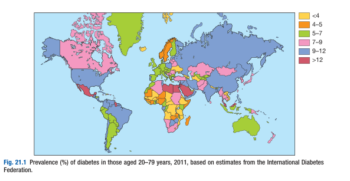
    - <u>Burden</u> - major cause of mortality and burden on healthcare expenditure
- **Etiological classification of DM:** 
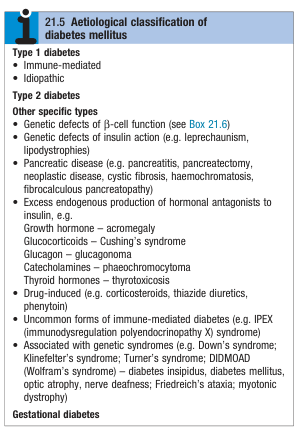
- **Dx criteria for DM** - arbitrarily selected thresholds to identify those who have a degree of hyperglycaemia carries significant risk of microvascular disease (particularly retinopathy) if untreated:

## Clinical Examination of the Patient with Diabetes

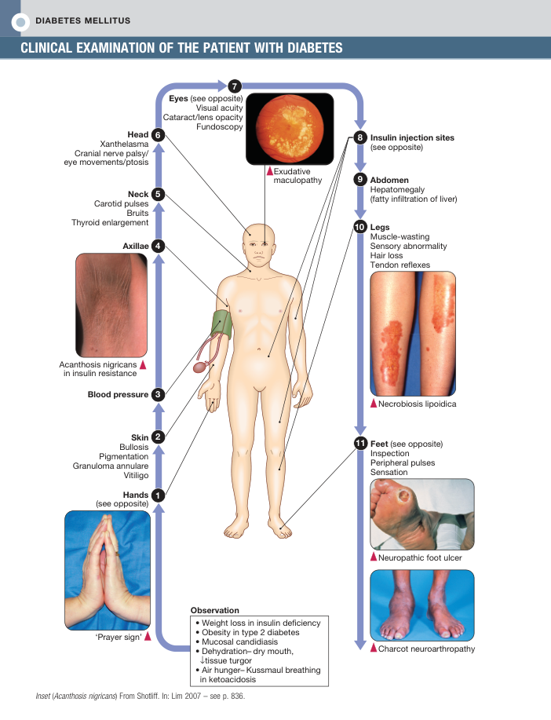 
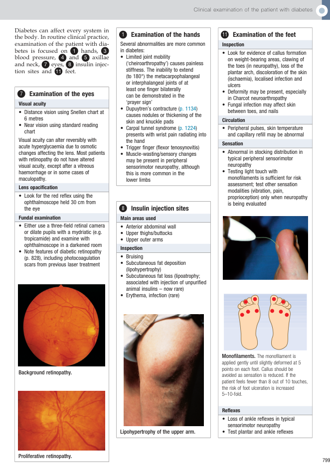

## Function Anatomy and Physiology

### Normal Glucose and Fat Metabolism

### Etiology and Pathophysiology of Diabetes Mellitus

1.  Type 1 diabetes
    - **Pathophysiology of T1DM:**
      - **Environmental triggers in a genetically predisposed individual** - genetic susceptibility appears to be a pre-requisite, but monozygous concordance rate is \< 40%, with wide geographical variations suggesting an environmental precipitant:
        - <u>Genetic predisposition</u> - \> 20 different regions shown some linkage with T1DM, most dnotably HLA-DQA1/DQB1 genes resulting in presentation of self antigens
        - <u>Environmental precipitant</u> - virus, drugs, chemicals or dietary constituents
      - **Autoimmune destruction of insulin-secreting B cells** - T cell-mediated autoimmune disease of the pancreatitis resulting in'insulitis' pathologically and subsequently beta-cell destruction 
      
      - **Progressive loss of beta-cell function** - loss of 80-90% of beta cell capacity results in marked hyperglycaemia and the manifestation of classical Sx of diabetes:
        - <u>Polyuria</u> - osmotic diuresis due to glycosuria
        - <u>Polydipsia</u> - increased fluid intake to maintain fluid balance against polyuria
        - <u>Marked weight loss</u> - due to catabolic effects of insulin deficiency
      - **Metabolic consequences of profund insulin deficiency** - occurs when beta cell dysfunction crosses a threshold, where hyperglycaemia results in beta-cell toxicity resulting in rapid progression of insulin deficiency:
        - <u>Profound hyperglycaemia and glycosuria</u> - results in polyuria and dehydration, nocturia, thirst, fatigue, and susceptibility to UTIs
        - <u>Unrestrained proteolysis and lipolysis</u> - underlies marked weight loss and diabetic ketoacidosis
        - <u>Hypokalaemia</u> - as a result of metabolic acidosis that drives K out of cells, and secondary hyperaldosteronism

        
        

2.  Type 2 diabetes
    - **Pathophysiology of T2DM:**
      - **Environmental trigger in a genetically predisposed individual:**
        - <u>Genetic predisposition</u> - marked difference in ethnic groups and high monozygous concordance rates in twin studies
        - <u>Obesity and physical inactivity</u> - 10-fold increased risk of T2DM in those where BMI \> 30 kg/m2, but not all obesed individuals develop DM as they do not have genetically impaired beta-cell functions
      - **Insulin resistance as the central pathological process** - onset of progressively worsening insulin resistance of unclear etiology underlying impaired glucose tolerance and to some extent :
        - **Adipocyte theory** - appealing theory as obesity is a major cause of insulin resistance:
          - <u>Excessive lipolysis</u> - release of excessive amounts of FFA to compete w/ glucose as fuel source, thus inducing insulin resistance
          - <u>Adipokines</u> - peptides released by adipocytes that alter sensitivity to insulin of other tissues
          - <u>Highest concentration of FFA and adipokines in portal vein</u> - central obesiity has potent influence on insulin sensitivity of the liver, adversely affecting gluconeogenesis and hepatic fat metabolism (NAFLD and cirrhosis)
        - **Role of physical activity** - physical inactivity down-regulates insulin-sensative kinases and promotes FFA accumulation within skeletal muscles
      - **Metabolic syndrome as the other metabolic consequences of insulin resistance** - HTN, Increased TC:HDL ratio, and NAFLD and PCOS a/w insulin resistance
      - **Pancreatic beta-cell failure** - toxic effects of glucose and FFA against pancreatic cells, resulting in progressive in progressive insulin deficiency: 
      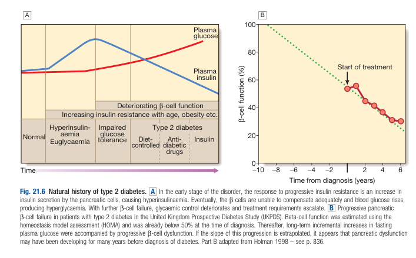

## Investigations

- **Urinalysis** - glucose, ketones, protein:
    - **Urine glucose** - non-diagnostic, but extremely Sn with roles in screening:
    - <u>Timing of urine glucose</u> - maximise Sn by urine passed 1-2h after meal
    - <u>Implications of glucosuria</u> - warrants further workup by blood tests (see below)
    - <u>Limitations of urine glucosa</u>:
      - **False +ve** - occurs in reduced renal threshold for glucose reabsorption (e.g. pregnancy or in young people)
      - **False -ve** - interferrance with certain drugs (e.g. beta-lactam, levodopa, salicylates)
    - **Urine ketones** - ketonuria is non-specific for DM, but is extremely likely if a/w glucosuria
    - **Urine protein** - proteinuria (\> 300mg/L) detected through dipstick tests, and microproteinuria (\> 30 mg/L) detected by biochemical laboratory measurements, as a marker of diabetic nephropathy and/or increased risk of macrovascular disease
- **Blood tests** - glucose, ketones, HBA1c:
    - **Blood ketone levels** - increasingly used as the major ketone (beta-hydroxybutyrate \[beta-OHB\]) in blood during DKA is not being measured by urine dipstick:
    - <u>Interpretation of capillary blood ketone measurements</u>: 
    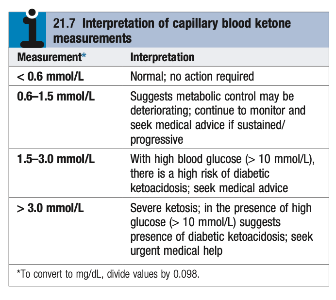

## Presenting Problems in Diabetes Mellitus

### Newly discovered hyperglycaemia

- **Definition** - biochemical abnormality of blood glucose often detected in patients with routine biochemical analysis
- **Clinical presentation of hyperglycaemia:**
    - **Asymptomatic** - discovered on routine biochemical analysis, following urine dipstick test revealing glycosuria
    - **Detection during critical illness** ('stress hyperglycaemia') - occurs during conditions which impose a burden on pancreatic beta-cells, e.g. during pregnancy, infection, MI, or other severe stress, or during Tx with diabetogenic drugs (e.g. glucocorticoids), which usually dissapears after the acute illness is resolved
    - **Symptoms of hyperglycaemia:**
    - <u>Polyuria and nocturia</u> - due to osmotic diuresis
    - <u>Polydipsia and dry mouth</u> - due to excessive urinary water loss stimulating the thirst mechanism

  
  
    - **Acute metabolic decompensation** - e.g. DKA, HHS etc.

- **Approach to Dx** - establish the diagnosis of glycaemia
- **Dx criteria of diabetes and pre-diabetes** - WHO guidelines (2011):
    - **Principles of Dx:**
    - <u>Asymptomatic patients</u> - requires 2 diagnostic test
    - <u>Symptomatic patients</u> - requires 1 diagnostic test or random blood glucose \>= 11.1 mmol/L
    - **Dx of DM** - 2 or more confirmatory tests:
    - Fasting blood glucose \>= 7.0 mmol/L
    - Oral glucose tolerance test - plasma glucose \>= 11.1 mmol/L 2h after 75g OGTT
    - HBA1c - \> 6.5%
    - **Dx of pre-diabetes:**
    - Impaired fasting glucose - fasting glucose \>= 6 mmol/L and \< 7 mmol/L
    - Impaired glucose tolerance - plasma glucose between 7.8-11.1 mmol/L 2h after a 75g OGTT
- **Clicial assessment and differentiation between T1DM and T2DM:** 

    - **Age of onset** - significant overlap as presentation of T2DM trending towards younger populations while subset of T1DM presents late (latent autoimmune diabetes of adults \[LADA\]):
    - <u>T1DM</u> - typically \< 40y
    - <u>T2DM</u> - typically \> 50y
    - **Clinical presentation** - difference in terms of chief complaint and symptomatology, onset, and duration:
    - <u>T1DM</u>:
      - Clinical presentation as the classical hyperglycaemic Sx (e.g. polyuria, nocturia, thirst, rapid weight loss)
      - Rapid onset over weeks
    - <u>T2DM</u>:
      - Clinical presentation as non-specific Sx (e.g. chronic fatigue, malaise, insomnia)
      - Uncontroled hyperglycaemia may clinicaly present with infections e.g. skin sepsis or genital candidiasis (e.g. pruritis vulvae or balanitis)
      - Marked weight loss and even DKA if <u>extremely late presentation</u>
      - Insiduous onset over months to years
    - **Physical signs and comorbidities:**
    - <u>T1DM</u> - normal body weight or marked weight loss
    - <u>T2DM</u>:
      - \>80% overweight at presentation in western population (less common in asian polulation), a/w central obesity
      - Often associated with comorbidities of metabolic syndrome - e.g. HTN (\> 50%), biochemical evidence of dyslipidaemia, NAFLD
- **Mx:**
    - **Principles of Mx:**
    - **Goals of Mx:**
      - <u>Symptomatic relief</u> - improve Sx of hyperglycaemia
      - <u>Prognostic Tx</u> - minimise the risk of long-term microvascular and macrovascular complications
    - **Approach to Mx:**
      - <u>Patient education</u> - multidisciplinary education regarding Mx and complications of DM to enable patients to adequately Mx there DM
      - <u>Self-assessment of glycaemia control</u> - role of self-aducation, detection of hypoglycaemia, and useful in acute-illness
      - <u>Dietary and lifestyle modification</u> - initiated if pre-diabetes to see if glycaemic control is adequate
      - <u>Oral hypoglycaemic agents and insulin</u> - initiated as per guidelines
    - **Patient education** - understand nature of DM and learn all aspects regarding all aspects of Mx:
    - **Approach to patient education** - structured education given in groups by trained educators in multidisciplinary approach (e.g. doctors, dietitians, specialised nurse, podiatrist)
    - **Patient education regarding insulin:**
      - Dose-measurement and injection techniques
      - Dose adjustment based on factors such as exercise, illness, episodic hypoglycaemia
      - Sx of hypoglycaemia and subsequent Mx
    - **Patient education regarding driving** - licensing regulations vary between countries: 
    
    - **Self-assessment of glycaemic control:**
    - <u>Indications</u> - only in insulin-treated patients, and risk of hypoglycaemia for patients on **sulphonylurea**
    - <u>Optimal glycaemic control</u>:
      - Pre-meal values - 4-7 mmol/L
      - 2h post-meal values - 4-8 mmol/L
    - <u>Capillary blood glucose monitor</u> - for insulin treated patients to detect hypoglycaemia and hyperglycaemia during illness (supplemented by urine ketones if unacceptablle hyperglycaemia)
    - **Lifestyle modification, oral hypoglycaemic agents, insulin** - see section on Mx of DM

### Long-term supervision of diabetes

- **Therapeutic goals for diabetes** - individualised target between 6.5-7.5%:
    - <u>Aggressive glycaemic control</u> (\<= 6.5%):
    - Early on in a motivated patient - e.g. patient managed through diet or 1-2 oral hypoglycaemics
    - Younger patients (low risk of hypoglycaemia)
    - <u>Lineant glypoglycaemic control</u> (7.5%):
    - Late stage
    - Older patient
    - Pre-existing cardiovascular disease
    - Risk of hypoglycaemia and falls (e.g. insulin-treated patients)
- **Approach to follow-up for diabetes** - follow CCCCL model in FM:
    - **Control** - assessment of glycaemic control through A1c, FBG, and home BG monitoring record
    - **Compliance to medications and S/E** - assessment of compliance and need to step-up medications to achieve targeted A1c
    - **Complications:**
    - <u>Coronary artery disease</u> - new onset chest pain (often absent in diabetics due to autonomic neuropathy) and exertional dyspnoea
    - <u>Stroke/TIA</u> (rare) - one-sided weakness
    - <u>Diabetic retinopathy</u> - blurred vision
    - <u>Diabetic nephropathy</u> - LL oedema, but primarily assessed biochemically and through urinalysis
    - <u>Diabetic neuropathy and diabetic foot</u> - distal numbness and parasthesia, claudication, poor healing ulcers
    - <u>Hypoglycaemic episodes</u> - Sx of hypoglycaemia (adrenergic and cognitive Sx), number and severity (driving advice required)
    - **Comorbidities** - ask about BP and lipid control
    - **Lifestyle issues:**
    - <u>General health status</u> - any illness
    - <u>Lifestyle modifications</u> - smoking cessation, reduced alcohol intake, exercise, targeted weight loss
    - <u>Psycho-social aspects</u> - impact on work, school, sexual health, stress and depression
- **P/E:**
    - <u>General examination</u>:
    - Body weight and BMI - educate on ideal body weight and BMI
    - Blood pressure - aggressive target of 130-140/70-80 mmHg based on risk factors and presence of nephropathy
    - <u>Eye examination</u> - detection of DR (or rarely CN III mononeuritis multiplex):
    - Visual acuities - near and distance
    - EOM - diplopia
    - Opthalmoscopy with pupils dilated - DR
    - <u>Examination of LL and feet</u> - LL vascular examination and assessment of peripheral neuropathy for assessment of foot risk (typically performed by podiatrist)
- **Review of Ix:**
    - **Blood** - LRFT, TFT, A1c, lipid profile
    - **Urinalysis** - fasting specimen for glucose, ketones, albumin (both macro- and micro-albuminuria)
- **Mx of comorbidities** - HTN and dyslipidaemia:
    - HTN - target 130-140/70-80 mmHg depending on 10y cardiovascular risk and presence of nephropathy
    - Dyslipidaemia - statin therapy irrespective for lipid profile as T2DM patients are assumed to have \>20% 10y CVD risk

### Diabetic ketoacidosis

- **Definition** - medical emergency precipitated by an intercurrent illness principally seen in T1DM, but also in late-stages of T2DM caused by absolute insulin deficiency to compensate for a stress response
- **Clinical presentation in T1DM vs T2DM** - often precipitated by an intercurrent illness, but ocassionally there is no precipitating factor:
    - <u>T1DM</u> - DKA is characteristic for T1DM and is often the presenting problem in newly diagnosed patients
    - <u>T2DM</u> - increasing number of patients presenting with DKA having underlying T2DM (estremely prevalent in african-American and Hispanic populations)
- **Pathophysiology of DKA:**
    - **Precipitated by an intercurrent illness** (e.g. infection) - absolute insulin deficiency when pancreatic beta cells fail to secrete sufficient insulin to compensate for the stress response, resulting in <u>marked hyperglycaemia</u> and exacerbation of Sx of hyperglycaemia
    - **Excessive fluid and electrolyte loss** - driven by hyperglycaemia:
    - <u>Dehydration and hypovolaemia</u> - driven by osmotic diuresis where total body water loss (~ 6L) is initially intracellular, followed by extracellular:
      - **Intracellular water loss** (50%) - contraction of ICF volume driven by <u>osmotic effects of hyperglycaemia</u> manifesting with little clinical features except reduced skin turgor, and <u>'pseudohyponatraemia'</u> biochemically
      - **Extracellular water loss** (50%) - contraction of extracellular volume driven by <u>osmotic diuresis</u> and <u>Na depletion</u> - manifesting as reflex tachycardia, haemoconcentration, hypotension, poor purfusion and oliguria
    - <u>Hypokalaemia</u> - every patient is K-depleted due to **secondary hyperaldosteronism** in response to poor renal perfusion and dehydration, but may not manifest biochemically due to 1) intravascular volume contraction, 2) displacement of K from intracellular compartment due to ketoacidosis
    - <u>Hyponatraemia</u> - due to pseudohyponatraemia in response to hyperosmolar state, and some degree of renal Na depletion
    - **Ketoacidosis and metabolic acidosis** - driven by profound insulin deficiency and exacerbated by catecholamines and other stress hormones (acute illness) resulting in <u>unrestricted lipolysis and hepatic ketogenesis</u>
- **Cardinal biochemical features of DKA:**
    - Hyperglycaemia - RBG \>= 11 mmol/L
    - Hyperketonaemia (\>= 3 mmol/L) or ketonuria (\>= 2+)
    - Metabolic acidosis - HCO3- \< 15 mmol/L or venous pH \< 7.3
- **Causes of morbidity and mortality:**
    - Cerebral oedema (typically in children)
    - Hypokalaemia (typically in adults)
    - Acute respiratory distress syndrome
    - Comorbid conditions - e.g. AMI, sepsis, pneumonia
- **Clinical features of DKA:**
    - **Symptoms of hyperglycaemia** - reported prodrome of polyuria, polydipsia, and recent weight loss
    - **Features of dehydration** - loss of skin turgor, furred tongue, cracked lips, tachycardia, hypotension and reduced intra-occular pressure (blurred vission)
    - **Altered mental status** - mental apathy, confusion or reduced GC due to cererbal oedema
    - **GI Sx** - abdominal pain and N/V particularly in children likely due to splanchnic hypoperfusion (amylase mildly elevated)

  
  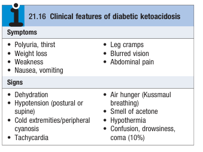

- **Ix** - should not delay the institution of IV fluid and insulin replacement therapy:
    - **Urinalysis** - dipstick for glycosuria and ketonuria (\>= 2+)
    - **Diagnostic blood tests** - RBG, RFT:
    - <u>RBG</u> - reveals hyperglycaemia (\>= 11.1 mmol/L)
    - <u>RFT</u>:
      - Urea/ sCr - reflects dehydration
      - Na - pseudohypnoatraemia
      - K - initially normal or raised due to volume contraction and extracellular shift, but likely to fall due to dilution, and intracellular shift driven by insulin
    - **12-lead ECG** - look for precipitants e.g. AMI, or arrhythmias caused by profound hypovolaemia
    - **Septic workup** - CBC (leukocytosis may be a stress response and does not infer infection), inflammatory markers, CXR, blood culture, urine culture
- **Mx:**
    - **Principles of Mx** - Tx in high-dependancy areas with involvement of diabetic specialist teams:
    - <u>Insulin replacement</u> - given immediately if biochemically evident of DKA titrated against biochemical response
    - <u>Fluid replacement</u> - titrated against markers of dehydration, particularly SBP (monitor for cerebral oedema in children)
    - <u>Treat other metabolic abnormalities</u> - K replacement (little role of IV bicarbonate therapy)
    - <u>Treat precipitating cause</u> - e.g. Tx of infection
    - **Overview of Mx** - initial Mx and routine clinical and biochemical assessment over 24h: 
    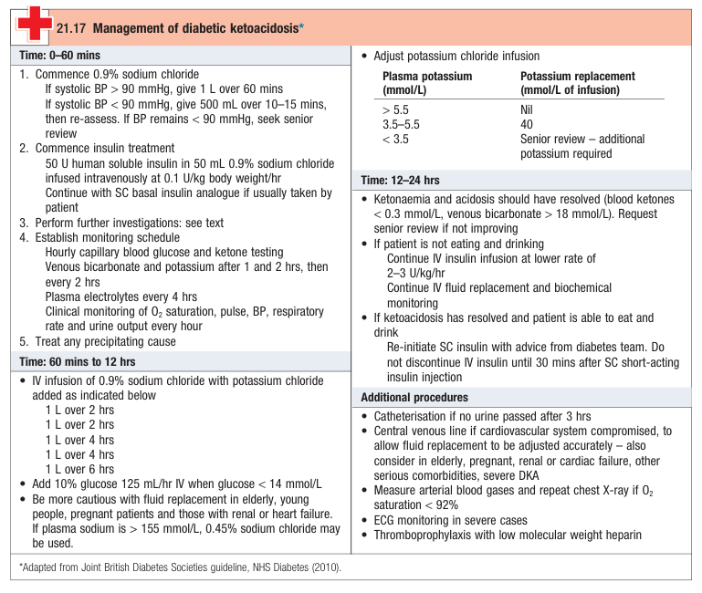
    - **Monitoring:**
    - <u>Vital signs</u> - BP/P, RR, SpO2, urine output +/- ECG q1h
    - <u>Glucose and ketones</u> - capillary blood glucose and ketone testing q1h
    - <u>HCO3 and K</u> - RFT at 1h and 2h, subsequently q2h
    - <u>Electrolytes</u> - q4h
    - **Insulin replacement therapy:**
    - <u>Regimen</u>:
      - 50U human soluble insulin infused - fixed rate IV infusion at 0.1U/kg/h
      - IM injection (alternative route if no IV access) - loading dose of 10-20U followed by 5U hourly
      - SC injection of fast-acting insulin analogue - initially 0.3U/kg followed by 0.1U/kg/h
    - <u>Rate of correction</u> - controlled rate, **rapid reduction avoided** as it might precipitate **hypoglycaemia** and **cerebral oedema**:
      - Rate of blood glucose reduction - 3-6 mmol/L/h
      - Rate of blood ketones reduction - 0.5 mmol/L/h
    - <u>Failure of blood glucose correction</u>:
      - Insulin resistance induced by ketosis, dehydration, acidaemia, infection and physiological stress
      - failure for blood glucose to fall within 1h at proposed rate may require higher dose of insulin regimen
    - <u>Complications</u>:
      - **Failure to correct hyperglycaemia** (insulin resistance as a stress response may require higher dose)
      - **Cerebral oedema** (rapid rate avoided as it results in a hypo-osmolar state that results in cerebral oedema)
      - **Hypokalaemia** (insulin drives K intracellularly and can result in hypoK if K not replenished sufficiently)
    - <u>Concommitent dextrose infusion</u> - initiate 10% dextrose infusion at 125ml/h once RBG \< 14 mmol/L along with insulin replacement to **replenish intravascular volume**
    - <u>Restoration of normal insulin regimen</u> (SC injection) - after clinically stabilised and able to eat and drink normally
    - **Fluid replacement** - replacement of intracellular and extracellular volume:
    - **Replacement of extracellular volume** - 0.9% NS (0.45% NaCl considered if Na \> 155 mmol/L):
      - <u>Regimen</u>:
        - **Initial bolus** - 1L given over 90 min (SBP \> 90 mmHg) or over 10-15 min with reassessment (SBP \< 90 mmHg)
        - **Subsequent replacement** - IV infusion of 0.9% with K replacement:
          - 1L over 2h
          - 1L over 2h
          - 1L over 4h
          - 1L over 4h
          - 1L over 6h
    - **Replacement of intracellular volume** - 10% dextrose infusion at 125 ml/h after RBG \< 14 mmol/L
    - **Caution:**
      - Risk of cerebral oedema (esp. children and young adults)
      - Risk of volume overload (esp. elederly or comorbid with heart failure or renal failure)
    - **K replacement** - careful monitoring as Mx can lead to both hypoK or hyperK:
    - <u>Initial 1L of fluid replacement</u> - K replacement not recommended because pre-renal AKI may be present secondary to dehydration (at risk of hyperK)
    - <u>Indications of K replacement in subsequent fluid replacement</u>:
      - Titrated against K levels - 40 mmol of KCl per L of NS if K 3.5-5.5 mmol/L
      - Urine output present (ensures renal loss of K)
    - <u>Indications for review of K replacement regimen</u> - K \< 3.5 mmol/L
    - **No role of bicarbonate** - insulin and fluid adequate to correct acidosis:
    - Acidosis triggers increased ventilation as an adaptive response to improve DO2 during dehydration
    - Respiratory suppression thus results in paradoxical CSF acidosis and has been implicated in the pathogenesis of cerebral oedema in children and young adults

### Hyperglycaemic hyperosmolar state

### Hypoglycaemia

### Diabetes and pregnancy

### Children, adlolescents and young adults with diabetes

### Hyperglycaemia in acute myocardial infarction

- **Definition** - hyperglycaemia often found in patient who have sustained an acute myocardial infarction
- **DDx of hyperglycaemia in AMI:**
    - Stress hyperglycaemia - due to increased insulin resistance in physiological stress (i.e. catecholamine-mediated insulin resistance), and subsequent OGTT will reveal impaired glucose tolerance
    - Undiagnosed DM - AMI is the first presentation of the patient with DM
    - Known DM - previously documented DM
- **Mx** - insulin therapy for <u>near normalisation of blood glucose</u> in peri-infarct period (evidence shows reduced long-term mortality from CAD)

### Surgery and diabetes

### Complications of diabetes

## Management of Diabetes

- **Principles of Mx:**
    - **Goals of Mx:**
    - <u>Symptomatic relief</u> - free of Sx of hyperglycaemia and able to lead completely normal lives
    - <u>Prognostic Tx</u> - reduce cardiovascular mortality through <u>glycaemic control</u> and Tx of other risk factors, and escape long-term complications of DM
    - **Modalities of Mx:**
    - <u>Lifestyle modifications</u> (adequate control for 50%) - diet, weight management, exercise, alcohol, smoking cessation
    - <u>Oral hypoglycaemic agents</u> (adequate control for 20-30%) - sulphonylurea and meglitinides, metformin, incretin-based therapies, GLP-1 receptor agonists, SGLT2i
    - <u>Insulin replacement therapy</u> (adequate control for 20-30%) - if evident insulin deficiency (e.g. marked weight loss)
    - <u>Pancreas transplantation</u> - limited utility
    - **Escalation of Tx** - dependent on adequacy of residual beta-cell dysfunction but is not measurable, depends on:
    - Type of DM - T1DM requires insulin therapy, while T2DM may require both insulin and OHA
    - Age of patient - early onset suggestive of T1DM
    - Weight of patient at diagnosis - pancreatic beta-cell failure and onset of insulin deficiency if marked weight loss
    - **Frequent re-assessment and follow-up** - regimen effectively a therapeutic trial and should be reviewed regularly based on glycaemic control and risk of hypoglycaemia

### Diet and Lifestyle

- **Diet modification** - requires access to <u>dietitian</u> at Dx, review and Tx changes:
    - **Aims of diet modification:**
    - <u>Good glycaemic control</u> - important in preventing microvascular and macrovascular complications
    - <u>Preventing fluctuations in blood glucose</u> - reduce hyperglycaemic Sx and avoid hypoglycaemia
    - <u>Aid weight Mx</u> - caloric restriction and reduction of fat intake aid weight maintenance for T1DM and non-obese T2DM, and weight loss for obese T2DM
    - <u>Adequate nutritional intake</u> - ensure adequate nutritional intake despite restricted diet
    - <u>Avoid atherogenic diet</u> - dietary modifications to reduce risk of ASCVD and subsequently reduce MACE
    - <u>Diet specific to comorbidities</u> - e.g. low protein diet for nephropathy
    - **Dietary constituents and recommended % of energy intake:** 
    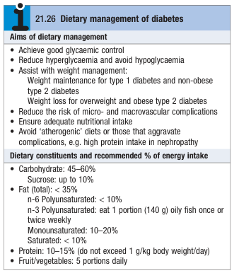
    - **Carbohydrates** - amount and source influence post-prandial glucose (?affects beta-cell glucotoxicity) and glycaemic control:
    - **Source of carbohydrates** - preferably low glycaemic index (produce a small gradual rise in glucose post-prandially):
      - Basmati rice
      - Spaghetti
      - Porridge
      - Noodles
      - Granary bread
      - Beans and lentils
      - Other starchy food
    - **Amounts of carbohydrates** - greater influence on <u>weight reduction</u> and <u>glycaemic control</u>:
      - Evidence shows short-term (6mo) low carbohydrate diet (50g/d at -13% caloric deficit) demonstrated weight reduction and improved diet control
      - Extremely restrictive and not applicable as demonstrated by high dropout rates and poor adherance
    - **Fats** - \< 35% of energy intake influence weight Mx and cardiovascular risk
    - **Salt** - \< 6g/d (same as general population)
    - **Weight management:**
    - <u>Rationale for weight Mx</u>:
      - Central obesity (waist circumference) predicts insulin resistance and hence progression of DM
      - Obesity is an independent risk factor for atherosclerosis and cardiovascular risk
      - Many oral hypoglycaemics and insulin encourage weight gain
    - <u>Mx of obesity</u> - see detailed notes on obesity:
      - Diet (caloric restriction)
      - Physical activity (increased energy expenditure)
      - Pharmacotherapy
      - Bariatric surgery
    - **Exercise** - encourage exercise in T2DM, but caution in T1DM as a/w hypoglycaemia:
    - <u>Rationale</u>:
      - Increased insulin sensitivity
      - Weight loss
      - Reduced cardiovascular risk
    - <u>Recommendations</u> - per WHO guidelines:
      - 2.5h of moderate intensity exercise - 30 min for 5d a week
      - 75 min of vigorous-intensity exercise
    - **Alcohol** - in moderation (but increased risk of hypoglycaemia due to reduced hypoglycaemia awareness and suppressing gluconeogenesis)

### Oral Hypoglycaemic Agents

- **Overview of oral hypoglycaemic agents:** 
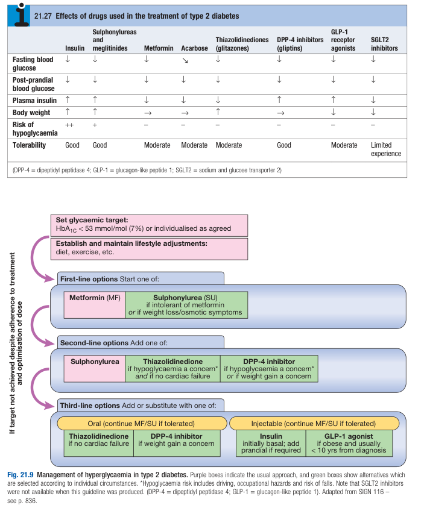
- **Metformin** (Biguanides):
    - **Indications** - 1st-line therapy for T2DM irrespective of body weight unless intolerated
    - **Dosing:**
    - Standard dose - initiate at low dose (500 mg bid) to reduce S/E, titrated upwards to maintenance dose of 1mg bid
    - Renal dose - dose halved if eGFR 30-45 ml/min (C/I if renal impairment)
    - **MOA** - ?insulin sensitizer:
    - <u>Inhibition of mitochondrial respiration</u> - increased AMP:ATP ratio and stimulation of AMP-activated protein kinase (AMPK) promoting insulin-like effects
    - <u>Effects on liver</u> - increased insulin-dependent glucose uptake, reduced hepatic gluconeogenesis (+/- promote glycolysis)
    - <u>Effects on gut metabolism</u> - increased gut glucose utilisation
    - **Clinical use:**
    - <u>Glycaemic control</u> - potent glucose lowering agent with <u>no risk of hypoglycaemia</u>
    - <u>Effects on weight control</u> - weight-neutral
    - <u>Effects on survival</u> - modest CVS protection and established benefits in microvascular disease
    - **S/E:**
    - <u>Mild GI disturbance</u> (25%) - diarrhoea, abdominal cramps, bloating and nausea (5% intolerant to metformin)
    - <u>Lactic acidosis</u> - rare but C/I if increased risk (e.g. alcoholism, impaired liver function, serious medical condition resulting in severe shock or hypoxia)
- **Supphonylureas and meglitinides** - insulin secretalogues:
    - **Indications:**
    - As 1st line Tx if intolerant of metformin or if weight loss/ osmotic symptoms
    - Add on therapy if poor glycaemmic control on metformin alone
    - **Selection:**
    - 1st-generation SUs - chlorpropamide, tolbutamide
    - 2nd-generation SUs - <u>gliclazide</u>, glimepiride, <u>glibenclanide</u>, glipizide
    - Meglitinides - repaglinide, nateglinide
    - **Dosing** - dose-response relationship steepest at low-doses with little benefit at high doses
    - **MOA:**
    - <u>Inhibition of ATP-sensitive K channels</u> - results in pancreatic beta-cell depolarisation and **increased insulin secretion**
    - **Clinical use:**
    - <u>Glycaemic control</u> - potent glucose lowering agent with <u>risk of hypoglycaemia</u>
    - <u>Effects on weight control</u> - weight-gain (avoided if weight gain is a concern)
    - <u>Effects on survival</u> - modest CVS protection and established benefits in microvascular disease (documented in UKPDS)
    - **S/E:**
    - <u>Weight gain</u> - not ideal for overweight or obese patients
    - <u>Hypoglycaemia</u> - due to unregulated insulin secretion even at normal or low blood glucose levels (avoid long-acting glibenclanide in elderly due to fall risk)
- **Thiazolidinediones** (TZD) - insulin sensitizers:
    - **Indications** - only considered as step-up therapy if other options not available (major S/E):
    - Add on therapy if hypoglycaemia and cost is a concern
    - In patient with <u>no heart failure</u>
    - **Selection** - Pioglitazone, Rosiglitazone (withdrawn due to risk of AMI)
    - **MOA:**
    - <u>Peroxisome proliferatior-activated receptor-γ activation</u> (PPARγ expressed in adipokines) - reduces insulin resistance and increases effects of endogenous insulin directly (through adipokines) and indirectly (via modulation of adipokine secretion, esp. adiponectin \[alters insulin Sn of liver\])
    - **Clinical use:**
    - <u>Glycaemic control</u> - potent glucose lowering agent with <u>no risk of hypoglycaemia</u>
    - <u>Effects on weight control</u> - weight-gain (avoided if weight gain is a concern)
    - <u>Effects on survival</u> - insufficient data
    - **S/E** - limits routine use:
    - <u>Risk of AMI</u> - reported in rosiglitazone (and withdrawn in 2010), not observable in pioglitazone currently
    - <u>Exacerbation of HF</u> - due to fluid retention
    - <u>Increased risk of fractures</u> - through observation
    - <u>Increased risk of bladder cancer</u> - through observation
- **DPP-4 inhibitors** (gliptins) - incretin-based therapy:
    - **Indications** - as add on therapy
    - **Selection** - Sitagliptin, Linagliptin, Vidagliptin, Saxagliptin, Alogliptin
    - **MOA** - inhibition of DDP-4 breakdown of endogenous incretins, stimulating post-prandial insulin secretion
    - **Clinical use:**
    - <u>Glycaemic control</u> - glucose lowering agent with no risk of hypoglycaemia as monotherapy
    - <u>Effects on weight</u> - weight neutral
- **GLP-1 inhibitor** - considered for weight loss:
    - **Indications** - as add-on therapy or if pharmacotherapy for weight loss contemplated
    - **RoA** - subcutaneous injection (not orally active)
    - **Selection** - Exenatide (bid), Exenatide MR (q1w), Liraglutide (od)
    - **MOA:**
    - <u>Mimicks endogenous GLP-1</u> - structurally similar to endogenous GLP1 and stimulates insulin secretion while evading breakdown by DPP-4
    - <u>Supraphysiological effects of GLP-1 activity on weight control</u> - delays gastric emptying and appetite if supra-physiological levels achieved (enables weight loss)
    - **Clinical use:**
    - <u>Glycaemic control</u> - glucose lowering agent with no risk of hypoglycaemia as monotherapy
    - <u>Effects on weight</u> - weight loss
- **SGLT2 inhibitor** (e.g. dapagliflozin) - role not established as of 2012

### Insulin Therapy

- **Formulations of insulin:**
    - <u>Short-acting (soluble) insulin</u> (clear solution) - unmodified and created based on recombinant DNA technology, in which pharmacokinetics are similar to human insulin
    - <u>Intermediate-acting insulin</u> - NPH insulin (addition of protamine and Zinc), or lente insulin (addition of excess zinc)
    - <u>Long-acting insulin</u> - insulin glargine, insulin detemir

  
  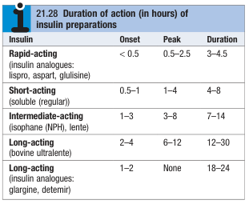

- **Insulin dosing regimens:**
    - <u>Once-daily long-acting insulin</u> - considered initial therapy for most T2DM requiring escalation from oral hypoglycaemics
    - <u>Twice-daily short-acting and intermediate-acting insulin</u> (soluble and NPH insulin):
    - Simplest regimen and is still most commonly used in many countries
    - However, requires patients to be able to mix insulin solutions and shake vial to resuspend solution prior to injection
    - Two different formulations are given before breakfast and the evening meal
    - Morning dose includes two-thirds of total insulin requirement in ratio of short-acting to intermediate-acting of 1:2
    - The remaining dose is given in the evening

  
  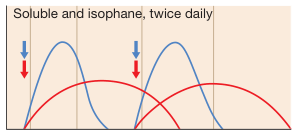
    - <u>Intensive insulin therapy</u> (basal-bolus regimen) - provides greater freedom regarding meal timing and more variable day-to-day physical activity:
    - Short-acting insulin taken before each meal
    - Intermediate-acting or long-acting insulin insulin being injected once or twice daily

  
  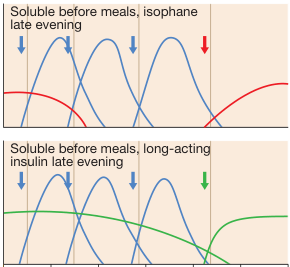

- **S/E of insulin therapy:**
    - <u>Hypoglycaemia</u> - results in adrenergic, and neuropsychiatric Sx that is reversed by intake of glucose
    - <u>Fasting hyperglycaemia</u> ('the dawn phenomenon') - insulin resistance as a result of circadian release of counter-regulatory hormones (cortisol, GH) as well as deminished circulating insulin
    - <u>Peripheral oedema</u> - due to salt and water retention in the short term
    - <u>Lipohyertrophy</u> - trophic reactions in the skin which results in **reduced absorption of insulin** (avoid repeating the same injectio sites)
- **Open-loop battery-powered inslin pumps** - continuous subcutaneous (CSII) intraperitoneal or intravenous invusion w/o reference to the blood glucose concentration:
    - <u>Principles</u> - closure of the loop performed by patients:
    - Continuous infusion at different rates to match the patient's diurnal variation in requirements
    - Boosted infusion manually during mealtimes
    - Additional adjustment by patient performing estimations of blood glucose
    - <u>Limitations</u> - requires high patient motivation
- **Artificial pancreas:**
    - Theoretical idea of closed-loop insulin pumps
    - Minaturised glucose sensors to communicate wirelessly with the insulin pump which would automatically adjust its rate

### Transplantation

## Complications of Diabetes

- **Overview:**
    - Excessive morbidity and mortality is caused by macrovascular complications, and microvascular complications
    - **Macrovascular complications** is caused by **accelerated atherosclerosis**, in a similar manner as non-diabetic patients, but is usually <u>more extensive and severe</u> (amplification of effects of other cardiovascular risk factors)
    - **Microvascular complications** is characterised pathologically with thickening of basement membrane and **increased vascular permeability**, and <u>correlates strongly with duration and degree of hyperglycaemia</u>
- **Leading cause of death in diabetic patients** - overall increased mortality risk compared to non-diabetic controls (RR 2.6)
    - Cardiovascular disease (70%) - increased risk of coronary heart disease, cerebrovascular disease, and peripheral artery disease (RR 2.8 vs non-diabetic control)
    - Chronic kidney disease (10%) - RR 2.7 vs non-diabetic control
    - Cancer (10%)
    - Infections (6%)
    - Diabetic ketoacidosis (1%)
    - Others (3%)

  
  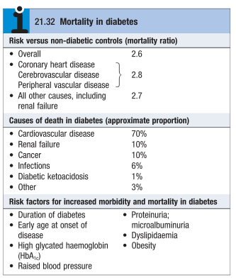

- **Complications of DM:**
    - **Microvascular/ neuropathic complications:**
    - <u>Occular complications</u> - diabetic retinopathy (+/- cataracts, CRVO, CRAO)
    - <u>Renal complications</u> - diabetic nephropathy
    - <u>Peripheral neuropathy</u> - sensory loss, pain in glove and stocking distribution (+/- motor weakness)
    - <u>Autonomic neuropathy</u> - labile BP control (postural hypotension), GI motility disorders (e.g. gastroparesis)
    - <u>Diabetic foot disease</u> - neuropathic lcers, ischaemia, arthropathy
    - **Macrovascular complications:**
    - Coronary circulation - coronary artery disease (myocardial ischaemia/ infarction)
    - Cerebral circulation - transient ischaemic attack, stroke
    - Peripheral circulation - intermittent claudication, critical limb-threatening ischaemia, acute limb ischaemia

  
  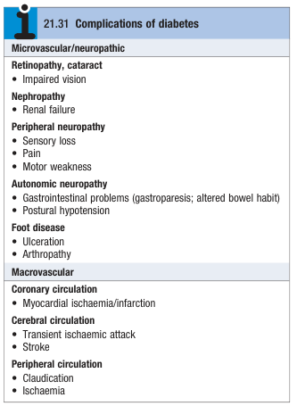

- **Pathophysiology of diabetic microangiopathy** - poorly characterised:
    - <u>Accelerated atherosclerosis</u> - appears to amplify the effects of other cardiovascular risk factors, such as smoking, HTN, dyslipidaemia, likely due to endothelial injury resulting in increased vascular permeability enabling deposition atherogenic lipoproteins
- **Prevention of diabetic complications** - strict glycaemic control and control of other risk factors:
    - **Glycaemic control:**
    - **Prevailing evidence** - strict glycaemic contol is the only factor with **statistically significant effect** on outcomes:
      - <u>Diabetes Control and Complication Trial</u> (T1DM) - 76% overall reduction in risk of developing microvascular complications on strict glycaemic control (target 7% vs 9%), with lower risk of MACE, stroke, and cardiovascular mortality in longer follow up , but a/w **3x risk of severe hypoglycaemia**
      - <u>UK Prospective Diabetes Study</u> (T2DM) - 25% reduction in development of diabetic complications through stright glycaemic control and good control of hypertension
      - <u>Action to Control Cardiovascular Risk in Diabetes</u> (ACCORD) - aggressive glycaemic control (target \< 6.5%) is a/w **increased mortality** within a subgroup of patients with 1) poorer glycacemic control at baseline, 2) longer duration of diabetes, 3) higher prevalence of cardiovascular disease
    - **Implications of prevailing evidence:**
      - <u>Aggressive glycaemic control</u> - more applicable to 1) younger patients, 2) shorter duration of DM, 3) no underlying cardiovascular disease
      - <u>Lineant glycaemic control</u> - more applicable to 1) older patients, 2) longer duration of DM, 3) multiple comorbidities (optimal target yet to be determined but strict glycaemic control known to increase mortality)
    - **Control of other risk factors:**
    - <u>Hypertension</u> - RCTs demonstrate aggressive Mx of BP (130-140/70-80 mmHg) rather than conventional targets minimises microvascular and macrovascular complications - <u>Dyslipidaemia</u> - limits macrovascular complications in people w/ DM, <u>irrespective of baseline cholesterol level</u>
    - <u>Cardiorenal protection</u> - role of ACEi to improve outcomes with ehart disease and treating diabetic nephropathy

### Diabetic Retinopathy

- **Definition** - diabetic microangiopathy involving the eyes mediated by chronic retinal ischaemia and angiogenesis
- **Epidemiology:**
    - <u>Incidence</u> - increases w/ duration of diabetes (almost invariable after 20y of DM)
    - <u>Burden</u> - one of the most common cause of <u>preventable blindness</u> in adults between 30 and 50y
- **Pathophysiology of diabetic retinopathy:**
    - <u>Effects of hyperglycaemia on retinal cells</u> - disrupts vascular autoregulation, stimulates production of vasoactive substances and enodothelial injury, culminating into **endothelial hypoperfusion**
    - <u>Increased expression of VEGF</u>:
    - **Increased endothelial cell proliferation** - results in new vessel formation and subsequently retinal haemorrhages
    - **Increased vascular permeablity** - causing retinal leakages and exudation
- **Risk factors for diabetic retinopathy:**
    - **Non-modifiable risk factors** - duration of DM, pregnancy
    - **Modifiable risk factors:**
    - Poor glycaemic control
    - Hypertension
    - Hyperlipidaemia
    - Nephropathy/ renal disease
    - Smoking
    - Obesity
- **Natural Hx of diabetic retinopathy** - progressive condition classified into non-proliferative DR, and proliferative DR:
    - **Non-proliferative DR:**
    - <u>Microaneurysms</u> - mainly arise from the venous end of capillaries and appear as discrete darker red spots
    - <u>'Dot' and 'blot' haemorrhages</u> - occur at deeper layers of the retina

  
  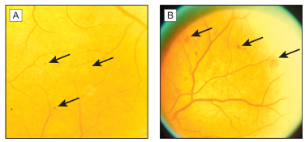
    - **Pre-proliferative DR:**
    - <u>Cotton wool spots</u> - indicate capillary infarction within nerve fibre areas
    - <u>Venous beading</u> - saccular bulges in veins, appearing as a string of 'sausages'
    - <u>Intra-retinal microvascular anomalies</u> (IRMA) - spidery vessels, often w/ sharp corners that indicate dilatation of pre-existing vessels

  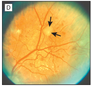 
  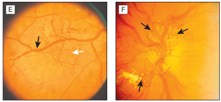
    - **Proliferative DR:**
    - <u>Neovascularisation</u> - new vessel formation either on the optic disc or the retina, initially arcades of vessels on the surface of the retina, but may extend forward to involve the vitreous
    - <u>Vitreous haemorrhage</u> - pre-retinal haemorrhage, accounting for sudden visual loss, and results in subsequent fibrosis, scarring and trational retinal detachment

  
  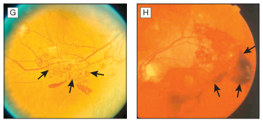
    - **Clinical significant macular oedema** (CSMO):
    - Can occur at any stage of DR
    - Characterised by hard exudates in the central retina

- **Rubeosis iridis:**
    - New vessel formation on the anterior surface of the iris
    - Obstruction of the drainage angle of the eye and the outflow of aqueous fluid, resulting in secondary glaucoma
- **Clinical features of diabetic retinopathy:**
    - <u>Asymptomatic</u> - microaneurysms, vascular anomalies and small exudates and haemorrhaes situated in the periphery will not interfere w/ vision
    - <u>Progressive vision loss</u> - if there is clinically significant macular oedema, where vascular changes are often present in the macular region, and CSMO confirmed on SL
    - <u>Sudden visual loss</u>- often as a result of vitreous haemorrhage or retinal detachment
- **Mx:**
    - **Principles of Mx:**
    - <u>Primary prevention</u> - good glycaemic control, BP control and lipid control
    - <u>Secondary prevention</u> - through annual screening
    - <u>Retinal photocoagulation</u> - indicated in severe proliferative or very severe non-proliferative retinopathy, or CSMO
    - **Primary Prevention:**
    - <u>Glycaemic control</u> - large epidemiological studies demonstrate that good glycaemic control reduces incidence and progression of DR in both type 1 and type 2 DM
    - <u>BP control</u> - more aggressive BP control of targeting \< 130/80 mmHg is a/w slower progression of DR
    - <u>Lipid control</u> - some studies suggest the association, although to a lesser extent to BP and glycaemic control (although still treated to avoid MACE)
    - **Screening** - annual screening recommended to detect disease in early stages when Tx most effective
    - **Retinal photocoagulation** (laser treatment):
    - <u>Indications</u>:
      - Severe proliferative DR
      - Very severe non-proliferative DR
      - Neovascularisation elsewhere w/ vitreous haemorrhage
      - Neovascularisation w/o vitreous haemorrhage
      - CSMO
    - <u>MOA</u>:
      - Reduce macular oedema by treating leaking microaneurysms and areas of retinal thicking
      - Destroy areas of retinal ischaemia to reduce intra-occular VEGF levels
      - Reduce risk of recurrent haemorrhage by inducing gliosis and fibrosis of new vessels
- **Other causes of visual loss in people of diabetes:**
    - Cateract
    - Glaucoma (primary or secondary)
    - Age-related macular degeneration
    - Retinal vein occlusion
    - Retinal artery occlusion
    - NAION

### Diabetic Nephropathy

### Diabetic Neuropathy

- **Definition** - microvascular complication of DM resulting in damage to the peripheral nervous system, causing substantial morbidity and mortality
- **Epidemiology:**
    - <u>Prevalence</u> - affects 50-90% of patients w/ DM (15-30% will have painful diabetic neuropathy)
    - <u>Incidence</u> - related to 1) duration of DM, and 2) degree of glycaemic control
- **Pathophysiology of diabetic neuropathy** - related to complications of intraneural capillaries (BM thickening and microthrombi):
    - <u>Axonal type neuropathy</u> - characterised by axonal degeneration of both myelinated and unmyelinated nerve fibres
    - <u>Other pathological changes</u>:
    - Thickening of Schwann cell basal lamina
    - Patchy segmental demyelination
- **Classification of diabetic neuropathy** - based on type of fibres affected, but clinically mixed syndromes usually occur: 
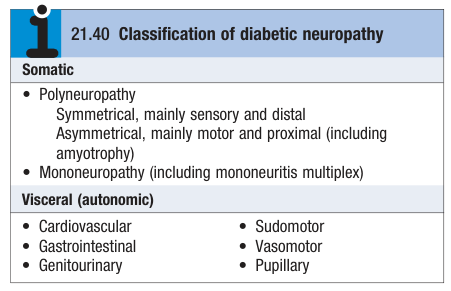
- **Clinical features of diabetic neuropathy** - typically mixed:
    - **Symmetrical sensory polyneuropathy** - often asymptomatic and revealed on clinical examination as 1) absence of sensation of vibration distally, 2) 'glove and stocking' impairment of all other sensory modalities, and 3) loss of tendon reflex:
    - <u>Parasthesia</u> - numbness in the feet
    - <u>Pain</u> - distal, dull, aching lancinating pain mainly over anterior aspect of the leg, usually **worse at night**
    - <u>Cutaneous hyperalgesia</u> - burning sensation over feet
    - <u>Ataxic gait</u> - wide-based gait due to reduced percept of proprioception
    - **Asymmetrical motor diabetic neuropathy** (diabetic amyotrophy) - severe and progressive weakness and wasting of the proximal muscles of the lower and ocassionally upper limbs caused by acute infarction of LMN of the lumbosacral plexus (but is often reversible in 1y):
    - <u>Pain</u> - neuropathic pain felt on anterior aspect of the leg, and hyperaesthesia and parasthesia
    - <u>Neuropathic cachexia</u> - marked weight loss, patient looks extremely ill and unable to get out of bed
    - <u>Reflexes</u> - loss of tendon reflexes, but paradoxically up-going planters
    - **Mononeuropathies** - severe and rapid onset mononeuropathies related to acute infarction of nerve or nerve compression syndromes, with associated recover:
    - <u>3rd or 6th nerve palsy</u> - manifests as diplopia
    - <u>Femoral and sciatic nerve</u> - LL weakness
    - <u>Nerve compression syndromes</u> - carpal tunnel syndrome, ulnar nerve palsy, lateral popliteal nerve compression (foot drop)
    - **Autonomic neuropathy** - patients w/ autonomic neuropathy have higher mortality due to sudden cardiorespiratory arrest (30-50% after onset of autonomic neuropathy): 
    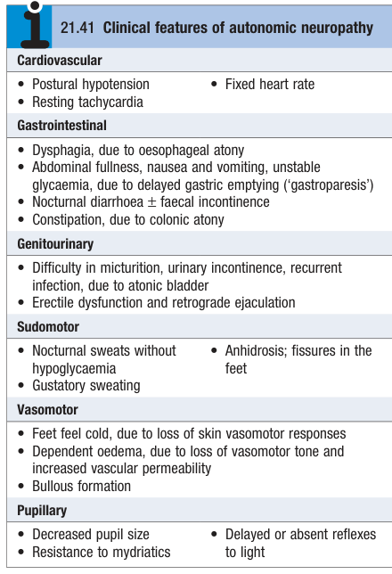
- **Ix** - assessment of autonomic function if required: 
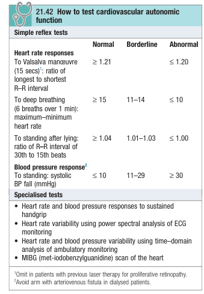
- **Dx** - clinical Dx after exclusion of other causes of neuropathy (Dx by exclusion)
- **Mx:** 
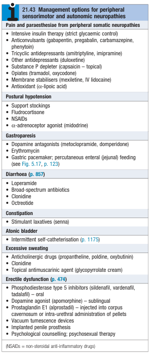

### Diabetic Foot
